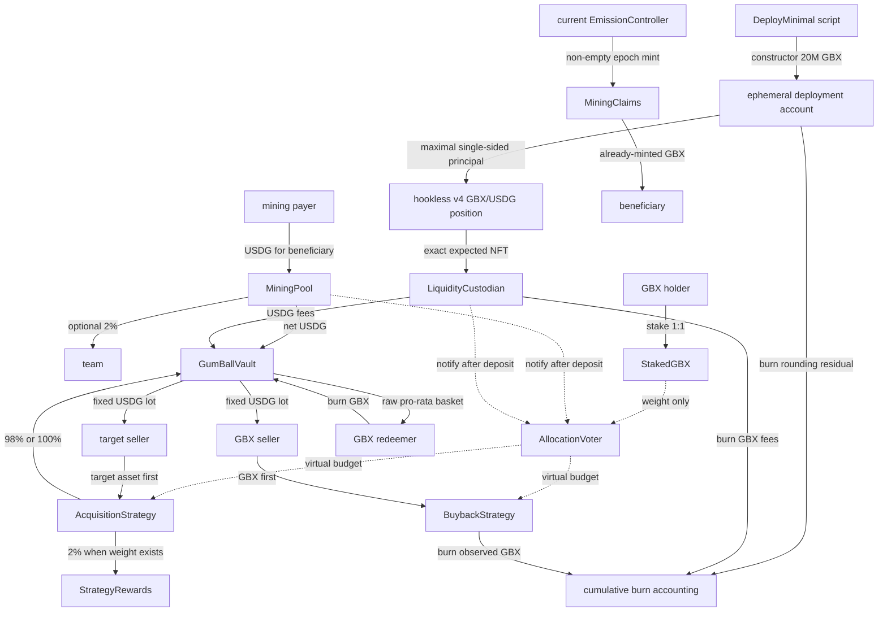

# Minimal protocol architecture

> This document describes the contracts currently compiled from `packages/contracts/src`. It is an engineering
> baseline, not deployment or release evidence.

## Boundaries

The system has one direct GBX token, one daily mining path, one passive raw-balance vault, one virtual allocation
ledger, one acquisition/rewards pair in the deployment graph, one buyback strategy, one canonical Uniswap v4 position
custodian, a typed seven-day timelock, and a stop-only guardian.

It has no proxy, generic executor, public factory, arbitrary vault call, NAV or price feed in state transitions,
additional initial funding or repayment liability, conventional DAO, liquidity-range manager, or staking withdrawal
lock.

All token flows assume reviewed standard ERC-20 contracts that are non-rebasing and non-fee-on-transfer. Where exact
debit/receipt equality is required, balance-delta assertions fail closed. Other measured deltas are accounting guards;
neither pattern supports taxed, rebasing, callback, or otherwise exotic assets.



Dashed edges are accounting. `AllocationVoter` does not custody USDG.

## Contract responsibilities

| Contract              | Responsibility                                                                                          | Explicit non-responsibility                                       |
| --------------------- | ------------------------------------------------------------------------------------------------------- | ----------------------------------------------------------------- |
| `GBXToken`            | One 20M constructor mint, current-controller mint authorization, cumulative one-billion cap, burns.     | Mining schedule, vault custody, administrative mint.              |
| `EmissionController`  | Advance one daily schedule step and mint a complete non-empty epoch to claims custody.                  | Contributions, claims, USDG, target assets.                       |
| `MiningPool`          | Attribute USDG to beneficiaries, settle ended epochs, route optional 2% team fee and net vault revenue. | Contribution reversal, demand-scaled emission.                    |
| `MiningClaims`        | Claim-once transfer of already-minted epoch GBX.                                                        | Minting, redirecting a beneficiary payment.                       |
| `StakedGBX`           | Non-transferable 1:1 staking receipt with immediate post-reset exit.                                    | Delegation, locks, governance execution.                          |
| `AllocationVoter`     | Signal weights, revenue index, virtual strategy budgets, idle USDG accounting.                          | Token custody or strategy execution.                              |
| `StrategyRewards`     | One target token's high-precision supporter reward index.                                               | Timed streams, reward redirection, strategy admission.            |
| `AcquisitionStrategy` | Exchange one fixed USDG lot for target tokens using the bounded auction transition.                     | Variable lot sizing, target pricing feed, arbitrary asset choice. |
| `BuybackStrategy`     | Exchange one fixed USDG lot for observed-and-burned GBX.                                                | Rewards, resale, treasury GBX custody.                            |
| `AssetRegistry`       | Bounded deterministic asset/strategy list, wiring checks, live/disabled status.                         | Runtime bytecode attestation or semantic proof.                   |
| `GumBallVault`        | Passive raw balances, in-kind redemption, current-budget USDG release to a live caller strategy.        | NAV, rebalancing, generic calls, administrator sweep.             |
| `LiquidityCustodian`  | Hold one exact hookless position NFT; collect fees; burn GBX fees; vault USDG fees.                     | Principal withdrawal, range changes, approvals, rescue.           |
| `ProtocolTimelock`    | Parameter-bound operations with a fixed seven-day delay.                                                | Generic target/calldata execution.                                |
| `EmergencyGuardian`   | Stop new exposure.                                                                                      | Resumption, asset movement, minting, exit blocking.               |

## Deployment and activation

The deployment script run builds the full graph, binds initializer-only cycles, creates the hookless pool and position,
transfers the exact expected NFT to the custodian, proves no deployment GBX remains, and starts mining. The first
registry entry is USDG. The deployed acquisition and buyback strategies are intentionally not registered or live.

Activation is later and explicit:

1. schedule the exact acquisition target/strategy/rewards tuple;
2. wait seven days and execute it;
3. separately schedule the exact standalone buyback strategy; and
4. wait seven days and execute it.

Before activation, fills and signaling to either strategy fail. Revenue notified with no active weight increments
`idleUSDG`. That value remains backing and is not assigned to a later strategy or signal.

## Mining and claims

Each epoch lasts one day. Contributions require the payer debit and pool receipt to equal the requested amount, and
distinguish payer from beneficiary.
At or after the end, anyone may settle. A configured team receives 2% of the contributed USDG and the vault must
receive the exact remainder before the voter notification succeeds. The current controller advances exactly one
schedule step. It mints the complete scheduled amount only when the epoch is non-empty.

Entitlement is:

```text
floor(beneficiaryContribution * epochEmission / totalEpochContribution)
```

Claims are paid to the beneficiary even if another account submits the transaction.

## Signaling and revenue

Users stake GBX 1:1 for non-transferable sGBX, then set an absolute list of up to 16 nonzero live-strategy weights.
The total cannot exceed their sGBX balance. Updating replaces the complete allocation. The reset entrypoint is never
administratively paused; successful unstake requires used weight to be zero, subject to the live reward-hook caveat
below.

For an acquisition strategy, voter weight changes call its registered rewards hook strictly while the strategy is
live. Faulty or malicious rewards code can therefore block updates or reset. Once the guardian or timelock terminally
disables that strategy, zero-weight resets skip its rewards hook entirely, clear the voter's user weight, and restore
unstaking liveness without forwarding gas to admitted code. Honest `StrategyRewards` retains a terminal weight
snapshot: already indexed claims remain correct and claimable, while a canonical disabled acquisition strategy cannot
advance the reward index because it cannot fill. This bypass does not promise accurate accounting inside malicious
strategy or rewards code.

After physical USDG reaches the vault, the authorized mining or liquidity source notifies the voter. With positive
active weight, the global revenue index allocates virtual budgets proportionally. With zero weight, all notified
revenue becomes idle immediately. Redemptions scale each budget, idle amount, and accounted vault USDG by the
remaining supply fraction so strategy claims do not exceed the backing retained after redemption.

## Strategies and vault release

The auction price falls linearly from `initPrice` to zero during `epochPeriod`, including exactly zero at the endpoint,
and is zero afterward. A fill checks the caller's epoch ID, deadline, and maximum payment. The next initial price is
the quoted payment multiplied by the configured factor and clamped to the immutable lower/absolute upper bounds.
Deployment leaves both auction clocks unset. Each typed registration starts its strategy's clock exactly once and
atomically with admission, so the seven-day registration delay cannot age the first epoch.

Acquisition transfers the target asset before requesting USDG. It bases the 98/2 split on observed receipt as a
fail-closed accounting check; with no supporter weight it sends the full receipt to the vault. Buyback transfers GBX
and burns the observed receipt before requesting USDG. In both cases, `GumBallVault.releaseUSDG` checkpoints and
consumes the caller strategy's current budget before making an exact transfer.

The vault accepts the receiver selected by the live strategy. This is safe only if admitted strategy code is honest.
Registry getter checks establish a few wiring relationships; they are not bytecode or behavioral attestation.

## Redemption

For shares `s` and pre-burn supply `S`, the vault snapshots every registered asset balance `B_i` and computes:

```text
amount_i = floor(B_i * s / S)
```

It then burns the caller's GBX, proportionally scales virtual budgets, and transfers the computed amounts exactly.
The asset list is capped at 16. Disabling a strategy does not remove its asset from the basket. Any registered token
that reverts or transfers inexactly can make the atomic all-asset redemption fail; no administrator bypass exists.

## Canonical liquidity

The canonical PoolKey contains sorted GBX/USDG currencies, explicit fee and tick spacing, and `hooks = address(0)`.
The position is wholly single-sided at creation: its range must lie above the initial tick when GBX is token0 and
below it when GBX is token1. A bounded math helper finds the largest representable liquidity whose rounded-up GBX
principal does not exceed 20M; the script burns the residual.

The custodian accepts only the configured PositionManager, deployment depositor, expected token ID, and exact
PoolKey. Fee collection removes zero liquidity, burns received GBX, deposits the exact USDG receipt into the vault,
then notifies the voter. A typed delayed operation can transfer the exact NFT to deployed code.

## Control-plane trust

Three delayed code/value surfaces remain:

- controller replacement can change issuance timing and receiver, bounded only by remaining cumulative capacity;
- exact-NFT transfer can hand the canonical position to arbitrary deployed recipient code; and
- strategy registration can admit code that releases its current signaled budget to an arbitrary receiver.

The delay provides observability. It does not attest or constrain the semantics of the selected code. All other
administrative operations are typed maintenance or stop/resume controls described in
[ACCESS_CONTROL.md](ACCESS_CONTROL.md).
