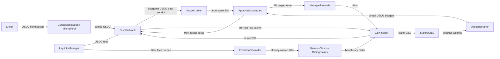

# GUM BALL 6900 Architecture

Status: implemented local architecture. This document is not evidence of an independent audit, production deployment,
or satisfaction of the external release gates.

## Architectural objective

GUM BALL 6900 is a single, non-upgradeable basket protocol on Robinhood Chain. Users mine GBX with USDG, stake GBX
1:1 into non-transferable sGBX, signal how future USDG should be allocated, earn a fixed share of assets acquired by
the strategies they support, and burn GBX to redeem the same pro-rata fraction of every registered vault asset.

The design deliberately excludes conventional token governance, arbitrary vault execution, external price or NAV
oracles in state transitions, leverage, a public factory, and a withdrawal lock.

## System boundaries

Arrows show economic flows, not necessarily direct Solidity calls. Detailed call ordering remains subject to the
checks-effects-interactions and reentrancy requirements in the master specification.

## Core components

<!-- prettier-ignore -->
| Component | Responsibility | Must not do |
|---|---|---|
| `GBXToken` | ERC-20 Permit share token; account for cumulative mint and burn. | Admin mint, rebase, seize balances, change cap, or replace minter. |
| `EmissionController` | Sole minter; perform role-specific genesis and recurring emission minting. | Hold or route USDG, expose generic admin minting, or reopen burned capacity. |
| `GenesisBootstrap` | Sponsor escrow, capped community raise, beneficiary eligibility, refunds, clearing price, atomic launch. | Withdraw community funds administratively or launch an underbacked LP allocation. |
| `GenesisClaims` | Hold the complete already-minted 80 million genesis miner allocation. | Change beneficiaries, withdraw GBX, or mint lazily. |
| `MiningPool` | Daily contribution escrow, beneficiary eligibility, anti-sniping, endogenous reserve, permissionless settlement. | Carry emission forward, take contribution fees, or use an external price. |
| `MiningClaims` | Hold complete settled emissions and serve beneficiary claims. | Redirect expired claims; expired GBX is burned. |
| `GumBallVault` | Sole custody point for all registered redeemable backing. | Execute arbitrary calls, sweep assets, approve arbitrary spenders, borrow, lend, or manage LPs. |
| `StakedGBX` | Eligibility-checked, non-transferable 1:1 signaling representation with immediate unstaking. | Delegate, transfer, or leave active/pending weight above remaining stake. |
| `AllocationVoter` | Persistent active/pending weights, high-precision revenue index, virtual budgets, and reward-generation boundaries. | Hold USDG, direct the sale/rebalancing of assets already in the vault, or let stale weight earn after strategy reactivation. |
| `AssetRegistry` | Bounded canonical asset, strategy, and rewards metadata. | Accept user-created arbitrary assets or disable redemption while a vault balance remains. |
| `AcquisitionStrategy` | Sell bounded USDG lots for a target asset through a reverse Dutch auction. | Receive USDG before target delivery, auction a whole balance, decay to zero, or retain backing. |
| `ManagerRewards` | Accumulator-based accounting for one strategy and one target reward token. | Accept external bribes, redirect rewards, or use an arbitrary reward list. |
| `HoldUSDGStrategy` | Visible virtual allocation that leaves USDG idle in the vault. | Custody, transfer, auction, or pay manager rewards. |
| `BuybackBurnStrategy` | Exchange bounded vault USDG for GBX and burn every GBX received. | Pay manager rewards or represent a dead-address transfer as a burn. |
| `RevenueRouter` | Route non-emission USDG revenue into the vault and notify allocation. | Withdraw revenue, split fees, or notify without a corresponding deposit. |
| `GumBallRouter` | Typed permit-based staking and basket redemption convenience paths. | Choose arbitrary targets/calldata/tokens, redirect a stake, retain routed GBX, or expose generic multicall. |
| `LiquidityManager` | Own the canonical v4 positions, route fees, and execute constrained migration. | Transfer NFTs to an EOA, redeem LP GBX, add leverage, or choose an arbitrary migration recipient. |
| `PermissionedLiquidityManager` | Successor review candidate that uses a verified GBX Permissions Adapter as the pool currency while preserving underlying-GBX accounting. | Authorize production, bypass wrapper/hook checks, strand the verification wei, or alter genesis supply. |
| `GenesisLiquidityCalculator` | Compute and validate maximal integer v4 liquidity during atomic launch. | Hold tokens/state, receive approvals, call back into custody, or expose privileged behavior. |
| `LaunchGuardHook` | Protect the intended PoolKey from malicious pre-initialization. | Add swap-time policy outside its declared permission bits. |
| `GumBallPermissionedHook` | Apply standard permissioned-pool checks and protect the successor PoolKey from pre-initialization. | Trust the immediate PoolManager caller as the user, accept another PoolKey, or initialize twice. |
| `AdapterVerificationEscrow` | Recycle the factory's fixed one-wei verification deposit during atomic genesis. | Select an amount, recipient, token, PoolManager, or arbitrary call target. |
| `ProtocolTimelock` | Delay a small allowlisted set of maintenance operations. | Act as a generic executor against the vault or bypass immutable economic rules. |
| `EmergencyGuardian` | Stop new risk-taking while preserving user exits and settled claims. | Pause redemption, unstaking, burns, refunds, or claims of settled/accrued assets. |

## Custody model

<!-- prettier-ignore -->
| Asset | Permitted custody before settlement | Long-term custody |
|---|---|---|
| Community/mining USDG | `GenesisBootstrap` or `MiningPool` escrow | `GumBallVault` |
| Non-emission USDG revenue | `RevenueRouter` or `LiquidityManager` transiently | `GumBallVault` |
| Unclaimed GBX | `GenesisClaims` or `MiningClaims` | Claims contract until claim or expiry burn |
| Staked GBX | `StakedGBX` | `StakedGBX` until immediate unstake |
| Acquired target asset | Acquisition strategy transiently during one fill | 98% `GumBallVault`; 2% associated `ManagerRewards` |
| Bought-back GBX | Buyback strategy transiently | None; immediately burned |
| v4 position NFTs | `LiquidityManager` | `LiquidityManager` or a constrained replacement position |

GumBallRouter may transiently hold only the exact caller-provided GBX used by one typed stake or redemption. It grants
an exact downstream allowance, clears that allowance in the same transaction, and requires its GBX balance to return
to the pre-call value. It does not batch identity-bearing signal or unstake calls; a future smart account can batch
those directly without making the router a generic executor.

Strategies and the voter do not permanently custody redeemable backing. The vault is the only long-term backing
custodian, and its externally callable value-moving surface is limited to redemption and budget-checked USDG release.

## Genesis flow

1. The liquidity backer escrows enough USDG for the maximum permitted community contribution.
2. Community participants contribute USDG during the bounded bootstrap period.
3. Settlement computes community USDG `C`, clearing price `C / 80,000,000 GBX`, and safely rounded sponsor amount.
4. If the minimum raise or sponsor test fails, the state becomes refundable; no administrator may seize deposits.
5. One transaction settles state, moves `C + sponsor` into the vault, refunds sponsor excess, mints 80 million GBX
   to GenesisClaims, mints 20 million GBX to LiquidityManager, initializes the reference price and canonical v4
   pool, creates the complete single-sided ladder, and notifies allocation.
6. A failure in any step reverts the full launch settlement.

After settlement, anyone may trigger individual genesis claims or a bounded batch of up to 64 beneficiaries. Claim
flags are consumed atomically, and GBX always goes directly to each recorded beneficiary rather than the caller.

The sponsor rounding rule is recorded in [ADR-0002](adr/0002-safe-sponsor-backing-rounding.md). Integer v4 liquidity
cannot universally represent every fixed raw-token cap, so the maximal-principal and constrained-residual conservation
rule is recorded in [ADR-0005](adr/0005-genesis-v4-integer-liquidity-residual.md).

## Recurring mining flow

1. A user contributes USDG for a beneficiary; accounting uses the observed balance increase.
2. The daily scheduled emission continues to decay even when an epoch is empty.
3. At permissionless settlement, actual emission is capped by schedule, cumulative capacity, and USDG affordable at
   95% of the previous endogenous reference price.
4. The complete USDG contribution moves to the vault and is notified to the voter.
5. The complete actual emission is minted to MiningClaims; claims transfer existing GBX to recorded beneficiaries.
6. Clearing/reference state and the next scheduled emission advance. There is no carryover.

## Signaling and allocation flow

Staking mints non-transferable sGBX 1:1. New and increased signals remain pending for 24 hours. Decreases and resets
may become effective immediately after reward checkpointing. A permissionless checkpoint activates mature changes.
Signals persist until changed, reset, or reduced by unstaking.

AllocationVoter converts newly notified USDG into virtual budgets using an index with at least 1e27 precision and
explicit remainder carry. The physical USDG remains in GumBallVault. With no live signal weight, revenue remains
idle and redeemable. Signals never authorize sale or rebalance of assets already acquired.

The global registry is bounded to sixteen asset-linked strategies plus the standalone buyback, while each user may
signal at most sixteen strategies. The intentional seventeen-entry budget-scaling bound is recorded in
[ADR-0006](adr/0006-seventeen-strategy-registry-bound.md).

## Acquisition and reward flow

An acquisition strategy offers a taker-selected USDG lot within immutable/configured bounds. Its reverse Dutch
auction expresses target-token units per USDG, starts above the previous clearing rate, decays linearly, and has a
nonzero floor. A fill is ordered as follows:

1. Validate live state, auction ID, deadline, lot, budget, and the taker's maximum target input.
2. Pull the target asset, measure both the taker's actual debit and strategy receipt by balance delta, and reject a
   debit above the taker's signed maximum.
3. Deliver the observed vault portion to GumBallVault and manager portion to the associated ManagerRewards contract.
4. Record the clearing rate and start the next auction.
5. Ask the vault to release USDG; the vault checkpoints and debits the virtual budget before transferring to the
   taker.

If there is no active strategy weight, the manager portion goes to the vault. ManagerRewards verifies exact observed
receipt on that fallback and on each user claim. After the last individually checkpointed manager exits, it also sends
only the terminal fractional-accounting dust to the vault while retaining every whole claim. Administrative strategy
closure defers that terminal reconciliation until all dormant generation weights are checkpointed. The buyback
specialization sends no manager portion and performs a real GBX burn before USDG release.

## Redemption flow

For `shares`, the vault snapshots `supplyBefore` and every registered raw asset balance. It scales outstanding
virtual USDG budgets by `(supplyBefore - shares) / supplyBefore`, burns the caller's GBX, and transfers
`balanceBefore[i] * shares / supplyBefore` for every registered asset. Rounding dust stays in the vault.

The contract has no redemption pause and no asset-skip path. External token pauses remain an explicit residual
liveness risk described in [ADR-0003](adr/0003-external-token-redemption-liveness.md).

## Canonical liquidity

The protocol designates one GBX/USDG Uniswap v4 PoolKey with 0.30% fee and tick spacing 60. At launch,
LiquidityManager dedicates all 20 million fully backed GBX to a one-sided range ladder beginning at the genesis
clearing price. It places the maximal integer-representable principal in each fixed range and retains only the
fully backed, explicitly recorded quantization residual with all approvals revoked. Principal plus residual must equal
20 million exactly. A launch guard prevents unauthorized initialization of that PoolKey.

USDG fees and completed-position USDG principal route only to GumBallVault and allocation. GBX fees are burned.
Migration requires a seven-day timelock, a precommitted destination PoolKey, constrained recipients, and full event
disclosure. Third parties may create unrelated pools; “canonical” means the single pool designated and managed by
the protocol. The migration destination must equal that canonical PoolKey exactly: the delayed path can replace
ranges and NFTs, but it cannot designate a new hook, fee tier, token ordering, tick spacing, or pool.

The production-permissioning successor described in [ADR-0011](adr/0011-permissioned-pool-successor-graph.md) changes
the pool-facing GBX currency to a verified Uniswap Permissions Adapter. Its hook combines wrapper-reported identity
checks with the same one-shot PoolKey guard. Because GBX supply is zero before genesis, atomic settlement temporarily
deposits exactly one wei of the already minted POL allocation for factory verification, then a fixed-purpose escrow
unwraps that same wei back to `PermissionedLiquidityManager` before pool initialization. The full 20 million GBX
balance must be restored or genesis reverts. Manifest schema v1 continues to reject permissioned production. Schema v2
models the exact successor deployment and requires raw-hash-bound graph, reproducible official-source build, and fresh
Robinhood testnet-fork rehearsal evidence. The graph artifact itself retains a literal `releaseEligible: false` gate,
so it cannot be mistaken for authorization. No populated production evidence set or external approval is committed.

## Configuration and external-data boundary

`packages/config` contains typed chain and provisional deployment inputs. Provisional or unresolved manifests are
not deployable artifacts. Immediately before testnet and mainnet deployment, automation must re-read primary
Robinhood and Uniswap sources, validate identities and bytecode, record hashes and constructor inputs, and produce a
signed verified manifest. State-changing contracts never consume those APIs after deployment.

Robinhood price APIs, corporate-action data, subgraph data, and UI price sources are display-only. The protocol's
only state-changing price discovery is bootstrap/mining batch clearing, auction clearing, Uniswap trading, and
permissionless in-kind redemption.

## Implementation constraints

- All core contracts are deployed once and are non-upgradeable.
- Constructor immutables are preferred; set-once wiring is allowed only where deployment ordering makes an
  immutable impossible and must permanently close initialization.
- Foundry and Hardhat compile the same `packages/contracts/src` tree with the exact compiler settings in
  [ADR-0004](adr/0004-solidity-pin-and-contract-wiring.md).
- Arrays and asset/strategy sets are bounded; no state-changing loop is unbounded.
- Every incoming token transfer is measured by observed balance delta.
- Every outbound transfer that burns a claim, consumes a budget, or clears a refund/reward liability requires both
  the custody sender's exact observed debit and the intended receiver's exact observed credit.
- Every value-moving external entry point uses reentrancy protection and checks-effects-interactions.
- No component exposes a generic execution, delegatecall, mint, rescue, or approval surface.
