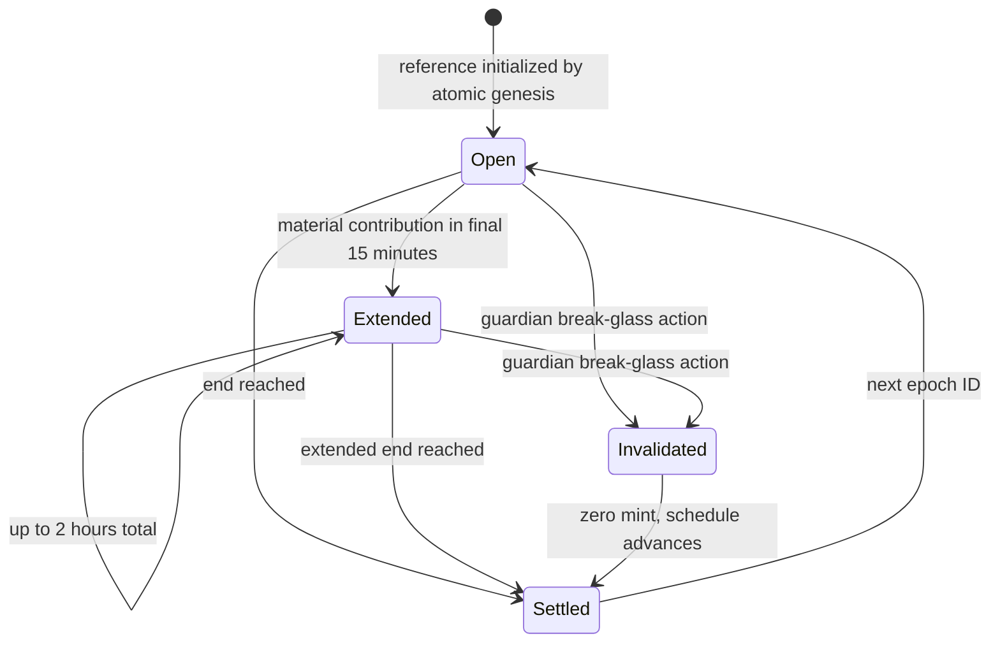

# GBX Emission Schedule

## Parameters

| Parameter                        |                    Value |
| -------------------------------- | -----------------------: |
| Genesis miners                   |           80,000,000 GBX |
| Genesis protocol-owned liquidity |           20,000,000 GBX |
| Maximum recurring budget         |          900,000,000 GBX |
| Lifetime cumulative mint cap     |        1,000,000,000 GBX |
| Epoch duration                   |                    1 day |
| Half-life                        |             1,460 epochs |
| Daily decay WAD                  |  999,525,354,337,060,160 |
| Initial daily scheduled emission | 427,181.096645855643 GBX |

There is no permanent tail emission. Burns do not reopen any part of the lifetime cap.

## State transition



Settlement is permissionless and advances one ended epoch ID per call. After downtime, callers can settle the
already-ended epochs sequentially. This preserves daily schedule decay and never carries forfeited emission into a
later epoch.

## Demand scaling and anti-sniping

Actual emission is limited by both the schedule and the amount contributors can afford at 95% of the previous
endogenous reference. A contribution during the final 15 minutes extends the epoch by 15 minutes when it increases
the prior total by at least 1%; cumulative extension is capped at two hours. Extension changes the contribution
deadline, not the emission epoch ID.

## Differential evidence

The independent implementations are:

- Solidity: `EmissionMath`, `MiningMath`, `EmissionController`, and `MiningPool`.
- TypeScript: `packages/sdk/src/math/emissions.ts` and the simulation fixture harness.
- Python: `packages/simulations/python/reference_model.py`.

The committed decimal-string fixtures cover 1, 4, 8, 16, 32, and 100-year horizons plus a SHA-256 commitment to every
daily scheduled emission from day 0 through day 36,500. Foundry recomputes that commitment through `EmissionMath`, so
the Solidity schedule is differentially checked against both independent reference implementations without reducing
the evidence to a handful of sampled days. The fixtures also cover fully funded, underfunded,
and empty epochs. Regression tests preserve separate Solidity EMA floors and the nonzero atomic reserve after long
empty tails.

Run:

```bash
pnpm sdk:test
pnpm simulations:test
pnpm simulations:fixtures:check
cd packages/contracts && forge test --match-contract EmissionControllerTest
```

The model proves arithmetic parity; it does not predict demand or token value.
