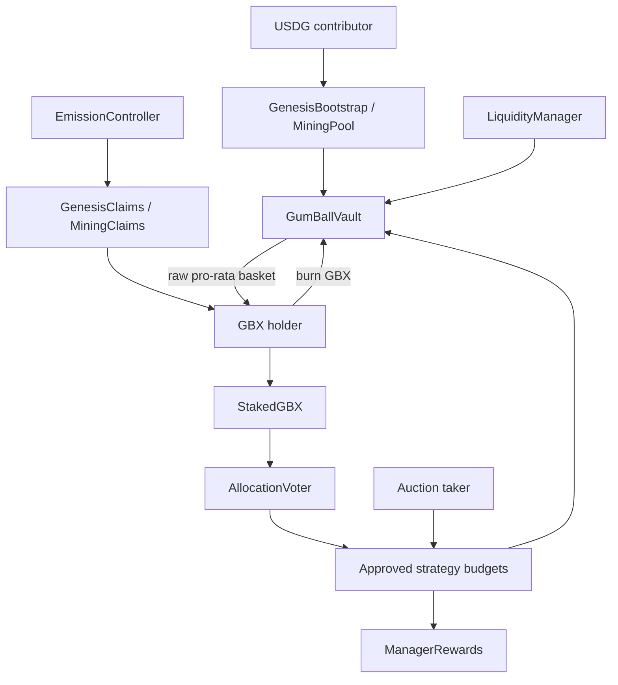

# GUM BALL 6900 Protocol Specification

This repository implements the August 1, 2026 GUM BALL 6900 master build specification. This file is the compact
in-repository normative map; detailed arithmetic, security boundaries, and operating procedures live in the linked
documents and contract NatSpec.

## Product invariants

GUM BALL 6900 is one directly deployed, non-upgradeable basket protocol on Robinhood Chain. It has no public factory,
token-holder proposal system, conventional DAO treasury executor, onchain NAV oracle, arbitrary vault execution, or
staking withdrawal lock.

- USDG contributors receive already-minted GBX claims from genesis or daily recurring epochs.
- GBX is a burnable pro-rata claim on every registered raw token balance held by GumBallVault.
- Lifetime cumulative mint is capped at one billion GBX; burns never reopen capacity.
- GBX stakes 1:1 into non-transferable sGBX. Unstaking is immediate.
- New/increased signals activate after 24 hours and allocate only future notified USDG.
- Each asset acquisition uses a bounded oracleless reverse Dutch auction.
- The vault receives all target receipt except the manager share; active managers receive at most 2%.
- Buyback accepts GBX for budgeted USDG and performs a real burn before USDG release.
- The 20 million genesis LP GBX is backed by sponsor USDG before entering canonical single-sided v4 liquidity.

## Protocol graph

## Lifecycle

1. Deployment tooling resolves current canonical dependencies, mines the hook address, deploys the complete graph,
   closes every set-once dependency, registers assets/strategies through the purpose-limited timelock, and publishes
   canonical deployment evidence. The Hardhat runner records resumable phase state; Foundry phase entrypoints are
   one-shot and require manual receipt reconciliation after any interrupted broadcast.
2. The sponsor escrows a known maximum. Community bootstrap runs for seven days under a fixed cap.
3. Failure enters permissionless refunds. Success atomically transfers backing, mints 80M claims + 20M LP GBX,
   initializes mining and the guarded v4 pool, mints the four range positions, and notifies genesis USDG.
4. Daily mining escrows USDG, demand-scales emission, transfers settlement backing to the vault, and mints complete
   claims allocations. Empty epochs advance without carryover.
5. Holders stake and signal. Strategies exchange only their virtual USDG budgets for target assets; they cannot sell
   existing basket holdings.
6. Holders may immediately unstake, trade through market liquidity, or burn GBX for the in-kind registered basket.

## Authority

ProtocolTimelock is controlled by a disclosed multisig but is not a generic executor. It accepts only hard-coded
target/selector classes with 48-hour or seven-day delays. EmergencyGuardian can only stop new exposure. Neither can
mint GBX, sweep the vault, redirect claims/rewards, transfer LP NFTs to an EOA, or pause redemption, unstaking, burns,
refunds, settled claims, or accrued reward claims.

Production eligibility is a separate disclosed trust boundary. Test mode may use `NoopEligibilityModule`; mainnet
requires a legally approved immutable registry adapter or explicit approval for unrestricted operation.

## Normative documents

- [Architecture](ARCHITECTURE.md)
- [Economics and formulas](ECONOMICS.md)
- [Emission schedule](EMISSIONS.md)
- [Economic/security invariants](INVARIANTS.md)
- [Canonical Uniswap v4 design](UNISWAP_V4.md)
- [Permissioned-pool release boundary](adr/0010-permissioned-pool-release-boundary.md)
- [Permissioned-pool successor graph](adr/0011-permissioned-pool-successor-graph.md)
- [Access control](ACCESS_CONTROL.md)
- [Threat model](THREAT_MODEL.md)
- [Trust assumptions](TRUST_ASSUMPTIONS.md)
- [Audit scope](AUDIT_SCOPE.md)
- [Deployment](DEPLOYMENT.md)
- [Subgraph](SUBGRAPH.md)
- [Web application](WEBAPP.md)
- [Operations](OPERATIONS.md)
- [Incident response](INCIDENT_RESPONSE.md)
- [Mainnet launch checklist](LAUNCH_CHECKLIST.md)

If implementation and prose disagree, production remains blocked until the discrepancy is resolved, tested, and
recorded in an ADR. A local passing build is not deployment authorization.
