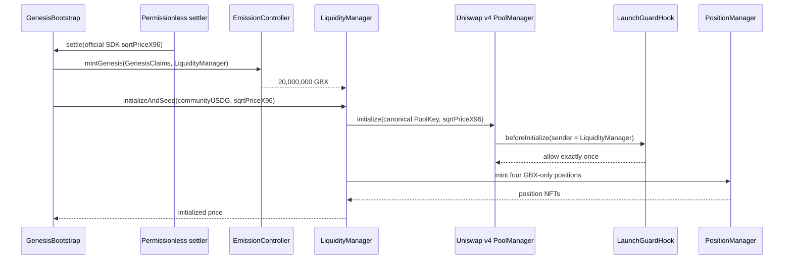

# Canonical Uniswap v4 Liquidity

## Canonical pool

The unrestricted schema-v1 graph designates one sorted GBX/USDG `PoolKey`:

```text
fee:          3,000 (0.30%)
tick spacing: 60
hook:         LaunchGuardHook
NFT owner:    LiquidityManager
```

“Canonical” identifies the pool initialized and owned by the protocol. It does not prevent third parties from
creating unrelated pools.

LaunchGuardHook has only the `beforeInitialize` permission bit. It accepts exactly the configured currencies, fee,
spacing, and hook address, exactly once, and only when `PoolManager.initialize` reports LiquidityManager as sender.
It has no swap-, liquidity-, donation-, fee-, upgrade-, or arbitrary-call surface.

That minimal hook is not a swap-time permissioned-pool implementation. Deployment-manifest schema v1 therefore
rejects a `release-approved` `permissioned-production` manifest even if its review boolean is set. The unrestricted
graph may launch only after counsel and issuers explicitly approve `unrestricted-production-approved`.
[ADR-0010](adr/0010-permissioned-pool-release-boundary.md) records this fail-closed v1 boundary.

The schema-v2 successor is specified in
[ADR-0011](adr/0011-permissioned-pool-successor-graph.md). It uses the official Permissions Adapter/factory,
Permissioned Position Manager, Universal Router 2.2, and quoter relationships; replaces the pool-facing GBX currency
with the verified adapter; and adds only GUM BALL's canonical delayed-initialization guard. A bounded settlement
escrow recycles the factory's 1-wei verification deposit during atomic genesis so the complete 20,000,000 GBX remains
available for POL without an extra mint. The Hardhat `permissioned` deployment branch and release-manifest schema v2
bind this graph. The graph artifact remains deliberately nonauthorizing (`releaseEligible: false`); only a signed v2
manifest that binds the exact graph bytes, a reproducible official-source build, and a fresh Robinhood testnet-fork
rehearsal can reach the ordinary release gates. No populated production evidence set or external approval is committed.

## Genesis price orientation

The endogenous launch price is:

```text
P0 = raw community USDG / 80,000,000e18 GBX
```

The settlement caller derives `sqrtPriceX96` from the finalized raw amounts with Uniswap's pinned official SDK
`encodeSqrtRatioX96`. `GenesisPriceMath` sorts the token addresses, orients the ratio as token1 per token0, enforces
Uniswap v4's half-open square-root-price bounds, and proves onchain that the supplied value is the unique floor square
root of the exact ratio. Its 512-bit comparison does not construct the potentially wider-than-256-bit shifted ratio.
A neighboring, hand-calculated, stale, or out-of-range witness reverts the entire settlement. Tick/range and liquidity
math continue to use Uniswap's pinned `TickMath`, `LiquidityAmounts`, `FullMath`, and core `SqrtPriceMath`; no local
production square-root or tick formula replaces the protocol libraries. The bounded maximal-liquidity procedure and
its integer residual are specified in [ADR-0005](adr/0005-genesis-v4-integer-liquidity-residual.md).



GenesisBootstrap performs this inside the same transaction that transfers sponsor/community backing to GumBallVault
and mints the complete genesis supply. Any pool or position failure rolls the whole launch back.

## One-sided range ladder

The default allocations are 50%, 30%, 15%, and 5%, covering approximately `1.0–1.5x`, `1.5–3x`, `3–6x`, and
`6–12x P0`. Deployment converts those price multipliers to spacing-aligned, correctly mirrored ticks before launch.
At the start boundary each position requires GBX only. When token0's floor tick is exactly spacing-aligned but the
actual square-root price lies strictly inside that tick, the lower bound advances one spacing; exact boundary equality
does not. A real PoolManager settlement regression proves the first mint cannot request USDG. As users buy GBX, ranges
convert toward USDG and become able to support sells inside the traversed liquidity.

Each percentage defines a raw-GBX cap. LiquidityManager chooses the greatest integer v4 liquidity that fits each cap
and records the actual principal. Because v4 liquidity is integral, fixed ranges cannot universally represent every
raw-token cap exactly. The sum of actual principal and the constrained GBX residual held by LiquidityManager must
equal exactly 20,000,000 GBX. The residual is fully backed, cannot be swept by fee collection, and has no approval or
arbitrary-transfer path. On the pinned 1:1 Robinhood vector it is 188,254 wei of GBX.

The primary hard exit remains GumBallVault redemption. A swap is a market trade with fees, price impact, and
available-liquidity risk; it is not a basket redemption.

## Fees and completed ranges

Fee collection cannot reduce position principal. Collected GBX fees are burned; the observed USDG receipt is sent
to GumBallVault and notified to AllocationVoter. A completed position may be swept permissionlessly only after the
actual slot0 square-root price reaches the terminal TickMath boundary. A floor tick equal to a token1 lower bound is
not sufficient when its square-root price remains inside that tick. Once complete, the NFT is burned, USDG principal
and fees go to GumBallVault, and GBX dust is burned. There is no recipient parameter.

The live client obtains the complete bounded active-position ID set from the subgraph at an explicit indexed block/hash,
then pins all StateView, LiquidityManager, PositionManager, and balance reads to that block and revalidates its hash.
The contract-enforced cap, onchain active count, candidate count, migration count, records, custody, PoolKey, ticks, and
liquidity must agree. An exact zero count with
an empty list is valid after all ranges are swept and produces zero position principal and fees; active genesis records
still make that empty index fail. Count/list mismatches, duplicates, more than 16 entries, omissions, stale hashes, or
inconsistent indexes fail closed. Only unmigrated state may fall back to the four genesis getters, whose active records
must match the onchain counter. LiquidityManager enforces a lifetime maximum of 16 simultaneously active canonical
positions, so requesting 17 rows detects an inconsistent or truncated index while 16 rows cover every valid state.
The client computes the human-unit USDG-per-GBX price and position principal with pinned official v4 `Pool` and
`Position` implementations. Exact current uncollected fees come from StateView `getPositionInfo` for the core position
owned by PositionManager with salt `bytes32(tokenId)`, compared with `getFeeGrowthInside`; the delta wraps as `uint256`
and uses Q128 floor multiplication exactly like v4 core. Principal and fees are mapped by canonical currency ordering
into raw GBX/USDG, not NAV. Dedicated subgraph `Protocol` counters still represent only already-collected routed fees
and exclude completed-range principal, sweep dust, and migration residuals.

## Constrained migration

Liquidity migration is exceptional. The complete plan is committed as calldata in a seven-day ProtocolTimelock
operation. The implementation validates the exact GBX/USDG destination `PoolKey`, aligned ordered ticks, initialized
destination pool, deadline, minimum liquidity, and fixed PositionManager/Permit2 custody path.

The destination key must equal the already initialized canonical PoolKey byte-for-byte. Migration means replacing
positions inside that pool; it does not authorize the multisig to select a new fee tier, hook, tick spacing, currency
ordering, or pool. The explicit key remains in the plan so public review and the timelock hash commit the complete
Uniswap operation. Moving to a different pool or hook would require a separately reviewed successor deployment, not
an expansion of this purpose-limited executor.

Each migration may remove and replace at most 16 positions, and its computed post-migration active count may not exceed
the global 16-position cap. Sweeps decrement that count; reverted sweeps or migrations roll every record and counter
change back atomically with the PositionManager operation.

At execution:

1. Existing live position NFTs are burned into v4 currency credits with precommitted minimum outputs.
2. Replacement positions are minted to LiquidityManager from only those credits with precommitted maximum inputs.
3. Every residual USDG unit is routed to GumBallVault and AllocationVoter.
4. Every residual GBX unit is really burned.
5. A complete before/after migration event is emitted.

The batch ends with `TAKE_PAIR`, not `CLOSE_CURRENCY`, so a plan that would create a token debt reverts instead of
pulling additional principal through Permit2. The one-time genesis Permit2 allowances are revoked immediately after
the ladder is seeded. A later reviewed migration may burn the constrained genesis residual under the same residual
routing rule; launch itself preserves it so the exact 100 million initial supply remains intact.

The guardian can pause new migrations but cannot take principal or block fee collection/completed-range sweeps. Only
the timelock can unpause. No path transfers an NFT or currency to an operator, multisig, EOA, or calldata-selected
recipient.

## External deployment gate

`packages/config/deployments/uniswap-v4.ts` is fail-closed. Mainnet addresses remain provisional until deployment
tooling verifies current official records, chain ID, runtime bytecode, pinned code hashes, and library compatibility.
Testnet addresses are unresolved. Production is also blocked until legal review selects an approved unrestricted or
permissioned-pool architecture.

Fork tests and a Robinhood testnet rehearsal are release evidence; local mocks are not substitutes for them. The
mainnet archive-fork lifecycle must exercise real PositionManager seeding, swaps in both directions, fee collection and
routing, a permissionless terminal-range sweep, and a timelocked canonical migration at the recorded nonzero block.
The testnet fork likewise requires a recorded nonzero block plus reviewed address and runtime-code-hash pins for every
external dependency; a chain-identity-only run cannot satisfy the gate.
