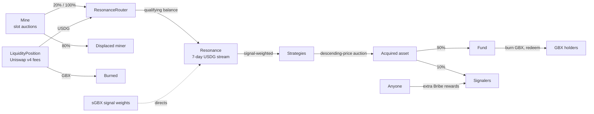

# GUM BALL 6900 at a Glance

> **Historical sheet — governance design superseded by ADR 0034.** This document is pinned to commit `95ed60e` and
> preserves its former `ProtocolGovernor` and Timelock design. [ADR 0034](../adr/0034-external-governance-ownership.md)
> removed both from the current core. `SignalGBX` still exposes IVotes-compatible checkpoints, but the external owner
> and governance system for `Resonance` remain unselected. The governance component, lifecycle, and risk statements
> below are historical, not current protocol claims.

**A protocol where token holders decide, by committing stake, which assets a shared onchain treasury buys — and where
anyone holding the token can burn it to withdraw their share of what was bought.**

## The problem

Pooled investment vehicles ask you to trust a manager. Onchain versions often keep that trust in a different form: an
admin key that changes holdings, an upgradeable contract that changes rules, a pause switch that stops withdrawals, an
oracle that decides what things are worth.

GUM BALL 6900 removes the manager. At this commit there is no upgrade path, proxy, pause switch, sweep function,
arbitrary-call executor, migration route, price oracle, NAV calculation, or rebalancing engine. The treasury has no
owner at all. What gets bought is decided by stake; what you can withdraw is decided by arithmetic you can verify.

## GBX

**GBX** is the protocol's transferable token. It is created two ways only: a single 20,000,000-token allocation at
deployment that becomes permanent market liquidity, and continuous issuance to miners after that. Mint authority is
handed to one contract exactly once and can never be changed, revoked, or duplicated. There is no supply cap;
issuance halves at fixed cumulative-mining thresholds down to a permanent, strictly positive floor.

Holding GBX gives two rights: **signal with it** to direct the protocol, or **burn it** to redeem treasury assets.

## Signaling

Signaling is a single atomic step: you deposit GBX, receive an equal amount of **SignalGBX (sGBX)**, and commit it to
one **Strategy** — a standing mandate to acquire one asset. Withdrawing reverses all three at once.

There is no intermediate "staked but uncommitted" state. **Every sGBX unit in existence is committed to exactly one
Strategy at all times**, so voting supply and economically active signal are the same quantity. sGBX is
non-transferable and carries the protocol's governance votes.

Revenue flows to Strategies in proportion to the signal they carry, moment by moment. There is no lock-up, cooldown, or
voting epoch, and every signal change first settles revenue accrued under the old weights — so changing your mind never
retroactively redirects money.

## Revenue, acquisition, and redemption

Revenue arrives in USDG from two sources. **Mining:** GBX is issued continuously to whoever occupies each of the
mine's slots (one at launch, up to sixteen), and taking a slot means winning its hourly descending-price auction — 80%
of the payment goes to the displaced miner, 20% becomes revenue; an empty slot routes 100%. There is no team fee.
**Liquidity fees:** the permanent GBX/USDG Uniswap v4 position earns fees that anyone can harvest, with the USDG
becoming revenue, the GBX burned, and the underlying liquidity never moving.

**Resonance** releases that revenue as a rolling seven-day stream, split by live signal weights. Each Strategy
accumulates USDG and sells all of it in a descending-price auction, asking to be paid in the asset it acquires. No
oracle is consulted — the auction is the price discovery.

Every acquired payment is then split by an immutable, hard-coded rule: **90% becomes treasury backing, 10% becomes an
automatic reward for that Strategy's signalers.** The split is cumulatively exact — paying in a thousand dust
increments yields the Bribe the same total as one lump sum — and neither share can be redirected.

The **Fund** is an ownerless treasury with no administrator and no asset registry. To redeem, burn GBX, name the
assets you want, and receive for each:

```text
floor(Fund's balance of that asset × GBX burned ÷ total GBX supply before the burn)
```

The operation is atomic. Assets you do not name are permanently forfeited — the design choice that stops one broken
token from freezing everyone else's redemption.

## Why signalers participate

Two stacked incentives: the automatic 10% share of everything their Strategy acquires, and **Bribes** — anyone may
permissionlessly stream additional rewards into a Strategy's pool to pull signal toward it, up to eight reward tokens
per Strategy.

## The loop



## Protocol components

| Contract            | Role                                                                                  |
| ------------------- | ------------------------------------------------------------------------------------- |
| `GBX`               | The token. One permanent minter, no supply cap, exact minted-minus-burned accounting. |
| `Mine`              | Issues GBX to slot occupants; hourly slot auctions produce USDG revenue.              |
| `SignalGBX`         | Non-transferable signal token; sole coordinator; governance votes. No idle state.     |
| `Resonance`         | Holds revenue in a seven-day stream and allocates it by signal weight.                |
| `Strategy`          | Descending-price auction trading accumulated USDG for a target asset.                 |
| `BribeRouter`       | Splits every acquired payment 90% Fund / 10% paired Bribe, cumulatively exact.        |
| `Bribe`             | Streams up to eight reward tokens to a Strategy's signalers.                          |
| `Fund`              | Ownerless treasury; redemption and GBX burning are its only exits.                    |
| `LiquidityPosition` | Permanently holds the GBX/USDG v4 position; fees harvestable by anyone.               |
| `ProtocolGovernor`  | Admits only three exact zero-value Resonance calls through a Timelock.                |

## What governance can change

Three things: add a Strategy, retire a Strategy, and register a Bribe reward token. Proposals are filtered by target,
selector, and calldata length before creation. The
**final live Strategy cannot be retired** — a replacement must be added first — so a valid signal destination always
exists. Governance cannot touch mining rates, the 90/10 split, mint authority, Fund assets, liquidity custody, the
auction mechanism, fixed sixteen-slot count, or its own voting parameters.

## Key risks

- **No independent audit.** No third party has reviewed this code. Internal testing is not a security guarantee.
- **Immutability cuts both ways.** A bug cannot be patched; a deployment mistake cannot be corrected.
- **Governance limits.** Snapshot voting without a withdrawal lock; queued proposals cannot be cancelled by anyone;
  undelegated signal raises the quorum denominator and in quantity could make governance unreachable.
- **Value is not guaranteed.** Nothing guarantees appreciation, auction liquidity, sound signal choices, or safe
  acquired tokens. The Fund accepts any ERC-20 sent to it, reviewed or not.
- **Accepted dust and abandonment.** Rounding residue and revenue streamed while nobody signals accumulate in
  Resonance permanently. If the last signaler exits a retired Strategy's reward pool, remaining rewards there are
  abandoned — an amount not bounded to dust.
- **External dependencies.** USDG, Uniswap v4, and every payment and reward token carry their own freeze, upgrade, and
  solvency risk.
- **Miner rollover risk.** The 80% handoff arrives only if someone later replaces the miner at a nonzero price; after
  an hour the price is zero.
- **Unresolved economics.** The mine's rate, halving threshold, tail rate, and price parameters are not yet selected
  or independently modelled.

## Status

| Field                        | Status                                                                                                                                                                                                                                                                                                                                                                                                                                                              |
| ---------------------------- | ------------------------------------------------------------------------------------------------------------------------------------------------------------------------------------------------------------------------------------------------------------------------------------------------------------------------------------------------------------------------------------------------------------------------------------------------------------------- |
| **Protocol status**          | Development candidate. Implementation complete at this commit; not approved for user funds.                                                                                                                                                                                                                                                                                                                                                                         |
| **Deployment status**        | Not deployed on any network. No signed deployment manifest exists. Target chain and canonical USDG / Uniswap v4 addresses are unresolved candidates.                                                                                                                                                                                                                                                                                                                |
| **Internal review status**   | At this commit: 335 default Foundry tests and 17 integration tests pass, 0 failed, 0 skipped, including 21 fuzz properties at 10,000 runs and 27 stateful invariants at 1,000 runs × depth 500 (13.5M calls). Pinned static analysis (Slither, Aderyn, Semgrep, Gitleaks), external fuzzing (Medusa 101,602 calls; Echidna 100,213 calls, 25 properties), and a 43-mutant campaign that killed every mutant all pass. Five High-severity release gates remain open. |
| **Independent audit status** | None. No independent external audit, compatible symbolic analysis, or release review has been completed.                                                                                                                                                                                                                                                                                                                                                            |
| **Legal status**             | Upstream code provenance and license reconciliation are unresolved release blockers.                                                                                                                                                                                                                                                                                                                                                                                |
| **Source commit**            | `95ed60efe333d875f7a66da7853eebdf5384e956`                                                                                                                                                                                                                                                                                                                                                                                                                          |

---

_Further reading: [How GUM BALL 6900 Turns Community Conviction Into an Onchain Portfolio](../articles/gumball-6900-explained.md)
for a plain-English walkthrough, and the [technical whitepaper](../whitepapers/gumball-6900/whitepaper.md) for exact
mathematics, invariants, and threat model._
