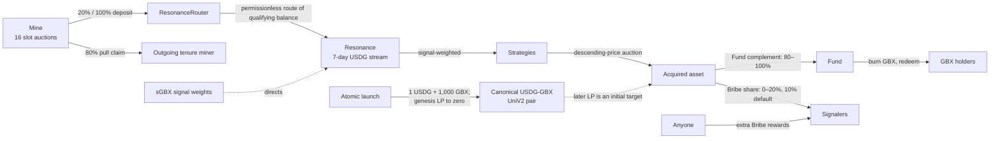

# GumBall6900 at a Glance

**A protocol where token holders signal with GBX which assets a shared onchain treasury buys — and where anyone holding
the token can burn it to redeem their share of what was bought.**

## The problem

Pooled investment vehicles ask you to trust a manager. Onchain versions often keep that trust in a different form: an
admin key that changes holdings, an upgradeable contract that changes rules, a pause switch that stops withdrawals, an
oracle that decides what things are worth.

GumBall6900 removes treasury-manager custody. There is no upgrade path, proxy, pause, sweep, arbitrary-call executor,
balance/state migration, oracle, NAV calculation, or rebalancing engine. The treasury has no owner. Narrow governance
can change four Resonance decisions and only Mine's future revenue Router; redemption remains arithmetic.

## GBX

**GBX** is the protocol's transferable token. Its constructor starts at zero supply. After the permanent Mine binding,
the canonical launcher directs one fixed **1,000 GBX** issuance solely into the genesis pair; later issuance comes
from mining slots. There is no team, presale, treasury, or discretionary allocation. Mint authority can never be
changed, revoked, or duplicated, and there is no supply cap.

Holding GBX gives two rights: **signal with it** to direct the protocol, or **burn it** to redeem treasury assets.

## Signaling

Signaling is a single atomic step: you deposit GBX, receive an equal amount of **SignalGBX (sGBX)**, and commit it to
one **Strategy** — a standing mandate to acquire one asset. Removing signal reverses all three at once.

There is no intermediate idle state. **Every sGBX unit in existence is committed to exactly one
Strategy at all times**, so the amount of signal in the system and the amount actually directing money are the same
quantity. sGBX cannot be transferred; the only way to get it is to add signal, and the only way to lose it is to remove
signal.

Revenue flows to Strategies in proportion to the signal they carry, moment by moment. There is no lock-up, cooldown, or
voting epoch, and every signal change first settles revenue accrued under the old weights — so changing your mind never
retroactively redirects money. Reallocation is a direct source removal plus destination addition; smart accounts may
compose both calls atomically, and a failure rolls the complete wallet batch back.

## Revenue, acquisition, and redemption

Protocol revenue arrives in USDG from **mining**: the mine is a permanent grid of **sixteen slots**, each running
its own hourly descending-price auction. GBX is issued continuously to whoever occupies each slot, and taking a slot
means paying that slot's current price — 80% becomes a pull claim for the outgoing tenure miner, while Mine deposits 20% into
ResonanceRouter; an empty slot deposits 100%. Mine does not call `route()`. Your issuance rate is fixed the moment you
take a slot and never changes while you hold it. There is no
team fee.

Anyone may later call the Router to move a qualifying balance into **Resonance**, which releases it as a rolling
seven-day stream split by live signal weights. There is no routing role or bounty, so Mine revenue may wait indefinitely
without a manual, frontend, volunteer-keeper, or cron caller. Each Strategy
accumulates USDG and sells all of it in a descending-price auction, asking to be paid in the asset it acquires. No
oracle is consulted — the auction is the price discovery.

The GBX-only atomic launcher seeds a pristine Robinhood Chain Uniswap V2 USDG/GBX pair with exactly **1 USDG and 1,000
GBX**, permanently locks every genesis LP unit at the zero address, and registers GBX and the actual LP token as the
two initial Strategies. Later LP is an ordinary redeemable asset if Fund acquires it. There is no continuing liquidity
manager, pricing, rebalance, swap, harvest, or liquidity guarantee.

Every acquired payment is classified at one bounded global rate. The automatic Bribe share **defaults to 10% and may
be set prospectively from 0% through 20%**; Fund receives the 100%-minus-Bribe complement, so its share defaults to
90% and always remains between 80% and 100%. Strategy performs the split per purchase, pays Fund directly, and sends
the Bribe share to its paired Router. Integer floors are accepted instead of a cumulative carry ledger. Neither
destination can be redirected.

The **Fund** is an ownerless treasury with no administrator and no asset registry. To redeem, burn GBX, name the
assets you want, and receive for each:

```text
floor(Fund's balance of that asset × GBX burned ÷ effective GBX supply before the burn)
```

That supply figure counts GBX already earned by current miners but not yet issued, so redeeming early does not dilute
the miners still holding slots. The operation is atomic. Assets you do not name are permanently forfeited — the design
choice that stops one broken token from freezing everyone else's redemption.

## Why signalers participate

Two stacked incentives: the bounded automatic share of everything their Strategy acquires — 10% by default, adjustable
prospectively from 0% through 20% — and **Bribes**, which anyone may permissionlessly stream into a Strategy's pool to
pull signal toward it, up to sixteen reward tokens per Strategy including the asset that Strategy buys.
Direct Bribe claims are authorized only for the beneficiary or the Bribe's immutable Resonance. A caller may also ask
Resonance to claim all tokens across a caller-selected array of registered live or killed Strategy Bribes for itself;
duplicates execute sequentially and the complete batch is atomic. Direct scalar-token claiming remains the gas and
broken-token fallback.

## The loop



## Protocol components

| Contract      | Role                                                                                  |
| ------------- | ------------------------------------------------------------------------------------- |
| `GBX`         | The token. One permanent minter, no supply cap, exact minted-minus-burned accounting. |
| `Mine`        | Issues GBX to slot occupants; sixteen hourly slot auctions produce USDG revenue.      |
| `SignalGBX`   | Non-transferable signal token; sole coordinator. No idle state.                       |
| `Resonance`   | Holds revenue in a seven-day stream and allocates it by signal weight.                |
| `Strategy`    | Descending-price auction trading accumulated USDG for a target asset.                 |
| `BribeRouter` | Buffers one Strategy's Bribe share for permissionless distribution.                   |
| `Bribe`       | Synthetix-shaped streams for up to sixteen tokens over virtual signal balances.       |
| `Fund`        | Ownerless treasury; redemption and GBX burning are its only exits.                    |
| `GBXLauncher` | One-shot deployment infrastructure; seeds and locks genesis LP, then retains no role. |

## What can be changed, and by whom

**Five continuing actions** across two contracts: Resonance may add or retire a Strategy, register a Bribe reward
token, and set the signaler reward share within 0–20%. Mine may only change where **future** protocol revenue goes,
after checking that the replacement graph shares the same GBX, USDG, and Fund. The **final live Strategy cannot be
retired** — a replacement must be added first.

Mine and Resonance use two-step ownership. The atomic launcher makes the supplied governance contract pending owner of
both; that contract must accept both roles after launch. SignalGBX and both factories renounce their setup owners. The
external governance system has not been chosen, and the core defines no proposal rules, quorum, or execution delay.

The Mine setter cannot touch mining rates, mint authority, Fund assets, old graph balances or positions, the auction
mechanism, or the fixed sixteen-slot count. Fund remains ownerless. The reward share moves only inside its coded 0–20%
band and applies to later purchases only. No contract has an upgrade path, pause switch, or sweep.

## Key risks

- **External review is incomplete.** A V12 export targets the exact source commit, but it omits an explicit scope,
  methodology, named auditor, date, signature, and report-level rationale. Independent disposition confirmed three
  behaviors requiring treatment; the export is not a security guarantee or release approval.
- **Immutability cuts both ways.** Code and old graph state cannot be patched. Only future Mine revenue can be switched
  to a validated replacement graph; old balances and positions stay behind.
- **Governance is unfinished.** The external system that must accept Mine and Resonance ownership is unselected, so its
  voting rules, permissions, upgrade model, and emergency powers are unknown. Whoever holds those roles can add or
  retire Strategies, register rewards, adjust the bounded Bribe share, redirect future Mine revenue, hand ownership on,
  or discard it. sGBX vote checkpoints survive withdrawal, so an external system must address borrowed voting weight.
- **Value is not guaranteed.** Nothing guarantees appreciation, auction liquidity, sound signal choices, or safe
  acquired tokens. The Fund accepts any ERC-20 sent to it, reviewed or not.
- **Accepted dust and abandonment.** Rounding residue and revenue streamed while nobody signals accumulate in
  Resonance permanently. If the last signaler exits a retired Strategy's reward pool, remaining rewards there are
  abandoned — an amount not bounded to dust.
- **External dependencies.** USDG and every payment and reward token carry their own freeze, upgrade, and solvency
  risk. The canonical LP also carries the risks of its pair, venue, and underlying tokens.
- **Miner rollover risk.** The 80% replacement claim exists only if a later replacement clears at a nonzero price;
  after an hour the price is zero, and self-replacement is permitted.
- **Economic review remains open.** The Mine's initial rate, provisional 69-day halving period, tail rate, and
  price constants are hard-coded and modelled, but have not received independent review.

## Status

| Field                        | Status                                                                                                                                                                                                                                        |
| ---------------------------- | --------------------------------------------------------------------------------------------------------------------------------------------------------------------------------------------------------------------------------------------- |
| **Protocol status**          | Uncommitted post-ADR-0055 development candidate; not approved for user funds.                                                                                                                                                                 |
| **Deployment status**        | Not deployed on any network. No signed deployment manifest exists. The launcher pins Robinhood Chain and its reviewed Uniswap V2 Factory; exact USDG/governance provenance, code hashes, simulation, receipts, and authorization remain open. |
| **Internal review status**   | V12's 22 findings were internally revalidated against `f991253`; ADRs 0052-0054 are later remediations, while ADR 0055 adds Mine Router migration and two-step ownership. None is covered by V12.                                             |
| **Open release gates**       | ADR 0055 Mine/Resonance/launcher review, fixed Mine economics, dependencies, exact governance, both ownership acceptances, deterministic rehearsal, and independent closure remain open.                                                      |
| **Independent audit status** | V12 export received for `3ae171b`; incomplete assurance package and not release-authorizing. Compatible symbolic analysis and final release review remain incomplete.                                                                         |
| **Legal status**             | Upstream code provenance and license reconciliation are unresolved release blockers.                                                                                                                                                          |
| **Source state**             | Current source includes ADRs 0051-0055 after V12's `3ae171b` baseline, including the launcher plus Mine Router migration and two-step ownership.                                                                                              |

---

_Further reading: [How GumBall6900 Turns Community Conviction Into an Onchain Portfolio](../articles/gumball-6900-explained.md)
for a plain-English walkthrough, and the [technical whitepaper](../whitepapers/gumball-6900/whitepaper.md) for exact
mathematics, invariants, and threat model._
