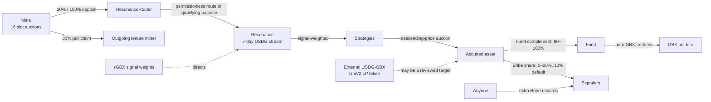

# GumBall6900 at a Glance

**A protocol where token holders decide, by committing stake, which assets a shared onchain treasury buys — and where
anyone holding the token can burn it to withdraw their share of what was bought.**

## The problem

Pooled investment vehicles ask you to trust a manager. Onchain versions often keep that trust in a different form: an
admin key that changes holdings, an upgradeable contract that changes rules, a pause switch that stops withdrawals, an
oracle that decides what things are worth.

GumBall6900 removes the manager. In this development tree there is no upgrade path, proxy, pause switch, sweep function,
arbitrary-call executor, migration route, price oracle, NAV calculation, or rebalancing engine. The treasury has no
owner at all. What gets bought is decided by stake; what you can withdraw is decided by arithmetic you can verify.

## GBX

**GBX** is the protocol's transferable token. It starts at zero supply and is issued only by Mine. Mint authority is
handed to that one contract exactly once and can never be changed, revoked, or duplicated. There is no supply cap;
the prospective issuance rate halves at fixed deployment-time intervals down to a permanent, strictly positive floor.

Holding GBX gives two rights: **signal with it** to direct the protocol, or **burn it** to redeem treasury assets.

## Signaling

Signaling is a single atomic step: you deposit GBX, receive an equal amount of **SignalGBX (sGBX)**, and commit it to
one **Strategy** — a standing mandate to acquire one asset. Withdrawing reverses all three at once.

There is no intermediate "staked but uncommitted" state. **Every sGBX unit in existence is committed to exactly one
Strategy at all times**, so the amount of signal in the system and the amount actually directing money are the same
quantity. sGBX cannot be transferred; the only way to get it is to signal, and the only way to lose it is to withdraw.

Revenue flows to Strategies in proportion to the signal they carry, moment by moment. There is no lock-up, cooldown, or
voting epoch, and every signal change first settles revenue accrued under the old weights — so changing your mind never
retroactively redirects money. A move is one atomic source removal plus destination addition; failure rolls both back.

## Revenue, acquisition, and redemption

Protocol revenue arrives in USDG from **mining**: the mine is a permanent grid of **sixteen slots**, each running
its own hourly descending-price auction. GBX is issued continuously to whoever occupies each slot, and taking a slot
means paying that slot's current price — 80% becomes a pull claim for the outgoing tenure miner, while Mine deposits 20% into
ResonanceRouter; an empty slot deposits 100%. Mine does not call `route()`. Your issuance rate is fixed the moment you
take a slot and never changes while you hold it. There is no
team fee.

Anyone may later call the Router to move a qualifying balance into **Resonance**, which releases it as a rolling
seven-day stream split by live signal weights. There is no routing role or bounty, so Mine revenue may wait indefinitely
without a manual, frontend, volunteer-keeper, or cron caller. Each Strategy
accumulates USDG and sells all of it in a descending-price auction, asking to be paid in the asset it acquires. No
oracle is consulted — the auction is the price discovery.

A reviewed, externally created fungible Uniswap v2-style USDG/GBX LP token may be one bootstrap Strategy target. It is acquired and
settled exactly like any other asset. The core has no liquidity-creation, custody, pricing, swap, harvest, or guarantee.

Every acquired payment is classified at one bounded global rate. The automatic Bribe share **defaults to 10% and may
be set prospectively from 0% through 20%**; Fund receives the 100%-minus-Bribe complement, so its share defaults to
90% and always remains between 80% and 100%. Strategy performs the split per purchase, pays Fund directly, and sends
the Bribe share to its paired Router. Integer floors are accepted instead of a cumulative carry ledger. Neither
destination can be redirected.

The **Fund** is an ownerless treasury with no administrator and no asset registry. To redeem, burn GBX, name the
assets you want, and receive for each:

```text
floor(Fund's balance of that asset × GBX burned ÷ effective GBX supply before the burn)
```

That supply figure counts GBX already earned by current miners but not yet issued, so redeeming early does not dilute
the miners still holding slots. The operation is atomic. Assets you do not name are permanently forfeited — the design
choice that stops one broken token from freezing everyone else's redemption.

## Why signalers participate

Two stacked incentives: the bounded automatic share of everything their Strategy acquires — 10% by default, adjustable
prospectively from 0% through 20% — and **Bribes**, which anyone may permissionlessly stream into a Strategy's pool to
pull signal toward it, up to sixteen reward tokens per Strategy including the asset that Strategy buys.

## The loop



## Protocol components

| Contract      | Role                                                                                  |
| ------------- | ------------------------------------------------------------------------------------- |
| `GBX`         | The token. One permanent minter, no supply cap, exact minted-minus-burned accounting. |
| `Mine`        | Issues GBX to slot occupants; sixteen hourly slot auctions produce USDG revenue.      |
| `SignalGBX`   | Non-transferable signal token; sole coordinator. No idle state.                       |
| `Resonance`   | Holds revenue in a seven-day stream and allocates it by signal weight.                |
| `Strategy`    | Descending-price auction trading accumulated USDG for a target asset.                 |
| `BribeRouter` | Buffers one Strategy's Bribe share for permissionless distribution.                   |
| `Bribe`       | Synthetix-shaped streams for up to sixteen tokens over virtual signal balances.       |
| `Fund`        | Ownerless treasury; redemption and GBX burning are its only exits.                    |

## What can be changed, and by whom

**Four things**, all on one contract: add a Strategy, retire a Strategy, register a Bribe reward token, and set the
signaler reward share within its 0–20% bound. Resonance is the only contract with continuing custom owner authority;
SignalGBX, StrategyFactory, and BribeFactory retain setup-only Ownable shells that production must explicitly
renounce after their one-time bindings are consumed. The **final live Strategy cannot be retired** — a replacement
must be added first — so a valid signal destination always exists.

Those four actions sit behind a single owner address on `Resonance`. That address is intended to be an external
governance system, and **that system has not been chosen yet.** The protocol itself contains no voting contract, no
proposal rules, no quorum, and no execution delay. sGBX does record vote checkpoints in the standard format such a
system could read, but nothing in the protocol reads them today. Until that choice is made and reviewed, the honest
statement is that the protocol's decision-making layer is unfinished — see the risks below.

Nothing can touch mining rates, mint authority, Fund assets, the auction mechanism, or the fixed
sixteen-slot count. The reward share moves only inside its coded 0–20% band, and a change applies to later purchases
only — it can never reclassify an amount already settled. No contract has an upgrade path, pause switch, or sweep.

## Key risks

- **External review is incomplete.** A V12 export targets the exact source commit, but it omits an explicit scope,
  methodology, named auditor, date, signature, and report-level rationale. Independent disposition confirmed three
  behaviors requiring treatment; the export is not a security guarantee or release approval.
- **Immutability cuts both ways.** A bug cannot be patched; a deployment mistake cannot be corrected.
- **Governance is unfinished.** The external system that will own `Resonance` is unselected, so its voting rules,
  permissions, upgrade model, and emergency powers are all unknown quantities today. Whoever holds that address can
  add or retire Strategies, register reward tokens, hand ownership on, or discard it. sGBX vote checkpoints survive a
  withdrawal, so an external system that reads them naively could let borrowed GBX vote.
- **Value is not guaranteed.** Nothing guarantees appreciation, auction liquidity, sound signal choices, or safe
  acquired tokens. The Fund accepts any ERC-20 sent to it, reviewed or not.
- **Accepted dust and abandonment.** Rounding residue and revenue streamed while nobody signals accumulate in
  Resonance permanently. If the last signaler exits a retired Strategy's reward pool, remaining rewards there are
  abandoned — an amount not bounded to dust.
- **External dependencies.** USDG and every payment and reward token carry their own freeze, upgrade, and solvency
  risk. A registered external LP token also carries the risks of its pair and venue.
- **Miner rollover risk.** The 80% replacement claim exists only if a later replacement clears at a nonzero price;
  after an hour the price is zero, and self-replacement is permitted.
- **Economic review remains open.** The Mine's initial rate, provisional 69-day halving period, tail rate, and
  price constants are hard-coded and modelled, but have not received independent review.

## Status

| Field                        | Status                                                                                                                                                                                                       |
| ---------------------------- | ------------------------------------------------------------------------------------------------------------------------------------------------------------------------------------------------------------ |
| **Protocol status**          | Development candidate at review target `3ae171b`; not approved for user funds.                                                                                                                               |
| **Deployment status**        | Not deployed on any network. No signed deployment manifest exists. Target chain and canonical USDG address are unresolved candidates; any bootstrap LP token address remains a reviewed deployment input.    |
| **Internal review status**   | V12's 22 findings were independently dispositioned at `3ae171b`; 249695 is an accepted theoretical risk, 249702 remains a deployment control, and 249705 is open. A complete release matrix remains pending. |
| **Open release gates**       | Claim authorization for V12-249705 remains unresolved; fixed Mine economics, dependency evidence, and the exact external governance system also remain open.                                                 |
| **Independent audit status** | V12 export received for `3ae171b`; incomplete assurance package and not release-authorizing. Compatible symbolic analysis and final release review remain incomplete.                                        |
| **Legal status**             | Upstream code provenance and license reconciliation are unresolved release blockers.                                                                                                                         |
| **Source state**             | Protocol source reviewed at `3ae171b997254b56602298d873b3918d1575b3c7`; the audit intake changes documentation and records, not protocol source.                                                             |

---

_Further reading: [How GumBall6900 Turns Community Conviction Into an Onchain Portfolio](../articles/gumball-6900-explained.md)
for a plain-English walkthrough, and the [technical whitepaper](../whitepapers/gumball-6900/whitepaper.md) for exact
mathematics, invariants, and threat model._
