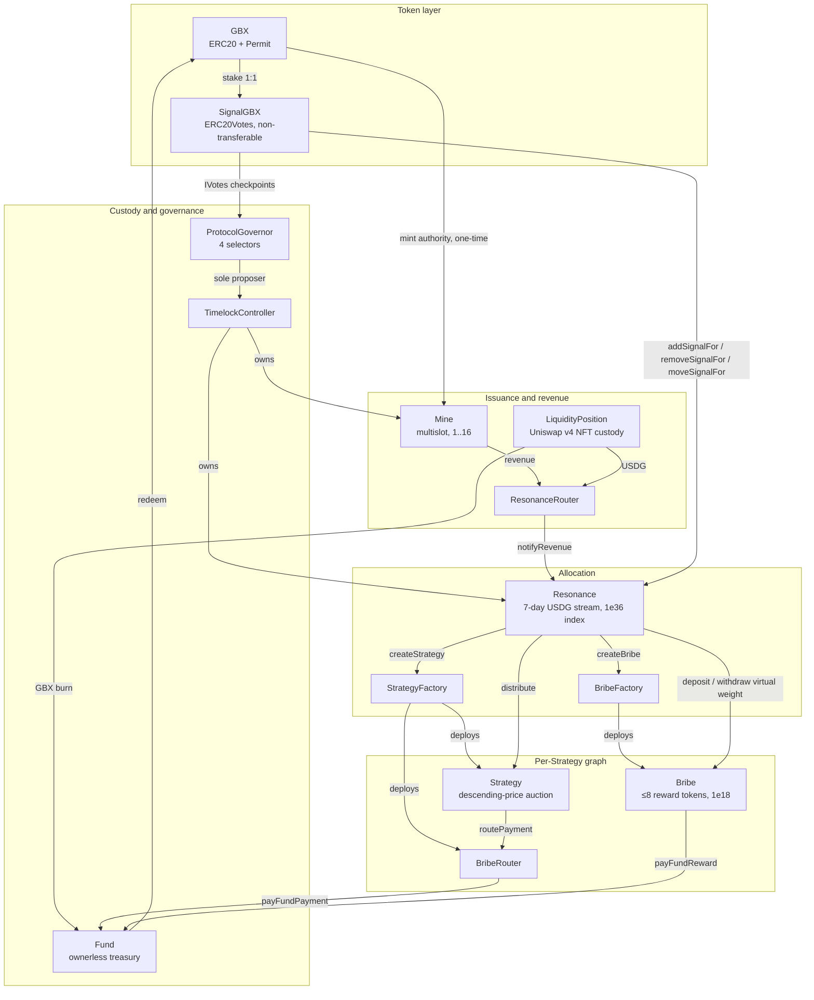

# GUM BALL 6900: Historical Pre-ADR 0034 Technical Whitepaper

> **Historical edition — governance design superseded by ADR 0034.** This uncommitted snapshot predates
> [ADR 0034](../../adr/0034-external-governance-ownership.md) and is preserved only as prior development evidence. It
> does **not** describe the current working tree: the core now contains no `ProtocolGovernor`, `TimelockController`,
> governance adapter, or provider-specific plugin. `SignalGBX` retains IVotes-compatible checkpoints, while the exact
> external owner and governance system for `Resonance` remain unselected. Every present-tense Governor or Timelock
> statement below describes the retired design, not current code.

> **Safety status.** The protocol is **not deployed, not independently audited, and not approved for user funds.**
> Non-governance claims in this edition were verified against the then-current Solidity tree; this source was not
> release-pinned, so it must not be used as current implementation or release evidence.

> **Current presentation sources.** The compact whitepaper and one-page sheet are built from `docs/whitepaper/` and
> `docs/one-pager/gumball6900/` via `pnpm docs:whitepaper` and `pnpm docs:one-pager`. Rebuilding this long-form
> historical source is archival reproduction only and does not make its retired governance design current.

## 1. Abstract

GUM BALL 6900 is an immutable, governance-minimized protocol that converts recurring onchain revenue into a
permissionlessly redeemable portfolio of arbitrary ERC-20 assets, with allocation directed by non-transferable staked
governance weight rather than by a manager, an oracle, or an index methodology.

The protocol issues a token, **GBX**, through a multislot mining market in which slot occupancy is sold by hourly
descending-price auctions denominated in an external stablecoin, **USDG**. Eighty percent of a replacement payment
compensates the displaced occupant; the remainder, together with fees from a permanently locked Uniswap v4 GBX/USDG
position, constitutes protocol revenue.

Revenue is placed into a single rolling seven-day emission schedule held by **Resonance** and allocated continuously
across **Strategies** in proportion to the non-transferable staked weight (**SignalGBX**, ticker sGBX) allocated to
each Strategy during each elapsed interval. A Strategy is a bounded descending-price auction that exchanges its
accumulated USDG for a fixed target asset. Every auction payment is classified by an immutable, cumulatively exact
rule: 90% becomes an irrevocable liability to **Fund**, an ownerless treasury with no asset registry and no
administrative surface, and 10% becomes an automatic reward liability to that Strategy's signalers.

GBX holders redeem by burning GBX and nominating an arbitrary set of unique non-GBX token addresses, receiving for
each the floored pro-rata share of Fund's balance against a single effective pre-burn supply snapshot that includes
all accrued unminted mining. Signaler compensation has two sources: the automatic 10% acquisition share, and
**Bribes**, permissionlessly funded reward streams attached to each Strategy, capped at eight reward tokens.

The retired governance design captured by this edition routed three selector-bounded, zero-value calls through a
Timelock whose sole proposer was an immutable **ProtocolGovernor** reading sGBX ERC20Votes checkpoints. ADR 0034
removed both contracts from the current core and left selection and review of the external `Resonance` owner as a
deployment blocker. The remaining immutability claims in this edition describe the pre-ADR 0034 snapshot only.

This document specifies the implemented mathematics exactly, states the accounting identities the implementation can
actually prove (and explicitly declines to assert those it cannot), enumerates state transitions, and presents the
threat model and residual risks.

## 2. Motivation

Pooled onchain asset vehicles have converged on a small set of trust concessions that are, individually, defensible
and collectively fatal to the claim of trust minimization:

1. **Discretionary allocation.** A manager, multisig, or unbounded DAO decides what the vehicle holds. Holders trust
   both competence and honesty.
2. **Upgradeability.** A proxy admin can change redemption arithmetic after deposits are taken.
3. **Pausability.** An emergency actor can suspend exit while entry or accrual continues.
4. **Oracle dependence.** A price feed determines mint and redemption ratios, importing the oracle's failure modes and
   manipulation surface into the vehicle's core accounting.
5. **Registry curation.** An asset allow-list is maintained by a privileged party, so a single broken or malicious
   entry can block redemption for every other asset.

Each concession exists for a reason. Removing them requires replacing the function they served with a mechanism that
does not require trust.

GUM BALL 6900 makes five substitutions:

| Concession removed       | Replacement mechanism                                                                              |
| ------------------------ | -------------------------------------------------------------------------------------------------- |
| Discretionary allocation | Continuous, revocable, per-Strategy stake allocation ("signal") that directs revenue by weight     |
| Upgradeability           | Immutable, non-proxied deployment with reciprocal one-time bindings                                |
| Pausability              | Unpausable redemption; failure isolation by caller-selected asset baskets and deferred liabilities |
| Oracle pricing           | Bounded descending-price auctions in which the clearing fill _is_ price discovery                  |
| Registry curation        | Registry-free raw-token treasury; the redeemer nominates the assets they wish to receive           |

The design accepts specific, enumerated costs for these substitutions — permanent dust accumulation, unrecoverable
deployment errors, unbounded reward abandonment in retired Strategies, and the absence of any emergency response.
These are stated in §38 and §39 rather than minimized.

## 3. Design goals

- **G1 — Immutability.** No contract may be upgraded, paused, migrated, or administratively drained. When a design
  choice trades governance flexibility against immutability, immutability wins and the consequence is recorded.
- **G2 — Minimal continuing authority.** The permanent administrative surface must be enumerable, selector-bounded,
  and small enough to state in one sentence.
- **G3 — Oracle independence.** No protocol accounting may depend on an external price, NAV, or valuation.
- **G4 — Exit liveness.** Redemption and stake withdrawal must never depend on the cooperation, solvency, or
  correctness of any third-party token other than the one being withdrawn.
- **G5 — Failure isolation.** A malformed, frozen, or malicious token must be able to block only its own payout, never
  another party's.
- **G6 — Exact value movement.** Every value transfer must verify exact sender debit and receiver credit, failing
  closed on inexact movement rather than silently absorbing loss.
- **G7 — Bounded work.** Every mandatory loop — reward tokens, mining slots, redemption baskets — must be bounded by a
  code constant or by caller-supplied input the caller pays for.
- **G8 — No retroactive redirection.** A weight change must never redirect value that accrued under prior weights.
- **G9 — Explicit accounting.** Where exact conservation is achievable it must be proven by identity; where it is not
  achievable, the residue must be classified and disclosed rather than implied to be zero.

## 4. Non-goals

- **N1 — No index methodology.** The set of Strategies registered in `Resonance` constitutes the protocol's index
  membership: it is the curated list of assets the protocol targets. What the protocol does **not** provide is index
  methodology — there is no target weighting, rebalancing, drift correction, reconstitution rule, or NAV. Fund holds
  whatever Strategies acquired plus whatever anyone sent it, in whatever proportions resulted. Membership is defined
  by registration in `Resonance`, never by a Fund balance (§24.2).
- **N2 — Not a valuation system.** The protocol never computes NAV, backing-per-token, or asset prices onchain.
- **N3 — Not a yield product.** No return, distribution, or performance is promised or engineered.
- **N4 — Not a general DAO.** Governance cannot execute arbitrary calls; the proposal filter is a whitelist of three
  selectors at one immutable address.
- **N5 — Not fee-on-transfer or rebase compatible.** Exact-delta checks make such tokens revert; this is fail-closed
  evidence, not support.
- **N6 — No emergency response.** There is deliberately no guardian, veto, circuit breaker, or recovery path.
- **N7 — No keeper infrastructure.** No function pays a caller bounty. All maintenance is voluntary and permissionless.
- **N8 — No dust conservation guarantee in Resonance.** Bribe conserves sub-unit carry exactly; Resonance deliberately
  does not, and no lifetime bound on its residue is claimed.

## 5. Terminology

| Term                       | Definition                                                                                                  |
| -------------------------- | ----------------------------------------------------------------------------------------------------------- |
| **GBX**                    | Transferable ERC-20 with ERC-2612 permit, 18 decimals. No vote checkpoints. Mined, staked, burned.          |
| **sGBX / SignalGBX**       | Non-transferable ERC-20 with ERC20Votes, 18 decimals. Minted 1:1 against staked GBX.                        |
| **USDG**                   | External stablecoin used for revenue. Six decimals **by deployment assumption**, not by code enforcement.   |
| **Signal**                 | An absolute quantity of sGBX a specific account has allocated to a specific Strategy.                       |
| **Allocated balance**      | The aggregate sGBX an account has committed across all live and killed Strategies; not withdrawable.        |
| **Strategy**               | A bounded descending-price auction exchanging accumulated USDG for one fixed payment token.                 |
| **Live / killed Strategy** | A Strategy accepting new signal and future revenue / one permanently excluded from both.                    |
| **Bribe**                  | Per-Strategy multi-token reward stream, permissionlessly funded, paid to that Strategy's signalers.         |
| **BribeRouter**            | Per-Strategy contract converting an auction payment into an irrevocable Fund liability.                     |
| **Fund**                   | Ownerless raw-token treasury. Redemption and GBX burning are its only value exits.                          |
| **Slot**                   | One mining position accruing GBX at a tenure-locked rate; occupancy sold by hourly auction.                 |
| **Epoch**                  | One auction round, identified by a monotonically increasing `epochId` used for fill-race protection.        |
| **Reverse Dutch auction**  | The repository's term for the descending-price mechanism in `Mine` and `Strategy`. See §43 discrepancy D-1. |
| **Reward period / stream** | A fixed seven-day emission schedule with a base rate plus a front-loaded remainder.                         |
| **Carry**                  | Sub-unit reward precision retained across checkpoints rather than discarded.                                |
| **Surplus**                | Value held by a contract that is not a liability to anyone and has no recovery path.                        |
| **Checkpoint**             | Advancing lazily-accrued state to the current timestamp before mutating weights or balances.                |
| **Timelock**               | OpenZeppelin `TimelockController` holding approved governance actions for a fixed delay before execution.   |

### 5.1 Notation

Throughout, `⌊x⌋` denotes integer floor division as performed by the EVM. All quantities are raw integer token units
unless explicitly stated otherwise. `1 GBX = 10^18` raw units. Under the intended deployment, `1 USDG = 10^6` raw
units. Timestamps are `block.timestamp` in seconds. `mulDiv(a, b, c)` denotes OpenZeppelin's `Math.mulDiv`, which
computes `⌊a·b/c⌋` at 512-bit intermediate precision and therefore cannot overflow on the intermediate product.

## 6. Actors

| Actor                      | Capability                                                                                        | Trusted for                           |
| -------------------------- | ------------------------------------------------------------------------------------------------- | ------------------------------------- |
| **Miner**                  | Pays USDG to occupy a slot; accrues GBX at a tenure-locked rate; claims displaced-miner payments. | Nothing                               |
| **Staker**                 | Stakes GBX for sGBX; holds voting weight; may keep sGBX idle.                                     | Nothing                               |
| **Signaler**               | Allocates sGBX to Strategies, directing revenue and earning Bribe rewards.                        | Nothing                               |
| **Strategy buyer**         | Fills a Strategy auction, paying the target asset and receiving accumulated USDG.                 | Nothing                               |
| **Bribe funder**           | Permissionlessly streams reward tokens to a Strategy's signalers.                                 | Nothing                               |
| **Redeemer**               | Burns GBX and nominates assets to withdraw pro rata from Fund.                                    | Nothing                               |
| **Harvester**              | Permissionlessly collects Uniswap v4 fees into the protocol.                                      | Nothing                               |
| **Checkpointer / router**  | Permissionlessly advances lazy state and forwards qualifying revenue.                             | Liveness only                         |
| **Voter**                  | Votes sGBX weight on proposals restricted to three selectors.                                     | Governance correctness                |
| **Timelock**               | Owns `Resonance`; executes approved proposals after a delay.                                      | Correct role configuration            |
| **Deployment coordinator** | Executes the one-time bindings, creates bootstrap Strategies, then renounces all authority.       | **Fully trusted, once, irreversibly** |

The deployment coordinator is the protocol's single unavoidable trusted party. Its authority is temporary by procedure
rather than by code (§28.4), and every error it can make is permanent.

## 7. System overview

The protocol comprises eleven deployed contract types plus an OpenZeppelin `TimelockController`. The economic cycle
has five stages.

**Stage 1 — Issuance and revenue origination.** `Mine` holds exactly sixteen permanent slots. Each
slot continuously accrues GBX at a rate fixed for its occupant's tenure. Occupancy is transferred by paying the slot's
current hourly descending price in USDG. On an occupied slot, `⌊price·8000/10000⌋` accrues as a pull claim for the
displaced occupant and the remainder routes to `ResonanceRouter`; on an empty slot the whole payment routes.
Independently, `LiquidityPosition` permanently holds one Uniswap v4 GBX/USDG position whose fees anyone may harvest:
harvested USDG routes to `ResonanceRouter`, harvested GBX is transferred to `Fund` and burned in the same transaction.

**Stage 2 — Revenue scheduling.** `ResonanceRouter` withholds any nonzero balance smaller than the exact USDG
remaining in Resonance's active schedule. Once its balance qualifies, it forwards its entire balance; `Resonance`
checkpoints elapsed emission, combines the notification with the remainder, and restarts a seven-day schedule.

**Stage 3 — Signal-weighted allocation.** `SignalGBX` is the sole external signal coordinator. Its restricted hooks on
`Resonance` checkpoint elapsed emission before mutating weights. Resonance maintains a Synthetix-shaped cumulative
index at `1e36` precision over `totalSignalWeight`, the sum of recorded weights across _live_ Strategies only.

**Stage 4 — Acquisition.** `Strategy.buy` first pulls the Strategy's released USDG from Resonance, then transfers its
entire USDG balance to a buyer-nominated receiver in exchange for the current descending price in the Strategy's fixed
payment token. That payment is routed through `BribeRouter` and classified 90% to an irrevocable `Fund`
liability and 10% to the paired `Bribe`, each settled by its own separate permissionless call.

**Stage 5 — Redemption.** `Fund.redeem` checkpoints every mining slot, snapshots `GBX.totalSupply()` and its balance
of each nominated token, pulls and burns the redeemer's GBX, and transfers each floored pro-rata share atomically.

Signaler compensation is delivered by `Bribe` contracts, funded both automatically by the 10% acquisition share and
by anyone who chooses to add further rewards.

## 8. Contract graph



### 8.1 Cardinality

| Contract             | Instances                               |
| -------------------- | --------------------------------------- |
| `GBX`                | 1                                       |
| `SignalGBX`          | 1                                       |
| `Mine`               | 1                                       |
| `LiquidityPosition`  | 1                                       |
| `ResonanceRouter`    | 1                                       |
| `Resonance`          | 1                                       |
| `StrategyFactory`    | 1                                       |
| `BribeFactory`       | 1                                       |
| `Fund`               | 1                                       |
| `ProtocolGovernor`   | 1                                       |
| `TimelockController` | 1                                       |
| `Strategy`           | n, one per registered Strategy          |
| `BribeRouter`        | n, one per Strategy, deployed with it   |
| `Bribe`              | n, one per Strategy, deployed before it |

## 9. Authority and ownership graph

### 9.1 Owned contracts and their permanent authority

| Contract            | Owner after setup | Continuing owner-gated functions                             |
| ------------------- | ----------------- | ------------------------------------------------------------ |
| `Resonance`         | Timelock          | `addStrategy`, `killStrategy`, `addBribeReward`              |
| `Mine`              | **none**          | none — sixteen slots are fixed at construction               |
| `SignalGBX`         | (setup owner)     | none remaining — `setResonance` is consumed at deployment    |
| `StrategyFactory`   | (setup owner)     | none remaining — `setResonance` is consumed at deployment    |
| `BribeFactory`      | (setup owner)     | none remaining — `setResonance` is consumed at deployment    |
| `GBX`               | —                 | none — `setMinter` is single-use and permanently locks       |
| `Fund`              | **none**          | none — contract is not `Ownable`                             |
| `LiquidityPosition` | **none**          | none — contract is not `Ownable`                             |
| `Strategy`          | **none**          | none                                                         |
| `BribeRouter`       | **none**          | none                                                         |
| `Bribe`             | **none**          | `addRewardToken`, callable only by the immutable `Resonance` |

`SignalGBX`, `StrategyFactory`, and `BribeFactory` retain a nominal `Ownable` owner after their one-time binding is
consumed, but that owner has no remaining function to call. `Resonance.setResonanceRouter` is likewise single-use.

### 9.2 The three continuing governance actions

| Selector                   | Target      | Effect                                                              | Reversible? |
| -------------------------- | ----------- | ------------------------------------------------------------------- | ----------- |
| `Resonance.addStrategy`    | `Resonance` | Deploys a Strategy, BribeRouter, and Bribe; registers payment token | No          |
| `Resonance.killStrategy`   | `Resonance` | Permanently excludes a Strategy from new signal and future revenue  | **No**      |
| `Resonance.addBribeReward` | `Resonance` | Appends a reward token to a Strategy's Bribe, within the cap of 8   | **No**      |

All three are irreversible. `addStrategy` is reversible only in the sense that the created Strategy can later
be killed; the deployed contracts persist forever.

### 9.3 Authority explicitly absent

No contract in `packages/contracts/src` contains a proxy, `Initializable`, `UUPSUpgradeable`, `Pausable`, a
`delegatecall`, a sweep or rescue function, a successor binding, a migration routine, an emission setter, a fee
setter, a price oracle, an entropy source, or a claim-redirection path. `ProtocolGovernor` additionally reverts
permanently on `relay`, `updateTimelock`, `receive`, and any `execute` carrying nonzero `msg.value`.

## 10. Token and asset-flow graph

### 10.1 USDG

| Origin                                                   | Path                                                                            | Terminal state                       |
| -------------------------------------------------------- | ------------------------------------------------------------------------------- | ------------------------------------ |
| Miner replacement payment                                | payer → `Mine`; `⌊p·8/10⌋` retained as claim, remainder → `ResonanceRouter`     | Displaced-miner claim, or revenue    |
| Uniswap v4 fees                                          | `LiquidityPosition` → `ResonanceRouter`                                         | Revenue                              |
| Revenue                                                  | `ResonanceRouter` → `Resonance` (on qualification) → `Strategy` (on distribute) | Auction inventory                    |
| Auction inventory                                        | `Strategy` → buyer-nominated `revenueReceiver`                                  | Exits the protocol                   |
| Rounding floors, zero-signal intervals, direct donations | remains in `Resonance`                                                          | **Permanent surplus, unrecoverable** |
| Direct donation to Router                                | remains in `ResonanceRouter` until a later qualifying route                     | Eventually revenue                   |

### 10.2 GBX

| Origin                   | Path                                                                   | Terminal state                            |
| ------------------------ | ---------------------------------------------------------------------- | ----------------------------------------- |
| Genesis allocation       | constructor → genesis recipient → Uniswap v4 position                  | Permanently locked in `LiquidityPosition` |
| Mining issuance          | `Mine` mints to slot occupant                                          | Circulating                               |
| Signal                   | holder → `SignalGBX` custody, sGBX minted 1:1, committed to a Strategy | Escrowed, redeemable by withdrawSignal    |
| Direct donation to sGBX  | remains in `SignalGBX`                                                 | **Stranded surplus, no receipt**          |
| Harvested LP fees in GBX | `LiquidityPosition` → `Fund` → burned atomically                       | Destroyed                                 |
| GBX-denominated auction  | buyer → `Strategy` → `BribeRouter` → `Fund`, burnable by anyone        | Destroyed when burned                     |
| Redemption               | redeemer → `Fund` → burned                                             | Destroyed                                 |

### 10.3 Acquired assets and Bribe reward tokens

| Origin                     | Path                                                            | Terminal state                         |
| -------------------------- | --------------------------------------------------------------- | -------------------------------------- |
| Auction payment (90%)      | buyer → `Strategy` → `BribeRouter` → `Fund`                     | Fund backing until redeemed            |
| Auction payment (10%)      | buyer → `Strategy` → `BribeRouter` → paired `Bribe`             | Streamed to that Strategy's signalers  |
| Bribe funding              | funder → `Bribe` → signalers                                    | Signaler balances                      |
| Bribe carry classification | `Bribe` sub-unit remainders → `Fund`                            | Fund backing                           |
| Unsolicited transfer       | anyone → `Fund`                                                 | Fund backing, unreviewed               |
| Abandoned Bribe rewards    | remains in `Bribe` after final signaler exit on a dead Strategy | **Permanently unclaimable, unbounded** |

**Structural invariant of the flow graph:** the only paths _out_ of `Fund` are `redeem` and `burnGBX`. There is no
path from `Fund` to any administrator, and no caller-selectable destination for any share of an auction payment.

## 11. GBX

`GBX` is `ERC20, ERC20Permit`. Name `"GUM BALL 6900"`, symbol `"GBX"`, 18 decimals. It deliberately does **not**
inherit `ERC20Votes`: governance weight exists only as sGBX (§13).

### 11.1 State

| Variable         | Type      | Meaning                                                     |
| ---------------- | --------- | ----------------------------------------------------------- |
| `minter`         | `address` | Current mint authority                                      |
| `minterLocked`   | `bool`    | Whether the one-time Mine handoff has completed permanently |
| `lifetimeMinted` | `uint256` | Cumulative raw units created, including genesis             |
| `lifetimeBurned` | `uint256` | Cumulative raw units destroyed                              |

### 11.2 Genesis allocation

```text
GENESIS_LIQUIDITY_ALLOCATION = 20_000_000 · 10^18 = 2·10^25 raw units
```

Minted once in the constructor to `genesisLiquidityRecipient`, with `lifetimeMinted` initialized to the same value.
No other allocation, vesting schedule, treasury reserve, or airdrop exists in the token contract.

### 11.3 Supply identity

**Identity I-1.** At every block:

```text
GBX.totalSupply() = GBX.lifetimeMinted() − GBX.lifetimeBurned()
```

_Proof sketch._ `lifetimeMinted` is incremented by exactly `amount` immediately before every `_mint(account, amount)`
(constructor and `mint`), and `lifetimeBurned` by exactly `amount` immediately before every `_burn`. Both counters are
monotonically non-decreasing and written nowhere else. ∎

Verified by `testFuzz_SupplyEqualsLifetimeMintedMinusBurned` and `invariant_GBXSupplyReconcilesWithBurns`.

There is no supply cap. Under the emission schedule of §12.5, cumulative issuance grows without bound in time.

### 11.4 Mint authority handoff

`setMinter(newMinter)` succeeds only when all of the following hold, and then permanently sets `minterLocked = true`:

```text
msg.sender == minter
minterLocked == false
newMinter ≠ 0  ∧  newMinter ≠ minter  ∧  newMinter.code.length > 0
IMine(newMinter).gbx() == address(this)       -- reciprocal identity, try/catch guarded
```

`mint` requires both `msg.sender == minter` and `minterLocked == true`. Therefore the deployment-time coordinator can
never mint, and after the handoff exactly one immutable address can mint forever. `burn` touches neither field, so
burning cannot reopen authority.

**Limitation.** The reciprocal check proves the candidate _claims_ the same GBX. It cannot distinguish a malicious
lookalike returning the expected value. This is finding **M-03**, an open High release gate (§41.3).

## 12. Mining and issuance

`Mine` is an ownerless `ReentrancyGuard`. It is the sole GBX issuer after the handoff.

### 12.1 Immutable parameters and their bounds

| Parameter             | Symbol  | Constructor bound         | Units              |
| --------------------- | ------- | ------------------------- | ------------------ |
| `priceMultiplier`     | `m`     | `1.1·10^18 ≤ m ≤ 3·10^18` | 1e18 fixed point   |
| `minimumInitialPrice` | `P_min` | `10^6 ≤ P_min ≤ 2^192−1`  | raw USDG           |
| `initialTps`          | `u_0`   | `0 < u_0 ≤ 10^24`         | raw GBX per second |
| `tailTps`             | `u_∞`   | `16 ≤ u_∞ ≤ u_0`          | raw GBX per second |
| `halvingAmount`       | `H`     | `10^3·10^18 ≤ H ≤ 10^27`  | raw GBX cumulative |

Additionally `IRevenueRouterIdentity(resonanceRouter).usdg() == usdg` must hold.

The lower bound `u_∞ ≥ 16 = SLOT_COUNT` guarantees `⌊u_∞ / 16⌋ ≥ 1`, so a newly occupied
slot always receives a strictly positive rate.

Constants: `BPS = 10_000`, `PREVIOUS_MINER_BPS = 8_000`, `PRICE_PRECISION = 10^18`, `PRICE_DECAY_PERIOD = 3600`,
`SLOT_COUNT = 16`.

### 12.2 Slot state

```solidity
struct Slot {
    uint256 epochId;          // monotonically increasing fill counter, starts at 1
    uint256 initialPrice;     // starting USDG price of the current auction
    uint256 auctionStartedAt; // timestamp the current auction began
    uint256 lastAccruedAt;    // start of this tenure's unsettled accrual
    uint256 tps;              // raw GBX per second, locked for this tenure
    address miner;            // zero when empty
}
```

An empty slot is `{epochId: 1, initialPrice: P_min, auctionStartedAt: now, lastAccruedAt: now, tps: 0, miner: 0}`.

### 12.3 Replacement price

**Formula F-1 (slot price).** For elapsed `e = now − auctionStartedAt` and `D = 3600`:

```text
price(e) = initialPrice − ⌊initialPrice · e / D⌋     for e < D
price(e) = 0                                          for e ≥ D
```

_Symbols._ `initialPrice`, raw USDG units, `uint256` bounded by `2^192−1`; `e`, `D` in seconds.
_Rounding._ The subtracted term floors, so `price(e)` lies at or **above** the exact real-valued line — rounding
favors the protocol and the displaced miner, never the incoming payer. `price` is a non-increasing step function.
_Overflow._ `Math.mulDiv` at 512-bit intermediate precision; with `initialPrice < 2^192` and `e < 2^256`, no overflow.

**Worked example.** `initialPrice = 2_000_000` (2.000000 USDG). At `e = 900`:
`price = 2_000_000 − ⌊2_000_000·900/3600⌋ = 2_000_000 − 500_000 = 1_500_000`. At `e = 1800`, `1_000_000`; at
`e = 2700`, `500_000`; at `e = 3600`, `0`. This is the curve reproduced in
`packages/simulations/fixtures/economic-scenarios.json`.

### 12.4 Payment allocation

**Formula F-2 (replacement split).** For clearing price `p` and previous occupant `M`:

```text
if p = 0:                       claim = 0,                     revenue = 0
if p > 0 and M = 0 (empty):     claim = 0,                     revenue = p
if p > 0 and M ≠ 0 (occupied):  claim = ⌊p · 8000 / 10000⌋,    revenue = p − claim
```

_Rounding._ `revenue = p − ⌊0.8p⌋ = ⌈0.2p⌉`. The rounding unit accrues to the **protocol**, not the displaced miner.
_Dust._ At most 1 raw USDG unit per replacement, always in the protocol's favor. There is no accepted loss.

<!-- figure: mining-split -->

**Worked example.** `p = 1_000_000`: `claim = 800_000`, `revenue = 200_000`. `p = 1_000_003`:
`claim = ⌊800_002.4⌋ = 800_002`, `revenue = 200_001`. Note `200_001 > 0.2·1_000_003 = 200_000.6`, confirming the
ceiling behavior.

**Identity I-2 (Mine solvency).**

```text
USDG.balanceOf(Mine) ≥ Mine.totalClaimable()
```

with equality when no unsolicited donation has been made. `claimable[a]` and `totalClaimable` are incremented together
in `_allocatePayment` and decremented together in `claim`; routed revenue leaves the contract in the same transaction
it arrives. Verified by `invariant_MineIsSolventAgainstReplacementClaims` and
`testFuzz_MineRevenueAndHandoffClaimsReachFinalDestinationsWithoutDust`.

### 12.5 Global emission schedule

**Formula F-3 (global rate).** Let `T_k` be the cumulative-mining threshold triggering the `k`-th halving:

```text
T_1 = H
T_{k+1} = T_k + ⌊H / 2^k⌋        (implemented as H >> k)
```

The global rate after `k` halvings is `u_k = ⌊u_0 / 2^k⌋` (implemented as `u_0 >> k`). The schedule terminates at the
smallest `k*` with `u_{k*} ≤ u_∞`, after which the rate is permanently `u_∞` and the next threshold is set to
`type(uint256).max`.

**Symbols.** `u_k` in raw GBX per second; `T_k`, `H` in raw GBX cumulative.
**Overflow.** All operations are shifts and additions on `uint256`; `H ≤ 10^27` and `u_0 ≤ 10^24` keep every
intermediate far below `2^256`.

<!-- figure: halving-curve -->

**Structural consequence.** Because the thresholds themselves halve,

```text
lim_{k→∞} T_k = Σ_{i≥0} ⌊H/2^i⌋ < 2H
```

so the **entire halving schedule completes before cumulative mining reaches `2H`**. After that point, global issuance
is permanently `u_∞` raw GBX per second and never changes again. This is a materially different shape from a
Bitcoin-style schedule, where thresholds are uniform and halvings continue indefinitely.

**Worked example.** Using the illustrative model values in `economic-scenarios.json`: `u_0` corresponding to
100 GBX/hour, `H = 490_000_000·10^18`. The first halving occurs at cumulative mined `490,000,000 GBX`, dropping the
global rate to 50 GBX/hour; the second at `490,000,000 + 245,000,000 = 735,000,000 GBX`, and so on, converging below
`980,000,000 GBX` cumulative. An incumbent's rate is unaffected by any of these crossings (§12.6).

> **These are illustrative model values, not production parameters.** The exact `u_0`, `H`, and `u_∞` have not been
> selected or independently modelled. This is finding **M-04**, an open High release gate.

### 12.6 Tenure-locked accrual

**Formula F-4 (slot accrual).** For an occupied slot,

```text
pendingEmission(i) = (now − slots[i].lastAccruedAt) · slots[i].tps
pendingEmission()  = storedPendingEmission + (now − pendingUpdatedAt) · aggregateTps
effectiveTotalSupply = GBX.totalSupply() + pendingEmission()
```

`aggregateTps` is the sum of the sixteen tenure rates. A handoff first advances the system accumulator at that old
aggregate rate, then mints only the outgoing slot's accrued amount and subtracts the same amount from stored pending
emission. Unrelated slots are neither iterated nor mutated.

**Formula F-5 (new tenure rate).** On a fill, after syncing pending emission and settling the outgoing slot:

```text
newSlot.tps = ⌊ globalTps(totalMined + storedPendingEmission) / 16 ⌋
```

_Rounding._ The division residue is **unissued** — it is never minted to anyone. This is a deliberate, permanent
reduction in aggregate issuance relative to the undivided global rate, bounded by `15` raw units per second
across all slots.

**Invariant.** `slot.tps` is assigned in exactly one place in the contract: the `Slot` struct literal inside `mine()`.
No other handoff, threshold crossing, or redemption modifies it. Verified by
`test_HalvingUsesEconomicAccrualAndNeverRepricesAnIncumbent`,
`testFuzz_CachedAccumulatorMatchesNaiveSlotsAndIndependentEconomicModel`, and
`invariant_MiningPendingAndTpsCachesMatchEverySlot`.

**Accepted consequence (finding M-01).** Because incumbents retain their tenure rate while new tenures divide the
_current_ global rate by sixteen, aggregate issuance can exceed the current global rate after a halving. The excess
persists until the legacy tenures turn over.

### 12.7 Next opening price

**Formula F-6.**

```text
nextInitialPrice = clamp( ⌊p · m / 10^18⌋ , P_min , 2^192 − 1 )
```

A fill at `p = 0` yields `⌊0⌋ = 0`, which clamps up to `P_min`. Recovery from the floor is therefore geometric at
rate `m` per fill, not immediate. Verified by `test_AFreeFillAtFullDecayRestartsAtTheConfiguredFloor` and
`test_RecoveryFromTheFloorIsOnlyGeometric`.

### 12.8 Fixed slot topology

Mine constructs exactly sixteen empty slots and exposes no owner or capacity mutation. This permanent topology maps
directly to a 4-by-4 market. Pending-emission and redemption-supply reads remain constant time regardless of how many
slots are occupied.

## 13. SignalGBX

`SignalGBX` is `ERC20, ERC20Votes, ReentrancyGuard, Ownable`. Name `"Signal GUM BALL 6900"`, symbol `"sGBX"`,
18 decimals.

### 13.1 Non-transferability

```solidity
function _update(address from, address to, uint256 value) internal override(ERC20, ERC20Votes) {
    if (from != address(0) && to != address(0)) revert TransferDisabled();
    super._update(from, to, value);
}
```

Only mint (`from == 0`) and burn (`to == 0`) are permitted. `transfer`, `transferFrom`, self-transfer, and
zero-value transfer all revert, with or without an allowance.

### 13.2 Collateralization

**Identity I-3.**

```text
SignalGBX.totalSupply() ≤ GBX.balanceOf(SignalGBX)
```

with equality absent direct GBX donations. `_depositAndMint` transfers exactly `amount` GBX in and mints exactly
`amount` sGBX; `_burnAndWithdraw` burns exactly `amount` and transfers exactly `amount` out. Both directions verify
sender debit and receiver credit and revert `InexactUnderlyingTransfer` on mismatch. Direct GBX donations to the
contract are stranded surplus that creates no receipt, signal, withdrawal entitlement, or voting power.

Verified by `testFuzz_SignalMoveWithdrawRoundTripIsLossless`, `invariant_SignalReceiptIsFullyCollateralized`, and
`test_DirectDonationIsSurplusAndCreatesNoSignalVotesOrWithdrawalEntitlement`.

### 13.3 Mandatory signal-backing

ADR 0031 removed the separate `allocatedBalance` ledger, `_allocate`, `_deallocate`, and the `ISignalGBXAllocation`
interface. Minting and burning are atomically coupled to the matching Resonance and paired-Bribe virtual-balance
change, so **an idle receipt state is unreachable**.

**Identity I-4 (mandatory signal-backing).** Across live **and** killed Strategies, at every block:

```text
SignalGBX.balanceOf(a)   = Σ_s Bribe(s).balanceOf(a)
SignalGBX.totalSupply()  = Σ_s Bribe(s).totalSupply()
GBX.balanceOf(SignalGBX) ≥ SignalGBX.totalSupply()
```

`Resonance.accountSignalWeight(a)` therefore returns `signalGBX.balanceOf(a)` directly rather than reading a second
ledger. There is no reachable successful state in which a newly minted raw unit is idle, or a burned raw unit leaves
signal behind.

Verified by `invariant_EveryReceiptUnitIsAssigned`, `invariant_SignalWeightNeverExceedsTheReceiptBalance`,
`invariant_AccountWeightsSumToAllRecordedStrategyWeight`, and
`test_RemovedIdleReceiptSelectorsAreAbsentFromRuntime` — which asserts the removed selectors are absent from deployed
**runtime**, not merely from source.

`moveSignal` alters neither side of I-4: it changes which Bribe holds the balance, not the total.

### 13.4 Voting

`SignalGBX` inherits `ERC20Votes` on OpenZeppelin's default block-number clock (`CLOCK_MODE = mode=blocknumber`).
Inside `_depositAndMint`:

```solidity
if (delegates(account) == address(0)) _delegate(account, account);
```

so a first signal activates voting weight without a second transaction. An account with an existing non-zero delegate
keeps it; an account that explicitly delegated to zero re-self-delegates on its next signal.

`SignalGBX` has **no ERC-2612 permit**. It inherits `EIP712` solely for ERC20Votes delegation signatures. This is
deliberate: a permit authorizes spending, and sGBX cannot be spent.

**Consequence of I-4 for governance.** Because no sGBX can be idle, the ERC20Votes supply used by
`ProtocolGovernor.quorum` is exactly the total signal committed across all Strategies. Under the superseded ADR 0030
design these were different quantities. §38.2 analyzes what this does and does not fix.

### 13.5 No lock

There is no timestamp, epoch, cooldown, or lock state anywhere in `SignalGBX`. Signaling, moving, and withdrawing may
occur in consecutive blocks or the same transaction. §35.3 and §38.2 analyze the governance consequence.

## 14. Signaling lifecycle

### 14.1 Entry points

The complete user-facing surface is **four** functions on `SignalGBX`. Each takes scalar absolute amounts; there is no
batch, array, percentage, or whole-account reset surface.

| Function                                | Composition                                                                      |
| --------------------------------------- | -------------------------------------------------------------------------------- |
| `signal(strategy, amount)`              | `_depositAndMint` → `Resonance.addSignalFor` → `Bribe.deposit`                   |
| `signalWithPermit(strategy, amount, …)` | `try permit` → `_depositAndMint` → `Resonance.addSignalFor` → `Bribe.deposit`    |
| `moveSignal(from, to, amount)`          | `Resonance.moveSignalFor` only — no GBX moves, no mint or burn, supply unchanged |
| `withdrawSignal(strategy, amount)`      | `Resonance.removeSignalFor` → `Bribe.withdraw` → `_burnAndWithdraw`              |

Every failed sub-operation reverts the complete transition.

**Removed by ADR 0031:** `stake`, `unstake`, `stakeAndSignal`, `stakeAndSignalWithPermit`, `removeSignal` (leaving
sGBX idle), and `removeSignalAndUnstake`. This is a breaking interface change; the repository has no production
deployment, so no compatibility shim was introduced.

The permit variant wraps `IERC20Permit(gbx).permit(...)` in `try/catch` and discards failures. This is safe because
the subsequent exact `transferFrom` is the authoritative authorization and custody check: a front-runner consuming
the signature leaves the resulting allowance intact, and any other permit failure simply leaves the caller's
pre-existing allowance to satisfy the transfer, or the whole call reverts. A failed or pre-consumed permit cannot
create an unbacked receipt or a partial signal.

### 14.2 Sole-coordinator restriction

`Resonance.addSignalFor`, `removeSignalFor`, and `moveSignalFor` carry `onlySignalGBX`, reverting
`UnauthorizedSignalSource` for any other caller. There is deliberately no second user-facing coordinator, and no
direct-signaling path on Resonance.

### 14.3 Canonical state ownership

Each level of the signal ledger has exactly one owner; no value is duplicated across contracts.

| Level               | Canonical storage             | Read accessor                       |
| ------------------- | ----------------------------- | ----------------------------------- |
| Account aggregate   | `SignalGBX.balanceOf(a)`      | `Resonance.accountSignalWeight(a)`  |
| Account × Strategy  | `Bribe(s).balanceOf[a]`       | `Resonance.accountSignals(a, s)`    |
| Strategy total      | `Bribe(s).totalSupply`        | `Resonance.strategySignalWeight(s)` |
| Active total (live) | `Resonance.totalSignalWeight` | direct                              |

The account aggregate is the sGBX balance itself, not a second ledger: ADR 0031 removed `allocatedBalance` precisely
because it would always have been identical to `balanceOf` (§13.3).

### 14.4 Checkpoint-before-mutate ordering

This ordering is the protocol's defense against same-transaction revenue capture (finding **A-11**).

| Operation         | Checkpoint performed before any weight mutation                   |
| ----------------- | ----------------------------------------------------------------- |
| `addSignalFor`    | `_updateReward(strategy)`                                         |
| `removeSignalFor` | `_updateReward(strategy)`                                         |
| `moveSignalFor`   | `_updateReward(fromStrategy)` **and** `_updateReward(toStrategy)` |
| `killStrategy`    | `updateReward(strategy)` modifier                                 |
| `notifyRevenue`   | `updateReward(address(0))` modifier — global index only           |
| `distribute`      | `updateReward(strategy)` modifier                                 |
| `Strategy.buy`    | `Resonance.distribute(address(this))` before reading inventory    |

Additionally, `Bribe.deposit` and `Bribe.withdraw` each call `_checkpointAll(account)` and `_fundAllPendingRewards()`
before mutating `totalSupply` or `balanceOf`.

**Consequence.** In a single transaction, no stream time elapses between operations, so `rewardPerToken` cannot
advance. A flash-signal therefore accrues exactly zero newly-notified revenue and zero newly-notified Bribe rewards.
A signal held across real elapsed time legitimately earns that interval's flow — the protocol provides no epoch,
cooldown, or anti-churn guarantee beyond this ordering.

Verified by `test_FlashSignalWeightCannotRedirectANewNotification`,
`test_FlashSignalWeightCannotStealAccruedBribeRewards`, `test_NewStrategyWeightReceivesOnlyPostEntryRevenue`, and the
named A-11 regression `test_SameTransactionSignalAndPurchaseCannotCaptureNewlyNotifiedRevenue`.

## 15. Historical onchain governance design (superseded)

> **Removed by ADR 0034.** This section documents the former in-repository `ProtocolGovernor` and Timelock design for
> provenance only. Neither contract exists in the current core, and these parameters are not current protocol facts.

`ProtocolGovernor` is `Governor, GovernorCountingSimple, GovernorVotes, GovernorTimelockControl`.

### 15.1 Immutable configuration

| Field                     | Type                 | Set at      | Mutable? |
| ------------------------- | -------------------- | ----------- | -------- |
| voting token (sGBX)       | `IVotes`             | constructor | No       |
| Timelock                  | `TimelockController` | constructor | No       |
| `resonance`               | `Resonance`          | constructor | No       |
| `mine`                    | `Mine`               | constructor | No       |
| `_votingDelayBlocks`      | `uint48`             | constructor | No       |
| `_votingPeriodBlocks`     | `uint32`             | constructor | No       |
| `_proposalThresholdVotes` | `uint256`            | constructor | No       |
| `_quorumNumerator`        | `uint256`            | constructor | No       |

Constructor validation: all four dependencies nonzero and code-bearing; `resonance.signalGBX() == votingToken`;
`votingPeriodBlocks ≠ 0`; `0 < quorumNumerator ≤ 100`.

> The actual parameter values are **unselected**. Voting delay, period, threshold, quorum, and the target chain's
> block-time assumption remain unresolved production inputs (finding **G-03**).

### 15.2 Proposal filter

**Rule.** `_propose` reverts unless, for every call `i`, `values[i] == 0` and `(target, selector, calldata length)`
matches one row exactly:

| Target      | Selector         | Required `calldata.length` |
| ----------- | ---------------- | -------------------------- |
| `resonance` | `addStrategy`    | `4 + 5·32 = 164`           |
| `resonance` | `killStrategy`   | `4 + 32 = 36`              |
| `resonance` | `addBribeReward` | `4 + 2·32 = 68`            |

`addStrategy(IERC20, Strategy.Config)` encodes as five words because `Config` is a static four-`uint256` struct
encoded inline. An empty proposal reverts `GovernorInvalidProposalLength`. Any other target, selector, length, or
nonzero value reverts `UnsupportedProposalCall`.

### 15.3 Quorum

**Formula F-8.**

```text
quorum(t) = ⌊ sGBX.getPastTotalSupply(t) · quorumNumerator / 100 ⌋
```

The denominator is **total sGBX supply at the snapshot**, which includes idle and undelegated receipts that will never
vote. §38.2 analyzes the liveness consequence (finding **G-03**).

### 15.4 Disabled surfaces

| Function                  | Behavior                                    |
| ------------------------- | ------------------------------------------- |
| `relay(...)`              | Always reverts `ImmutableGovernanceSurface` |
| `updateTimelock(...)`     | Always reverts `ImmutableGovernanceSurface` |
| `receive()`               | Always reverts `ImmutableGovernanceSurface` |
| `execute(...)` with value | Reverts when `msg.value ≠ 0`                |

The `execute` guard exists because `GovernorTimelockControl` forwards `msg.value` to the Timelock independently of
proposal call values; rejecting it prevents accidental ETH from becoming permanently stranded while preserving
permissionless execution.

### 15.5 Cancellation

Inherited `Governor.cancel` is proposer-only and valid only in `Pending` state. `ProtocolGovernor` exposes **no public
function that calls `TimelockController.cancel`**, even though deployment grants it `CANCELLER_ROLE`. Therefore a
queued proposal cannot be cancelled by anyone: not the proposer, not a guardian, not a multisig, not the public.

This is finding **G-02**, accepted by ADR 0030. A stale or conflicting queued operation can remain queued
indefinitely and revert on execution; it does not block a differently-described replacement proposal. The Timelock
delay is an observation and exit window, not an emergency veto.

## 16. Resonance

`Resonance` is `ReentrancyGuard, Ownable`. It is a Synthetix-shaped rewarder in which the "stakers" are Strategies and
the "stake" is signal weight.

### 16.1 State

```solidity
struct Reward {
    uint256 periodFinish;        // exclusive end of the active seven-day schedule
    uint256 remainderFinish;     // exclusive end of the one-extra-unit-per-second window
    uint256 rewardRate;          // base raw units per second
    uint256 lastUpdateTime;      // last timestamp folded into rewardPerTokenStored
    uint256 rewardPerTokenStored;// cumulative index, 1e36 scaled
}
```

The token-keyed ledger shape is retained from the Bribe lineage, but `Resonance` permanently registers exactly one
reward token: USDG, pushed in the constructor. `rewardTokens` has length 1 forever; there is no function to append.

Constants: `DURATION = 7 days = 604_800`, `REWARD_PRECISION = 10^36`.

### 16.2 Live-weight semantics

`totalSignalWeight` is the sum of `Bribe(s).totalSupply()` over **live** Strategies only. It is:

- incremented by `amount` in `addSignalFor`;
- decremented by `amount` in `removeSignalFor` **only if the Strategy is alive**;
- incremented by `amount` in `moveSignalFor` **only if the source Strategy is dead** (re-entering the live denominator);
- decremented by the Strategy's entire recorded weight in `killStrategy`.

This asymmetry is precisely what prevents a killed Strategy's weight from being subtracted twice.

## 17. Six-decimal USDG reward mathematics

This section is the protocol's most precision-sensitive arithmetic, because the reward token carries six decimals
while the weight denominator carries eighteen.

### 17.1 The decimal problem

Under the intended deployment, USDG has 6 decimals and sGBX has 18. A naive Synthetix index at `1e18` precision would
compute, for `E` raw USDG emitted against total weight `W`:

```text
Δindex = ⌊ E · 10^18 / W ⌋
```

With `W = 4600·10^18` (a modest 4,600 sGBX) and `E = 10^6` raw units (1.00 USDG), this yields
`⌊10^6 · 10^18 / 4.6·10^21⌋ = ⌊217.4⌋ = 217`, and the per-Strategy recovery
`⌊weight · 217 / 10^18⌋` reintroduces a second floor. The compounding of two floors at insufficient precision would
round small allocations entirely to zero.

**Resolution.** `REWARD_PRECISION = 10^36`, chosen so the index carries `10^36 / 10^18 = 10^18` units of precision per
unit of weight — restoring 18 significant digits of headroom against a 6-decimal reward.

### 17.2 Index formulas

**Formula F-9 (cumulative index).**

```text
rewardPerToken() = rewardPerTokenStored                                        if W = 0
                 = rewardPerTokenStored + mulDiv(E, 10^36, W)                  otherwise

where W = totalSignalWeight
      E = emissionBetween(lastUpdateTime, min(now, periodFinish))
```

_Symbols._ `E` in raw USDG units; `W` in raw sGBX units (18 decimals); index in `1e36`-scaled USDG-per-raw-sGBX.
_Rounding._ Floor. The residue `E·10^36 mod W` is **discarded, not carried** (§17.5).
_Overflow._ `mulDiv` computes the 512-bit product `E · 10^36` before dividing. `E` is bounded by the scheduled amount;
even `E = 2^96` leaves the product below `2^216`. No overflow is reachable.

**Formula F-10 (Strategy entitlement).**

```text
earned(s) = account_Token_Rewards[s]
          + mulDiv( activeBalance(s), rewardPerToken() − paid[s], 10^36 )

where activeBalance(s) = isStrategyAlive[s] ? strategySignalWeight(s) : 0
```

_Rounding._ Floor. The residue `activeBalance · Δ mod 10^36` is **discarded, not carried** (§17.5).
_Note._ A killed Strategy has `activeBalance = 0`, so `earned` returns exactly its stored pre-kill amount forever.

### 17.3 The raw emission schedule

**Formula F-11 (schedule restart).** On a qualifying notification of `reward` at time `t₀` with remaining `left`:

```text
S              = reward + left
rewardRate     = ⌊ S / 604800 ⌋
rateRemainder  = S mod 604800
periodFinish   = t₀ + 604800
remainderFinish= t₀ + rateRemainder
lastUpdateTime = t₀
```

**Formula F-12 (emission between two timestamps).** For `from < to`:

```text
emissionBetween(from, to) = (to − from) · rewardRate
                          + ( from < remainderFinish
                              ? min(to, remainderFinish) − from
                              : 0 )
```

**Lemma (schedule exactness).** Emission over the full period equals `S` exactly:

```text
emissionBetween(t₀, t₀ + 604800) = 604800 · rewardRate + (remainderFinish − t₀)
                                 = 604800 · ⌊S/604800⌋ + (S mod 604800)
                                 = S    ∎
```

So **no raw USDG unit is lost to the rate division.** The remainder is emitted at one extra raw unit per second across
the first `rateRemainder` seconds. This holds even for `S = 1`: `rewardRate = 0`, `rateRemainder = 1`, and the single
raw unit is emitted during the first second. Verified by `test_OneRawUnitEmitsDuringTheFirstActiveSecond` and
`test_RawRemainderIsFrontLoadedAndTheCompleteAmountIsScheduled`.

**Formula F-13 (remaining).**

```text
left() = 0                                          if now ≥ periodFinish
       = emissionBetween(now, periodFinish)         otherwise

getRewardForDuration() = rewardRate · 604800 + (remainderFinish − (periodFinish − 604800))
```

<!-- figure: stream-schedule -->

**Worked example A (clean division).** `S = 604_800_000_000` raw USDG (604,800.000000 USDG).
`rewardRate = 1_000_000`, `rateRemainder = 0`. Emission is exactly 1 USDG per second for seven days.

**Worked example B (with remainder).** `S = 1_000_000` raw (1.00 USDG). `rewardRate = ⌊1_000_000/604_800⌋ = 1`;
`rateRemainder = 1_000_000 − 604_800 = 395_200`. For the first 395,200 seconds emission is 2 raw units per second;
thereafter 1 raw unit per second. Total `= 604_800·1 + 395_200 = 1_000_000`. Exact.

### 17.4 Allocation worked example

Three Strategies, weights `w_A = 1000·10^18`, `w_B = 3000·10^18`, `w_C = 600·10^18`, so `W = 4600·10^18`. One day
elapses under Worked example A's schedule, emitting `E = 86_400 · 10^6 = 86_400_000_000` raw USDG.

Index advance: `Δ = mulDiv(86_400_000_000, 10^36, 4600·10^18) = ⌊8.64·10^46 / 4.6·10^21⌋ = 18_782_608_695_652_173_913_043_478`
(units of `1e36`-scaled USDG per raw sGBX).

Per-Strategy recovery:

| Strategy | Weight (raw sGBX) | `mulDiv(w, Δ, 10^36)` | USDG              |
| -------- | ----------------- | --------------------- | ----------------- |
| A        | `1000·10^18`      | `18_782_608_695`      | 18,782.608695     |
| B        | `3000·10^18`      | `56_347_826_086`      | 56,347.826086     |
| C        | `600·10^18`       | `11_269_565_217`      | 11,269.565217     |
| **Sum**  |                   | **`86_399_999_998`**  | **86,399.999998** |

**Residue: 2 raw units (0.000002 USDG) unallocated.** This is the compounded global-index and per-Strategy floor. It
remains in Resonance permanently as surplus.

### 17.5 Accepted surplus — what Resonance deliberately does _not_ conserve

Resonance has **three** sources of permanently unclassified USDG, and carries none of them:

1. **Global-index floor.** `E · 10^36 mod W` per checkpoint (§17.2, F-9).
2. **Per-Strategy floor.** `activeBalance · Δ mod 10^36` per Strategy per checkpoint (§17.2, F-10).
3. **Zero-active-weight emission.** `rewardPerToken()` returns early when `W = 0`, but `_updateReward` still advances
   `lastUpdateTime` to `lastTimeRewardApplicable()`. Stream time therefore elapses with **no** Strategy credited, and
   that interval's emission is permanently unclaimable.

Plus a fourth category that is never scheduled at all: **direct USDG transfers to Resonance**, since scheduling occurs
only inside `notifyRevenue`.

**This is a deliberate divergence from Bribe**, which conserves sub-unit carry exactly (§23.4). ADR 0029 accepted the
divergence (finding **A-02**) on the grounds that `1e36` precision makes individual floors economically negligible and
that exact carry would require the additional state and boundary machinery Bribe carries.

> **No exact conservation identity and no lifetime dust bound is claimed for Resonance.** There is no synchronization,
> sweep, rescue, or later-allocation path. Checkpoint frequency and protocol lifetime determine the accumulation, and
> neither is bounded.

The strongest provable statement is an inequality (§30, Identity I-7).

## 18. Reward-period notification behavior

### 18.1 Router retention rule

`ResonanceRouter.route()` is permissionless and behaves as:

```text
pending = USDG.balanceOf(router)
if pending = 0:            revert NoRevenue
minimum = Resonance.left(USDG)
if pending < minimum:      emit RevenueHeld(caller, pending, minimum); return 0
forward the ENTIRE pending balance; require balanceOf(router) = 0 afterwards
```

There is **no absolute minimum**. Because `left()` decays monotonically to zero at `periodFinish`, any retained
balance eventually qualifies without further deposits. The rule prevents a sub-threshold Mine payment or fee harvest
from reverting upstream while also preventing cheap stream-reset griefing.

### 18.2 Resonance acceptance rule

`notifyRevenue(reward)` is `onlyResonanceRouter`, runs `updateReward(address(0))` first, then:

```text
if reward = 0:              revert ZeroAmount
remaining = left(USDG)
if reward < remaining:      revert RewardSmallerThanLeft
pull exactly `reward` from the router (exact-delta checked)
restart schedule with S = reward + remaining      (F-11)
```

### 18.3 Economic consequence of the restart rule

A restart moves `periodFinish` to `now + 7 days` and sets the rate to `⌊(reward + left)/604800⌋`. This can **raise or
lower** the instantaneous rate:

- If `reward` is large relative to `left`, the rate rises.
- If `reward ≈ left` and substantial time has elapsed, the rate can fall, because the same remaining value is
  re-spread over a fresh seven days.

An actor wishing to force an early reset must supply at least `left`, so the manipulation is economically
self-financing rather than free. The residual timing influence is intentional and accepted (§34.3).

Verified by `test_QualifyingTopUpCheckpointsAndRestartsWithRewardPlusLeft`,
`test_TopUpBelowLeftRevertsAtomicallyAtResonance`, `test_SubThresholdRevenueWaitsUntilTheRouterBalanceQualifies`,
and `test_AnOutsiderCannotExtendOrSlowTheLiveStream`.

### 18.4 Contrast with Bribe

The two streaming mechanisms behave **oppositely** on a top-up and must never be described interchangeably:

| Behavior on funding during an active stream | `Resonance`                           | `Bribe`                               |
| ------------------------------------------- | ------------------------------------- | ------------------------------------- |
| Minimum accepted amount                     | `≥ left`                              | any nonzero amount                    |
| Effect on the active schedule               | checkpoints and **restarts** at `now` | **queues** behind it, undisturbed     |
| Effect on `periodFinish`                    | moves to `now + 7 days`               | unchanged                             |
| Sub-unit carry                              | discarded as surplus                  | conserved exactly, classified to Fund |
| Zero-supply behavior                        | time elapses, emission unclaimable    | stream **pauses**, time preserved     |

## 19. Signal checkpoint ordering

The ordering discipline of §14.4 has a precise formal statement.

**Property P-1 (no same-transaction capture).** Let `τ` be a transaction containing a weight mutation at internal step
`j` and any revenue-bearing operation at step `k > j`. Because every mutation and every notification calls
`_updateReward` before mutating, and because `rewardPerToken` advances only as a function of
`lastTimeRewardApplicable() − lastUpdateTime`, which is identically zero within one `block.timestamp`, the index
cannot advance between steps `j` and `k`. Therefore weight introduced at step `j` earns exactly zero from any
emission recognized at step `k`.

**Property P-2 (no retroactive redirection).** Symmetrically, weight _removed_ at step `j` retains its full
entitlement to all emission checkpointed before step `j`, because `_updateReward(strategy)` settles
`account_Token_Rewards[strategy]` into storage before the weight changes.

**Corollary.** The pair (P-1, P-2) means signal weight earns exactly the emission that elapses while it is allocated —
no more, no less, up to the floors of §17.5.

**What P-1 does not provide.** It bounds capture within a transaction, not across blocks. A signaler who allocates and
holds across real elapsed time earns that interval's flow legitimately, and may unallocate immediately afterwards.
There is deliberately no epoch, cooldown, minimum duration, or anti-churn mechanism. Rapid allocation movement and
wallet-splitting are permitted by design.

### 19.1 Strategy purchase ordering

`Strategy.buy` calls `ICoreResonance(resonance).distribute(address(this))` **before** reading
`revenueToken.balanceOf(address(this))`. Consequently:

- the buyer receives every USDG unit released to the Strategy through the execution timestamp, not merely its stale
  visible balance; and
- combined with P-1, a same-transaction signal-then-buy sequence can acquire only inventory that predated the routed
  payment.

This is the direct remediation of finding **A-11**.

## 20. Strategy registration and lifecycle

### 20.1 Registration

`Resonance.addStrategy(paymentToken, config)` is `onlyOwner nonReentrant` and performs, in order:

1. Reject `paymentToken` that is zero or code-less; reject `paymentToken == signalGBX` (`ForbiddenPaymentToken`).
2. `bribeFactory.createBribe()` → new `Bribe` bound to this Resonance, reading `fund` from it.
3. `bribe.addRewardToken(paymentToken)` — the payment token occupies reward slot 1 of 8 automatically.
4. `strategyFactory.createStrategy(usdg, paymentToken, fund, bribe, config)` → deploys `Strategy` **and**
   `BribeRouter` together.
5. Record `isStrategy`, `isStrategyAlive`, `bribeFor`, `bribeRouterFor`, `paymentTokenFor`.
6. Set `account_Token_RewardPerTokenPaid[strategy][usdg] = rewardPerTokenStored`.

Step 6 is what prevents a newly registered Strategy from claiming historical revenue: it starts at the current index,
so its first `earned` computation sees `Δ = 0`. Verified by `test_StrategyAddedAfterAccrualCannotClaimHistoricRevenue`.

The rejection of sGBX as a payment token (finding **E-03**) exists because sGBX transfers are permanently disabled: a
Strategy priced in sGBX could never be filled, and the reward slot it consumed in the append-only Bribe registry could
never be reclaimed.

Both factories reject any caller other than their permanently bound Resonance (`NotResonance`), so there is no public
Strategy or Bribe creation path.

### 20.2 Death

`killStrategy(strategy)` is `onlyOwner nonReentrant updateReward(strategy)`:

```text
require isStrategy[strategy] ∧ isStrategyAlive[strategy]
require liveStrategyCount ≠ 1                       -- else revert FinalLiveStrategy
isStrategyAlive[strategy] ← false
--liveStrategyCount
totalSignalWeight ← totalSignalWeight − strategySignalWeight(strategy)
```

The `updateReward` modifier runs first, so the Strategy's accrued whole USDG units are settled into
`account_Token_Rewards` and remain permanently claimable via `distribute`. Thereafter `earned` uses
`activeBalance = 0`, so no further accrual occurs.

Death is **irreversible**. There is no revive function. Since ADR 0031, the **final** live Strategy cannot be killed
at all: `liveStrategyCount == 1` reverts `FinalLiveStrategy`, so at least one valid signal destination always exists
(§29.3).

### 20.3 Post-death signal semantics

| Operation on a killed Strategy `s` | Permitted? | Effect on `totalSignalWeight`                         |
| ---------------------------------- | ---------- | ----------------------------------------------------- |
| `addSignalFor(a, s, x)`            | No         | reverts `StrategyAlreadyDead`                         |
| `removeSignalFor(a, s, x)`         | **Yes**    | **unchanged** — weight was already excluded at kill   |
| `moveSignalFor(a, s, → live, x)`   | **Yes**    | **increased by `x`** — re-enters the live denominator |
| `moveSignalFor(a, live, → s, x)`   | No         | reverts `StrategyAlreadyDead`                         |

The asymmetry is essential: subtracting on `removeSignalFor` would double-subtract weight already removed by
`killStrategy`. Verified by `test_DeadStrategySignalCanExitWithoutSubtractingActiveSupplyTwice` and
`test_MoveSignalFromAKilledStrategyReentersTheLiveDenominatorOnce`.

### 20.4 The closed-pool consequence (finding BR-1)

`Bribe` has no kill state and no awareness that its Strategy died. It becomes a **closed pool**:

- `deposit` is unreachable, because the only caller is `Resonance.addSignalFor`, which rejects dead Strategies.
- Incumbent signalers may remain indefinitely, earn and claim independently funded rewards, and exit incrementally.
- When `totalSupply` reaches zero, `withdraw` pauses every stream. A paused stream resumes only via `deposit` — which
  can never occur again.
- Queued rewards likewise require a `deposit` to start.
- `notifyRewardAmount` remains callable, so tokens can still be added to a pool with zero possible claimants.

**The abandoned amount is not bounded to dust.** It may include a complete unvested stream plus any later
notification. There is deliberately no retirement state, refund, rescue, sweep, or Fund reclassification. Accepted by
ADR 0028; evidenced by `test_KnownRisk_DeadStrategyBribeCanPauseAndQueueRewardsForever`.

Interfaces **must** identify dead Strategies, warn the final signaler that exiting abandons remaining rewards, and
must not imply that a notification to a dead zero-supply Bribe is recoverable.

## 21. Reverse Dutch acquisition auctions

### 21.1 Immutable configuration

| Parameter         | Symbol  | Bound                                         |
| ----------------- | ------- | --------------------------------------------- |
| `epochDuration`   | `D_s`   | `3600 ≤ D_s ≤ 31_536_000` (1 hour … 365 days) |
| `priceMultiplier` | `m_s`   | `1.1·10^18 ≤ m_s ≤ 3·10^18`                   |
| `minimumPrice`    | `p_min` | `10^6 ≤ p_min ≤ 2^192−1`                      |
| `initialPrice`    | `p_0`   | `p_min ≤ p_0 ≤ 2^192−1`                       |

`PRICE_SCALE = 10^18`, `ABSOLUTE_MINIMUM_PRICE = 10^6`, `ABSOLUTE_MAXIMUM_PRICE = 2^192−1`.

### 21.2 Price function

**Formula F-14.** For `e = now − epochStartedAt`:

```text
currentPrice(e) = initialPrice − ⌊ initialPrice · e / D_s ⌋     for e < D_s
                = 0                                              for e ≥ D_s
```

_Units._ Raw units of the **payment token**, whose decimals are that token's own.
_Rounding._ Floor on the subtracted term, so the quoted price is at or above the ideal line. Monotonically
non-increasing within an epoch.
_Overflow._ `mulDiv`; `initialPrice < 2^192` bounds the intermediate.

<!-- figure: auction-decay -->

**Important distinction.** `p_min` is a floor on the **next epoch's starting price**, not on the fill price. Fills
below `p_min`, including at exactly zero after full decay, are normal and expected.

**Worked example.** `D_s = 86_400` (24 h), `p_0 = 4·10^8` raw (4.00000000 WBTC at 8 decimals). At `e = 47_520`
(55% elapsed): `price = 4·10^8 − ⌊4·10^8 · 47_520 / 86_400⌋ = 4·10^8 − 2.2·10^8 = 1.8·10^8` = 1.8 WBTC.

### 21.3 Fill

```text
buy(revenueReceiver, expectedEpochId, deadline, maximumPayment):
  require revenueReceiver ≠ 0
  require now ≤ deadline                            else DeadlinePassed
  require expectedEpochId = epochId                 else EpochIdMismatch
  Resonance.distribute(this)                        -- pull released USDG first
  revenueAmount ← revenueToken.balanceOf(this)
  require revenueAmount ≠ 0                         else EmptyRevenue
  paymentAmount ← currentPrice()
  require paymentAmount ≤ maximumPayment            else MaximumPaymentExceeded
  if paymentAmount ≠ 0:
      pull exactly paymentAmount (exact-delta checked)
      _settlePayment(paymentAmount)
  transfer exactly revenueAmount to revenueReceiver (exact-delta checked)
  initialPrice ← nextInitialPrice(paymentAmount)
  epochStartedAt ← now
  epochId ← epochId + 1
```

Buyer protections are `expectedEpochId` (defeats a competing fill changing the price mid-flight), `deadline`, and
`maximumPayment`.

**Formula F-15 (next starting price).**

```text
nextInitialPrice = clamp( ⌊ paymentAmount · m_s / 10^18 ⌋ , p_min , 2^192 − 1 )
```

A zero-price fill yields `p_min`. Recovery is geometric at `m_s` per fill. Verified by
`test_OneLateFillCollapsesTheAuctionToItsFloor` and `test_RecoveryFromTheFloorIsOnlyGeometric`.

### 21.4 Receiver semantics

`revenueReceiver` is buyer-chosen and unvalidated beyond non-zero. Consequences, all tested:

| Receiver              | Outcome                                                                                      |
| --------------------- | -------------------------------------------------------------------------------------------- |
| Ordinary address      | Normal                                                                                       |
| `Fund`                | Settles exactly; USDG becomes Fund backing (`test_RevenueReceiverEqualToFundSettlesExactly`) |
| `Resonance`           | Creates **unscheduled surplus** — the USDG is not re-notified                                |
| The `Strategy` itself | Fails atomically (exact-delta check cannot be satisfied)                                     |

## 22. Auction-payment settlement

### 22.1 Settlement path

`Strategy._settlePayment(amount)`:

```text
router ← Resonance.bribeRouterFor(this)
require router ≠ 0
paymentToken.forceApprove(router, amount)
BribeRouter(router).routePayment(amount)
if paymentToken.allowance(this, router) ≠ 0: paymentToken.forceApprove(router, 0)
```

The conditional zero-approval (finding **E-04**) supports tokens that revert on redundant zero approvals.

### 22.2 The fixed 90/10 classification

`BribeRouter` declares three immutable constants and holds no setter of any kind:

```solidity
uint256 public constant BPS       = 10_000;
uint256 public constant FUND_BPS  =  9_000;   // 90% → Fund
uint256 public constant BRIBE_BPS =  1_000;   // 10% → paired Bribe
```

`routePayment(amount)` is callable **only** by its immutable `strategy`:

```text
pull exactly `amount` from strategy (exact-delta checked)

bribeAmount          ← ⌊amount · BRIBE_BPS / BPS⌋
accumulatedRemainder ← splitRemainder + mulmod(amount, BRIBE_BPS, BPS)
bribeAmount          ← bribeAmount + ⌊accumulatedRemainder / BPS⌋
splitRemainder       ← accumulatedRemainder mod BPS
fundAmount           ← amount − bribeAmount

accountedPaymentBalance += amount
fundPaymentLiability    += fundAmount
bribePaymentLiability   += bribeAmount
```

This **supersedes ADR 0021's 100%-to-Fund rule.** The split applies to the **acquired payment asset**; USDG is
unaffected, since Resonance still transfers 100% of a Strategy's earned USDG to that Strategy (§16).

_Overflow._ `Math.mulDiv` computes the quotient at 512-bit intermediate width and `mulmod` computes the modulus
without overflowing, so no intermediate product can wrap.

### 22.3 Cumulative exactness

**Formula F-21 (frequency-independent classification).** `splitRemainder` carries the sub-unit Bribe entitlement in
basis-point numerator units and is always `< BPS`. For any cumulative payment total `X`, **regardless of how `X` was
partitioned into calls**:

```text
cumulative Bribe classification = ⌊X · BRIBE_BPS / BPS⌋
cumulative Fund classification  = X − ⌊X · BRIBE_BPS / BPS⌋
splitRemainder                  = (X · BRIBE_BPS) mod BPS
```

<!-- figure: acquisition-split -->

**Why the carry is load-bearing.** Naive per-payment flooring would give the Bribe `⌊1 · 1000 / 10000⌋ = 0` on every
one-raw-unit payment, so an adversary filling in dust could starve the reward share permanently. This was internal
finding **SR-002** (High).

<!-- figure: cumulative-split -->

**Worked example (SR-002's minimal trace).** Ten separate one-raw-unit payments:

| Call | `amount` | `accumulatedRemainder` before ÷ | `bribeAmount` | `fundAmount` | `splitRemainder` after |
| ---- | -------- | ------------------------------- | ------------- | ------------ | ---------------------- |
| 1    | 1        | 1,000                           | 0             | 1            | 1,000                  |
| 2    | 1        | 2,000                           | 0             | 1            | 2,000                  |
| …    | …        | …                               | …             | …            | …                      |
| 9    | 1        | 9,000                           | 0             | 1            | 9,000                  |
| 10   | 1        | 10,000                          | **1**         | **0**        | **0**                  |

Cumulative state is exactly **Fund 9, Bribe 1, remainder 0** — matching `⌊10 · 1000 / 10000⌋ = 1`. Verified by
`test_TenOneUnitPaymentsClassifyExactlyNineToFundAndOneToBribe`, `test_TenOneUnitPaymentsDoNotStarveTheBribe`, and
`testFuzz_ClassificationIsFrequencyIndependent`.

`splitRemainder` is a fractional entitlement in numerator units — never a withdrawable token balance, never a
caller-controlled destination.

### 22.4 Isolated deferred settlement legs

Both legs are permissionless, and each clears its own state **before** its external interaction so a failure
atomically restores only that leg:

```text
payFundPayment():
    amount ← fundPaymentLiability ; if 0 return
    fundPaymentLiability ← 0 ; accountedPaymentBalance −= amount
    transfer exactly `amount` to fund (exact-delta checked)

notifyBribeReward():
    amount ← bribePaymentLiability ; if 0 return
    bribePaymentLiability ← 0 ; accountedPaymentBalance −= amount
    forceApprove(bribe, amount) ; bribe.notifyRewardAmount(paymentToken, amount)
    clear residual allowance if nonzero ; verify exact debit and credit
```

**A failure or incompatibility on one leg cannot destroy, consume, or block permissionless retry of the other.**
Deferral is what prevents a frozen or hostile Fund, Bribe, or payment token from blocking an auction fill.

The Bribe leg always has a valid registered reward token, because `addStrategy` registers the Strategy's payment
token as reward slot 1 of 8 at creation (§20.1).

Verified by `test_PayingFundIsPermissionlessAndClearsTheLiability`,
`test_NotifyingBribeIsPermissionlessExactAndClearsOnlyItsLeg`,
`test_AFailureOnEitherSettlementLegDoesNotBlockOrCorruptTheOther`,
`test_BribeNotificationRejectsReentrancyAndStillVerifiesExactDeltas`, and
`test_BribeNotificationClearsAStickyResidualAllowance`.

### 22.5 Settlement identities

**Identity I-5 (BribeRouter exactness).** At every block:

```text
accountedPaymentBalance = fundPaymentLiability + bribePaymentLiability
paymentToken.balanceOf(router) ≥ accountedPaymentBalance
paymentSurplus() = paymentToken.balanceOf(router) − accountedPaymentBalance     (direct donations)
splitRemainder < BPS
```

_Proof sketch._ All three counters start at zero. `routePayment` adds `amount` to the first and
`fundAmount + bribeAmount = amount` across the other two. Each settlement function subtracts the identical amount from
`accountedPaymentBalance` and its own liability. ∎

**Identity I-6 (payment conservation).** For any completed fill at nonzero price `p`:

```text
p = increment to fundPaymentLiability + increment to bribePaymentLiability
```

with **zero** routed to Resonance, to a fee recipient, or to any caller-selected destination. Direct donations change
neither liability nor `splitRemainder`.

Verified by `test_CompletePaymentIsClassifiedNinetyTenEvenWithLiveSignalWeight`,
`testFuzz_ClassificationIsFrequencyIndependent`, `test_RoutePaymentIsStrategyOnly`, and
`invariant_BribeRouterAccountingIdentitiesAreExact`.

### 22.6 GBX-denominated Strategies

A Strategy whose payment token is GBX is handled identically — no special case exists. The 90% share travels
`buyer → Strategy → BribeRouter → Fund` and is **supply-neutral until explicitly burned**; `Fund.burnGBX(amount)` is
permissionless and burns from Fund's own balance. The 10% share is streamed to that Strategy's signalers as a GBX
reward and is **not** burned.

**Operational consequence.** Fund-held GBX is included in `gbx.totalSupply()`, which is the redemption denominator
(§25.2). Unburned Fund GBX therefore inflates the denominator and reduces every redeemer's payout. A redeemer should
settle and burn pending Fund GBX before quoting or executing a redemption.

## 23. Bribe reward accounting

`Bribe` is the protocol's exact-carry accounting subsystem, and is materially more intricate than Resonance because
it conserves what Resonance discards.

Constants: `REWARD_DURATION = 7 days`, `REWARD_PRECISION = 10^18`, `MAX_REWARD_TOKENS = 8`.

### 23.1 State inventory

| Mapping                     | Meaning                                                          |
| --------------------------- | ---------------------------------------------------------------- |
| `scheduledRewards[t]`       | Whole units remaining in the active stream                       |
| `queuedRewards[t]`          | Whole units waiting for the stream to finish or supply to appear |
| `pendingRewardScaled[t]`    | Emitted precision not yet large enough for an index increment    |
| `indexedRewardScaled[t]`    | Precision indexed globally but not yet folded into accounts      |
| `rewards[a][t]`             | Whole-unit user liability, payable only to `a`                   |
| `userRewardRemainder[a][t]` | Sub-unit user carry retained across checkpoints                  |
| `accruedRewardLiability[t]` | Σ over accounts of `rewards[a][t]`                               |
| `fundRewardLiability[t]`    | Whole-unit liability irrevocably owed to Fund                    |
| `fundRewardRemainder[t]`    | Sub-unit Fund carry awaiting a whole unit                        |
| `accountedRewardBalance[t]` | Notified minus paid out (user + Fund)                            |

### 23.2 Stream mathematics

Structurally identical to F-11/F-12 at `REWARD_DURATION`, with one addition: a `pauseStarted` field.

```text
_startStream(t, amount, startedAt):
    rewardRate      ← ⌊amount / 604800⌋
    remainder       ← amount mod 604800
    periodFinish    ← startedAt + 604800
    remainderFinish ← startedAt + remainder
    lastUpdateTime  ← startedAt
    pauseStarted    ← 0
    scheduledRewards[t] ← amount
```

**Formula F-16 (accrual).**

```text
_accrueUntil(t, ts):
    emitted ← emissionBetween(lastUpdateTime, ts)
    lastUpdateTime ← ts
    scheduledRewards[t]     −= emitted
    pendingRewardScaled[t]  += emitted · 10^18
```

**Formula F-17 (indexing).**

```text
_indexPendingReward(t):
    if supply = 0: return
    δ ← ⌊ pendingRewardScaled[t] / supply ⌋
    if δ = 0: return
    indexed ← δ · supply
    pendingRewardScaled[t] −= indexed
    indexedRewardScaled[t] += indexed
    rewardPerTokenStored   += δ
```

The residue `pendingRewardScaled mod supply` is **retained**, not discarded — this is the essential difference from
Resonance.

**Formula F-18 (account checkpoint).**

```text
newlyIndexed ← balanceOf(a) · (rewardPerTokenStored − paid[a])
indexedRewardScaled[t] −= newlyIndexed
soleCarry ← (balanceOf(a) ≠ 0 ∧ balanceOf(a) = totalSupply) ? pendingRewardScaled[t] : 0
             (and pendingRewardScaled[t] ← 0 in that case)
accrued ← userRewardRemainder[a][t] + newlyIndexed + soleCarry
whole   ← ⌊accrued / 10^18⌋
userRewardRemainder[a][t] ← accrued mod 10^18
rewards[a][t] += whole ; accruedRewardLiability[t] += whole
```

The sole-signaler branch exists because when one account holds the entire supply, the global residue is
unambiguously theirs. `earned()` mirrors it by adding `globalScaled mod supply` in the same condition.

### 23.3 Queueing and pausing

**Queueing.** `notifyRewardAmount` starts a stream immediately **only if** `totalSupply ≠ 0` **and**
`periodFinish = 0`. Otherwise the amount joins `queuedRewards`. A live stream is therefore never reset, shrunk, or
extended by a top-up — this defeats repeated-tiny-top-up griefing.

`_checkpointToken` advances through at most the current stream and **one** queued successor per call, bounding work.

**Pausing.** When `totalSupply` reaches zero in `withdraw`, `_pauseStream` records `pauseStarted = now` for every
token. When supply leaves zero in `deposit`, `_resumeAllStreams` adds `pausedDuration = now − pauseStarted` to
`periodFinish`, `remainderFinish`, and `lastUpdateTime`, preserving the schedule's remaining shape exactly. While
paused, `_checkpointToken` and `_previewEmission` return early and `lastTimeRewardApplicable` returns `pauseStarted`.

Verified by `test_ZeroSignalWeightPausesAndExtendsTheStreamWithoutRetroactiveAccrual` and
`testFuzz_RepeatedZeroSupplyPausesPreserveEveryEarlyRemainderUnit`.

### 23.4 Carry classification to Fund

Before **every** supply change, `deposit` and `withdraw` call `_fundAllPendingRewards()`, which for each token moves
the entire `pendingRewardScaled` into Fund classification:

```text
_accrueFundScaled(t, scaled):
    s ← fundRewardRemainder[t] + scaled
    whole ← ⌊s / 10^18⌋
    fundRewardRemainder[t] ← s mod 10^18
    fundRewardLiability[t] += whole
```

Additionally, when an account's balance reaches zero in `withdraw`, its `userRewardRemainder` for every token is
moved to Fund and deleted.

**Rationale (finding A-09, ADR 0027).** Carry accumulated under one denominator cannot be fairly indexed under a
different one. Leaving it in `pendingRewardScaled` would let a **later entrant** receive value emitted before their
entry, or let **remaining signalers** absorb an exited account's precision. Routing it to Fund makes it protocol
backing instead — value that no individual can capture.

Verified by `test_NewSignalerCannotReceivePreEntryRewardCarry`,
`test_RemainingSignalerCannotReceivePreExitRewardCarry`, and `test_FullExitCannotReallocateUserRewardRemainder`.

### 23.5 Bounded reward registry

`MAX_REWARD_TOKENS = 8`, append-only, `onlyResonance`. The cap is what makes every mandatory loop — `_checkpointAll`,
`_fundAllPendingRewards`, the exit carry loop, the pause loop, the resume loop — constant-bounded (finding **A-08**).
Gas is measured by `test_MaximumRewardTokenGasStaysFarBelowABlock` and `test_RewardTokenGasSlopeIsRecordedAndBounded`.

### 23.6 Claim isolation

Three claim entry points: all-tokens, single-token, and caller-selected list (with duplicate and registration
validation performed **before** any token interaction). All pay the entitled `account`, never `msg.sender`. Selective
claiming is what lets a signaler omit a broken reward token without losing access to the others.

### 23.7 Exit liveness

`Bribe.withdraw` performs **only** accounting: checkpoints, carry classification, balance decrements, and stream
pauses. It contains no `transfer`, `transferFrom`, or `safeTransfer`. Therefore signal withdrawal can never
fail because a reward, payment, or revenue token is frozen — design goal G4. Verified by
`invariant_EveryActorCanFullyRemoveSignalsAndUnstake`.

## 24. Fund custody

`Fund` is `ReentrancyGuard` only. It is **not** `Ownable`, has no roles, and its only storage is the immutable `gbx`.

### 24.1 Value exits

Exactly two, both permissionless:

| Function          | Effect                                                |
| ----------------- | ----------------------------------------------------- |
| `burnGBX(amount)` | Burns `amount` of Fund's **own** GBX balance          |
| `redeem(...)`     | Burns caller's GBX, transfers floored pro-rata basket |

There is no sweep, rescue, recovery, migration, or administrative withdrawal of any kind. Assets omitted by every
redeemer remain in Fund indefinitely, backing the residual supply.

### 24.2 Registry-free design

Fund maintains **no asset list**. Any ERC-20 transferred to it becomes redeemable backing without review,
registration, or governance action.

**Therefore:** presence in Fund does **not** indicate protocol endorsement. Official protocol membership is
represented solely by Strategies registered in `Resonance`. Interfaces must label unsolicited Fund balances
separately, support manual asset-address entry, and warn that omissions are permanently forfeited.

## 25. GBX redemption

### 25.1 Interface

```solidity
function redeem(uint256 gbxAmount, address receiver, address[] calldata tokens) external nonReentrant
```

Validation: `gbxAmount ≠ 0`; `receiver ∉ {0, address(this)}`; `tokens.length ≠ 0`; every entry unique and not GBX or
zero (§25.4).

### 25.2 Algorithm

```text
1. require gbx.minterLocked() ∧ mine.code.length > 0 ∧ IMine(mine).gbx() = gbx
2. supplyBeforeBurn ← IMine(mine).effectiveTotalSupply() -- minted plus all pending mining issuance
3. require supplyBeforeBurn ≠ 0 ∧ gbxAmount ≤ supplyBeforeBurn
4. for each token i:
       _markToken(i)                                  -- transient duplicate guard
       balancesBefore[i] ← IERC20(i).balanceOf(Fund)
       payouts[i]        ← mulDiv(balancesBefore[i], gbxAmount, supplyBeforeBurn)
5. transferFrom(msg.sender → Fund, gbxAmount) ; gbx.burn(gbxAmount)
6. for each token i:
       require IERC20(i).balanceOf(Fund) ≥ balancesBefore[i]     -- pre-transfer guard
       if payouts[i] ≠ 0: transfer exactly payouts[i] to receiver (exact-delta checked)
       _clearToken(i)
7. for each token i:
       require IERC20(i).balanceOf(Fund) ≥ balancesBefore[i] − payouts[i]   -- final basket guard
```

**Formula F-19 (payout).**

```text
payout_i = ⌊ balanceOf_i(Fund) · gbxAmount / supplyBeforeBurn ⌋
```

_Units._ Raw units of token `i`. _Rounding._ Floor — the residue stays in Fund for the residual supply, so rounding
always favors remaining holders. _Overflow._ `mulDiv` at 512-bit intermediate precision.

Every payout uses the **same** `supplyBeforeBurn`, so a multi-asset basket is internally consistent. The entire
operation is atomic: any revert unwinds the burn and all transfers.

### 25.3 Why effective supply includes pending mining

Mining accrual is lazy (§12.6): a miner's earned GBX is unminted until its slot changes hands. Reading only `totalSupply()`
would exclude already-earned issuance, and a redeemer would receive a share computed against an artificially small
denominator — diluting miners in favor of redeemers. `effectiveTotalSupply()` eliminates the timing advantage in
constant time and does not mutate Mine. This is the remediation of finding **A-10**.

### 25.4 Duplicate detection via EIP-1153

```text
slot = keccak256(abi.encode(REDEMPTION_NAMESPACE, token))
_markToken:  reject token ∈ {0, gbx};  if tload(slot) ≠ 0 revert DuplicateToken;  tstore(slot, 1)
_clearToken: tstore(slot, 0)
```

This gives `O(n)` duplicate detection with **no** permanent storage writes, no sorting requirement, no asset registry,
no token IDs, and no monotonic nonce. Marks are cleared after each successful payout so that a second redemption later
in the same transaction is fully independent.

**Deployment prerequisite.** The target chain must support EIP-1153 (Cancun). This is a hard requirement recorded in
`docs/TRUST_ASSUMPTIONS.md`.

### 25.5 The shared-ledger guard

Steps 6 and 7 defeat an attack in which two distinct addresses front the same underlying balance ledger. Without the
final pass, a redeemer could nominate both facades and extract the same backing twice. The final pass requires each
selected address to retain at least `balancesBefore[i] − payouts[i]`, catching asymmetric aliases where only the later
transfer mutates the earlier address's reported balance. This is the remediation of finding **E-01**, evidenced by
`test_RedeemRejectsDifferentAddressesThatDebitOneSharedLedger` and
`test_RedeemFinalPassRejectsAnAsymmetricAliasSideEffect`.

<!-- figure: redemption -->

### 25.6 Worked redemption example

**State.** Fund holds `50 WBTC` (`5·10^9` raw at 8 decimals) and `400 ETH` (`4·10^20` raw at 18 decimals).
`gbx.totalSupply() = 10^8 · 10^18`. Miners have accrued `10^6 · 10^18` unminted GBX. Redeemer burns
`gbxAmount = 2.5·10^5 · 10^18` (250,000 GBX).

**Step 2.** `effectiveTotalSupply()` returns `1.01·10^26` without minting or changing a slot.

**Step 4.**

```text
WBTC: ⌊ 5·10^9 · 2.5·10^23 / 1.01·10^26 ⌋ = ⌊ 12_376_237.62 ⌋ = 12_376_237 raw = 0.12376237 WBTC
ETH : ⌊ 4·10^20 · 2.5·10^23 / 1.01·10^26 ⌋ = 990_099_009_900_990_099 raw ≈ 0.990099009900990099 ETH
```

**Step 5.** Supply falls to `1.0075·10^26` (100,750,000 GBX).

**Counterfactual.** Without step 2, `supplyBeforeBurn = 10^26` and the WBTC payout would be `12_500_000` raw
(0.125 WBTC). The checkpoint costs this redeemer `123_763` raw WBTC — exactly the dilution attributable to the
miners' already-earned claim, and therefore correct.

This reproduces the mechanism modelled in `packages/simulations/fixtures/economic-scenarios.json`, whose analogous
scenario yields `495_049_504_950` raw USDG with the checkpoint versus `500_000_000_000` without.

## 26. LiquidityPosition

`LiquidityPosition` is `IERC721Receiver, ReentrancyGuard`. It is **ownerless** and has **no withdrawal function of any
kind**.

### 26.1 Admission

`onERC721Received` accepts exactly one NFT, requiring simultaneously:

```text
msg.sender = positionManager            -- only the canonical PositionManager may deliver
¬positionRecorded                       -- one-time
from       = positionDepositor          -- precommitted depositor
tokenId    = expectedPositionTokenId    -- precommitted ID
ownerOf(tokenId) = address(this)
keccak256(abi.encode(receivedPoolKey)) = poolKeyHash
tickLower  = expectedTickLower  ∧  tickUpper = expectedTickUpper
getPositionLiquidity(tokenId) ≠ 0
```

The constructor additionally requires the pool key's currencies to be exactly `{GBX, USDG}` in address order, the
hooks address to be zero (`NonzeroHook` — the pool must be hookless), `tickLower < tickUpper`, and reciprocal token
identity on both destinations (`router.usdg() == usdg`, `fund.gbx() == gbx`).

**Once admitted, the NFT can never leave, by any caller, through any mechanism.** Admission checks run once, on
receipt, and are the only defense against a misconfigured position.

### 26.2 Fee harvesting

**Formula F-20 (harvest).**

```text
principal ← getPositionLiquidity(tokenId)
modifyLiquidities([DECREASE_LIQUIDITY(tokenId, 0, 0, 0, ""), CLOSE_CURRENCY(c0), CLOSE_CURRENCY(c1)], now)
require getPositionLiquidity(tokenId) = principal          else PrincipalLiquidityChanged
usdgRouted ← USDG.balanceOf(this) ; if ≠ 0: transfer to router (exact) ; router.route()
gbxBurned  ← GBX.balanceOf(this)  ; if ≠ 0: transfer to fund (exact) ; fund.burnGBX(gbxBurned)
```

A zero-liquidity `DECREASE_LIQUIDITY` is Uniswap v4 PositionManager's canonical fee-collection path; the two
`CLOSE_CURRENCY` actions take the fee credits without touching principal. The post-condition check is an explicit
guard that principal is genuinely unchanged.

`harvestFees` is **permissionless with no caller bounty**. Routing and burning are atomic with collection: any failure
reverts the whole harvest, restoring the position's fee accounting. Direct GBX or USDG donations to the contract are
swept to the same fixed destinations on the next harvest.

### 26.3 Genesis position properties

The position is intended to begin as a **one-sided, out-of-range GBX-only** position funded entirely by the
20,000,000 GBX genesis allocation, so that bootstrap requires no matching stablecoin capital and the position sells
into demand as price rises.

> **This is a deployment property, not a contract guarantee.** `LiquidityPosition` enforces the pool identity, the
> tick range, hooklessness, and nonzero liquidity. It does **not** verify one-sidedness, that the range is out of
> market, or the deposited amount. An incorrect genesis price or range strands the position permanently and cannot be
> corrected.

## 27. Historical Timelock and ProtocolGovernor design (superseded)

> **Removed by ADR 0034.** The role configuration and flow below describe the retired design only. Current deployment
> remains blocked until a later ADR selects and reviews the exact external governance executor that will own
> `Resonance`.

### 27.1 Intended role configuration

| Role                 | Holder after setup      | Consequence                                            |
| -------------------- | ----------------------- | ------------------------------------------------------ |
| `PROPOSER_ROLE`      | `ProtocolGovernor` only | No alternate scheduling path                           |
| `CANCELLER_ROLE`     | `ProtocolGovernor` only | Held but **unreachable** — no public function calls it |
| `EXECUTOR_ROLE`      | `address(0)`            | Execution is permissionless after the delay            |
| `DEFAULT_ADMIN_ROLE` | **nobody**              | Renounced by the coordinator; roles are frozen forever |

The Timelock owns `Resonance` and `Mine`.

### 27.2 This configuration is procedural, not enforced

> **No Solidity in this repository enforces any row of the table above.** `Resonance` and `Mine` are plain `Ownable`;
> role grants and renunciations occur in deployment steps 9–10 of `docs/DEPLOYMENT.md`. The test fixtures prove the
> wiring is _achievable_, not that any deployment _achieved_ it.

Several repository documents state these as "invariants". They are correctly understood as **deployment obligations
that must be proven by signed deployment evidence**. This is discrepancy D-5 (§43) and part of findings **M-03** and
**E-02**.

### 27.3 Historical governance flow

```text
stateDiagram-v2
    [*] --> Pending: propose (filter passes)
    Pending --> Active: votingDelay blocks elapse
    Pending --> Canceled: proposer cancels
    Active --> Defeated: quorum unmet or against ≥ for
    Active --> Succeeded: quorum met and for > against
    Succeeded --> Queued: queue into Timelock
    Queued --> Executed: after minDelay, by anyone
    Defeated --> [*]
    Canceled --> [*]
    Executed --> [*]
    note right of Queued
      No cancellation path exists.
      A stale operation stays queued forever
      and may revert on execution.
    end note
```

## 28. Deployment and immutable bindings

### 28.1 Binding table

| Binding                        | Guard                                  | Reciprocal check                                           | Reusable? |
| ------------------------------ | -------------------------------------- | ---------------------------------------------------------- | --------- |
| `GBX.setMinter(Mine)`          | `msg.sender = minter`, `¬minterLocked` | `IMine(m).gbx() = GBX`                                     | No        |
| `SignalGBX.setResonance(R)`    | `onlyOwner`, unset                     | `R.signalGBX() = SignalGBX`                                | No        |
| `StrategyFactory.setResonance` | `onlyOwner`, unset                     | `R.strategyFactory() = this`                               | No        |
| `BribeFactory.setResonance`    | `onlyOwner`, unset                     | `R.bribeFactory() = this`                                  | No        |
| `Resonance.setResonanceRouter` | `onlyOwner`, unset                     | `Router.resonance() = this` **and** `Router.usdg() = usdg` | No        |
| `Mine` constructor             | —                                      | `Router.usdg() = usdg`                                     | n/a       |
| `LiquidityPosition` ctor       | —                                      | `Router.usdg() = usdg`, `Fund.gbx() = gbx`                 | n/a       |
| `Bribe` constructor            | —                                      | reads `fund` from the bound `Resonance`                    | n/a       |

Every reciprocal read is `try/catch` guarded and reverts on failure or on a mismatched identity.

`SignalGBX` additionally refuses **all** staking and signaling until its Resonance binding completes
(`ResonanceNotSet`), so no user can deposit into a partially-wired graph.

### 28.2 What reciprocal checks do and do not prove

They prove **consistency**: contract A and contract B agree they refer to each other, and to the same USDG or GBX.
They cannot prove **honesty**: a malicious lookalike that returns the expected identities passes every check.

This materially reduces accidental cross-wiring but does not close finding **M-03**, which remains an open High
release gate requiring exact runtime code hashes, constructor arguments, transaction receipts, and a signed manifest.

### 28.3 Deployment order (summary)

The intended sequence from `docs/DEPLOYMENT.md`: deploy GBX with a temporary coordinator as minter → deploy Fund,
SignalGBX, both factories → deploy Resonance with a temporary setup owner, bind it into SignalGBX and both factories,
deploy ResonanceRouter and bind it → deploy Mine and verify its identities → `GBX.setMinter(Mine)` **irreversibly** →
create every reviewed bootstrap Strategy while the setup owner still controls Resonance → initialize the pool and
create the precommitted position → deploy LiquidityPosition and safe-transfer the NFT → deploy Timelock and
ProtocolGovernor and grant roles → transfer Resonance ownership to the Timelock and renounce the
coordinator's admin role → reconcile all runtime bytecode, arguments, bindings, ownership, and custody.

### 28.4 The irreversibility budget

Every one of the following is permanent and unrepairable once executed:

| Action                                 | Failure mode if wrong                                        |
| -------------------------------------- | ------------------------------------------------------------ |
| `GBX.setMinter`                        | Wrong or malicious issuer forever; no second minter possible |
| Any `setResonance` / router binding    | Permanently crossed graph                                    |
| Mine constructor economics             | Wrong emission curve forever                                 |
| Governor voting parameters             | Ungovernable or capturable forever                           |
| Pool key, tick range, NFT ID           | Genesis liquidity stranded permanently                       |
| NFT safe-transfer to LiquidityPosition | Position locked forever regardless of correctness            |
| Timelock role grants and renunciation  | Alternate proposer or lingering admin, forever               |
| Bootstrap Strategy set                 | Unwanted Strategies exist forever (killable, not removable)  |

A failed setup must be abandoned entirely before use. There is no repair authority.

## 29. State machines

### 29.1 Mining slot

| From     | Transition              | To       | Effects                                                                 |
| -------- | ----------------------- | -------- | ----------------------------------------------------------------------- |
| Empty    | `mine` at price `p`     | Occupied | 100% of `p` routes; `tps ← ⌊globalTps/16⌋`; `epochId++`                 |
| Occupied | `mine` at price `p > 0` | Occupied | settle this slot; `⌊0.8p⌋` → claim, `⌈0.2p⌉` → router; assign new `tps` |
| Occupied | `mine` at price `p = 0` | Occupied | settle this slot; **no token movement**; assign new `tps`; `epochId++`  |
| Occupied | `Fund.redeem`           | Occupied | no slot mutation; effective supply includes the slot's pending emission |

A slot never returns to Empty. The permanent slot count is sixteen.

### 29.2 Signal position (account × Strategy)

| From               | Transition                    | To                 | Guard                                                              |
| ------------------ | ----------------------------- | ------------------ | ------------------------------------------------------------------ |
| None               | `signal` / `signalWithPermit` | Signalling         | Strategy live; caller holds `x` GBX and allowance                  |
| Signalling         | `signal`                      | Signalling (+x)    | Strategy live; caller holds `x` GBX and allowance                  |
| Signalling         | `withdrawSignal`              | Signalling (−x)    | `x ≤ Bribe.balanceOf(a)`; burns sGBX, returns GBX                  |
| Signalling         | `moveSignal(s → s')`          | Signalling on `s'` | `s'` live; `s ≠ s'`; `x ≤ Bribe(s).balanceOf(a)`; supply unchanged |
| Signalling on dead | `withdrawSignal`              | Signalling (−x)    | permitted; active weight unchanged                                 |
| Signalling on dead | `moveSignal(dead → live)`     | Signalling         | re-enters the live denominator exactly once                        |
| Signalling on dead | `signal`                      | —                  | **reverts** `StrategyAlreadyDead`                                  |

Because of Identity I-4 there is no `None → Idle` transition and no idle state at all: a position either exists on
some Strategy or the sGBX does not exist.

### 29.3 Strategy

| From | Transition                                  | To   | Notes                                                                                       |
| ---- | ------------------------------------------- | ---- | ------------------------------------------------------------------------------------------- |
| —    | `addStrategy`                               | Live | Deploys Strategy + BribeRouter + Bribe; `++liveStrategyCount`; index initialized to current |
| Live | `killStrategy` when `liveStrategyCount > 1` | Dead | Checkpoints first; weight excluded; `--liveStrategyCount`; **irreversible**                 |
| Live | `killStrategy` when `liveStrategyCount = 1` | Live | **reverts** `FinalLiveStrategy` — a replacement must be added first                         |
| Dead | —                                           | Dead | No revive transition exists                                                                 |

The final-live-Strategy guard (ADR 0031, superseding ADR 0029's permission to kill it) guarantees a valid signal
destination always exists — necessary now that signaling is the only way to hold sGBX. Governance replaces the last
Strategy by batching `addStrategy(replacement)` before `killStrategy(previous)` in one proposal. Verified by
`test_KillingTheFinalLiveStrategyRevertsAfterBootstrap`.

### 29.4 Strategy auction epoch

| From    | Transition                 | To        | Effects                                                      |
| ------- | -------------------------- | --------- | ------------------------------------------------------------ |
| Epoch n | `buy` at price `p > 0`     | Epoch n+1 | distribute → pull `p` → settle → pay out USDG → reprice      |
| Epoch n | `buy` at price `p = 0`     | Epoch n+1 | distribute → **no payment** → pay out USDG → `p_min` restart |
| Epoch n | `buy` with zero USDG       | Epoch n   | **reverts** `EmptyRevenue`                                   |
| Epoch n | `buy` with stale `epochId` | Epoch n   | **reverts** `EpochIdMismatch`                                |

### 29.5 Bribe reward stream (per token)

| From     | Transition                            | To           | Effects                                          |
| -------- | ------------------------------------- | ------------ | ------------------------------------------------ |
| Inactive | `notify` with `totalSupply > 0`       | Active       | `_startStream` at `now`                          |
| Inactive | `notify` with `totalSupply = 0`       | Inactive     | amount → `queuedRewards`                         |
| Active   | `notify` (any supply)                 | Active       | amount → `queuedRewards`; **stream undisturbed** |
| Active   | `totalSupply → 0` via `withdraw`      | Paused       | `pauseStarted ← now`; pending carry → Fund       |
| Paused   | `totalSupply > 0` via `deposit`       | Active       | all boundaries shifted by `pausedDuration`       |
| Active   | `now ≥ periodFinish`, queue empty     | Inactive     | `_clearFinishedStream`; index preserved          |
| Active   | `now ≥ periodFinish`, queue nonempty  | Active       | successor started at old `periodFinish`          |
| Paused   | Strategy dead, no signaler can return | **Terminal** | **rewards permanently unclaimable** (BR-1)       |

### 29.6 Fund liability (BribeRouter and Bribe)

| From        | Transition                   | To          | Notes                                      |
| ----------- | ---------------------------- | ----------- | ------------------------------------------ |
| Zero        | auction fill / carry accrual | Outstanding | Liability recorded; destination immutable  |
| Outstanding | `payFundPayment` succeeds    | Zero        | Exact transfer verified                    |
| Outstanding | `payFundPayment` reverts     | Outstanding | Atomically restored; permanently retryable |

### 29.7 Governance proposal

See §27.3. Note the absence of any transition out of `Queued` other than `Executed`.

## 30. Accounting identities

Only identities the implementation can actually prove are asserted. Where exact conservation does not hold, an
inequality is stated instead and the residue is named.

**I-1 — GBX supply.** `totalSupply = lifetimeMinted − lifetimeBurned`. _Exact._ (§11.3)

**I-2 — Mine solvency.** `USDG.balanceOf(Mine) ≥ totalClaimable`, equality absent donations. _Exact modulo
donations._ (§12.4)

**I-3 — sGBX collateralization.** `sGBX.totalSupply ≤ GBX.balanceOf(SignalGBX)`, equality absent donations. _Exact
modulo donations._ (§13.2)

**I-4 — Mandatory signal-backing.** `∀a: sGBX.balanceOf(a) = Σ_s Bribe(s).balanceOf(a)`, and
`sGBX.totalSupply() = Σ_s Bribe(s).totalSupply()`, across live and killed Strategies. _Exact._ (§13.3)

**I-5 — BribeRouter exactness.** `accountedPaymentBalance = fundPaymentLiability + bribePaymentLiability`, and
`splitRemainder < BPS`. _Exact._ (§22.5)

**I-6 — Signal ledger consistency.**

```text
∀a:  Σ_s Bribe(s).balanceOf(a)                 = SignalGBX.balanceOf(a)
∀s:  Σ_a Bribe(s).balanceOf(a)                 = Bribe(s).totalSupply
     Σ_{s live} Bribe(s).totalSupply           = Resonance.totalSignalWeight
```

_Exact._ Note the third line ranges over **live** Strategies only; a killed Strategy retains its recorded balances
while contributing zero to the active total. Verified by `invariant_AccountWeightsSumToAllRecordedStrategyWeight`,
`invariant_BribeBalancesMirrorAccountSignals`, `invariant_BribeSupplyMirrorsStrategyWeight`,
`invariant_StrategyWeightsSumToTheGlobalTotal`, and `invariant_DeadStrategiesAreExcludedFromActiveWeight`.

**I-7 — Resonance solvency (inequality only).**

```text
USDG.balanceOf(Resonance) = left(USDG) + Σ_s earned(s, USDG) + surplus,   surplus ≥ 0
```

where `surplus` comprises global-index floors, per-Strategy floors, zero-active-weight emission, and direct
donations.

> **This is deliberately not an equality with a bounded residue.** No exact conservation and no lifetime dust bound is
> claimed for Resonance (§17.5). Verified as an inequality by `invariant_ResonanceIsSolventAgainstClaimableRevenue`,
> `invariant_ResonanceScheduledAndEarnedRevenueIsSolvent`, and
> `testFuzz_AccruedAndScheduledRevenueNeverExceedsTheHeldBalance`.

**I-8 — Bribe conservation (exact).** For each registered token `t`, every accounted unit is represented in exactly
one place:

```text
accountedRewardBalance[t] = scheduledRewards[t]
                          + queuedRewards[t]
                          + accruedRewardLiability[t]
                          + fundRewardLiability[t]
                          + ⌊(pendingRewardScaled[t] + indexedRewardScaled[t]
                              + Σ_a userRewardRemainder[a][t] + fundRewardRemainder[t]) / 10^18⌋
```

and `IERC20(t).balanceOf(Bribe) ≥ accountedRewardBalance[t]`, the difference being direct donations exposed by
`rewardSurplus(t)`. _Exact._ Verified by `invariant_BribeAccountingIdentitiesAreExact`,
`invariant_BribesAreSolventAgainstAccruedRewards`, `invariant_ScheduledRewardsNeverExceedHeldBalance`, and
`testFuzz_BribeIsAlwaysSolventAgainstAccruedRewards`.

**I-9 — Fund redemption conservation.** For each selected token `i`:

```text
balanceAfter_i = balanceBefore_i − ⌊balanceBefore_i · gbxAmount / supplyBeforeBurn⌋
supplyAfter    = supplyBeforeBurn − gbxAmount
```

and therefore backing per remaining GBX is non-decreasing:

```text
balanceAfter_i / supplyAfter  ≥  balanceBefore_i / supplyBeforeBurn
```

_Exact, with the inequality strict whenever the floor discards a residue._ Verified by
`testFuzz_PayoutIsExactlyTheFlooredProRataShare`, `testFuzz_BackingPerGBXNeverDecreasesOnRedemption`,
`testFuzz_SequentialRedemptionsStaySolvent`, and `invariant_FundNeverOwesMoreThanItHolds`.

**I-10 — Effective supply.** `Mine.effectiveTotalSupply() = GBX.totalSupply() + Mine.pendingEmission()` before any
checkpoint. _Exact._ Verified by `invariant_EffectiveSupplyIncludesEveryPendingEmission`.

**I-11 — USDG conservation across the routing path.** Every raw unit leaving `Mine` as routed revenue arrives at
`ResonanceRouter`, and every unit forwarded from the Router arrives at Resonance, with exact-delta checks on both
legs and `RevenueRetained` reverting any shortfall. Verified by `invariant_USDGIsConserved`,
`testFuzz_RoutingConservesEveryUnit`, `testFuzz_RoutingIsExactlyConservative`, and
`invariant_RevenueRouterRetentionIsFullyVisible`.

### 30.1 Identities deliberately _not_ asserted

| Tempting claim                                              | Why it is not asserted                                                                  |
| ----------------------------------------------------------- | --------------------------------------------------------------------------------------- |
| Resonance USDG is exactly conserved                         | Three floor/discard sources; see I-7 and §17.5                                          |
| Resonance dust is bounded over the protocol lifetime        | Depends on unbounded checkpoint frequency and lifetime                                  |
| Every Bribe reward is eventually claimable                  | False after BR-1 abandonment (§20.4)                                                    |
| Fund backing per GBX is non-decreasing under all operations | Only proven for redemption; unsolicited transfers and burns move it in either direction |
| Aggregate GBX issuance ≤ current global rate                | False while pre-halving tenure rates remain locked (M-01, §12.6)                        |
| Timelock roles are correctly configured                     | Procedural, not code-enforced (§27.2)                                                   |

## 31. Security invariants

| ID   | Invariant                                                                        | Evidence                                                                                                         |
| ---- | -------------------------------------------------------------------------------- | ---------------------------------------------------------------------------------------------------------------- |
| S-1  | Only the permanently bound Mine can mint GBX, and only after `minterLocked`      | `test_OnlyPermanentlyBoundMineCanMint`                                                                           |
| S-2  | `slot.tps` is never rewritten during a tenure                                    | `test_HalvingUsesEconomicAccrualAndNeverRepricesAnIncumbent`                                                     |
| S-3  | Mine always has exactly 16 slots and no capacity mutation                        | `test_LaunchesWithSixteenEmptySlotsAndPermanentMiningAuthority`                                                  |
| S-4  | sGBX is non-transferable in every path, including self and zero-value            | `test_TransferIsPermanentlyDisabled`, `test_SelfTransferIsAlsoDisabled`, `test_ZeroValueTransferIsStillDisabled` |
| S-5  | Only SignalGBX may mutate signal state on Resonance                              | `test_OnlySignalGBXCanMutateAnotherAccountsSignal`                                                               |
| S-6  | Only Resonance may mutate Bribe virtual balances or append reward tokens         | `test_VirtualBalanceMutationIsResonanceOnly`                                                                     |
| S-7  | Only the bound Resonance may deploy through either factory                       | `test_FactoriesAreResonanceOnly`                                                                                 |
| S-8  | Only the immutable Strategy may call `BribeRouter.routePayment`                  | `test_RoutePaymentIsStrategyOnly`                                                                                |
| S-9  | Only the bound Router may call `Resonance.notifyRevenue`                         | `test_NotifyRevenueIsRouterOnlyAndRejectsZero`                                                                   |
| S-10 | A same-transaction signal cannot capture newly notified revenue or Bribe rewards | `test_FlashSignalWeightCannotRedirectANewNotification`, `test_FlashSignalWeightCannotStealAccruedBribeRewards`   |
| S-11 | Bribe carry cannot cross a signal-supply boundary to a later entrant             | `test_NewSignalerCannotReceivePreEntryRewardCarry`                                                               |
| S-12 | An exiting account's remainder cannot be reallocated to remaining signalers      | `test_FullExitCannotReallocateUserRewardRemainder`                                                               |
| S-13 | Every value transfer verifies exact sender debit and receiver credit             | the full fee-on-transfer rejection family (§36)                                                                  |
| S-14 | Redemption rejects GBX, zero, and duplicates in any position                     | `test_RedeemRejectsDuplicatesInAnyPosition`                                                                      |
| S-15 | A redemption basket cannot double-consume one shared backing ledger              | `test_RedeemRejectsDifferentAddressesThatDebitOneSharedLedger`                                                   |
| S-16 | Redemption is atomic: any failure reverts the burn and all transfers             | `test_ASelectedFailingTransferRollsBackTheEntireRedemption`                                                      |
| S-17 | Redemption includes all pending mining in a constant-time denominator            | `test_RedemptionUsesEffectiveSupplyWithoutSettlingAnyMiner`                                                      |
| S-18 | Reentrancy cannot double-claim a reward or double-fill an auction                | `test_ReentrantRewardPayoutCannotDoubleClaim`, `test_AHostilePaymentTokenCannotReenterTheSameStrategy`           |
| S-19 | Harvesting never changes principal liquidity                                     | `testFuzz_HarvestIsExactAndPrincipalIsFixed`                                                                     |
| S-20 | The canonical NFT can never leave LiquidityPosition                              | `test_TheCanonicalNFTCanNeverLeaveOnceAdmitted`                                                                  |
| S-21 | Only the three exact zero-value calls can be proposed                            | `test_OnlyTheThreeExactZeroValueCallsCanBeProposed`                                                              |
| S-22 | Governor rejects nonzero `msg.value`, relay, and Timelock replacement            | `test_DirectOwnerAndTimelockSchedulingBypassIsClosed`                                                            |
| S-23 | Fund has no administrative surface                                               | `test_FundHasNoAdministrativeSurfaceLeft`                                                                        |
| S-24 | Redemption and GBX burning are the only ways assets leave Fund                   | `test_RedemptionIsTheOnlyWayAssetsCanEverLeaveFund`                                                              |
| S-25 | Reward-token registry is capped at 8 and append-only                             | `test_RewardTokenCountIsPermanentlyCappedAtEight`                                                                |

## 32. Liveness properties

| ID   | Property                                                                     | Depends on                                             |
| ---- | ---------------------------------------------------------------------------- | ------------------------------------------------------ |
| L-1  | An account can always withdraw signal it holds                               | GBX transferability only                               |
| L-2  | An account can always remove signal, including from a dead Strategy          | **Nothing** — pure accounting (§23.7)                  |
| L-3  | Redemption cannot be paused, gated, or blocked by any party                  | The redeemer's own token selection                     |
| L-4  | A redeemer can route around a broken asset by omitting it                    | Caller-selected basket                                 |
| L-5  | A signaler can claim one reward token while another is frozen                | Selective claim                                        |
| L-6  | A Fund liability blocked by a hostile token remains observable and retryable | Token eventually functioning                           |
| L-7  | Auction fills are never blocked by a frozen Fund                             | Deferred settlement (§22.2)                            |
| L-8  | Sub-threshold revenue eventually enters the stream without action            | `left()` decaying to zero (§18.1)                      |
| L-9  | Governance execution is permissionless after the Timelock delay              | Zero-address executor **(procedural)**                 |
| L-10 | Every mandatory loop is bounded                                              | `MAX_REWARD_TOKENS = 8`; Fund does not loop Mine slots |

### 32.1 Liveness properties that do **not** hold

| Non-property                                            | Reason                                                                  |
| ------------------------------------------------------- | ----------------------------------------------------------------------- |
| Rewards in a dead Strategy's Bribe are always claimable | BR-1 terminal state (§20.4)                                             |
| Resonance surplus is always recoverable                 | No recovery path exists (§17.5)                                         |
| Uniswap fees are always harvested                       | No caller bounty; harvesting is voluntary                               |
| Mining accrual is always current                        | Lazy; requires a voluntary checkpoint                                   |
| Governance can always act                               | Undelegated sGBX can raise quorum beyond reachable participation (G-03) |
| A queued proposal can be stopped                        | No cancellation path (G-02)                                             |

## 33. Precision and rounding analysis

### 33.1 Rounding inventory

| #   | Site                          | Formula                               | Direction                | Residue destination                   | Bounded?      |
| --- | ----------------------------- | ------------------------------------- | ------------------------ | ------------------------------------- | ------------- |
| 1   | Mine price decay              | `⌊P·e/D⌋` subtracted                  | Favors protocol          | none (price is quoted)                | ≤1 unit       |
| 2   | Mine payment split            | `⌊p·0.8⌋`                             | Favors protocol          | routed as revenue                     | ≤1 unit       |
| 3   | Mine next price               | `⌊p·m/10^18⌋`                         | Favors payer             | none                                  | ≤1 unit       |
| 4   | New tenure rate               | `⌊globalTps/16⌋`                      | Reduces issuance         | **unissued forever**                  | <16/s         |
| 5   | Halving rate                  | `u_0 >> k`                            | Reduces issuance         | unissued                              | ≤1/s          |
| 6   | Resonance schedule rate       | `⌊S/604800⌋` + front-loaded remainder | **exact**                | none — fully emitted                  | **0**         |
| 7   | Resonance global index        | `⌊E·10^36/W⌋`                         | Reduces payout           | **Resonance surplus**                 | **No**        |
| 8   | Resonance per-Strategy        | `⌊w·Δ/10^36⌋`                         | Reduces payout           | **Resonance surplus**                 | **No**        |
| 9   | Bribe schedule rate           | `⌊A/604800⌋` + front-loaded remainder | **exact**                | none                                  | **0**         |
| 10  | Bribe global index            | `⌊pendingScaled/supply⌋`              | Deferred                 | **retained in `pendingRewardScaled`** | **0**         |
| 11  | Bribe account settlement      | `⌊accrued/10^18⌋`                     | Deferred                 | **retained in `userRewardRemainder`** | **0**         |
| 12  | Bribe boundary classification | `⌊scaled/10^18⌋`                      | Deferred                 | **`fundRewardRemainder` → Fund**      | **0**         |
| 13  | Fund redemption payout        | `⌊bal·g/S⌋`                           | Favors remaining holders | stays in Fund                         | ≤1 unit/token |

**Rows 6, 9–13 are exact or fully carried.** Rows 7 and 8 are the protocol's only unbounded value leakage.

### 33.2 Why 1e36 and not 1e18

With `E` raw USDG (6 decimals) and `W` raw sGBX (18 decimals), the relative truncation error of the global index is
approximately `1/(E · P / W)` where `P` is the precision constant. Taking a representative `W = 10^22`
(10,000 sGBX) and one second of a 1 USDG/second stream (`E = 10^6`):

| Precision `P` | `⌊E·P/W⌋`         | Relative error of one checkpoint |
| ------------- | ----------------- | -------------------------------- |
| `10^18`       | `⌊10^2⌋ = 100`    | ~1%                              |
| `10^36`       | `⌊10^20⌋ = 10^20` | ~10⁻²⁰                           |

At `1e18`, per-checkpoint truncation of order 1% would be economically material and would compound with checkpoint
frequency. At `1e36` it is negligible per checkpoint. Bribe can safely use `1e18` because its reward tokens are not
constrained to six decimals _and_, more importantly, because it carries its residue rather than discarding it.

### 33.3 The decimal-asymmetry hazard

> **Six-decimal USDG is a deployment assumption, not a code constant.** No contract calls `usdg.decimals()` or
> validates it. The `1e36` calibration, every worked example in this document, and every economic figure in the
> simulation fixtures assume 6 decimals. Binding a USDG with different decimals would leave the contracts functional
> but invalidate the calibration and all economic modelling. This is discrepancy D-2 (§43).

A related asymmetry applies to Bribe reward tokens, whose decimals are unconstrained. A **low-decimal** reward token
produces a proportionally larger whole-unit Fund liability at each carry-classification boundary, because one whole
unit is economically larger. This cannot transfer pre-entry carry to a later signaler — the classification direction
is always toward Fund — but it does mean low-decimal Bribe rewards leak more value to Fund at boundaries than
high-decimal ones.

### 33.4 Overflow analysis

| Expression                    | Widest intermediate | Safe because                                           |
| ----------------------------- | ------------------- | ------------------------------------------------------ |
| `mulDiv(E, 10^36, W)`         | 512-bit product     | `Math.mulDiv` full-width intermediate                  |
| `mulDiv(w, Δ, 10^36)`         | 512-bit product     | same                                                   |
| `mulDiv(bal, g, S)`           | 512-bit product     | same                                                   |
| `(to − from) · rewardRate`    | `uint256`           | `rewardRate = ⌊S/604800⌋`; `S` bounded by held balance |
| `emitted · 10^18` (Bribe)     | `uint256`           | guarded by `_requireScalableBalance`                   |
| `elapsed · slot.tps`          | `uint256`           | `tps ≤ 10^24`; overflow needs ~10^52 s                 |
| `balanceOf(a) · (rpt − paid)` | `uint256`           | bounded by conserved accounted balance                 |

`Bribe._requireScalableBalance` explicitly rejects any `accountedRewardBalance` exceeding
`type(uint256).max / 10^18` with `RewardScaleOverflow`, rejecting the first excess unit without consuming it
(`test_RewardScaleCeilingRejectsTheFirstExcessUnitWithoutConsumingIt`).

Solidity 0.8.26 provides checked arithmetic throughout; there are no `unchecked` blocks in the value-bearing paths.

## 34. MEV and timing analysis

### 34.1 Mining slot auctions

Slot replacement is a public descending-price opportunity with a deterministic, publicly computable price. It is
inherently competitive and MEV-exposed:

- **Sniping.** Searchers will fill at the earliest profitable moment. This is the mechanism working as designed —
  competition compresses the clearing price toward fair value.
- **Front-running a replacement.** Mitigated by `expectedEpochId`: a competing fill increments `epochId` and reverts
  the victim's transaction rather than executing it at a worse price.
- **Zero-price sniping.** After one hour the price is zero, so an incumbent can be displaced for free. This is
  intrinsic to the design and is finding **M-02** (§39.7).

### 34.2 Strategy auctions

Identical structure. The buyer's protections are `expectedEpochId`, `deadline`, and `maximumPayment`. The auction has
no reserve price, so a Strategy's inventory will clear at whatever the market bears, potentially at zero after full
decay. Since the next epoch's starting price derives from the last clearing price, a coordinated series of cheap fills
can depress subsequent starting prices; the `minimumPrice` floor bounds this, and recovery is geometric at `m_s`.

### 34.3 Stream restart timing

`notifyRevenue` requires `reward ≥ left`, so an actor wishing to force a restart must supply at least the remaining
schedule. The influence that remains is genuine and accepted:

- An actor who _wants_ faster emission can top up to restart at a higher rate.
- An actor who _wants_ slower emission can top up with `reward ≈ left` late in a period, re-spreading the remainder
  over a fresh seven days.

Both cost real capital proportional to the remainder. There is no free griefing vector, but there is no
manipulation-proof guarantee either.

### 34.4 Signal timing

P-1 (§19) eliminates same-transaction capture. It does **not** eliminate short-horizon strategic signaling: an actor
observing an imminent large notification can allocate signal one block earlier and capture that interval's flow
legitimately. Because there is no epoch, cooldown, or minimum duration, signal weight is fully fluid. This is a
deliberate design decision, not an oversight.

### 34.5 Redemption timing

A redeemer's payout depends on `gbx.totalSupply()` at execution. Adversarial interleaving is bounded:

- Mining accrual is force-checkpointed (§25.3), so it cannot be timed against.
- Unburned Fund GBX inflates the denominator, so a redeemer benefits from burning it first — a permissionless action
  any redeemer can take in the same transaction bundle.
- Another redemption in the same block reduces both numerator and denominator consistently (I-9), so ordering does not
  create extractable advantage.

### 34.6 Checkpoint griefing

Because accrual is lazy and every mandatory loop is bounded, there is no unbounded-work griefing vector. The costs a
griefer can impose are the fixed 8-token Bribe loop on a signaler entering or exiting. Fund redemption reads Mine's
effective supply in constant time and performs no mining-slot loop.

## 35. Economic analysis

### 35.1 The mining market

A miner's expected return over a tenure of length `T` is:

```text
E[return] = T · tps · price_GBX  +  Pr[replaced at price p > 0] · E[⌊0.8p⌋]  −  p_entry
```

Equilibrium properties:

- **`p_entry` is set by the descending auction**, so it converges toward the market's valuation of `T·tps·price_GBX`
  plus the option value of the handoff.
- **The handoff term is not guaranteed.** It is zero if no successor pays, and the price reaches zero after one hour.
- **Tenure length is endogenous**: a slot that is profitable to hold is also profitable to take, so `T` shortens as
  GBX price rises.
- **The multiplier `m` is a ratchet.** A hot slot escalates its own next starting price geometrically, damping the
  rate at which cheap tenures can be acquired in succession.

### 35.2 Issuance dynamics

Global issuance is `u_k` per second, halving through a schedule that terminates below cumulative `2H` (§12.5), after
which it is permanently `u_∞`. Two consequences:

- **The tail is the long-run regime.** Almost all of the protocol's lifetime is spent at `u_∞`, not on the halving
  curve. Parameter selection should therefore weight the tail heavily.
- **Capacity expansion transiently over-issues** (M-01, §12.6). The excess is bounded by the incumbents' legacy rates
  and decays as tenures turn over.

### 35.3 Signal equilibrium

A signaler's return from allocating weight `w` to Strategy `s` over interval `[t₀, t₁]` is:

```text
Bribe rewards to s over [t₀,t₁] · w / totalSupply(s)
```

Note what is **absent**: the signaler receives no share of the revenue they direct, and no share of the acquired
asset. Revenue directed to `s` benefits _all GBX holders_ via Fund backing, while Bribe rewards accrue only to
signalers of `s`.

This creates the intended separation: **acquisition is a public good funded by protocol revenue; direction is a
private good funded by whoever wants that direction.** The equilibrium is that signal flows toward Strategies whose
Bribe yield is highest, and Bribe funders bid against each other for the protocol's acquisition capacity.

**Failure mode.** If no Strategy is bribed, rational signalers keep sGBX idle, `totalSignalWeight` falls toward zero,
and stream emission during that interval becomes permanently unclaimable surplus (§17.5). The protocol continues to
function but leaks revenue. Nothing in the design prevents this.

### 35.4 Redemption and backing

Backing per GBX is `balance_i / totalSupply` for each asset `i`. It rises when: assets are acquired, GBX is burned
(Fund burns, LP-fee burns, redemptions with floored residue). It falls when: GBX is issued by mining. There is no
onchain computation of aggregate backing, because that would require prices.

**Redemption arbitrage.** If the market price of GBX falls below the redeemable value of the basket, burning becomes
profitable, which contracts supply and raises backing per remaining token. This is the design's only
value-stabilization mechanism, and it is entirely emergent — no contract enforces or subsidizes it.

### 35.5 What the design does not attempt

The protocol maintains index **membership** — the set of Strategies registered in `Resonance` — but no index
**methodology**. There are no target weights, no rebalancing, no drift correction, no diversification constraint, no
risk budget, no performance fee, no management fee, no NAV, and no valuation. Fund's composition is a historical
record of what signalers directed and buyers filled, plus whatever anyone donated; the proportions are an outcome, not
a target.

## 36. Supported-token model

### 36.1 Support definition

A token is supported only if:

1. a requested transfer debits the sender by **exactly** the requested amount;
2. it credits the receiver by **exactly** the requested amount;
3. `balanceOf`, `approve`, `transfer`, `transferFrom` follow conventional semantics;
4. balances do not change asynchronously (no rebasing);
5. callbacks cannot bypass reentrancy guards or authorization.

### 36.2 Enforcement

Every value-moving path snapshots both balances and reverts on inexact movement:

| Contract            | Error                                            |
| ------------------- | ------------------------------------------------ |
| `Mine`              | `InexactTransfer`                                |
| `SignalGBX`         | `InexactUnderlyingTransfer`                      |
| `Resonance`         | `InexactRevenueTransfer`, `InexactRevenuePayout` |
| `Strategy`          | `InexactPayment`, `InexactPayout`                |
| `BribeRouter`       | `InexactTransfer`                                |
| `Bribe`             | `InexactRewardTransfer`, `InexactRewardPayout`   |
| `Fund`              | `InexactTransfer`                                |
| `LiquidityPosition` | `InexactTransfer`                                |

**This is fail-closed evidence, not support.** It guarantees the protocol does not silently absorb loss from a
fee-on-transfer or rebasing token; it does not make such a token usable, and it does not make an adversarial,
upgradeable, pausable, or blocklisting token safe.

### 36.3 Explicit exclusions and accommodations

| Category                          | Handling                                                                           |
| --------------------------------- | ---------------------------------------------------------------------------------- |
| Fee-on-transfer                   | Rejected by exact-delta checks in every path                                       |
| Rebasing                          | Rejected in effect; asynchronous balance changes break the delta checks            |
| ERC-777-style callbacks           | Reentrancy-guarded; reentrancy regressions exist for hostile payment/reward tokens |
| Missing-return-value tokens       | **Supported** via `SafeERC20`                                                      |
| Tokens reverting on zero approval | **Supported** — conditional zero-approval cleanup (finding E-04)                   |
| `SignalGBX` as payment or reward  | **Forbidden** at registration (finding E-03)                                       |
| Blocklisting tokens               | Can block their own payout only; liability persists and is retryable               |

### 36.4 Failure isolation summary

| Failure                       | Blast radius                                                          |
| ----------------------------- | --------------------------------------------------------------------- |
| Broken Strategy payment token | That Strategy's Fund liability; not signal exit, not other Strategies |
| Broken Bribe reward token     | That token's claim only; other tokens claimable selectively           |
| Broken Fund asset             | Only redemptions that _select_ it                                     |
| Broken USDG                   | **Systemic** — all revenue, all auctions, all mining payments         |
| Broken GBX                    | **Systemic** — impossible by construction; GBX is protocol-controlled |

USDG is the single external token whose failure is systemic and unrecoverable.

## 37. External dependencies

| Dependency                                          | Version/source            | Trust required                                    | Failure impact       |
| --------------------------------------------------- | ------------------------- | ------------------------------------------------- | -------------------- |
| OpenZeppelin ERC20/Permit/Votes                     | `@openzeppelin/contracts` | Library correctness                               | Systemic             |
| OpenZeppelin `Governor*`, `TimelockController`      | same                      | Library correctness                               | Governance only      |
| OpenZeppelin `SafeERC20`, `Math`, `ReentrancyGuard` | same                      | Library correctness                               | Systemic             |
| Uniswap v4 `IPositionManager`, `Actions`            | `@uniswap/v4-periphery`   | Correct fee accounting on zero-liquidity decrease | LP revenue only      |
| Uniswap v4 core types                               | `@uniswap/v4-core`        | Pool key semantics                                | LP revenue only      |
| **USDG**                                            | external, third-party     | Solvency, no blocklist, no rebase, 6 decimals     | **Systemic**         |
| Strategy payment tokens                             | external, per Strategy    | Standard ERC-20 behavior                          | Per-Strategy         |
| Bribe reward tokens                                 | external, per token       | Standard ERC-20 behavior                          | Per-token            |
| EIP-1153 transient storage                          | chain (Cancun)            | `tstore`/`tload` availability                     | **Redemption fails** |

**Absent by design:** no price oracle, no NAV computation, no entropy source, no keeper network, no cross-chain
bridge, no off-chain signer, and no external upgrade authority.

**Target chain.** `README.md` names **Robinhood Chain** as the intended target. `packages/config/deployments` holds
dated _candidate_ files. No canonical USDG or Uniswap v4 address is resolved and no signed manifest clears them.

## 38. Threat model

### 38.1 Smart-contract bugs

**Exposure.** The full protocol; nothing is upgradeable.
**Mitigation.** Small surface (3,532 lines of Solidity across 19 source files), immutability, exact-delta checks,
reentrancy guards, extensive fuzz and stateful-invariant coverage (§40).
**Residual.** **No independent audit has been performed.** A discovered bug cannot be patched, paused, or worked
around. This is the single largest unmitigated risk in the system.

### 38.2 Governance capture and deadlock

**Capture.** An actor accumulating sufficient sGBX can add Strategies, retire Strategies, and register Bribe reward
tokens. They **cannot** reach any other target or selector, drain Fund, mint GBX, alter
economics, or move the liquidity position. Retiring a Strategy is irreversible, making it the highest-impact
capture target.
**Low participation lowers the capture cost**, since quorum is a fixed percentage of staked supply.

**Deadlock (finding G-03, open).** Quorum uses `getPastTotalSupply`, which includes idle and undelegated sGBX. If
enough stake is undelegated, no proposal can reach quorum and **all three maintenance actions become permanently
unreachable**. There is no fallback authority. Exact voting parameters are unselected, so this risk is currently
unquantified.

### 38.3 Short-duration voting power (finding G-01)

sGBX has no staking or withdrawal lock and voting uses historical block snapshots. An account may acquire or **borrow**
GBX, signal before the snapshot, vote, and withdraw immediately afterwards, bearing only borrowing cost and price risk
for a few blocks. Combined with the irreversibility of `killStrategy`, this permits a low-cost, permanent hostile
action. Accepted for development by ADR 0030; flagged as requiring independent review of the capture model.

### 38.4 Oracle and external-price assumptions

**None exist.** The protocol never reads a price. This eliminates oracle manipulation as an attack class entirely.
The substituted risk is that auction clearing prices may be poor if the auction is thin, uncompetitive, or filled at
full decay.

### 38.5 Auction manipulation

- **Depressing Strategy prices.** A coordinated actor filling late repeatedly depresses subsequent starting prices,
  bounded below by `minimumPrice` with geometric recovery.
- **Inflating Mine prices.** Filling early repeatedly escalates starting prices geometrically at `m`, potentially
  pricing out honest miners — but each escalation costs the manipulator the full payment, 80% of which goes to the
  displaced party.
- **Inventory timing.** `Strategy.buy` distributes before reading inventory (§19.1), so a buyer always receives
  everything released through the execution timestamp. They cannot be shortchanged by a stale balance, nor can they
  acquire inventory that postdates their transaction.

### 38.6 MEV and transaction ordering

See §34. Mining and Strategy auctions are inherently MEV-exposed; `expectedEpochId`, `deadline`, and price caps
convert ordering risk into transaction failure rather than economic loss.

### 38.7 Reward timing

Stream restarts are influenceable at real capital cost (§34.3). Signal is fully fluid across blocks (§34.4). Neither
is manipulation-proof; both are bounded by requiring the manipulator to commit capital proportional to the effect.

### 38.8 Rounding extraction

**Analysis.** Rows 7 and 8 of §33.1 discard value rather than assigning it, so there is no party who _receives_ the
rounding residue and therefore no direct extraction target. An attacker could in principle maximize _waste_ by forcing
maximally-frequent checkpoints at maximally-adverse weights, but this destroys value rather than capturing it and
costs the attacker gas. Bribe residues are carried exactly and classified to Fund, so they cannot be extracted by a
later entrant (S-11, S-12).

**Verified negative results:** `test_NewSignalerCannotReceivePreEntryRewardCarry`,
`test_NewStrategySignalCannotReceivePreEntryRoundedSurplus`,
`test_ZeroSignalElapsedRevenueBecomesSurplusAndCannotBeCapturedLater`.

### 38.9 Malicious and nonstandard tokens

Covered in §36. Blast radius is per-token except for USDG.

### 38.10 Fee-on-transfer and rebasing assets

Rejected by exact-delta checks in every ingress and egress path. A token that _becomes_ fee-on-transfer after
registration (an upgradeable token enabling a fee) causes its own payouts to revert; the liability persists and
becomes claimable again if the fee is disabled
(`test_FeeEnabledAfterNotificationRollsBackTheClaimAndCanRetry`).

### 38.11 Proxy upgrades in external tokens

**Unmitigated and unmitigable.** Any Strategy payment token, Bribe reward token, Fund asset, or USDG may be a proxy
whose implementation changes to add a blocklist, a fee, a pause, or an arbitrary drain. The protocol has no allow-list
to remove them from and no rescue path. A redeemer's only defense is omitting the asset.

### 38.12 Chain censorship and reorganization

Auction fills, mining replacements, and redemptions are ordinary transactions subject to censorship and reorg. A
reorg can undo a fill, changing who holds a slot or who received an auction's inventory. Nothing in the protocol
assumes finality beyond ordinary chain guarantees. Prolonged censorship of `route` or a slot handoff delays
settlement but does not destroy entitlements, since all accrual is time-based and lazily settled.

### 38.13 Immutable-deployment mistakes

See §28.4. Eight categories of permanent, unrepairable error. This is finding **M-03**, an open High release gate.

### 38.14 Compromised frontend or indexer

The contracts are permissionless and directly callable, so a compromised interface cannot steal funds directly. It
can, however:

- mislead a redeemer into omitting valuable assets (permanently forfeited);
- mislead the final signaler of a dead Strategy into exiting and abandoning rewards;
- present raw balances as inventory, misleading auction participants;
- present the 80% mining handoff as guaranteed;
- present unsolicited Fund tokens as protocol-endorsed holdings.

Every one of these is a **permanent** loss to the misled user. Interface correctness is therefore a genuine security
boundary, not merely a usability concern.

### 38.15 Incorrect deployment parameters

Finding **M-04**, open High release gate. The Mine's initial rate, halving amount, tail rate, price multiplier, and
minimum price, plus every Governor voting parameter, are unselected. Wrong values produce unsafe or unusable
economics even with perfectly correct Solidity.

### 38.16 Loss of keys

The deployment coordinator's key is critical **only during setup**. After renunciation there is no privileged key
whose loss affects the protocol: Mine, Fund, and LiquidityPosition are ownerless, and Resonance is owned by a Timelock
driven by token voting. Loss of a _user's_ key loses that user's GBX and any allocated stake permanently,
with no recovery mechanism.

### 38.17 Legal and regulatory risk

Unresolved in every respect. Additionally, upstream code provenance and license reconciliation are explicit release
blockers (§41.5): the protocol adapts pinned give.fun, Liquid Signal Governance, and Farplace MineRig code, with a
transitive **GPL-2.0-or-later** ancestor in the auction lineage and unidentified Synthetix and Solidly ancestors,
while the repository declares BUSL-1.1 at the root and MIT per file.

## 39. Residual risks

Risks that remain after all implemented mitigations, in descending severity.

### 39.1 No independent audit

No third party has reviewed this code at any version. Internal testing (§40) is engineering evidence and is not a
substitute. **Open.**

### 39.2 Unrepairable defects

Immutability means any defect — in code, parameters, or deployment — is permanent. **Accepted by ADR 0016/0017.**

### 39.3 Governance deadlock via idle stake

Finding **G-03**. Unquantified because voting parameters are unselected. **Open release gate.**

### 39.4 Uncancellable queued proposals

Finding **G-02**. A stale or hostile queued operation cannot be stopped by anyone. **Accepted by ADR 0030.**

### 39.5 Unbounded Resonance surplus

Findings **A-02**/**A-09**. Rounding floors, zero-weight intervals, and donations accumulate permanently with no
recovery path and no lifetime bound. **Accepted by ADR 0029.**

### 39.6 Unbounded reward abandonment in dead Strategies

Finding **BR-1**. A final signaler's exit can strand a complete unvested stream. **Accepted by ADR 0028.**

### 39.7 Miner rollover and zero-price replacement

Finding **M-02**. The 80% handoff is contingent, not guaranteed, and after one hour a successor pays nothing.
**Accepted by ADR 0024.**

### 39.8 Transitional over-issuance after a halving

Finding **M-01**. Aggregate issuance can exceed the undivided global rate until legacy tenures turn over.
**Accepted by ADR 0033.**

### 39.9 Unselected economic parameters

Finding **M-04**. **Open release gate.**

### 39.10 Lookalike dependencies at deployment

Findings **M-03**/**E-02**. Reciprocal checks prove consistency, not honesty. **Open release gate.**

### 39.11 Unharvested liquidity fees

No caller bounty exists, so fees may accrue indefinitely unharvested. Value is not lost — it remains claimable by any
future harvester — but revenue timing is unpredictable.

### 39.12 Forfeited redemption assets

A redeemer who omits an asset permanently forfeits their claim to it. Interface error here is unrecoverable.

### 39.13 Unsolicited Fund assets

Any ERC-20 can become Fund backing without review. Malicious tokens in the Fund cannot harm redeemers who omit them,
but can mislead observers about the treasury's composition and quality.

### 39.14 USDG issuer risk

A single external stablecoin is the substrate for all revenue, all auctions, and all mining payments. Its failure is
systemic and unrecoverable.

### 39.15 Legal and provenance

§38.17. **Open release blocker.**

## 40. Testing and verification evidence

> **Every figure in §40.1 was produced by executing the suites against the working tree at commit
> `281e601ecb3f3989da826a8a7dfba37b63b55ca0`.** Figures from earlier commits are segregated into §40.4 and labelled
> with their own commit and date. **None of this constitutes formal proof or an independent audit.**

### 40.1 Verified at the reviewed commit

**Command:** `forge test --summary`

| Result  | Value   |
| ------- | ------- |
| Suites  | 22      |
| Passed  | **335** |
| Failed  | 0       |
| Skipped | 0       |

| Suite                                      | Passed | Suite                       | Passed |
| ------------------------------------------ | ------ | --------------------------- | ------ |
| `AdversarialTest`                          | 18     | `LiquidityPositionDeepTest` | 18     |
| `ArchitectureReconciliationRegressionTest` | 4      | `MineTest`                  | 23     |
| `BribeTest`                                | 31     | `ProtocolGovernorTest`      | 11     |
| `BribeRetirementRiskTest`                  | 1      | `ResonanceTest`             | 35     |
| `BribeRewardFlowTest`                      | 8      | `BribeRouterTest`           | 14     |
| `CarryReallocationTest`                    | 4      | `ResonanceRouterTest`       | 8      |
| `FactoriesTest`                            | 8      | `SignalGBXTest`             | 21     |
| `FundTest`                                 | 26     | `SignalGasTest`             | 4      |
| `GBXTest`                                  | 10     | `StartingPointTest`         | 15     |
| `HistoricalBribeDifferentialTest`          | 3      | `StrategyTest`              | 40     |
| `ProtocolInvariantsTest`                   | 28     | `USDGFlowTest`              | 5      |

This figure **matches `FINDINGS.md` at this commit exactly.** Two suites are new for the ADR 0031/0032 work:
`ArchitectureReconciliationRegressionTest` (which asserts the removed idle-receipt selectors are absent from deployed
runtime and that ten one-unit payments classify 9/1) and `HistoricalBribeDifferentialTest`.

**Command:** `FOUNDRY_PROFILE=integration forge test --summary`

| Result  | Value  |
| ------- | ------ |
| Suites  | 2      |
| Passed  | **17** |
| Failed  | 0      |
| Skipped | 0      |

`CampaignHarnessTest` 6, `LiquidityFeeHarvestTest` 11.

### 40.2 Campaign configuration

From `packages/contracts/foundry.toml` at this commit:

| Profile       | Fuzz runs | Invariant runs | Invariant depth | `fail_on_revert` |
| ------------- | --------- | -------------- | --------------- | ---------------- |
| `default`     | 10,000    | 1,000          | 500             | true             |
| `ci`          | 10,000    | 1,000          | 500             | true             |
| `nightly`     | 100,000   | 10,000         | 1,000           | true             |
| `integration` | 256       | —              | —               | —                |

Compiler: Solidity 0.8.26, Cancun, optimizer enabled at 10,000 runs, no metadata hash. Foundry 1.7.1
(`4072e48705af9d93e3c0f6e29e93b5e9a40caed8`).

> The `nightly` profile was **not** executed for this document and is not reported as passing.

### 40.3 Evidence by method

**Unit and negative testing.** 335 default-profile tests spanning constructor validation, authorization, degenerate
arguments, revert paths, and behavioral regressions for every accepted finding.

**Property-based fuzzing.** **21** `testFuzz_` properties in the default profile at 10,000 runs each — **210,000
configured fuzz cases**. Properties cover supply reconciliation (I-1), receipt collateralization (I-3),
signal-backing (I-4), 90/10 frequency-independence (F-21), routing conservation (I-11), redemption pro-rata exactness
and monotone backing (I-9), price-curve exactness and monotonicity, next-price bounds, Bribe solvency (I-8), and
Resonance non-overpayment (I-7).

**Stateful invariant testing.** **27** `invariant_` properties plus one deterministic handler-reachability test
(`test_EveryHandlerActionIsReachable`), each at 1,000 runs × depth 500 with `fail_on_revert = true` — **500,000 calls
per property**, **13,500,000 aggregate state-machine transitions**. `FINDINGS.md` records that all **31 handler
selectors** were reached approximately 16,000 times each with **zero handler reverts or discards**. The reachability
regression exists specifically to prevent a permanently short-circuited handler action from producing false
confidence.

**Integration testing against real Uniswap v4.** `LiquidityFeeHarvestTest` (11 tests) deploys real Uniswap v4 and
exercises the zero-liquidity `DECREASE_LIQUIDITY` fee-collection path, principal preservation across repeated
harvests, harvesting after price leaves the range, and atomic rollback of routing failure. This suite lives in a
separate profile because Uniswap's `PositionManager` exceeds EIP-170 when built at this project's optimizer settings.

**Randomized action-sequence campaign.** `CampaignHarnessTest` (6 tests) wires the complete protocol graph from a
single constructor and runs `testFuzz_RandomActionSequencesPreserveEveryProperty` over 256 randomized 12-action
sequences, asserting every property after each action.

**Architecture-reconciliation regressions.** `ArchitectureReconciliationRegressionTest` (4 tests) is the direct
evidence for the ADR 0031/0032 changes: it asserts the removed idle-receipt selectors are absent from **deployed
runtime**, that `signal` atomically custodies, mints, delegates, and mirrors the paired Bribe, and that ten
one-raw-unit payments classify to exactly Fund 9 / Bribe 1.

**Differential-model evidence.** `packages/simulations` contains independent TypeScript and Python economic models
whose committed JSON fixtures and SVG charts are reproducibility evidence, checked by
`pnpm simulations:fixtures:check`. The fixtures independently reproduce the mining price curve, the 80/20 mining
split, staggered fixed-slot pre/post-halving tenures, the halving schedule, the tail, the Strategy auction curve, the
supply identity, and effective-supply redemption dilution.

**Gas bounding.** `test_MaximumRewardTokenGasStaysFarBelowABlock`, `test_RewardTokenGasSlopeIsRecordedAndBounded`,
`test_ScalarSignalEntryAndExitRemainCheapInTheShippedConfiguration`, and `test_FixedLiabilityAndGovernanceGasIsRecorded`
bound the mandatory loops of §32 (L-10).

**Static analysis — now a passing gate.** `FINDINGS.md` at this commit records pinned **Slither 0.11.5, Aderyn 0.6.8,
Semgrep 1.162.0, Gitleaks 8.30.1**, plus compiler/size, dependency, and license gates, all passing. The exact
fingerprint register accepts **177 current-source findings across 28 reviewed detector classes**; Semgrep and Gitleaks
raw reports contain **zero** findings. Mythril 0.24.8 remains incompatible with constructor-resolved immutable/Cancun
runtimes and **is not a proof**.

**External fuzzing — now a passing gate.** Native **Medusa 1.5.1** completed **101,602 calls** with zero failures
across 65 surfaces. Pinned **Echidna 2.3.2** completed **100,213 calls** with all **25 properties** passing.

**Mutation testing — now a passing gate.** The current focused campaign of **43 mutants killed every mutant**.

> These three gates were explicitly _not_ passing at the superseded commit `281e601`. Their passing is a meaningful
> increase in engineering confidence. It remains engineering evidence: none of it is formal proof, and none of it is
> an independent audit.

### 40.4 Historical evidence — explicitly not current

`packages/contracts/audit/AUDIT-BASELINE.md` and `packages/contracts/audit/TEST-CAMPAIGN.md` both carry
"Historical evidence only" banners. They review commit **`54e3f2c3ce1de25aea4da2f21fab27804a3bfa84`** (2026-08-09),
which **predates** the ADR 0024 Mine redesign and the ADR 0029/0030/0031/0032 changes. Their reported figures —
including **340 default Foundry tests** — describe a superseded contract graph and must not be read as current.

At this commit the register and the executed suites agree exactly: `FINDINGS.md` (2026-08-16) reports **335** default
and **17** integration tests, and both were reproduced by running the suites (§40.1). See discrepancy D-4 for the
history of this figure.

### 40.5 Verification methods absent

| Method                         | Status at this commit                                   |
| ------------------------------ | ------------------------------------------------------- |
| Independent external audit     | **Not performed**                                       |
| Symbolic execution             | Not performed (Mythril incompatible with this runtime)  |
| Formal verification            | Not performed                                           |
| Second external-fuzzer seed    | Not performed                                           |
| Fork validation                | Not completed; no RPC capability and block pin recorded |
| Monitored testnet rehearsal    | Not performed                                           |
| Reviewed production parameters | Not selected                                            |
| Release review                 | Not performed                                           |
| Signed deployment manifest     | Does not exist                                          |

> A skipped fork run is not a pass. Fork results count only when the exact RPC capability and block pin are recorded.

## 41. Deployment status

### 41.1 Deployment

**The protocol is not deployed on any network.** No signed deployment manifest exists for this repository state.
`packages/config/deployments` contains dated _candidates_ and _policy_ files (for example
`robinhood-mainnet-wrapped-btc.2026-08-02.candidate.json`, `provisional-mainnet-bytecode-hashes.2026-08-01.json`),
none of which is a cleared canonical address.

`docs/DEPLOYMENT.md` is explicitly "an unexecuted development outline, not a deployment manifest or release
authorization," and no script in the repository is authorized to broadcast it.

### 41.2 Review

Internal engineering review only. Dispositions are recorded in `packages/contracts/audit/FINDINGS.md`
(2026-08-16), with campaign-specific findings for the ADR 0031/0032 work in
`packages/contracts/audit/SIGNAL-RESONANCE-FINDINGS.md`.

### 41.3 Open release gates

| Finding  | Severity | Gate                                                                                                                                              |
| -------- | -------- | ------------------------------------------------------------------------------------------------------------------------------------------------- |
| **M-03** | High     | Immutable bindings cannot detect a malicious lookalike. Requires signed manifest, exact runtime code hashes, constructor arguments, and receipts. |
| **M-04** | High     | Mine's initial rate, halving amount, tail rate, price multiplier, and minimum price are unselected and unmodelled.                                |
| **G-03** | High     | Governor voting delay, period, threshold, quorum, and block-time assumptions unresolved; undelegated sGBX can deadlock governance.                |
| **G-01** | High     | Short-duration voting power accepted by ADR 0030 but requires independent review of the capture/liveness model.                                   |
| **E-02** | High     | Materially reduced by reciprocal identity checks, but codehash, parameter, and manifest review remains external.                                  |

### 41.4 Accepted findings (not gates)

**A-02**, **A-09** (Resonance half) — accepted by ADR 0029. **BR-1** — accepted by ADR 0028. **M-01**, **M-02** —
accepted by ADR 0024. **G-02** — accepted by ADR 0030. **A-08** — liveness resolved; bounded cost retained.
**SR-001** (idle sGBX and duplicate signal ledgers) and **SR-002** (superseded 100%-Fund classification) — both High,
both fixed locally by ADR 0031 and ADR 0032 respectively and covered by named regressions.

### 41.5 Legal and provenance

An **unresolved release blocker**. `docs/LEGAL-PROVENANCE-BLOCKER.md` records that the active contracts adapt pinned
give.fun `ef6ee14a…`, Liquid Signal Governance `14b5fbbb…`, and Farplace MineRig `8cf74230…`; that `Strategy`'s
descending-price shape has a transitive Euler Fee Flow ancestor at `3bee858a…` whose reviewed file is
**GPL-2.0-or-later**; that stated Synthetix and Solidly ancestors lack exact repository, commit, and path; that
`LiquidityPosition` cites a TokenJar concept with no recorded provenance; and that the repository declares BUSL-1.1 at
the root while every active Solidity file declares MIT. No clean-room, compatibility, relicensing, or
separate-permission claim is made.

### 41.6 Status language

The following terms are **not** applicable to this protocol at this commit and are not used in this document except to
deny them: _audited_, _safe_, _verified_, _launched_, _live_, _production-ready_, _trustless_, _risk-free_,
_fully decentralized_, _community-owned_, _guaranteed yield_.

Terms that **are** supported by evidence: _immutable_ (no upgrade path exists in `packages/contracts/src`),
_governance-minimized_ (three selector-bounded actions), _ownerless_ (of `Mine`, `Fund`, and `LiquidityPosition`),
_permissionless_ (of the named user-facing operations), and _non-transferable_ (of sGBX).

## 42. Contract reference

| Contract            | Path (under `packages/contracts/src`) | Lines | Inherits                                                                         | Key constants                                                                                                                      |
| ------------------- | ------------------------------------- | ----- | -------------------------------------------------------------------------------- | ---------------------------------------------------------------------------------------------------------------------------------- |
| `GBX`               | `core/GBX.sol`                        | 95    | `ERC20`, `ERC20Permit`                                                           | `GENESIS_LIQUIDITY_ALLOCATION = 20_000_000 ether`                                                                                  |
| `Mine`              | `core/Mine.sol`                       | —     | `ReentrancyGuard`                                                                | `BPS 10_000`, `PREVIOUS_MINER_BPS 8_000`, `PRICE_DECAY_PERIOD 1 hours`, `SLOT_COUNT 16`, `MIN_TAIL_TPS 16`, `MAX_INITIAL_TPS 1e24` |
| `SignalGBX`         | `core/SignalGBX.sol`                  | 195   | `ERC20`, `ERC20Votes`, `ReentrancyGuard`, `Ownable`                              | —                                                                                                                                  |
| `Resonance`         | `core/Resonance.sol`                  | 459   | `ReentrancyGuard`, `Ownable`                                                     | `DURATION 7 days`, `REWARD_PRECISION 1e36`                                                                                         |
| `ResonanceRouter`   | `core/ResonanceRouter.sol`            | 83    | `IResonanceRouter`, `ReentrancyGuard`                                            | —                                                                                                                                  |
| `Strategy`          | `core/Strategy.sol`                   | 238   | `ReentrancyGuard`                                                                | `MIN_EPOCH_DURATION 1 hours`, `MAX_EPOCH_DURATION 365 days`, `PRICE_SCALE 1e18`, `ABSOLUTE_MINIMUM_PRICE 1e6`                      |
| `StrategyFactory`   | `core/StrategyFactory.sol`            | 82    | `Ownable`                                                                        | —                                                                                                                                  |
| `Bribe`             | `core/Bribe.sol`                      | 730   | `ReentrancyGuard`                                                                | `REWARD_DURATION 7 days`, `REWARD_PRECISION 1e18`, `MAX_REWARD_TOKENS 8`                                                           |
| `BribeFactory`      | `core/BribeFactory.sol`               | 65    | `Ownable`                                                                        | —                                                                                                                                  |
| `BribeRouter`       | `core/BribeRouter.sol`                | 203   | `ReentrancyGuard`                                                                | `BPS 10_000`, `FUND_BPS 9_000`, `BRIBE_BPS 1_000`                                                                                  |
| `Fund`              | `core/Fund.sol`                       | 195   | `ReentrancyGuard`                                                                | `REDEMPTION_NAMESPACE`                                                                                                             |
| `LiquidityPosition` | `core/LiquidityPosition.sol`          | 342   | `IERC721Receiver`, `ReentrancyGuard`                                             | —                                                                                                                                  |
| `ProtocolGovernor`  | `governance/ProtocolGovernor.sol`     | 246   | `Governor`, `GovernorCountingSimple`, `GovernorVotes`, `GovernorTimelockControl` | `QUORUM_DENOMINATOR 100`                                                                                                           |

**Interfaces:** `ICoreResonance` (54), `IResonanceIdentity` (25), `IBribe` (21), `IMine` (19), `IFund` (16),
`IResonanceRouter` (12). `ISignalGBXAllocation` was **deleted** by ADR 0031.

**Total protocol Solidity: 3,508 lines across 19 files** — 12 core contracts, 1 governance contract, and 6
interfaces. (`ISignalGBXAllocation.sol` was deleted by ADR 0031, so the interface count fell from 7 to 6 while
`BribeRouter` and `Resonance` grew.)

### 42.1 Permissionless entry points

`Mine.mine`, `Mine.claim`; `ResonanceRouter.route`; `Resonance.distribute`;
`SignalGBX.signal`/`signalWithPermit`/`moveSignal`/`withdrawSignal`; `Strategy.buy`;
`Bribe.notifyRewardAmount`/`claimReward`/`claimRewards`/`payFundReward`;
`BribeRouter.payFundPayment`/`notifyBribeReward`; `Fund.burnGBX`/`redeem`; `LiquidityPosition.harvestFees`;
`GBX.burn`; `ProtocolGovernor.propose`/`castVote`/`queue`/`execute`.

### 42.2 Restricted entry points

| Function                                                     | Caller                   |
| ------------------------------------------------------------ | ------------------------ |
| `GBX.mint`                                                   | `Mine` (locked)          |
| `GBX.setMinter`                                              | current `minter`, once   |
| `Resonance.addSignalFor`/`removeSignalFor`/`moveSignalFor`   | `SignalGBX`              |
| `Resonance.notifyRevenue`                                    | `ResonanceRouter`        |
| `Resonance.addStrategy`/`killStrategy`/`addBribeReward`      | owner (Timelock)         |
| `Resonance.setResonanceRouter`                               | owner, once              |
| `Bribe.deposit`/`withdraw`/`addRewardToken`                  | `Resonance`              |
| `BribeRouter.routePayment`                                   | its immutable `Strategy` |
| `StrategyFactory.createStrategy`, `BribeFactory.createBribe` | bound `Resonance`        |
| `SignalGBX.setResonance`, factories' `setResonance`          | owner, once              |

## 43. References and provenance

### 43.1 Source of truth

| Artifact                       | Path                                                    |
| ------------------------------ | ------------------------------------------------------- |
| Solidity implementation        | `packages/contracts/src`                                |
| Executable specification suite | `packages/contracts/test/minimal/StartingPoint.t.sol`   |
| Internal fact registry         | `docs/facts/gumball-6900-facts.md`                      |
| Finding register               | `packages/contracts/audit/FINDINGS.md`                  |
| Economic fixtures              | `packages/simulations/fixtures/economic-scenarios.json` |

### 43.2 Authoritative ADRs

ADR 0017 (ownerless Fund and LiquidityPosition, no successor) ·
ADR 0022 (fixed-principal LP fee routing) · ADR 0024 (immutable multislot Mine; its GBX-ERC20Votes statement
superseded by ADR 0030) · ADR 0027 (Bribe carry boundaries) · ADR 0028 (closed Bribe pools after Strategy death) ·
ADR 0029 (Bribe-based Resonance; signal entrypoints superseded by 0030 then 0031, kill-final-Strategy by 0031,
100%-Fund by 0032) · ADR 0030 (ProtocolGovernor, Timelock, voting token, selector-bounded filter; its idle-sGBX and
`allocatedBalance` decisions superseded by ADR 0031) · **ADR 0031 (mandatory signal-backed SignalGBX)** ·
**ADR 0032 (fixed 90/10 acquired-asset settlement)**.

### 43.3 Superseded ADRs excluded from this document

**Fully superseded:** ADR 0018 (auto-compounding LP → ADR 0022) · **ADR 0021 (uniform 100%-Fund Strategy settlement →
ADR 0032)** · ADR 0023 (fixed supply and Fundraiser reserve → ADR 0024) · ADR 0025 (global revenue stream →
ADR 0026) · ADR 0026 (exact successor stream → ADR 0029).

**Partially superseded, historical context only:** ADR 0013 (acquisition splits, buyback, proposer model) ·
ADR 0014 (mint authority, distribution, fee routing) · ADR 0015 (whole-account actions, public coordination surface) ·
ADR 0016 (terminology; "management fee" means the bounded acquisition auction) · ADR 0019 (Resonance batch APIs, direct signal
entrypoints, idle allocation and standalone exit) · ADR 0020 (Resonance carry, donation synchronization, Strategy
routing — the last superseded by ADR 0021 and then ADR 0032).

### 43.4 Upstream lineage

Pinned give.fun `ef6ee14a454432210d13e312d0ef825f670bd79d`; Liquid Signal Governance
`14b5fbbbe1945f2e6501f84976e5f12b39fb227a`; Farplace MineRig `8cf7423016b108e7bd8d7854c14e0ac6585bb935`; transitive
Euler Fee Flow `3bee858a1568d1313f37d615953f83391a897866` (**GPL-2.0-or-later**); stated Synthetix `StakingRewards`
and Solidly ancestors, **exact sources unresolved**. Full per-file mapping and SHA-256 evidence: `NOTICE` and
`docs/LEGAL-PROVENANCE-BLOCKER.md`. **See §41.5 — this is an open release blocker.**

### 43.5 Recorded discrepancies

**D-1 — "Reverse Dutch auction" naming.** `AGENTS.md`, `docs/EMISSIONS.md`, and the contracts' own NatSpec use
"reverse Dutch." Mechanically both `Mine` and `Strategy` implement a **descending-price** auction, conventionally a
plain Dutch auction; "reverse Dutch" follows the Euler Fee Flow lineage. _Resolution:_ the repository's term is
retained and the mechanics are always stated explicitly.

**D-2 — Six-decimal USDG is an assumption, not a constant.** No contract reads or validates `usdg.decimals()`. The
only in-repository evidence for 6 is the test fixture (`ProtocolFixture.sol:65`,
`MockERC20("Global Dollar", "USDG", 6)`) and the simulation fixtures. _Resolution:_ stated throughout as a deployment
property of the intended USDG, never as a contract guarantee. See §33.3.

**D-3 — Stale `Fundraiser` artifact.** `packages/contracts/artifacts/hardhat/src/core/Fundraiser.sol` exists as
compiler output with no corresponding source; the design was superseded by ADR 0024. _Resolution:_ excluded entirely.
Regenerating Hardhat artifacts would clear it; generated artifacts were out of scope for this documentation work.

**D-4 — Test-count drift (now resolved).** `TEST-CAMPAIGN.md` reports 340 at commit `54e3f2c3` (2026-08-09);
`FINDINGS.md` reported 322 at `281e601` while the actual figure there was 339. **At this commit the register and the
executed suites agree exactly at 335 default and 17 integration.** _Resolution:_ only figures verified by running the
suites are reported as current; historical figures carry their own commit and date. See §40.1 and §40.4.

**D-5 — Timelock role closure is procedural.** `docs/ACCESS_CONTROL.md`, `docs/INVARIANTS.md`, and
`docs/TRUST_ASSUMPTIONS.md` state sole-proposer, open-executor, and no-external-admin as invariants. **No Solidity
enforces them**; they are deployment steps 9–10. _Resolution:_ described throughout as deployment obligations
requiring signed evidence. See §27.2.

**D-7 — Documents were re-derived after a mid-work protocol change.** An earlier version of this whitepaper, the
one-pager, the article, and the fact registry described commit `281e601`. That commit was superseded by ADR 0031
(mandatory signal-backed SignalGBX) and ADR 0032 (fixed 90/10 acquired-asset settlement) before publication. The
superseded drafts asserted that 100% of every auction payment became a Fund liability, that no auction proceeds fund
Bribes, that idle sGBX could vote without earning, and that a standalone staking surface existed — **all four are now
false**. _Resolution:_ every affected claim was re-derived against `95ed60e` and the suites re-run. Any copy of these
documents citing `281e601` should be discarded.

**D-6 — "Index protocol" framing.** `README.md` calls the protocol an "onchain index protocol," while
`AGENTS.md:72` uses the narrower and more precise formulation: "Official protocol/index membership is represented by
Strategies registered in Resonance, not by a Fund asset list." _Resolution:_ this document adopts the `AGENTS.md`
sense throughout. Registered Strategies **are** index membership — the curated list of target assets — but the
protocol supplies no index methodology: no weights, rebalancing, drift correction, reconstitution, or NAV (§4 N1,
§35.5). Membership is never inferred from a Fund balance, since Fund accepts unsolicited transfers without review
(§24.2).

### 43.6 Companion documents

- [GUM BALL 6900 at a Glance](../../one-pagers/gumball-6900.md) — one-page summary
- [How GUM BALL 6900 Turns Community Conviction Into an Onchain Portfolio](../../articles/gumball-6900-explained.md) —
  plain-English explanation
- [Internal fact registry](../../facts/gumball-6900-facts.md) — per-claim evidence with source, tests, and caveats

---

_Reviewed commit: `95ed60efe333d875f7a66da7853eebdf5384e956`. Not deployed. Not independently audited. Not approved
for user funds._
