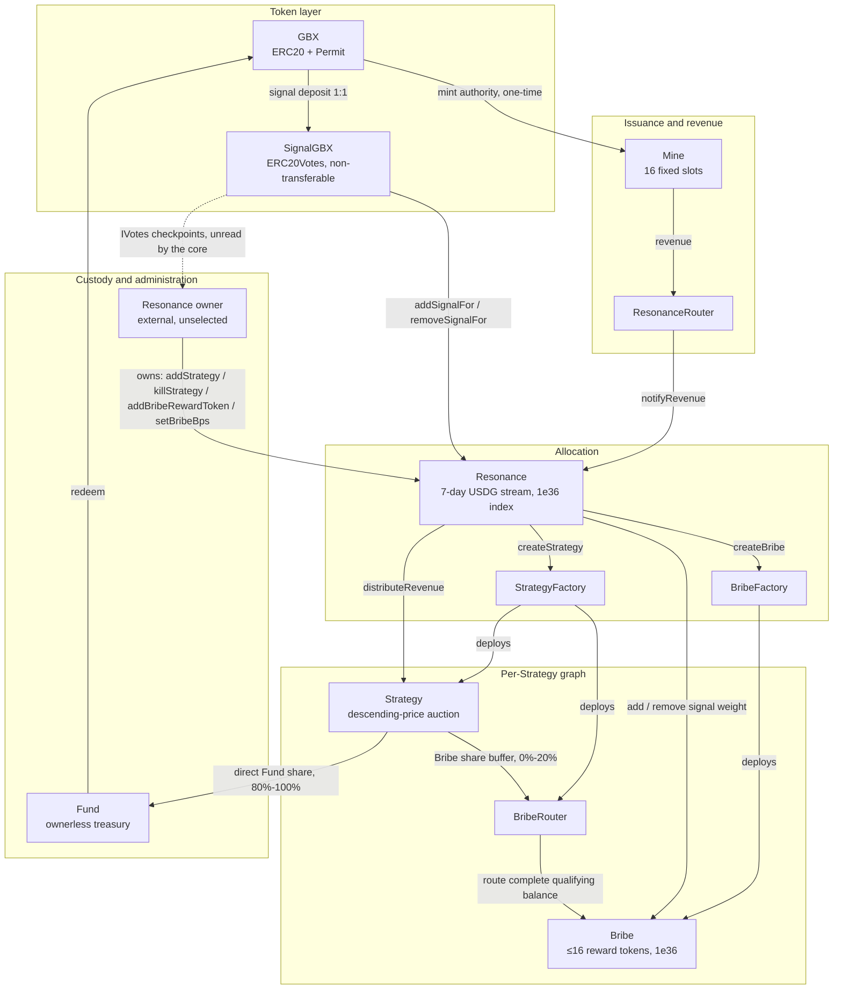

# GumBall6900: Technical Whitepaper

> **Safety status.** The protocol is **not deployed or approved for user funds.** A V12 finding export targets the
> exact source at `3ae171b`, but it is incomplete and not release-authorizing; independent disposition confirmed three
> behaviors requiring treatment. It does not cover ADR 0051's later API, batching, read periphery, SDK, or subgraph
> changes. Local green checks and the export remain bounded evidence, never a safety or release claim.

> **Governance is unselected.** The core contains no `ProtocolGovernor`, `TimelockController`, generic executor, or
> provider-specific governance adapter; [ADR 0034](../../adr/0034-external-governance-ownership.md) removed them.
> `Resonance` is the only core contract with continuing custom owner authority. SignalGBX, StrategyFactory, and
> BribeFactory retain setup-only Ownable shells until production explicitly renounces them after their one-time
> bindings are consumed. The external governance system that will own Resonance has not been selected. §15 and §27
> specify exactly what the core does and does not guarantee as a consequence.

> **Companion sources.** The compact whitepaper and one-page sheet are built from `docs/whitepaper/` and
> `docs/one-pager/gumball6900/` via `pnpm docs:whitepaper` and `pnpm docs:one-pager`. This long-form source builds to
> `output/pdf/GumBall6900-whitepaper.pdf` via `pnpm docs:longform`.

## 1. Abstract

GumBall6900 is an immutable, governance-minimized protocol that converts recurring onchain revenue into a
permissionlessly redeemable portfolio of arbitrary ERC-20 assets, with allocation directed by non-transferable signal
weight rather than by a manager, an oracle, or an index methodology.

The protocol issues a token, **GBX**, through a multislot mining market in which new slot tenures begin through hourly
descending-price auctions denominated in an external stablecoin, **USDG**. Eighty percent of a replacement payment
becomes a pull claim for the outgoing tenure miner; the remainder constitutes protocol revenue. GBX starts at zero supply and Mine is
its sole lifetime issuer. A reviewed, externally created fungible Uniswap v2-style USDG/GBX LP token may be one ordinary bootstrap
Strategy asset, but the core contains no liquidity-specific mechanism or guarantee.

Revenue is placed into a single rolling seven-day Synthetix-shaped emission schedule held by **Resonance** and allocated continuously
across **Strategies** in proportion to the non-transferable signal weight (**SignalGBX**, ticker sGBX) allocated to
each Strategy during each elapsed interval. A Strategy is a bounded descending-price auction that exchanges its
accumulated USDG for a fixed target asset. For each purchase, Strategy snapshots a bounded global signaler rate,
floors that purchase's Bribe share, transfers the complement directly to **Fund**, and sends only the Bribe share to
a small notification buffer. The rate defaults to 10% and is capped at 20%; at least 80% of each individual purchase
therefore reaches Fund. There is deliberately no cumulative split carry: partitioning value across purchases can
change aggregate classification by sub-token rounding units (ADR 0047).

GBX holders redeem by burning GBX and nominating an arbitrary set of unique non-GBX token addresses, receiving for
each the floored pro-rata share of Fund's balance against a single effective pre-burn supply snapshot that includes
all accrued unminted mining. Signaler compensation has two sources: the bounded automatic acquisition share (10% by
default and prospectively adjustable from 0% through 20%), and **Bribes**, permissionlessly funded reward streams
attached to each Strategy, capped at sixteen reward tokens.

Protocol administration is reduced to four continuing owner-gated calls on a single contract:
`Resonance.addStrategy`, `Resonance.killStrategy`, `Resonance.addBribeRewardToken`, and bounded prospective
`Resonance.setBribeBps`. SignalGBX, StrategyFactory, and BribeFactory retain setup-only Ownable shells after their
one-time bindings; production must remove those temporary owners. The remaining core contracts are ownerless or
authorized by immutable contract identity rather than an owner. The core
implements no proposal, quorum, voting, delay, or cancellation semantics of its own; ADR 0034 removed the
in-repository Governor and Timelock in favour of an external governance system that has not yet been selected.
`SignalGBX` retains non-transferable ERC20Votes checkpoints for that future integration, and the core assigns them no
meaning. Selection, review, and the ownership handoff that removes the temporary deployment owner remain deployment
blockers.

This document specifies the implemented mathematics exactly, states the accounting identities the implementation can
actually prove (and explicitly declines to assert those it cannot), enumerates state transitions, and presents the
threat model and residual risks.

## 2. Motivation

Pooled onchain asset vehicles have converged on a small set of trust concessions that are, individually, defensible
and collectively fatal to the claim of trust minimization:

1. **Discretionary allocation.** A manager, multisig, or unbounded DAO decides what the vehicle holds. Holders trust
   both competence and honesty.
2. **Upgradeability.** A proxy admin can change redemption arithmetic after deposits are taken.
3. **Pausability.** An emergency actor can suspend exit while entry or accrual continues.
4. **Oracle dependence.** A price feed determines mint and redemption ratios, importing the oracle's failure modes and
   manipulation surface into the vehicle's core accounting.
5. **Registry curation.** An asset allow-list is maintained by a privileged party, so a single broken or malicious
   entry can block redemption for every other asset.

Each concession exists for a reason. Removing them requires replacing the function they served with a mechanism that
does not require trust.

GumBall6900 makes five substitutions:

| Concession removed       | Replacement mechanism                                                                                    |
| ------------------------ | -------------------------------------------------------------------------------------------------------- |
| Discretionary allocation | Continuous, revocable, per-Strategy signal allocation that directs revenue by weight                     |
| Upgradeability           | Immutable, non-proxied deployment with reciprocal one-time bindings                                      |
| Pausability              | Unpausable redemption; caller-selected redemption baskets and scalar reward claims isolate broken assets |
| Oracle pricing           | Bounded descending-price auctions in which the clearing fill _is_ price discovery                        |
| Registry curation        | Registry-free raw-token treasury; the redeemer nominates the assets they wish to receive                 |

The design accepts specific, enumerated costs for these substitutions — permanent dust accumulation, unrecoverable
deployment errors, unbounded reward abandonment in retired Strategies, and the absence of any emergency response.
These are stated in §38 and §39 rather than minimized.

## 3. Design goals

- **G1 — Immutability.** No contract may be upgraded, paused, migrated, or administratively drained. When a design
  choice trades governance flexibility against immutability, immutability wins and the consequence is recorded.
- **G2 — Minimal continuing authority.** The permanent administrative surface must be enumerable, selector-bounded,
  and small enough to state in one sentence.
- **G3 — Oracle independence.** No protocol accounting may depend on an external price, NAV, or valuation.
- **G4 — Exit liveness.** Redemption and signal removal must never depend on the cooperation, solvency, or
  correctness of any third-party token other than the one being withdrawn.
- **G5 — Failure isolation.** Where the core offers an isolated operation, a malformed or frozen token should block
  only that operation: scalar Bribe claims isolate reward tokens, and caller-selected Fund baskets isolate assets.
- **G6 — Standard-token boundary.** Canonical GBX/USDG, Strategy payment tokens, and Bribe reward tokens are assumed
  to be standard, non-rebasing ERC-20s. `SafeERC20` handles return-value compatibility; Mine, SignalGBX, reward, and
  settlement paths do not duplicate balance snapshots around transfers. Fund preserves
  stricter checks for caller-selected arbitrary assets.
- **G7 — Bounded work.** Every mandatory loop — reward tokens, mining slots, redemption baskets — must be bounded by a
  code constant or by caller-supplied input the caller pays for.
- **G8 — No retroactive redirection.** A weight change must never redirect value that accrued under prior weights.
- **G9 — Explicit accounting.** Where exact conservation is achievable it must be proven by identity; where it is not
  achievable, the residue must be classified and disclosed rather than implied to be zero.

## 4. Non-goals

- **N1 — No index methodology.** The set of Strategies registered in `Resonance` constitutes the protocol's index
  membership: it is the curated list of assets the protocol targets. What the protocol does **not** provide is index
  methodology — there is no target weighting, rebalancing, drift correction, reconstitution rule, or NAV. Fund holds
  whatever Strategies acquired plus whatever anyone sent it, in whatever proportions resulted. Membership is defined
  by registration in `Resonance`, never by a Fund balance (§24.2).
- **N2 — Not a valuation system.** The protocol never computes NAV, backing-per-token, or asset prices onchain.
- **N3 — Not a yield product.** No return, distribution, or performance is promised or engineered.
- **N4 — Not a general DAO.** The core implements no voting, proposal, or execution machinery at all. Protocol
  administration is four continuing owner-gated calls on one contract (§15.1).
- **N5 — Not fee-on-transfer or rebase compatible.** Those mechanics are outside the supported-token model and may
  revert, underfund, or otherwise make the affected market unusable; registration is a governance responsibility.
- **N6 — No emergency response.** There is deliberately no guardian, veto, circuit breaker, or recovery path.
- **N7 — No keeper infrastructure.** No function pays a caller bounty. All maintenance is voluntary and permissionless.
- **N8 — No reward-dust conservation guarantee.** Resonance and Bribe both accept rate-, index-, and account-level
  floors as unallocated surplus. No lifetime bound on that residue is claimed.

## 5. Terminology

| Term                         | Definition                                                                                                                                        |
| ---------------------------- | ------------------------------------------------------------------------------------------------------------------------------------------------- |
| **GBX**                      | Transferable ERC-20 with ERC-2612 permit, 18 decimals. No vote checkpoints. Mined, escrowed through SignalGBX, burned.                            |
| **sGBX / SignalGBX**         | Non-transferable ERC-20 with ERC20Votes, 18 decimals. Minted 1:1 against GBX atomically assigned to Strategy signal.                              |
| **USDG**                     | External stablecoin used for revenue. Six decimals **by deployment assumption**, not by code enforcement.                                         |
| **Signal**                   | An absolute quantity of sGBX a specific account has allocated to a specific Strategy.                                                             |
| **Account aggregate signal** | The account's sGBX balance, equal to its allocations across all live and killed Strategies; returned as GBX only by removing a paired allocation. |
| **Strategy**                 | A bounded descending-price auction exchanging accumulated USDG for one fixed payment token.                                                       |
| **Live / killed Strategy**   | A Strategy accepting new signal and future revenue / one permanently excluded from both.                                                          |
| **Bribe**                    | Per-Strategy multi-token reward stream, permissionlessly funded, paid to that Strategy's signalers.                                               |
| **BribeRouter**              | Per-Strategy Bribe-only buffer that permissionlessly notifies its complete qualifying payment-token balance.                                      |
| **Fund**                     | Ownerless raw-token treasury. Redemption and GBX burning are its only value exits.                                                                |
| **Slot**                     | One mining position accruing GBX at a tenure-locked rate; each new tenure begins through an hourly auction.                                       |
| **Epoch**                    | One auction round, identified by a monotonically increasing `epochId` used for fill-race protection.                                              |
| **Reverse Dutch auction**    | The repository's term for the descending-price mechanism in `Mine` and `Strategy`. See §43 discrepancy D-1.                                       |
| **Reward period / stream**   | A seven-day whole-unit-per-second schedule; valid active top-ups roll the ordinary scheduled leftover into a restarted period.                    |
| **Surplus**                  | Value held by a contract that is not a liability to anyone and has no recovery path.                                                              |
| **Checkpoint**               | Advancing lazily-accrued state to the current timestamp before mutating weights or balances.                                                      |
| **Resonance owner**          | The single address holding the four continuing administration capabilities; intended to become an external governance executor (§15).             |

### 5.1 Notation

Throughout, `⌊x⌋` denotes integer floor division as performed by the EVM. All quantities are raw integer token units
unless explicitly stated otherwise. `1 GBX = 10^18` raw units. Under the intended deployment, `1 USDG = 10^6` raw
units. Timestamps are `block.timestamp` in seconds. `mulDiv(a, b, c)` denotes OpenZeppelin's `Math.mulDiv`, which
computes `⌊a·b/c⌋` at 512-bit intermediate precision and therefore cannot overflow on the intermediate product.

## 6. Actors

| Actor                      | Capability                                                                                                               | Trusted for                                   |
| -------------------------- | ------------------------------------------------------------------------------------------------------------------------ | --------------------------------------------- |
| **Miner**                  | Pays USDG to begin a slot tenure; accrues GBX at a tenure-locked rate; claims outgoing-tenure payments.                  | Nothing                                       |
| **Signaler / voter**       | Atomically deposits GBX, receives non-transferable voting sGBX, and assigns every unit to one live Strategy.             | Nothing                                       |
| **Strategy buyer**         | Fills a Strategy auction, paying the target asset and receiving accumulated USDG.                                        | Nothing                                       |
| **Bribe funder**           | Permissionlessly streams reward tokens to a Strategy's signalers.                                                        | Nothing                                       |
| **Redeemer**               | Burns GBX and nominates assets to withdraw pro rata from Fund.                                                           | Nothing                                       |
| **Checkpointer / router**  | Permissionlessly advances lazy state and forwards qualifying revenue.                                                    | Liveness only                                 |
| **Resonance owner**        | Adds Strategies, kills Strategies, registers Bribe reward tokens, and sets the bounded prospective Bribe share (§15.1).  | **Fully trusted for those four capabilities** |
| **Deployment coordinator** | Executes one-time bindings, creates bootstrap Strategies, transfers Resonance, and removes the three setup-shell owners. | **Fully trusted, once, irreversibly**         |

The deployment coordinator is the protocol's single unavoidable trusted party. Its authority is temporary by procedure
rather than by code (§28.4), and every error it can make is permanent.

## 7. System overview

The protocol source defines eleven core contract types. The economic cycle has five stages.

**Stage 1 — Issuance and revenue origination.** `Mine` holds exactly sixteen permanent slots. Each
slot continuously accrues GBX at a rate fixed for its current tenure. A new tenure begins by paying the slot's
current hourly descending price in USDG. On an occupied slot, `⌊price·8000/10000⌋` accrues as a pull claim for the
outgoing tenure miner and the remainder is deposited into `ResonanceRouter`; on an empty slot the whole payment is
deposited there.
Mine's action ends after a successful `SafeERC20` request for the nominal deposit. Under the supported standard USDG
model, that amount reached the Router. A later permissionless `route()` call is required to forward Router USDG into
Resonance; no caller role, bounty, or liveness guarantee exists.

**Stage 2 — Revenue scheduling.** `ResonanceRouter` withholds any nonzero balance smaller than either seven days in
raw units or the whole USDG returned by `remainingRevenue()` for Resonance's active period. Once its balance satisfies both gates
and someone calls `route()`, it forwards the entire balance. Resonance checkpoints elapsed emission, combines the
notification with the ordinary Synthetix leftover, floors the new per-second rate, and restarts a seven-day schedule.

**Stage 3 — Signal-weighted allocation.** `SignalGBX` is the sole external signal coordinator. Its restricted hooks on
`Resonance` checkpoint elapsed emission before mutating weights. Resonance maintains a Synthetix-shaped cumulative
index at `1e36` precision over `totalSignalWeight`, the sum of recorded weights across _live_ Strategies only.

**Stage 4 — Acquisition.** `Strategy.buy` first pulls the Strategy's released USDG from Resonance, then exchanges its
entire USDG balance for the current descending price in the Strategy's fixed payment token. Before touching that token,
Strategy snapshots Resonance's global 0%-to-20% Bribe rate. It floors the Bribe share for this purchase, transfers the
100%-to-80% complement directly to immutable Fund, and transfers only a nonzero Bribe share to `BribeRouter`.
Permissionless `BribeRouter.route()` later notifies the paired Bribe once the complete buffer satisfies the
Bribe's duration and active-leftover gates.

A reviewed, externally created fungible Uniswap v2-style USDG/GBX LP token may be registered during bootstrap as an ordinary Strategy
payment token. It uses this same acquisition and settlement path; no core component creates, seeds, owns, custodies,
prices, rebalances, compounds, harvests, or swaps liquidity.

**Stage 5 — Redemption.** `Fund.redeem` reads Mine's constant-time effective supply without checkpointing or iterating
the slots, snapshots its balance of each nominated token, pulls and burns the redeemer's GBX, and transfers each
floored pro-rata share atomically.

Signaler compensation is delivered by `Bribe` contracts, funded both automatically by the bounded acquisition share
(10% by default, prospectively adjustable from 0% through 20%) and by anyone who chooses to add further rewards.

## 8. Contract graph



### 8.1 Cardinality

| Contract          | Instances                               |
| ----------------- | --------------------------------------- |
| `GBX`             | 1                                       |
| `SignalGBX`       | 1                                       |
| `Mine`            | 1                                       |
| `ResonanceRouter` | 1                                       |
| `Resonance`       | 1                                       |
| `StrategyFactory` | 1                                       |
| `BribeFactory`    | 1                                       |
| `Fund`            | 1                                       |
| `Strategy`        | n, one per registered Strategy          |
| `BribeRouter`     | n, one per Strategy, deployed with it   |
| `Bribe`           | n, one per Strategy, deployed before it |

## 9. Authority and ownership graph

<!-- figure: authority-map -->

### 9.1 Owned contracts and their permanent authority

| Contract          | Owner after setup                  | Continuing owner-gated functions                                                                                                      |
| ----------------- | ---------------------------------- | ------------------------------------------------------------------------------------------------------------------------------------- |
| `Resonance`       | External executor (**unselected**) | `addStrategy`, `killStrategy`, `addBribeRewardToken`, bounded `setBribeBps`, plus inherited `transferOwnership` / `renounceOwnership` |
| `Mine`            | **none**                           | none — sixteen slots are fixed at construction                                                                                        |
| `SignalGBX`       | (setup owner)                      | none remaining — `setResonance` is consumed at deployment                                                                             |
| `StrategyFactory` | (setup owner)                      | none remaining — `setResonance` is consumed at deployment                                                                             |
| `BribeFactory`    | (setup owner)                      | none remaining — `setResonance` is consumed at deployment                                                                             |
| `GBX`             | —                                  | none — `setMinter` is single-use and permanently locks                                                                                |
| `Fund`            | **none**                           | none — contract is not `Ownable`                                                                                                      |
| `Strategy`        | **none**                           | none                                                                                                                                  |
| `BribeRouter`     | **none**                           | none                                                                                                                                  |
| `Bribe`           | **none**                           | `addRewardToken`, callable only by the immutable `Resonance`                                                                          |

`SignalGBX`, `StrategyFactory`, and `BribeFactory` retain a nominal `Ownable` owner after their one-time binding is
consumed, but that owner has no remaining function to call. `Resonance.setResonanceRouter` is likewise single-use.

### 9.2 The four continuing administration actions

| Selector                        | Target      | Effect                                                              | Reversible? |
| ------------------------------- | ----------- | ------------------------------------------------------------------- | ----------- |
| `Resonance.addStrategy`         | `Resonance` | Deploys a Strategy, BribeRouter, and Bribe; registers payment token | No          |
| `Resonance.killStrategy`        | `Resonance` | Permanently excludes a Strategy from new signal and future revenue  | **No**      |
| `Resonance.addBribeRewardToken` | `Resonance` | Appends a reward token to a Strategy's Bribe, within the cap of 16  | **No**      |
| `Resonance.setBribeBps`         | `Resonance` | Sets the global signaler share of acquisitions, bounded `[0, 2000]` | Yes         |

The first three are irreversible. `addStrategy` is reversible only in the sense that the created Strategy can later be
killed; the deployed contracts persist forever. `setBribeBps` is the sole reversible action and the sole economic
parameter: it is bounded in code and applies prospectively, so it cannot reclassify an amount already settled.

### 9.3 Authority explicitly absent

No contract in `packages/contracts/src` contains a proxy, `Initializable`, `UUPSUpgradeable`, `Pausable`, a
`delegatecall`, a sweep or rescue function, a successor binding, a migration routine, an emission setter, a fee
setter, a price oracle, an entropy source, or a claim-redirection path.

There is also no governance machinery: no `Governor`, no `TimelockController`, no generic executor, and no
provider-specific adapter. ADR 0034 removed them, so the guarantees such a stack would have supplied — proposal
filtering, quorum, voting periods, execution delay, cancellation rules — are supplied by nothing in this repository.
They become properties of whichever external system is later given ownership of `Resonance` (§15.2).

## 10. Token and asset-flow graph

### 10.1 USDG

| Origin                                                   | Path                                                                                  | Terminal state                           |
| -------------------------------------------------------- | ------------------------------------------------------------------------------------- | ---------------------------------------- |
| Miner replacement payment                                | payer → `Mine`; `⌊p·8/10⌋` retained as claim, remainder deposited → `ResonanceRouter` | Outgoing-tenure claim, or Router deposit |
| Revenue                                                  | `ResonanceRouter` → `Resonance` (on qualifying `route()` call) → `Strategy`           | Auction inventory                        |
| Auction inventory                                        | `Strategy` → buyer-nominated `revenueReceiver`                                        | Exits the protocol                       |
| Rounding floors, zero-signal intervals, direct donations | remains in `Resonance`                                                                | **Permanent surplus, unrecoverable**     |
| Direct donation to Router                                | remains in `ResonanceRouter` until a later qualifying route call                      | May wait indefinitely                    |

### 10.2 GBX

| Origin                  | Path                                                                   | Terminal state                        |
| ----------------------- | ---------------------------------------------------------------------- | ------------------------------------- |
| Initial supply          | constructor creates no GBX                                             | Zero                                  |
| Mining issuance         | `Mine` mints to slot occupant                                          | Circulating                           |
| Signal                  | holder → `SignalGBX` custody, sGBX minted 1:1, committed to a Strategy | Escrowed, removable through SignalGBX |
| Direct donation to sGBX | remains in `SignalGBX`                                                 | **Stranded surplus, no receipt**      |
| GBX-denominated auction | buyer → `Strategy` → `Fund`, burnable by anyone                        | Destroyed when burned                 |
| Redemption              | redeemer → `Fund` → burned                                             | Destroyed                             |

### 10.3 Acquired assets and Bribe reward tokens

| Origin                                            | Path                                                        | Terminal state                              |
| ------------------------------------------------- | ----------------------------------------------------------- | ------------------------------------------- |
| Auction payment (Fund complement, 80–100%)        | buyer → `Strategy` → `Fund`, atomically with the purchase   | Fund backing until redeemed                 |
| Auction payment (Bribe share, 0–20%; 10% default) | buyer → `Strategy` → `BribeRouter` → paired `Bribe`         | Buffered, then streamed to signalers        |
| Compatible direct Router donation                 | donor → `BribeRouter` → paired `Bribe` on a qualifying call | Joins the next complete-buffer notification |
| Independent Bribe funding                         | funder → `Bribe` → signalers                                | Streamed reward; floors remain surplus      |
| Direct donation to Bribe                          | donor → `Bribe`                                             | **Unscheduled surplus**                     |
| Unsolicited transfer to Fund                      | anyone → `Fund`                                             | Fund backing, unreviewed                    |
| Zero-supply Bribe emission                        | remains in `Bribe`                                          | **Unallocated surplus, unrecoverable**      |

**Structural invariant of the flow graph:** the only paths _out_ of `Fund` are `redeem` and `burnGBX`. There is no
path from `Fund` to any administrator, and no caller-selectable destination for any share of an auction payment.

## 11. GBX

`GBX` is `ERC20, ERC20Permit`. Name `"GumBall6900"`, symbol `"GBX"`, 18 decimals. It deliberately does **not**
inherit `ERC20Votes`: governance weight exists only as sGBX (§13).

### 11.1 State

| Variable         | Type      | Meaning                                                     |
| ---------------- | --------- | ----------------------------------------------------------- |
| `minter`         | `address` | Current mint authority                                      |
| `minterLocked`   | `bool`    | Whether the one-time Mine handoff has completed permanently |
| `lifetimeMinted` | `uint256` | Cumulative raw units created by Mine                        |
| `lifetimeBurned` | `uint256` | Cumulative raw units destroyed                              |

### 11.2 Initial supply

```text
GBX.totalSupply() = GBX.lifetimeMinted() = GBX.lifetimeBurned() = 0
```

The constructor creates no tokens. It installs only a temporary setup minter that can perform the one-time Mine
binding; `mint` remains disabled until that binding is permanently locked. There is no team allocation, presale,
liquidity premint, vesting schedule, treasury reserve, or airdrop in the token contract.

### 11.3 Supply identity

**Identity I-1.** At every block:

```text
GBX.totalSupply() = GBX.lifetimeMinted() − GBX.lifetimeBurned()
```

_Proof sketch._ `lifetimeMinted` is incremented by exactly `amount` immediately before every `_mint(account, amount)`
in `mint`, and `lifetimeBurned` by exactly `amount` immediately before every `_burn`. Both counters are
monotonically non-decreasing and written nowhere else. ∎

Verified by `testFuzz_SupplyEqualsLifetimeMintedMinusBurned` and `invariant_GBXSupplyReconcilesWithBurns`.

There is no supply cap. Under the emission schedule of §12.5, cumulative issuance grows without bound in time.

### 11.4 Mint authority handoff

`setMinter(newMinter)` succeeds only when all of the following hold, and then permanently sets `minterLocked = true`:

```text
msg.sender == minter
minterLocked == false
newMinter ≠ 0  ∧  newMinter ≠ minter  ∧  newMinter.code.length > 0
IMine(newMinter).gbx() == address(this)       -- reciprocal identity, try/catch guarded
```

`mint` requires both `msg.sender == minter` and `minterLocked == true`. Therefore the deployment-time coordinator can
never mint, and after the handoff exactly one immutable address can mint forever. `burn` touches neither field, so
burning cannot reopen authority.

**Limitation.** The reciprocal check proves the candidate _claims_ the same GBX. It cannot distinguish a malicious
lookalike returning the expected value. This is finding **M-03**, an open High release gate (§41.3).

## 12. Mining and issuance

`Mine` is an ownerless `ReentrancyGuard`. It is the sole GBX issuer after the handoff.

### 12.1 Fixed Mine economics

| Constant            | Symbol  | Value       | Units              |
| ------------------- | ------- | ----------- | ------------------ |
| `PRICE_MULTIPLIER`  | `m`     | `2`         | integer multiplier |
| `MIN_INITIAL_PRICE` | `P_min` | `10^6`      | raw USDG           |
| `MAX_INITIAL_PRICE` | `P_max` | `2^192−1`   | raw USDG           |
| `INITIAL_TPS`       | `u_0`   | `64·10^18`  | raw GBX per second |
| `HALVING_PERIOD`    | `Δ`     | `5,961,600` | seconds            |
| `TAIL_TPS`          | `u_∞`   | `1·10^18`   | raw GBX per second |

Mine stores its supplied USDG and ResonanceRouter without calling the Router during construction. ADR 0045 instead
requires pinned post-deployment reads proving `Mine.usdg() == USDG`,
`Mine.resonanceRouter() == ResonanceRouter`, and `ResonanceRouter.usdg() == USDG` before the permanent GBX minter
handoff or market exposure.

These values are bytecode constants rather than constructor arguments. The constructor accepts only GBX, USDG, and
ResonanceRouter. Constants also include `BPS = 10_000`, `PREVIOUS_MINER_BPS = 8_000`,
`PRICE_DECAY_PERIOD = 3600`, and `SLOT_COUNT = 16`.

### 12.2 Slot state

```solidity
struct Slot {
    uint256 epochId;          // monotonically increasing fill counter, starts at 1
    uint256 initialPrice;     // starting USDG price of the current auction
    uint256 auctionStartedAt; // timestamp the current auction began
    uint256 lastAccruedAt;    // start of this tenure's unsettled accrual
    uint256 tps;              // raw GBX per second, locked for this tenure
    address miner;            // zero when empty
}
```

An empty slot is `{epochId: 1, initialPrice: P_min, auctionStartedAt: now, lastAccruedAt: now, tps: 0, miner: 0}`.

### 12.3 Replacement price

**Formula F-1 (slot price).** For elapsed `e = now − auctionStartedAt` and `D = 3600`:

```text
price(e) = initialPrice − ⌊initialPrice · e / D⌋     for e < D
price(e) = 0                                          for e ≥ D
```

_Symbols._ `initialPrice`, raw USDG units, `uint256` bounded by `2^192−1`; `e`, `D` in seconds.
_Rounding._ The subtracted term floors, so `price(e)` lies at or **above** the exact real-valued line — rounding
favors the protocol and the outgoing tenure miner, never the incoming payer. `price` is a non-increasing step function.
_Overflow._ `Math.mulDiv` at 512-bit intermediate precision; with `initialPrice < 2^192` and `e < 2^256`, no overflow.

**Worked example.** `initialPrice = 2_000_000` (2.000000 USDG). At `e = 900`:
`price = 2_000_000 − ⌊2_000_000·900/3600⌋ = 2_000_000 − 500_000 = 1_500_000`. At `e = 1800`, `1_000_000`; at
`e = 2700`, `500_000`; at `e = 3600`, `0`. This is the curve reproduced in
`packages/simulations/fixtures/economic-scenarios.json`.

### 12.4 Payment allocation

**Formula F-2 (replacement split).** For clearing price `p` and previous occupant `M`:

```text
if p = 0:                       claim = 0,                     revenue = 0
if p > 0 and M = 0 (empty):     claim = 0,                     revenue = p
if p > 0 and M ≠ 0 (occupied):  claim = ⌊p · 8000 / 10000⌋,    revenue = p − claim
```

_Rounding._ `revenue = p − ⌊0.8p⌋ = ⌈0.2p⌉`. The rounding unit accrues to the **protocol**, not the outgoing tenure miner.
_Dust._ At most 1 raw USDG unit per replacement, always in the protocol's favor. There is no accepted loss.

<!-- figure: mining-split -->

**Worked example.** `p = 1_000_000`: `claim = 800_000`, `revenue = 200_000`. `p = 1_000_003`:
`claim = ⌊800_002.4⌋ = 800_002`, `revenue = 200_001`. Note `200_001 > 0.2·1_000_003 = 200_000.6`, confirming the
ceiling behavior.

**Identity I-2 (Mine solvency).**

```text
USDG.balanceOf(Mine) ≥ Mine.totalClaimableMinerPayments()
```

with equality when no unsolicited donation has been made. `claimableMinerPayment[a]` and
`totalClaimableMinerPayments` are incremented together in `_allocatePayment` and decremented together in
`claimMinerPayment`; the Router deposit leaves Mine in the same transaction it
arrives. Verified by `invariant_MineIsSolventAgainstReplacementClaims` and
`testFuzz_MineRevenueAndHandoffClaimsReachFinalDestinationsWithoutDust`.

**Mine/Router boundary (ADRs 0044 and 0049).** `_collectAndDeposit` requests payer → Mine and Mine →
ResonanceRouter transfers through `SafeERC20`, then emits `RevenueDeposited(slotIndex, epochId, amount)`. It does not
inspect balance deltas or call `route()`. The event records the nominal protocol share requested into the Router;
standard canonical USDG semantics make that the amount delivered. ResonanceRouter's distinct
`RevenueRouted(caller, amount)` proves a later forward into Resonance. A failed USDG call into the Router still reverts
the paid replacement, but a later Router or Resonance failure cannot. Permissionless routing has no caller role, bounty,
or liveness guarantee, so the deposit may wait indefinitely. Optional manual, frontend, volunteer-keeper, cron, or
future helper composition is periphery and cannot become a Mine correctness dependency.

### 12.5 Global emission schedule

**Formula F-3 (global rate).** Let `t_0 = startTime`, the immutable Mine-deployment timestamp, and let
`Δ = 69 days = 5,961,600 seconds`:

```text
k(t) = ⌊(t − t_0) / Δ⌋
u(t) = max(u_0 >> k(t), u_∞)
```

The global rate is prospective: it is read only when a slot begins a new tenure. A time boundary never reprices an
occupied slot. Neither `totalMined` nor `pendingEmission()` selects the rate.

**Symbols.** `u(t)` in raw GBX per second; `t`, `t_0`, and `Δ` in seconds.
**Arithmetic.** Solidity checked subtraction rejects a timestamp before `startTime`; ordinary block timestamps cannot
produce that state. A right shift by a large count yields zero and the final `max` clamps the result to `u_∞`, so the
calculation is constant time and has no loop.

<!-- figure: halving-curve -->

**Fixed schedule.** `u_0 = 64 GBX/second = 230,400 GBX/hour`. The first prospective halving occurs exactly 69 days
after deployment, whether or not any slot has been occupied; later boundaries occur at the same fixed interval. The
prospective path is 64, 32, 16, 8, 4, 2, then 1 GBX/second. The tail begins at the sixth boundary, day 414, when
`64 / 2^6 = u_∞ = 1 GBX/second`.

**Synchronized reference only.** If every slot is occupied from deployment, all sixteen slots are refreshed and settled
exactly at every boundary, and no GBX is burned, the six pre-tail eras emit and supply 751,161,600 GBX by day 414. The
scheduled tail flow is 31,536,000 GBX per 365-day year, initially about 4.1982% of that reference supply and declining
as supply grows. This is
not a cap, actual-supply forecast, or guaranteed inflation rate: legacy tenures can emit above that path, empty slots
can emit below it, and burns change the live denominator.

| Boundary | Elapsed days | Fresh global rate | Synchronized gross supply |
| -------- | ------------ | ----------------- | ------------------------- |
| Launch   | 0            | 64 GBX/s          | 0                         |
| 1        | 69           | 32 GBX/s          | 381,542,400               |
| 2        | 138          | 16 GBX/s          | 572,313,600               |
| 3        | 207          | 8 GBX/s           | 667,699,200               |
| 4        | 276          | 4 GBX/s           | 715,392,000               |
| 5        | 345          | 2 GBX/s           | 739,238,400               |
| 6 (tail) | 414          | 1 GBX/s           | 751,161,600               |

From the day-414 tail, the same no-burn reference reaches **782,697,600** GBX after one year, **814,233,600** after
two years, **908,841,600** after five years, and **1,066,521,600** after ten years.

**Accepted timing consequences.** Time between deployment and public launch consumes the schedule. A replacement just
before a boundary can lock the older rate for that tenure, while a replacement just after it receives the lower rate.
These are direct consequences of a deployment-time clock combined with tenure locking.

> **Independent economic review remains open.** ADRs 0042 and 0043 record the 64 GBX/second initial rate, 69-day period,
> and 1 GBX/second tail as provisional development values. They do not constitute audit approval, deployment authorization,
> or a signed production manifest. This is finding **M-04**.

### 12.6 Tenure-locked accrual

**Formula F-4 (slot accrual).** For an occupied slot,

```text
pendingEmission(i) = (now − slots[i].lastAccruedAt) · slots[i].tps
pendingEmission()  = storedPendingEmission + (now − pendingUpdatedAt) · aggregateTps
effectiveTotalSupply = GBX.totalSupply() + pendingEmission()
```

`aggregateTps` is the sum of the sixteen tenure rates. A replacement first advances the system accumulator at that old
aggregate rate, then mints only the outgoing slot's accrued amount and subtracts the same amount from stored pending
emission. Unrelated slots are neither iterated nor mutated.

**Formula F-5 (new tenure rate).** On a fill, after syncing pending emission and settling the outgoing slot:

```text
newSlot.tps = ⌊ globalTps(block.timestamp − startTime) / 16 ⌋
```

_Rounding._ The division residue is **unissued** — it is never minted to anyone. This is a deliberate, permanent
reduction in aggregate issuance relative to the undivided global rate, bounded by `15` raw units per second
across all slots.

**Invariant.** `slot.tps` is assigned in exactly one place in the contract: the `Slot` struct literal inside `mine()`.
No other replacement, time boundary, or redemption modifies it. Verified by
`test_TimeBasedHalvingNeverRepricesAnIncumbent`, `test_GlobalRateHalvesByDeploymentTimeEvenWhenEverySlotIsEmpty`,
`testFuzz_CachedAccumulatorMatchesNaiveSlotsAndIndependentEconomicModel`, and
`invariant_MiningPendingAndTpsCachesMatchEverySlot`.

**Accepted consequence (finding M-01).** Because outgoing tenures retain their assigned rate while new tenures divide the
_current_ global rate by sixteen, aggregate issuance can exceed the current global rate after a halving. The excess
persists until the legacy tenures turn over.

<!-- figure: tenure-lock -->

### 12.7 Next opening price

**Formula F-6.**

```text
nextInitialPrice = clamp( ⌊p · m / 10^18⌋ , P_min , 2^192 − 1 )
```

A fill at `p = 0` yields `⌊0⌋ = 0`, which clamps up to `P_min`. Recovery from the floor is therefore geometric at
rate `m` per fill, not immediate. Verified by `test_AFreeFillAtFullDecayRestartsAtTheConfiguredFloor` and
`test_RecoveryFromTheFloorIsOnlyGeometric`.

### 12.8 Fixed slot topology

Mine constructs exactly sixteen empty slots and exposes no owner or capacity mutation. This permanent topology maps
directly to a 4-by-4 market. Pending-emission and redemption-supply reads remain constant time regardless of how many
slots are occupied.

<!-- figure: mine-grid -->

<!-- figure: pending-emission -->

## 13. SignalGBX

`SignalGBX` is `ERC20, ERC20Votes, ReentrancyGuard, Ownable`. Name `"SignalGumBall6900"`, symbol `"sGBX"`,
18 decimals.

### 13.1 Non-transferability

```solidity
function _update(address from, address to, uint256 value) internal override(ERC20, ERC20Votes) {
    if (from != address(0) && to != address(0)) revert TransferDisabled();
    super._update(from, to, value);
}
```

Only mint (`from == 0`) and burn (`to == 0`) are permitted. `transfer`, `transferFrom`, self-transfer, and
zero-value transfer all revert, with or without an allowance.

### 13.2 Collateralization

**Identity I-3.**

```text
SignalGBX.totalSupply() ≤ GBX.balanceOf(SignalGBX)
```

with equality absent direct GBX donations. `_depositAndMint` requests `amount` GBX through `SafeERC20` and mints
`amount` sGBX; `_burnAndWithdraw` burns `amount` and requests `amount` GBX out. ADR 0049 removes sender/receiver
balance snapshots and trusts the canonical GBX implementation to move the requested amount. Direct GBX donations to
the contract are stranded surplus that creates no receipt, signal, withdrawal entitlement, or voting power.

Verified by `testFuzz_SignalMoveWithdrawRoundTripIsLossless`, `invariant_SignalReceiptIsFullyCollateralized`, and
`test_DirectDonationIsSurplusAndCreatesNoSignalVotesOrWithdrawalEntitlement`.

### 13.3 Mandatory signal-backing

ADR 0031 removed the separate `allocatedBalance` ledger, `_allocate`, `_deallocate`, and the `ISignalGBXAllocation`
interface. Minting and burning are atomically coupled to the matching Resonance and paired-Bribe virtual-balance
change, so **an idle receipt state is unreachable**.

**Identity I-4 (mandatory signal-backing).** Across live **and** killed Strategies, at every block:

```text
SignalGBX.balanceOf(a)   = Σ_s Bribe(s).signalWeightOf(a)
SignalGBX.totalSupply()  = Σ_s Bribe(s).totalSignalWeight()
GBX.balanceOf(SignalGBX) ≥ SignalGBX.totalSupply()
```

The account aggregate is read directly from `SignalGBX.balanceOf(a)`; Resonance exposes no duplicate aggregate or
account-by-Strategy signal getter. There is no reachable successful state in which a newly minted raw unit is idle,
or a burned raw unit leaves signal behind.

Verified by `invariant_EveryReceiptUnitIsAssigned`, `invariant_SignalWeightNeverExceedsTheReceiptBalance`,
`invariant_AccountWeightsSumToAllRecordedStrategyWeight`, and
`test_RemovedIdleReceiptSelectorsAreAbsentFromRuntime` — which asserts the removed selectors are absent from deployed
**runtime**, not merely from source.

Scalar and batched additions/removals preserve both sides of I-4 atomically. A failed batch rolls back its complete
aggregate custody and every earlier allocation.

### 13.4 Voting

`SignalGBX` inherits `ERC20Votes` on OpenZeppelin's default block-number clock (`CLOCK_MODE = mode=blocknumber`).
Inside `_depositAndMint`:

```solidity
if (delegates(account) == address(0)) _delegate(account, account);
```

so a first signal activates voting weight without a second transaction. An account with an existing non-zero delegate
keeps it; an account that explicitly delegated to zero re-self-delegates on its next signal.

`SignalGBX` has **no ERC-2612 permit**. It inherits `EIP712` solely for ERC20Votes delegation signatures. This is
deliberate: a permit authorizes spending, and sGBX cannot be spent.

**Consequence of I-4 for a future integration.** Because no sGBX can be idle, the ERC20Votes total supply is exactly
the total signal committed across all Strategies. Any external system that uses `getPastTotalSupply` as a quorum
denominator therefore measures against economically active weight only, with no idle receipts inflating it. That is a
useful token property, not a quorum guarantee — the core defines no quorum (§15.2, §15.3).

### 13.5 No lock

There is no timestamp, epoch, cooldown, or lock state anywhere in `SignalGBX`. Adding and removing signal may occur in
consecutive blocks or the same transaction. Combined with checkpoints that survive removal (§15.3), this
means an external system must not assume that recorded voting weight implies a currently held position. §35.3 and
§38.2 analyze the consequence.

## 14. Signaling lifecycle

<!-- figure: signal-lifecycle -->

### 14.1 Entry points

The complete user-facing surface is **four** functions on `SignalGBX`: bounded scalar add/remove operations and their
optional struct-array variants. Every amount is an absolute raw-unit delta.

| Function                         | Composition                                                                                      |
| -------------------------------- | ------------------------------------------------------------------------------------------------ |
| `addSignal(strategy, amount)`    | `_depositAndMint` → `Resonance.addSignalFor` → `Bribe.addSignalWeight`                           |
| `addSignalMany(allocations)`     | checked sum → one deposit/mint → one canonical add hook and event per allocation                 |
| `removeSignal(strategy, amount)` | `Resonance.removeSignalFor` → `Bribe.removeSignalWeight` → `_burnAndWithdraw`                    |
| `removeSignalMany(allocations)`  | checked sum → one canonical remove hook and event per allocation → one aggregate burn/GBX return |

Every failed sub-operation reverts the complete transition.

An empty batch or any zero amount reverts. Duplicate Strategies execute sequentially. Batch length is caller-controlled,
so interfaces simulate and split oversized requests; scalar removal remains the bounded exit. ADR 0051 removes
`signal`, `signalWithPermit`, `moveSignal`, and `withdrawSignal` without compatibility aliases. SignalGBX consumes no
permit signature. Smart wallets may atomically batch GBX approval with direct SignalGBX calls while remaining
`msg.sender`; plain externally owned accounts establish allowance separately.

### 14.2 Sole-coordinator restriction

`Resonance.addSignalFor` and `removeSignalFor` carry `onlySignalGBX`, reverting `UnauthorizedSignalSource` for any
other caller. Resonance exposes no dedicated move hook, and there is no shared write-through signal Router: such a
Router would become the GBX, sGBX, and signal owner under `msg.sender` semantics. There is deliberately no second
user-facing coordinator and no direct-signaling path on Resonance.

### 14.3 Canonical state ownership

Each level of the signal ledger has exactly one owner; no value is duplicated across contracts.

| Level               | Canonical storage and public accessor |
| ------------------- | ------------------------------------- |
| Account aggregate   | `SignalGBX.balanceOf(a)`              |
| Account × Strategy  | `Bribe(s).signalWeightOf(a)`          |
| Strategy total      | `Bribe(s).totalSignalWeight()`        |
| Active total (live) | `Resonance.totalSignalWeight()`       |

The account aggregate is the sGBX balance itself, not a second ledger: ADR 0031 removed `allocatedBalance` precisely
because it would always have been identical to `balanceOf` (§13.3).

### 14.4 Checkpoint-before-mutate ordering

This ordering is the protocol's defense against same-transaction revenue capture (finding **A-11**).

| Operation           | Checkpoint performed before its weight mutation               |
| ------------------- | ------------------------------------------------------------- |
| `addSignalFor`      | `_updateRevenue(strategy)`                                    |
| `removeSignalFor`   | `_updateRevenue(strategy)`                                    |
| `killStrategy`      | `_updateRevenue(strategy)` before validation and mutation     |
| `notifyRevenue`     | `_updateRevenue(address(0))` — global index only              |
| `distributeRevenue` | `_updateRevenue(strategy)`                                    |
| `Strategy.buy`      | `Resonance.distributeRevenue(address(this))` before inventory |

Additionally, `Bribe.addSignalWeight` and `Bribe.removeSignalWeight` each call `_updateAllRewards(account)` before
mutating `totalSignalWeight` or `signalWeightOf`. There is no boundary carry or Fund-classification pass.

**Consequence.** In a single transaction, no stream time elapses between operations, so the revenue/reward indices cannot
advance. A flash-signal therefore accrues exactly zero newly-notified revenue and zero newly-notified Bribe rewards.
A signal held across real elapsed time legitimately earns that interval's flow — the protocol provides no epoch,
cooldown, or anti-churn guarantee beyond this ordering.

Verified by `test_FlashSignalWeightCannotRedirectANewNotification`,
`test_FlashSignalWeightCannotStealAccruedBribeRewards`, `test_NewStrategyWeightReceivesOnlyPostEntryRevenue`, and
`test_StrategyAddedAfterAccrualCannotClaimHistoricRevenue` (finding A-11).

## 15. Protocol administration and external governance

ADR 0034 removed `ProtocolGovernor` and the protocol `TimelockController` from the core. This section specifies the
administration surface that remains and states precisely which guarantees the core does **not** provide as a result.

### 15.1 The complete owner-gated surface

`Resonance` is the only core contract with continuing custom owner authority. SignalGBX, StrategyFactory, and
BribeFactory retain setup-only Ownable shells until production explicitly renounces them after their one-time
Resonance bindings are consumed; those shells expose no custom protocol action after setup. Resonance's owner-gated
functions are:

| Function                                  | Source                 | Effect                                                                   | Reversible?             |
| ----------------------------------------- | ---------------------- | ------------------------------------------------------------------------ | ----------------------- |
| `addStrategy(IERC20, Config)`             | `Resonance.sol`        | Deploys Strategy, BribeRouter, and Bribe; registers the payment token    | No (kill only)          |
| `killStrategy(address)`                   | `Resonance.sol`        | Permanently excludes a Strategy from new signal and future revenue       | **No**                  |
| `addBribeRewardToken(address, address)`   | `Resonance.sol`        | Appends a reward token to a Strategy's Bribe, within `MAX_REWARD_TOKENS` | **No**                  |
| `setBribeBps(uint256)`                    | `Resonance.sol`        | Sets the global signaler share, bounded `[0, MAX_BRIBE_BPS]` (ADR 0036)  | Yes, prospectively      |
| `setResonanceRouter(address)`             | `Resonance.sol`        | Binds the sole ResonanceRouter                                           | Single-use, then closed |
| `transferOwnership` / `renounceOwnership` | OpenZeppelin `Ownable` | Moves or destroys the owner role                                         | Not by the protocol     |

`setResonanceRouter` reverts with `ResonanceRouterAlreadySet` after its first success, so it is a deployment binding
rather than a continuing authority. The four continuing capabilities are therefore exactly `addStrategy`,
`killStrategy`, `addBribeRewardToken`, and `setBribeBps`.

**Enforced constraints on those calls.** These are Solidity checks, not procedural expectations:

| Constraint                                                | Mechanism                                                        |
| --------------------------------------------------------- | ---------------------------------------------------------------- |
| The final live Strategy cannot be killed                  | `if (liveStrategyCount == 1) revert FinalLiveStrategy(strategy)` |
| The signaler share can never exceed 20%                   | `if (newBribeBps > MAX_BRIBE_BPS) revert BribeBpsAboveMaximum()` |
| A rate change cannot reclassify a settled amount          | Snapshotted per payment, before any payment-token interaction    |
| A Strategy cannot be killed twice                         | `isStrategyLive` check, `StrategyAlreadyDead`                    |
| sGBX cannot be a payment token or Bribe reward token      | `ForbiddenPaymentToken`, `ForbiddenRewardToken`                  |
| Payment and reward tokens must be deployed code           | `code.length == 0` rejection                                     |
| Bribe reward tokens are append-only and capped at sixteen | `Bribe.MAX_REWARD_TOKENS`, `RewardAlreadyAdded`                  |
| Strategy auction parameters are bounded at construction   | `Strategy` constructor range checks (§21.1)                      |

### 15.2 Authority the core does not implement

The core contains **no** Governor, Timelock, generic executor, multicall relay, or provider-specific governance
adapter. It therefore makes none of the following guarantees, and no repository document should assert them:

| Absent guarantee                       | Consequence                                                                       |
| -------------------------------------- | --------------------------------------------------------------------------------- |
| Selector-bounded proposal filtering    | The owner calls the four continuing functions directly; no calldata filter exists |
| Proposal threshold, quorum, or support | The core defines none; `liveStrategyCount` is the only counting rule              |
| Voting period or voting delay          | The core defines none                                                             |
| Post-approval execution delay          | Owner calls take effect in the calling transaction                                |
| Permissionless execution after a delay | Not applicable; there is no queue                                                 |
| Cancellation, veto, or guardian        | No such role exists in the core                                                   |
| Sole-proposer closure                  | Not applicable                                                                    |
| Immutable governance parameters        | Not provided; `bribeBps` is mutable within its hard 0–20% bound                   |

The owner address itself is the entire authority model in this development tree. Nothing in `packages/contracts/src` constrains
who or what that address is.

### 15.3 SignalGBX voting checkpoints

`SignalGBX` is `ERC20, ERC20Votes, ReentrancyGuard, Ownable`. It retains vote checkpoints deliberately, for a future
external integration, and the core assigns them no semantics.

| Property            | Value                                                                                    |
| ------------------- | ---------------------------------------------------------------------------------------- |
| Interface           | `IVotes` via OpenZeppelin `ERC20Votes`                                                   |
| Clock               | Default block-number clock; no `clock()` or `CLOCK_MODE` override                        |
| Transferability     | None — `_update` reverts `TransferDisabled` unless `from` or `to` is zero                |
| Delegation          | Standard; `_depositAndMint` self-delegates any account with no delegate                  |
| Approval permit     | Not implemented on sGBX; the underlying GBX carries `ERC20Permit`                        |
| Supply relationship | Every sGBX unit is backed one-for-one by escrowed GBX and assigned to one Strategy (§14) |

Because `_depositAndMint` self-delegates on first deposit, an account that has never delegated still accrues voting
weight from its first signal without a second transaction. This removes the former undelegated-supply liveness concern
**as a property of the token**; it does not constitute a quorum guarantee, because the core defines no quorum.

**Checkpoints survive removal.** `removeSignal` and `removeSignalMany` burn sGBX and write a new checkpoint, but historical
checkpoints at earlier blocks are immutable by construction. An account may acquire GBX, signal it, allow a block to
pass, remove signal, and retain its recorded weight at that past block. Whether that is exploitable depends entirely on
whether the selected external system reads historical balances and how it spaces its snapshot from its voting window.
This is finding **G-01**, retained as an integration property rather than a core defect.

### 15.4 Requirements on the future integration

ADR 0034 makes deployment conditional on a later ADR that pins and reviews at least:

1. provider, exact release, deployed bytecode, and proxy or upgrade model;
2. plugin set, permission graph, root and admin holders, and any emergency path;
3. direct compatibility with SignalGBX voting checkpoints and delegation, including snapshot-to-vote spacing (G-01);
4. proposal creation, quorum, support, voting duration, execution, batching, cancellation, and delay semantics; and
5. the exact `Resonance` owner address and the transaction evidence proving the handoff.

Until every item is selected, tested, and recorded, no deployment is authorized. Aragon is under consideration; no
provider is part of the reviewed protocol graph, and this document must not be read as selecting one.

### 15.5 Security consequences

- Analysis of snapshot borrowing, quorum liveness, permission graphs, upgrade authority, and execution behavior does
  not apply to this repository and must be repeated against the selected system's exact release.
- A compromised or careless `Resonance` owner can add Strategies, kill any Strategy except the last live one, register
  reward tokens up to the sixteen-token cap, transfer ownership, or renounce it. `renounceOwnership` would permanently
  freeze the Strategy set at its current membership.
- Owner authority does not reach mining parameters, mint authority, Fund assets, liquidity custody, auction mechanics,
  or the sixteen-slot count. Those are immutable or held by ownerless contracts (§9). The one economic parameter it
  does reach, the signaler share, is bounded in code to `[0, MAX_BRIBE_BPS]` and applies prospectively only, so no
  owner can reclassify a settled amount or drive Fund's cumulative share below 80%.
- A production deployment that retains the temporary setup owner is a protocol with an ordinary admin key. Removing
  that owner is a release gate, not a recommendation (findings **M-03**, **G-01**, **G-03**).

## 16. Resonance

`Resonance` is `ReentrancyGuard, Ownable`. It is a Synthetix-shaped rewarder in which the "stakers" are Strategies and
the "stake" is signal weight.

### 16.1 State

```solidity
struct RevenueData {
    uint256 periodFinish;         // exclusive end of the active seven-day schedule
    uint256 revenueRate;          // whole raw USDG units emitted per second
    uint256 lastUpdateTime;       // last timestamp folded into revenuePerSignalStored
    uint256 revenuePerSignalStored; // cumulative index, 1e36 scaled
}
```

Resonance specializes the Bribe lineage to one immutable reward token: USDG. It stores one scalar `revenueData`
schedule plus `strategyRevenuePerSignalPaid[strategy]` and `strategyRevenue[strategy]`; there is no Resonance reward-token
registry, token-keyed schedule, or second-token extension point. Bribe remains independently multi-token.

Constants: `REWARD_DURATION = 7 days = 604_800`, `REWARD_PRECISION = 10^36`.

### 16.2 Live-weight semantics

`totalSignalWeight` is the sum of `Bribe(s).totalSignalWeight()` over **live** Strategies only. It is:

- incremented by `amount` in `addSignalFor`;
- decremented by `amount` in `removeSignalFor` **only if the Strategy is alive**;
- decremented by the Strategy's entire recorded weight in `killStrategy`.

This asymmetry is precisely what prevents a killed Strategy's weight from being subtracted twice.

## 17. Intended six-decimal USDG revenue mathematics

This section is the protocol's most precision-sensitive arithmetic. Under the intended deployment, USDG carries six
decimals while the weight denominator carries eighteen; contracts operate only on raw units and do not read or enforce
USDG decimals.

### 17.1 The decimal problem

Under the intended deployment, USDG has 6 decimals and sGBX has 18. A naive Synthetix index at `1e18` precision would
compute, for `E` raw USDG emitted against total weight `W`:

```text
Δindex = ⌊ E · 10^18 / W ⌋
```

With `W = 4600·10^18` (a modest 4,600 sGBX) and `E = 10^6` raw units (1.00 USDG), this yields
`⌊10^6 · 10^18 / 4.6·10^21⌋ = ⌊217.4⌋ = 217`, and the per-Strategy recovery
`⌊weight · 217 / 10^18⌋` reintroduces a second floor. The compounding of two floors at insufficient precision would
round small allocations entirely to zero.

**Resolution.** `REWARD_PRECISION = 10^36`, chosen so the index carries `10^36 / 10^18 = 10^18` units of precision per
unit of weight — restoring 18 significant digits of headroom against a 6-decimal reward.

### 17.2 Index formulas

**Formula F-9 (cumulative index).**

```text
revenuePerSignal() = revenuePerSignalStored                                    if W = 0
                   = revenuePerSignalStored + mulDiv(E, 10^36, W)              otherwise

where W = totalSignalWeight
      E = emissionBetween(lastUpdateTime, min(now, periodFinish))
```

_Symbols._ `E` in raw USDG units; `W` in raw sGBX units (18 decimals); index in `1e36`-scaled USDG-per-raw-sGBX.
_Rounding._ Floor. The residue `E·10^36 mod W` is **discarded, not carried** (§17.5).
_Overflow._ `mulDiv` computes the 512-bit product `E · 10^36` before dividing. `E` is bounded by the scheduled amount;
even `E = 2^96` leaves the product below `2^216`. No overflow is reachable.

**Formula F-10 (Strategy entitlement).**

```text
earnedRevenue(s) = strategyRevenue[s]
                 + mulDiv(activeWeight(s), revenuePerSignal() − strategyRevenuePerSignalPaid[s], 10^36)

where activeWeight(s) = isStrategyLive[s] ? Bribe(bribeFor[s]).totalSignalWeight() : 0
```

_Rounding._ Floor. The residue `activeBalance · Δ mod 10^36` is **discarded, not carried** (§17.5).
_Note._ A killed Strategy has `activeWeight = 0`, so `earnedRevenue` returns exactly its stored pre-kill amount forever.

### 17.3 The raw emission schedule

**Formula F-11 (Synthetix-shaped schedule restart).** On a qualifying notification of `amount` at time `t₀`, let the
old schedule's whole-unit remainder be `remaining = max(periodFinish − t₀, 0) · oldRevenueRate`:

```text
S              = amount + remaining
revenueRate    = ⌊S / 604800⌋
periodFinish   = t₀ + 604800
lastUpdateTime = t₀
```

**Formula F-12 (emission between two timestamps).** For applicable timestamps `from < to ≤ periodFinish`:

```text
emissionBetween(from, to) = (to − from) · revenueRate
```

The schedule represents only whole per-second units:

```text
scheduled        = 604800 · ⌊S/604800⌋
rateFloorSurplus = S − scheduled = S mod 604800
```

The remainder is neither front-loaded nor carried. It stays in Resonance as unallocated USDG surplus. The sole Router
requires at least `REWARD_DURATION` raw units before notification, so a newly started schedule has `revenueRate ≥ 1`; the
Resonance contract itself remains a scalar Synthetix engine rather than maintaining a second remainder boundary.

**Formula F-13 (remaining).**

```text
remainingRevenue() = 0                                             if now ≥ periodFinish
                   = (periodFinish − now) · revenueRate            otherwise
```

<!-- figure: stream-schedule -->

**Worked example A (clean division).** `S = 604_800_000_000` raw USDG (604,800.000000 USDG).
`revenueRate = 1_000_000`. Emission is exactly 1 USDG per second for seven days, with zero rate-floor surplus.

**Worked example B (with remainder).** `S = 1_000_000` raw (1.00 USDG). `revenueRate = ⌊1_000_000/604_800⌋ = 1`;
the schedule emits `604_800` raw units over seven days. The remaining `395_200` raw units stay in Resonance as
unallocated rate-floor surplus. Verified by `test_NotificationStartsOneScalarScheduleAndKeepsTheRateFloorAsSurplus`,
`test_OrdinaryRateFloorLeavesTheRawRemainderAsSurplus`, and
`test_RouterBuffersUntilAtLeastOneRawUnitPerSecondCanBeScheduled`.

### 17.4 Allocation worked example

Three Strategies, weights `w_A = 1000·10^18`, `w_B = 3000·10^18`, `w_C = 600·10^18`, so `W = 4600·10^18`. One day
elapses under Worked example A's schedule, emitting `E = 86_400 · 10^6 = 86_400_000_000` raw USDG.

Index advance: `Δ = mulDiv(86_400_000_000, 10^36, 4600·10^18) = ⌊8.64·10^46 / 4.6·10^21⌋ = 18_782_608_695_652_173_913_043_478`
(units of `1e36`-scaled USDG per raw sGBX).

Per-Strategy recovery:

| Strategy | Weight (raw sGBX) | `mulDiv(w, Δ, 10^36)` | USDG              |
| -------- | ----------------- | --------------------- | ----------------- |
| A        | `1000·10^18`      | `18_782_608_695`      | 18,782.608695     |
| B        | `3000·10^18`      | `56_347_826_086`      | 56,347.826086     |
| C        | `600·10^18`       | `11_269_565_217`      | 11,269.565217     |
| **Sum**  |                   | **`86_399_999_998`**  | **86,399.999998** |

**Residue: 2 raw units (0.000002 USDG) unallocated.** This is the compounded global-index and per-Strategy floor. It
remains in Resonance permanently as surplus.

### 17.5 Accepted surplus — what Resonance deliberately does _not_ conserve

Resonance has **four** arithmetic or time sources of permanently unallocated USDG, and carries none of them:

1. **Schedule-rate floor.** `(amount + remaining) mod REWARD_DURATION` on each schedule restart (§17.3, F-11).
2. **Global-index floor.** `E · 10^36 mod W` per checkpoint (§17.2, F-9).
3. **Per-Strategy floor.** `activeBalance · Δ mod 10^36` per Strategy per checkpoint (§17.2, F-10).
4. **Zero-active-weight emission.** `revenuePerSignal()` returns early when `W = 0`, but `_updateRevenue` still advances
   `lastUpdateTime` to `_lastApplicableRevenueTime()`. Stream time therefore elapses with **no** Strategy credited, and
   that interval's emission is permanently unclaimable.

Plus a fifth category that is never scheduled at all: **direct USDG transfers to Resonance**, since scheduling occurs
only inside `notifyRevenue`.

ADR 0047 applies the same simple rule to Resonance and Bribe: whole-unit floors remain surplus instead of introducing
remainder schedules, carry buckets, Fund classification, or boundary-specific state. `1e36` makes index floors small
for intended magnitudes, but does not make them zero.

> **No exact conservation identity and no lifetime dust bound is claimed for Resonance.** There is no synchronization,
> sweep, rescue, or later-allocation path. Checkpoint frequency and protocol lifetime determine the accumulation, and
> neither is bounded.

The strongest provable statement is an inequality (§30, Identity I-7).

## 18. Reward-period notification behavior

### 18.1 Router retention rule

`ResonanceRouter.route()` is permissionless and behaves as:

```text
pending = USDG.balanceOf(router)
if pending = 0:            revert NoRevenue
minimum = max(Resonance.REWARD_DURATION(), Resonance.remainingRevenue())
if pending < minimum:      emit RevenueHeld(caller, pending, minimum); return 0
approve and notify the ENTIRE pending balance
```

The absolute `REWARD_DURATION`-raw-unit floor ensures the restarted whole-unit rate is nonzero.
`remainingRevenue()` decays monotonically, but a balance below `REWARD_DURATION` never qualifies without further deposits. Qualification does not execute a transaction:
someone must still call `route()`, and no role or bounty guarantees that call. A sub-threshold attempt returns without
reverting; Mine does not attempt routing at all. The `remainingRevenue` gate also prevents cheap stream-reset griefing.

### 18.2 Resonance acceptance rule

`notifyRevenue(amount)` is `onlyResonanceRouter`, runs `_updateRevenue(address(0))` first, then:

```text
if amount = 0:              revert ZeroAmount
remaining = remainingRevenue()
if amount < remaining:      revert RevenueBelowRemaining
pull `amount` from the router with SafeERC20
revenueRate = ⌊(amount + remaining) / REWARD_DURATION⌋
restart the seven-day schedule at now              (F-11)
```

Only the bound Router can call this function, and the Router separately enforces `amount ≥ REWARD_DURATION`. Neither side
duplicates sender and receiver balance snapshots; USDG is assumed to have standard non-rebasing ERC-20 semantics.

### 18.3 Economic consequence of the restart rule

A restart moves `periodFinish` to `now + 7 days` and sets the rate to `⌊(amount + remaining)/604800⌋`. This can **raise or
lower** the instantaneous rate:

- If `amount` is large relative to `remaining`, the rate rises.
- If `amount ≈ remaining` and substantial time has elapsed, the rate can fall, because the same remaining value is
  re-spread over a fresh seven days.

An actor wishing to force an early reset through the Router must supply enough for its complete balance to reach both
`REWARD_DURATION` and `remainingRevenue`, so the manipulation is economically self-financing rather than free. The residual timing
influence is intentional and accepted (§34.3).

Verified by `test_QualifyingTopUpCheckpointsAndRestartsWithRewardPlusLeft`,
`test_RouterBuffersUntilItsBalanceReachesTheActiveAmountLeft`, and
`test_SubThresholdRevenueWaitsUntilTheRouterBalanceQualifies`.

### 18.4 Relationship to Bribe

ADR 0047 intentionally makes the two reward engines share the same upstream-shaped core:

| Behavior on funding during an active stream | `Resonance`                                                  | `Bribe`                                  |
| ------------------------------------------- | ------------------------------------------------------------ | ---------------------------------------- |
| Minimum new amount                          | Router enforces `≥ REWARD_DURATION` and `≥ remainingRevenue` | notification enforces both directly      |
| Effect on active schedule                   | checkpoint, add ordinary leftover, restart at `now`          | same                                     |
| Schedule-rate remainder                     | unallocated token surplus                                    | unallocated token surplus                |
| Zero-supply behavior                        | time elapses; interval is unallocated                        | same                                     |
| Asset and cardinality                       | one immutable USDG schedule                                  | up to sixteen registered token schedules |

## 19. Signal checkpoint ordering

The ordering discipline of §14.4 has a precise formal statement.

**Property P-1 (no same-transaction capture).** Let `τ` be a transaction containing a weight mutation at internal step
`j` and any revenue-bearing operation at step `k > j`. Because every mutation and every notification calls
`_updateRevenue` before mutating, and because `revenuePerSignal` advances only as a function of
`_lastApplicableRevenueTime() − lastUpdateTime`, which is identically zero within one `block.timestamp`, the index
cannot advance between steps `j` and `k`. Therefore weight introduced at step `j` earns exactly zero from any
emission recognized at step `k`.

**Property P-2 (no retroactive redirection).** Symmetrically, weight _removed_ at step `j` retains its full
entitlement to all emission checkpointed before step `j`, because `_updateRevenue(strategy)` settles
`strategyRevenue[strategy]` into storage before the weight changes.

**Corollary.** The pair (P-1, P-2) means signal weight earns exactly the emission that elapses while it is allocated —
no more, no less, up to the floors of §17.5.

**What P-1 does not provide.** It bounds capture within a transaction, not across blocks. A signaler who allocates and
holds across real elapsed time earns that interval's flow legitimately, and may unallocate immediately afterwards.
There is deliberately no epoch, cooldown, minimum duration, or anti-churn mechanism. Rapid allocation movement and
wallet-splitting are permitted by design.

### 19.1 Strategy purchase ordering

`Strategy.buy` calls `IResonance(resonance).distributeRevenue(address(this))` **before** reading
`usdg.balanceOf(address(this))`. Consequently:

- the buyer receives every USDG unit released to the Strategy through the execution timestamp, not merely its stale
  visible balance; and
- combined with P-1, a same-transaction signal-then-buy sequence can acquire only inventory that predated the routed
  payment.

This is the direct remediation of finding **A-11**.

## 20. Strategy registration and lifecycle

### 20.1 Registration

`Resonance.addStrategy(paymentToken, config)` is `onlyOwner nonReentrant` and performs, in order:

1. Reject `paymentToken` that is zero or code-less; reject `paymentToken == signalGBX` (`ForbiddenPaymentToken`).
2. `bribeFactory.createBribe()` → new `Bribe` bound to this Resonance; Bribe has no Fund dependency.
3. `bribe.addRewardToken(paymentToken)` — the payment token occupies reward slot 1 of 16 automatically.
4. `strategyFactory.createStrategy(usdg, paymentToken, fund, bribe, config)` → deploys `Strategy` **and**
   `BribeRouter` together.
5. Record `isStrategyRegistered`, `isStrategyLive`, `bribeFor`, and `bribeRouterFor`; increment `liveStrategyCount`.
6. Set `strategyRevenuePerSignalPaid[strategy] = revenueData.revenuePerSignalStored`.

Step 6 is what prevents a newly registered Strategy from claiming historical revenue: it starts at the current index,
so its first `earnedRevenue` computation sees `Δ = 0`. Verified by `test_StrategyAddedAfterAccrualCannotClaimHistoricRevenue`.

The rejection of sGBX as a payment token (finding **E-03**) exists because sGBX transfers are permanently disabled: a
Strategy priced in sGBX could never be filled, and the reward slot it consumed in the append-only Bribe registry could
never be reclaimed.

Both factories reject any caller other than their permanently bound Resonance (`NotResonance`), so there is no public
Strategy or Bribe creation path.

### 20.2 Death

`killStrategy(strategy)` is `onlyOwner nonReentrant` and calls `_updateRevenue(strategy)` before validation:

```text
require isStrategyRegistered[strategy] ∧ isStrategyLive[strategy]
require liveStrategyCount ≠ 1                       -- else revert FinalLiveStrategy
isStrategyLive[strategy] ← false
--liveStrategyCount
totalSignalWeight ← totalSignalWeight − Bribe(bribeFor[strategy]).totalSignalWeight()
```

The `_updateRevenue` call runs first, so the Strategy's accrued whole USDG units are settled into
`strategyRevenue` and remain permanently claimable via `distributeRevenue`. Thereafter `earnedRevenue` uses
an active weight of zero, so no further accrual occurs.

Death is **irreversible**. There is no revive function. Since ADR 0031, the **final** live Strategy cannot be killed
at all: `liveStrategyCount == 1` reverts `FinalLiveStrategy`, so at least one valid signal destination always exists
(§29.3).

### 20.3 Post-death signal semantics

| Operation on a killed Strategy `s` | Permitted? | Effect on `totalSignalWeight`                       |
| ---------------------------------- | ---------- | --------------------------------------------------- |
| `addSignalFor(a, s, x)`            | No         | reverts `StrategyAlreadyDead`                       |
| `removeSignalFor(a, s, x)`         | **Yes**    | **unchanged** — weight was already excluded at kill |

The asymmetry is essential: subtracting on `removeSignalFor` would double-subtract weight already removed by
`killStrategy`. A wallet may later add the returned GBX to a live Strategy in the same account-level batch, but that
is composition of two direct operations rather than a core move selector.
Verified by `test_DeadStrategySignalCanExitWithoutSubtractingActiveSupplyTwice`,
`test_MoveFromKilledStrategyReentersLiveWeightExactlyOnce`, and
`test_MoveSignalDestinationFailureRollsBackSourceRemoval`.

### 20.4 The closed-pool consequence after ADR 0047

`Bribe` has no kill state and no awareness that its Strategy died. It becomes a **closed pool**:

- `addSignalWeight` is unreachable, because the only caller is `Resonance.addSignalFor`, which rejects dead Strategies.
- Incumbent signalers may remain, earn elapsed rewards, claim, and exit incrementally.
- Reward time never pauses. If supply becomes zero, any remaining scheduled emission elapses without an account being
  credited and stays as unallocated Bribe surplus.
- `notifyReward` remains callable when its duration and remaining-reward gates are met, even if no signaler can return.

The old BR-1 queue-and-pause terminal state was superseded by ADR 0047; there is no queue or paused state now. The
economic warning remains: a notification to a dead, zero-supply Bribe can become entirely unclaimable, with no refund,
rescue, sweep, or Fund reclassification. Interfaces must identify dead Strategies and must not imply recovery.

## 21. Reverse Dutch acquisition auctions

### 21.1 Immutable configuration

| Parameter         | Symbol  | Bound                                         |
| ----------------- | ------- | --------------------------------------------- |
| `epochDuration`   | `D_s`   | `3600 ≤ D_s ≤ 31_536_000` (1 hour … 365 days) |
| `priceMultiplier` | `m_s`   | `1.1·10^18 ≤ m_s ≤ 3·10^18`                   |
| `minimumPrice`    | `p_min` | `10^6 ≤ p_min ≤ 2^192−1`                      |
| `initialPrice`    | `p_0`   | `p_min ≤ p_0 ≤ 2^192−1`                       |

`PRICE_SCALE = 10^18`, `ABSOLUTE_MINIMUM_PRICE = 10^6`, `ABSOLUTE_MAXIMUM_PRICE = 2^192−1`.

### 21.2 Price function

**Formula F-14.** For `e = now − epochStartedAt`:

```text
currentPrice(e) = initialPrice − ⌊ initialPrice · e / D_s ⌋     for e < D_s
                = 0                                              for e ≥ D_s
```

_Units._ Raw units of the **payment token**, whose decimals are that token's own.
_Rounding._ Floor on the subtracted term, so the quoted price is at or above the ideal line. Monotonically
non-increasing within an epoch.
_Overflow._ `mulDiv`; `initialPrice < 2^192` bounds the intermediate.

<!-- figure: auction-decay -->

**Important distinction.** `p_min` is a floor on the **next epoch's starting price**, not on the fill price. Fills
below `p_min`, including at exactly zero after full decay, are normal and expected.

**Worked example.** `D_s = 86_400` (24 h), `p_0 = 4·10^8` raw (4.00000000 WBTC at 8 decimals). At `e = 47_520`
(55% elapsed): `price = 4·10^8 − ⌊4·10^8 · 47_520 / 86_400⌋ = 4·10^8 − 2.2·10^8 = 1.8·10^8` = 1.8 WBTC.

### 21.3 Fill

```text
buy(revenueReceiver, expectedEpochId, deadline, maximumPayment):
  require revenueReceiver ≠ 0
  require now ≤ deadline                            else DeadlinePassed
  require expectedEpochId = epochId                 else EpochIdMismatch
  appliedBribeBps ← Resonance.bribeBps()            -- before any token interaction
  Resonance.distributeRevenue(this)                 -- pull released USDG first
  revenueAmount ← usdg.balanceOf(this)
  require revenueAmount ≠ 0                         else EmptyRevenue
  paymentAmount ← currentPrice()
  require paymentAmount ≤ maximumPayment            else MaximumPaymentExceeded
  if paymentAmount ≠ 0:
      pull paymentAmount with SafeERC20
      bribeAmount ← ⌊paymentAmount·appliedBribeBps/BPS⌋
      transfer paymentAmount − bribeAmount directly to Fund
      if bribeAmount ≠ 0: transfer it to BribeRouter
  transfer revenueAmount to revenueReceiver with SafeERC20
  initialPrice ← nextInitialPrice(paymentAmount)
  epochStartedAt ← now
  epochId ← epochId + 1
```

Buyer protections are `expectedEpochId` (defeats a competing fill changing the price mid-flight), `deadline`, and
`maximumPayment`.

**Formula F-15 (next starting price).**

```text
nextInitialPrice = clamp( ⌊ paymentAmount · m_s / 10^18 ⌋ , p_min , 2^192 − 1 )
```

A zero-price fill yields `p_min`. Recovery is geometric at `m_s` per fill. Verified by
`test_OneLateFillCollapsesTheAuctionToItsFloor` and `test_RecoveryFromTheFloorIsOnlyGeometric`.

### 21.4 Receiver semantics

`revenueReceiver` is buyer-chosen and unvalidated beyond non-zero. Consequences, all tested:

| Receiver              | Outcome                                                                                   |
| --------------------- | ----------------------------------------------------------------------------------------- |
| Ordinary address      | Normal                                                                                    |
| `Fund`                | USDG becomes Fund backing                                                                 |
| `Resonance`           | Creates **unscheduled surplus** — the USDG is not re-notified                             |
| The `Strategy` itself | A standard ERC-20 self-transfer succeeds; the USDG remains inventory for a later purchase |

## 22. Auction-payment settlement

### 22.1 Inline settlement path

ADR 0047 returns classification to `Strategy`, following the upstream Liquid Signal boundary:

```text
appliedBribeBps ← Resonance.bribeBps()             -- before payment-token interaction
paymentToken.safeTransferFrom(buyer, Strategy, p)
bribeAmount ← mulDiv(p, appliedBribeBps, 10000)
fundAmount  ← p − bribeAmount
if fundAmount  ≠ 0: paymentToken.safeTransfer(Fund, fundAmount)
if bribeAmount ≠ 0: paymentToken.safeTransfer(BribeRouter, bribeAmount)
```

The Strategy holds immutable Fund and payment-token addresses. It sends no part of the acquired payment to
Resonance, a fee recipient, or a caller-selected destination. A failed Fund or Router transfer reverts the complete
purchase; there is no deferred Fund settlement or liability ledger.

### 22.2 Bounded prospective classification

`Resonance` holds the only rate:

```solidity
uint256 public constant BPS = 10_000;
uint256 public constant DEFAULT_BRIBE_BPS = 1_000;
uint256 public constant MAX_BRIBE_BPS = 2_000;
uint256 public bribeBps = DEFAULT_BRIBE_BPS;
```

The Strategy snapshots `bribeBps` before `safeTransferFrom`, so even a callback-capable payment token cannot change the
classification of the purchase whose transfer triggered the callback. The owner can change only later purchases.
Because every admissible rate is at most 2,000, Fund receives at least 80% of **each** purchase under integer
arithmetic. `Math.mulDiv` supplies a full-width product for the floored Bribe calculation.

This split applies to the **acquired payment asset**. It does not split USDG: Resonance still pays 100% of a Strategy's
earned USDG to that Strategy.

<!-- figure: acquisition-split -->

### 22.3 Per-purchase floors and partition dependence

**Formula F-21 (per-purchase classification).** For each payment `a_i` at its captured rate `r_i`:

```text
Bribe_i = ⌊a_i · r_i / BPS⌋
Fund_i  = a_i − Bribe_i

cumulative Bribe = Σ_i ⌊a_i · r_i / BPS⌋
cumulative Fund  = Σ_i a_i − cumulative Bribe
```

There is no `splitRemainder`, so in general
`Σ_i ⌊a_i·r_i/BPS⌋ ≠ ⌊Σ_i(a_i·r_i)/BPS⌋`. Partitioning can change cumulative classification by sub-token units.

<!-- figure: cumulative-split -->

**Minimal example at 10%.** One payment of ten raw units yields Fund 9 / Bribe 1. Ten separate one-unit purchases each
floor the Bribe share to zero, yielding Fund 10 / Bribe 0. ADR 0047 accepts this result in exchange for removing
cross-purchase carry state. The invariant is per-purchase conservation and the 80% Fund floor, not frequency
independence.

### 22.4 Minimal BribeRouter buffer

`BribeRouter` has only immutable `paymentToken` and `bribe` references. Strategy sends only the Bribe share there;
the Router does not know Fund, read the global rate, classify payments, or record liabilities. Its only action is
permissionless `route()`:

```text
amount ← paymentToken.balanceOf(router)
if amount = 0: return 0
if amount < Bribe.REWARD_DURATION(): return 0
if amount < Bribe.remainingReward(paymentToken): return 0
approve Bribe for amount
Bribe.notifyReward(paymentToken, amount)
emit RewardRouted(bribe, paymentToken, amount)
```

The complete balance is used. Compatible direct donations are therefore indistinguishable from Strategy-provided
shares and join the next notification. A below-threshold call is a no-op. If Bribe notification reverts, the
transaction reverts and the buffer remains. A temporary token failure can be retried if it clears; lifetime-cap
exhaustion is permanent and strands the buffer. In either case, the earlier Strategy purchase is unaffected because
notification is a separate transaction.

The Strategy payment token is registered as reward slot 1 of 16 when the Strategy graph is created (§20.1).

### 22.5 Settlement identities and non-identities

For a successful purchase using a supported standard token:

```text
p = fundAmount + bribeAmount
fundAmount = p − ⌊p·r/BPS⌋
bribeAmount = ⌊p·r/BPS⌋
r ≤ 2000  ⇒  fundAmount ≥ p − ⌊p/5⌋
```

These are arithmetic identities evaluated before transfer. The Router's complete token balance is its buffer; there
is no distinction between accounted payment and donation, no Fund or Bribe liability, and no `paymentSurplus` view.
No cross-purchase conservation identity is asserted (§22.3), and unsupported token mechanics can violate the assumed
movement semantics (§36).

### 22.6 GBX-denominated Strategies

A Strategy whose payment token is GBX has no special settlement branch. Its Fund complement travels
`buyer → Strategy → Fund` and remains supply-neutral until anyone calls permissionless `Fund.burnGBX`. Its nonzero
Bribe share travels `buyer → Strategy → BribeRouter`, then is streamed as GBX to that Strategy's signalers once the
buffer qualifies.

**Operational consequence.** Fund-held GBX remains in current `gbx.totalSupply()` and therefore in the
`effectiveTotalSupply()` redemption denominator (§25.2) until burned. A redeemer should burn accumulated Fund GBX
before quoting or executing a redemption.

## 23. Bribe reward accounting

`Bribe` is a bounded multi-token adaptation of the Synthetix `MultiRewards` cumulative-index engine. ADR 0047 removes
the protocol-specific queue, pause, carry, Fund-liability, and exact-transfer layers; the remaining differences from
scalar Resonance are the token registry, per-token state, lifetime cap, and claim loop.

Constants: `REWARD_DURATION = 7 days`, `REWARD_PRECISION = 10^36`, `MAX_REWARD_TOKENS = 16`.

### 23.1 State inventory

| State                                    | Meaning                                                                  |
| ---------------------------------------- | ------------------------------------------------------------------------ |
| `totalSignalWeight`, `signalWeightOf[a]` | Resonance-controlled virtual signal supply and account balances          |
| `_rewardTokens`, `isRewardToken[t]`      | Append-only registry, capped at sixteen                                  |
| `rewardData[t]`                          | `periodFinish`, `rewardRate`, `lastUpdateTime`, stored `rewardPerSignal` |
| `accountRewardPerSignalPaid[a][t]`       | Index already incorporated for one account and token                     |
| `rewards[a][t]`                          | Accrued whole-token amount payable only to `a`                           |
| `lifetimeRewardNotified[t]`              | Monotonic cumulative raw units admitted for `t`                          |

### 23.2 Stream mathematics

For registered token `t`, let `T = min(now, periodFinish[t])`, `P = 10^36`, and `W = totalSignalWeight`.

**Formula F-16 (cumulative reward per signal).**

```text
rewardPerSignal(t) = stored[t]                                       if W = 0
                   = stored[t] + ⌊(T − lastUpdateTime[t])
                                         · rewardRate[t] · P / W⌋     otherwise
```

**Formula F-17 (account entitlement).**

```text
earned(a,t) = rewards[a][t]
            + ⌊signalWeightOf[a] · (rewardPerSignal(t) − paid[a][t]) / P⌋
```

`_updateReward(a,t)` stores the current index and applicable timestamp, then stores `earned(a,t)` and the new paid
index when `a ≠ 0`. `_updateAllRewards(a)` repeats that fixed work for every registered token before a signal-balance
change or all-token claim.

### 23.3 Notification and leftover rollover

`notifyReward(t, amount)` is permissionless for a registered token and executes in this order:

**Formula F-18 (Bribe restart).**

```text
require amount ≥ REWARD_DURATION
require lifetimeRewardNotified[t] + amount ≤ MAX_LIFETIME_REWARD_AMOUNT
remaining ← remainingReward(t)
require amount ≥ remaining
checkpoint token t globally
safeTransferFrom(caller, Bribe, amount)
rewardRate[t]     ← ⌊(amount + remaining) / REWARD_DURATION⌋
lastUpdateTime[t] ← now
periodFinish[t]   ← now + REWARD_DURATION
lifetimeRewardNotified[t] += amount
```

This is ordinary Synthetix leftover rollover: a valid top-up combines the new amount with whole units scheduled at the
old rate and restarts from `now`. Equality with `remainingReward` is accepted. The duration floor guarantees a nonzero new rate;
the leftover gate makes repeatedly restarting a live stream proportionately expensive.

There is **no queue**. A valid notification always starts or restarts immediately.

### 23.4 Zero supply and accepted surplus

Reward time does **not pause** when `totalSignalWeight = 0`. `rewardPerSignal` holds the index constant, while a checkpoint
advances `lastUpdateTime` to the applicable timestamp. Emission from that zero-supply interval is never allocated to a
later entrant.

For each token, the following remain unallocated Bribe balance rather than being carried or sent to Fund:

1. `(amount + remaining) mod REWARD_DURATION` at schedule creation;
2. the global-index floor in F-16;
3. the account floor in F-17;
4. emission while signal supply is zero; and
5. direct transfers that did not enter through `notifyReward`.

There are no global, account, or Fund carry buckets; no Fund reward liability; and no exact conservation identity.
Checkpoint and account-partition frequency can affect the accumulated surplus. ADR 0047 explicitly accepts this in
exchange for retaining the small upstream-shaped state machine.

### 23.5 Bounded reward registry

`MAX_REWARD_TOKENS = 16`, append-only, `onlyResonance`. The cap is what makes every mandatory loop —
`_updateAllRewards`, signal-balance checkpoints, and the all-token claim — constant-bounded (finding **A-08**).
The higher bound accepts approximately doubled worst-case loop work in exchange for fifteen independent incentive
slots after the automatic payment token. The scalar-addition, withdrawal, and composed-move measurements recorded for
ADR 0048 predate ADR 0051 and do not establish batch headroom. Current maximum-bound tests must measure several
Strategies with sixteen reward streams each. Batch length is caller-controlled, while scalar removal remains the
bounded exit. Historical numbers remain local engineering evidence only.

### 23.6 Lifetime notification cap (ADRs 0035 and 0037)

Each `(Bribe, token)` pair carries a monotonic counter of every raw unit ever admitted through
`notifyReward`, whether the notifier is a `BribeRouter` settling the bounded automatic share (10% by default)
or an independent funder. The immutable ceiling is:

**Formula F-24.**

```text
P    = REWARD_PRECISION = 1e36
MAX_LIFETIME_REWARD_AMOUNT = ⌊(2²⁵⁶ − 1) / P⌋
```

A notification is rejected with `RewardLifetimeCapExceeded(token, notified, requested, maximum)` when

```text
amount > MAX_LIFETIME_REWARD_AMOUNT − lifetimeRewardNotified[t]
```

The check runs **before** the active-leftover test, checkpoint, or token interaction, so a rejection leaves the
caller's balance and every schedule untouched.

**Why the counter is monotonic.** Claims, stream completion, Strategy death, and zero-supply intervals do not reduce
the cumulative reward-per-signal index already written to storage. Reopening capacity after payout would therefore
allow repeated notifications to exhaust that index. Because every signal addition and removal checkpoints
all registered tokens, such an overflow could strand escrowed GBX. This was finding **BR-2**.

**Safety argument.** One admitted raw unit contributes at most `P` scaled units to the global index, and the smallest
possible virtual supply is one raw signal unit, which assigns the whole scaled amount. With lifetime notifications
`N`:

```text
rewardPerSignalStored ≤ N · P     and     N ≤ ⌊(2²⁵⁶ − 1) / P⌋
```

so the stored and previewed index remain representable. A one-unit virtual supply attains the bound, making this the
largest history-independent limit that is safe under arbitrary supply changes.

**Consequences.** The cap is approximately `1.158 × 10⁴¹` raw units, or `1.158 × 10²³` whole units for an 18-decimal
token, and constrains no conventional asset; it can bind an unusually high-decimal token. Reaching it
blocks only new notifications for that one token in that one Bribe — existing rewards, claims, and signal removals
continue (§32, L-9). If an automatic Strategy-payment notification is rejected, the complete balance
remains buffered in `BribeRouter`; the Fund share was already transferred during the purchase (§22.4). Direct Bribe
donations never enter the index and never consume the cap. No epoch reset, retirement withdrawal, or rescue path is
introduced.

### 23.7 Claim isolation

Two claim shapes remain: `claimRewards(account)` checkpoints and attempts every registered token, while
`claimReward(account, token)` checkpoints and pays exactly one registered token. Both pay the entitled `account`,
never `msg.sender`. The scalar claim is what lets a signaler route around a broken reward token; caller-selected batch
claims are periphery rather than core.

### 23.8 Exit liveness

`Bribe.removeSignalWeight` performs **only** reward checkpoints and virtual-balance decrements. It contains no `transfer`,
`transferFrom`, or `safeTransfer`. Therefore signal removal does not interact with a reward token and cannot fail
because that token is frozen — design goal G4. Verified by
`invariant_EveryActorCanFullyWithdrawSignals`.

## 24. Fund custody

`Fund` is `ReentrancyGuard` only. It is **not** `Ownable`, has no roles, and its only storage is the immutable `gbx`.

### 24.1 Value exits

Exactly two, both permissionless:

| Function          | Effect                                                |
| ----------------- | ----------------------------------------------------- |
| `burnGBX(amount)` | Burns `amount` of Fund's **own** GBX balance          |
| `redeem(...)`     | Burns caller's GBX, transfers floored pro-rata basket |

There is no sweep, rescue, recovery, migration, or administrative withdrawal of any kind. Assets omitted by every
redeemer remain in Fund indefinitely, backing the residual supply.

### 24.2 Registry-free design

Fund maintains **no asset list**. Any ERC-20 transferred to it becomes redeemable backing without review,
registration, or governance action.

**Therefore:** presence in Fund does **not** indicate protocol endorsement. Official protocol membership is
represented solely by Strategies registered in `Resonance`. Interfaces must label unsolicited Fund balances
separately, support manual asset-address entry, and warn that omissions are permanently forfeited.

## 25. GBX redemption

### 25.1 Interface

```solidity
function redeem(uint256 gbxAmount, address receiver, address[] calldata tokens) external nonReentrant
```

Validation: `gbxAmount ≠ 0`; `receiver ∉ {0, address(this)}`; `tokens.length ≠ 0`; every entry unique and not GBX or
zero (§25.4).

### 25.2 Algorithm

```text
1. require gbx.minterLocked() ∧ mine.code.length > 0 ∧ IMine(mine).gbx() = gbx
2. supplyBeforeBurn ← IMine(mine).effectiveTotalSupply() -- minted plus all pending mining issuance
3. require supplyBeforeBurn ≠ 0 ∧ gbxAmount ≤ supplyBeforeBurn
4. for each token i:
       _markToken(i)                                  -- transient duplicate guard
       balancesBefore[i] ← IERC20(i).balanceOf(Fund)
       payouts[i]        ← mulDiv(balancesBefore[i], gbxAmount, supplyBeforeBurn)
5. transferFrom(msg.sender → Fund, gbxAmount) ; gbx.burn(gbxAmount)
6. for each token i:
       require IERC20(i).balanceOf(Fund) ≥ balancesBefore[i]     -- pre-transfer guard
       if payouts[i] ≠ 0: transfer exactly payouts[i] to receiver (exact-delta checked)
       _clearToken(i)
7. for each token i:
       require IERC20(i).balanceOf(Fund) ≥ balancesBefore[i] − payouts[i]   -- final basket guard
```

**Formula F-19 (payout).**

```text
payout_i = ⌊ balanceOf_i(Fund) · gbxAmount / supplyBeforeBurn ⌋
```

_Units._ Raw units of token `i`. _Rounding._ Floor — the residue stays in Fund for the residual supply, so rounding
always favors remaining holders. _Overflow._ `mulDiv` at 512-bit intermediate precision.

Every payout uses the **same** `supplyBeforeBurn`, so a multi-asset basket is internally consistent. The entire
operation is atomic: any revert unwinds the burn and all transfers.

### 25.3 Why effective supply includes pending mining

Mining accrual is lazy (§12.6): a miner's earned GBX is unminted until its slot tenure is replaced. Reading only `totalSupply()`
would exclude already-earned issuance, and a redeemer would receive a share computed against an artificially small
denominator — diluting miners in favor of redeemers. `effectiveTotalSupply()` eliminates the timing advantage in
constant time and does not mutate Mine. This is the remediation of finding **A-10**.

### 25.4 Duplicate detection via EIP-1153

```text
slot = keccak256(abi.encode(REDEMPTION_NAMESPACE, token))
_markToken:  reject token ∈ {0, gbx};  if tload(slot) ≠ 0 revert DuplicateToken;  tstore(slot, 1)
_clearToken: tstore(slot, 0)
```

This gives `O(n)` duplicate detection with **no** permanent storage writes, no sorting requirement, no asset registry,
no token IDs, and no monotonic nonce. Marks are cleared after each successful payout so that a second redemption later
in the same transaction is fully independent.

**Deployment prerequisite.** The target chain must support EIP-1153 (Cancun). This is a hard requirement recorded in
`docs/TRUST_ASSUMPTIONS.md`.

### 25.5 The shared-ledger guard

Steps 6 and 7 defeat an attack in which two distinct addresses front the same underlying balance ledger. Without the
final pass, a redeemer could nominate both facades and extract the same backing twice. The final pass requires each
selected address to retain at least `balancesBefore[i] − payouts[i]`, catching asymmetric aliases where only the later
transfer mutates the earlier address's reported balance. This is the remediation of finding **E-01**, evidenced by
`test_RedeemRejectsDifferentAddressesThatDebitOneSharedLedger` and
`test_RedeemFinalPassRejectsAnAsymmetricAliasSideEffect`.

<!-- figure: redemption -->

### 25.6 Worked redemption example

**State.** Fund holds `50 WBTC` (`5·10^9` raw at 8 decimals) and `400 ETH` (`4·10^20` raw at 18 decimals).
`gbx.totalSupply() = 10^8 · 10^18`. Miners have accrued `10^6 · 10^18` unminted GBX. Redeemer burns
`gbxAmount = 2.5·10^5 · 10^18` (250,000 GBX).

**Step 2.** `effectiveTotalSupply()` returns `1.01·10^26` without minting or changing a slot.

**Step 4.**

```text
WBTC: ⌊ 5·10^9 · 2.5·10^23 / 1.01·10^26 ⌋ = ⌊ 12_376_237.62 ⌋ = 12_376_237 raw = 0.12376237 WBTC
ETH : ⌊ 4·10^20 · 2.5·10^23 / 1.01·10^26 ⌋ = 990_099_009_900_990_099 raw ≈ 0.990099009900990099 ETH
```

**Step 5.** Supply falls to `1.0075·10^26` (100,750,000 GBX).

**Counterfactual.** Without step 2, `supplyBeforeBurn = 10^26` and the WBTC payout would be `12_500_000` raw
(0.125 WBTC). The checkpoint costs this redeemer `123_763` raw WBTC — exactly the dilution attributable to the
miners' already-earned claim, and therefore correct.

This reproduces the mechanism modelled in `packages/simulations/fixtures/economic-scenarios.json`, whose analogous
scenario yields `495_049_504_950` raw USDG with the checkpoint versus `500_000_000_000` without.

## 26. External LP Strategy

ADR 0050 removes canonical protocol-owned liquidity. A reviewed, externally created fungible Uniswap v2-style USDG/GBX LP token may be
registered during bootstrap as one ordinary Strategy payment token.

### 26.1 Ordinary Strategy treatment

The LP-token Strategy uses the same bounded descending-price acquisition, signaling, irreversible kill behavior, and
global prospective Fund/Bribe split as every other Strategy. The LP token received from a buyer is transferred to
Fund and the paired Bribe path in the same 80%-to-100% / 0%-to-20% classification. No per-Strategy exception exists,
and no LP token address is hard-coded.

### 26.2 Core boundary

No core component creates, seeds, owns, custodies, prices, rebalances, compounds, harvests, or swaps liquidity. There
is no canonical position, liquidity NFT, liquidity owner, or protocol fee-harvest path. Registering an external LP
token neither proves its safety nor guarantees a liquid GBX market.

### 26.3 Deployment responsibility

The exact LP token address, pair identity, venue, underlying token identities, and code provenance are reviewed
deployment inputs. Registration is ordinary `Resonance.addStrategy` bootstrap policy. If no suitable token is
reviewed, the deployment must not invent an address or claim guaranteed liquidity.

## 27. Ownership lifecycle and the enforcement boundary

§15 specifies the owner-gated surface. This section specifies **who holds that owner role over time**, and draws the
line between what Solidity enforces and what a deployment must prove.

### 27.1 Ownership at each stage

| Stage                        | `Resonance.owner()`                    | Capability held                                                                         |
| ---------------------------- | -------------------------------------- | --------------------------------------------------------------------------------------- |
| Construction                 | `initialOwner` constructor argument    | All owner-gated calls, including `setResonanceRouter`                                   |
| Bootstrap                    | Temporary deployment setup owner       | Binds the Router; creates reviewed initial Strategies                                   |
| After handoff (**required**) | Exact reviewed external executor       | `addStrategy`, `killStrategy`, `addBribeRewardToken`, bounded prospective `setBribeBps` |
| Optional terminal state      | `address(0)` after `renounceOwnership` | None; Strategy membership is frozen permanently                                         |

`SignalGBX`, `StrategyFactory`, and `BribeFactory` each retain a nominal `Ownable` owner after their one-time
`setResonance` binding is consumed, but no remaining function is gated on it (§9.1). `Mine`, `Fund`,
`Strategy` and `BribeRouter` are not `Ownable` at all. `Bribe` gates `addRewardToken` on the
immutable `resonance` address rather than on an owner.

### 27.2 What Solidity enforces, and what it does not

This distinction is the single most important qualification in this document.

**Enforced by the contracts**, unconditionally and without reference to any deployment procedure:

- `GBX.setMinter` succeeds at most once and permanently sets `minterLocked` (§11).
- `Mine` has no owner and no capacity-changing function; `SLOT_COUNT` is `constant` (§12).
- `Resonance.setResonanceRouter`, `SignalGBX.setResonance`, `StrategyFactory.setResonance`, and
  `BribeFactory.setResonance` each revert after their first success.
- One-time bindings validate reciprocal identity — a Mine must report the same GBX, a Router the same Resonance and
  USDG, a Resonance the same SignalGBX and factory pair (§28.1).
- `killStrategy` reverts on the final live Strategy.
- `Fund`, `Strategy`, and `BribeRouter` expose no owner, sweep, rescue, or migration path.

**Not enforced by any contract in this repository**, and therefore a deployment obligation that must be proven by
signed evidence rather than asserted:

- That the `Resonance` owner after handoff is the intended external governance executor rather than an EOA, a
  compromised address, or a lookalike contract.
- That the temporary setup owner retains no authority afterward.
- That the Mine bytecode contains the reviewed initial rate, provisional halving period, tail rate, price multiplier,
  and minimum initial price.
- That the deployed dependency is the canonical USDG contract on the target chain, and that any bootstrap external
  LP Strategy uses the exact reviewed fungible token address.
- That Mine's immutable USDG and Router form the intended pair; ADR 0045 makes this a pinned post-deployment evidence
  obligation rather than a Mine constructor invariant.

Reciprocal binding checks plus ADR 0045's post-deployment Mine/Router verification reject a _crossed_ protocol graph.
They cannot distinguish a malicious lookalike that returns the expected identities, and the protocol has no upgrade,
successor, or migration authority with which to repair a wrong value after exposure. This is finding **M-03** — an
open High release gate — and the residue of **E-02**.

Where any repository document states an ownership or role condition as an "invariant", it is correctly read as a
**deployment obligation**. This was recorded as discrepancy D-5 (§43).

### 27.3 Handoff sequence and evidence

Ownership closure is step 8 of `docs/DEPLOYMENT.md`, and it is gated on step 7: deployment stops unless a later ADR
has selected and reviewed the external governance integration. The sequence is:

```text
1. Setup owner binds ResonanceRouter (single-use).
2. Setup owner creates every reviewed bootstrap Strategy and registers reviewed Bribe reward tokens.
3. A later ADR pins the external governance provider, release, bytecode, permission graph, and voting semantics.
4. Setup owner renounces ownership of SignalGBX, StrategyFactory, and BribeFactory after their bindings are consumed.
5. Setup owner calls `transferOwnership(exact reviewed executor)` on Resonance. No intermediate custodian.
6. Verify `Resonance.owner()`, the handoff receipt, all three renunciations, and that the coordinator retains no authority.
```

Bootstrap Strategies are created **before** handoff deliberately: the initial membership is part of the reviewed
deployment rather than the first act of an unreviewed governance system. The consequence is that the setup owner's
key retains Resonance authority until step 5 completes, and a deployment interrupted between steps 2 and 5 leaves a
protocol with a live Resonance admin key. Until step 4, it also owns the three setup shells. There is no contract-level
timeout, escrow, or forced handoff.

## 28. Deployment and immutable bindings

### 28.1 Binding table

| Binding                        | Guard                                  | Reciprocal check                                           | Reusable? |
| ------------------------------ | -------------------------------------- | ---------------------------------------------------------- | --------- |
| `GBX.setMinter(Mine)`          | `msg.sender = minter`, `¬minterLocked` | `IMine(m).gbx() = GBX`                                     | No        |
| `SignalGBX.setResonance(R)`    | `onlyOwner`, unset                     | `R.signalGBX() = SignalGBX`                                | No        |
| `StrategyFactory.setResonance` | `onlyOwner`, unset                     | `R.strategyFactory() = this`                               | No        |
| `BribeFactory.setResonance`    | `onlyOwner`, unset                     | `R.bribeFactory() = this`                                  | No        |
| `Resonance.setResonanceRouter` | `onlyOwner`, unset                     | `Router.resonance() = this` **and** `Router.usdg() = usdg` | No        |
| `Bribe` constructor            | nonzero contract address               | immutable Resonance caller identity; no Fund dependency    | n/a       |

Every listed one-time binding read is guarded and reverts on failure or on a mismatched identity. ADR 0045 deliberately
moves verification of Mine's configured Router address and both contracts' canonical USDG identity out of Mine
construction and into pinned deployment evidence; a mismatched Mine candidate must be abandoned before GBX binding or
exposure.

`SignalGBX` additionally refuses **all** signal additions until its Resonance binding completes
(`ResonanceNotSet`), so no user can deposit into a partially-wired graph.

### 28.2 What reciprocal checks do and do not prove

The onchain checks prove **consistency** for the bindings they guard: contract A and contract B agree they refer to each
other, and to the same USDG or GBX. Pinned deployment reads provide the equivalent consistency evidence for Mine's
Router/token pairing. Neither mechanism proves **honesty**: a malicious lookalike that returns the expected identities
passes every check.

This materially reduces accidental cross-wiring but does not close finding **M-03**, which remains an open High
release gate requiring exact runtime code hashes, constructor arguments, transaction receipts, and a signed manifest.

### 28.3 Deployment order (summary)

The intended sequence from `docs/DEPLOYMENT.md`: deploy GBX with a temporary coordinator as minter → deploy Fund,
SignalGBX, both factories → deploy Resonance with a temporary setup owner, bind it into SignalGBX and both factories,
deploy ResonanceRouter and bind it → deploy Mine and verify its identities → `GBX.setMinter(Mine)` **irreversibly** →
create every reviewed bootstrap Strategy, including the reviewed external LP token if selected, while the setup owner
still controls Resonance → **stop** unless a later ADR
has selected and reviewed the external governance integration → transfer Resonance ownership directly to the exact
reviewed external executor and prove the coordinator retains no authority → reconcile all runtime bytecode,
arguments, bindings, ownership, and custody; also renounce the consumed SignalGBX, StrategyFactory, and BribeFactory
setup shells and verify their owners are zero (§27.3).

### 28.4 The irreversibility budget

Every one of the following is permanent and unrepairable once executed:

| Action                              | Failure mode if wrong                                        |
| ----------------------------------- | ------------------------------------------------------------ |
| `GBX.setMinter`                     | Wrong or malicious issuer forever; no second minter possible |
| Any `setResonance` / router binding | Permanently crossed graph                                    |
| Mine bytecode economics             | Wrong emission curve forever                                 |
| `Resonance` ownership handoff       | Wrong or hostile administrator for the four capabilities     |
| Retaining the temporary setup owner | A live admin key in a protocol that claims to have none      |
| Bootstrap Strategy set              | Unwanted Strategies exist forever (killable, not removable)  |

A failed setup must be abandoned entirely before use. There is no repair authority.

## 29. State machines

### 29.1 Mining slot

| From     | Transition              | To       | Effects                                                                 |
| -------- | ----------------------- | -------- | ----------------------------------------------------------------------- |
| Empty    | `mine` at price `p`     | Occupied | 100% of `p` → Router deposit; `tps ← ⌊globalTps/16⌋`; `epochId++`       |
| Occupied | `mine` at price `p > 0` | Occupied | settle this slot; `⌊0.8p⌋` → claim, `⌈0.2p⌉` → router; assign new `tps` |
| Occupied | `mine` at price `p = 0` | Occupied | settle this slot; **no token movement**; assign new `tps`; `epochId++`  |
| Occupied | `Fund.redeem`           | Occupied | no slot mutation; effective supply includes the slot's pending emission |

A slot never returns to Empty. The permanent slot count is sixteen.

### 29.2 Signal position (account × Strategy)

| From               | Transition                          | To              | Guard                                                  |
| ------------------ | ----------------------------------- | --------------- | ------------------------------------------------------ |
| None               | `addSignal` / `addSignalMany`       | Signalling      | every destination live; caller holds GBX and allowance |
| Signalling         | `addSignal` / `addSignalMany`       | Signalling (+x) | every destination live; aggregate custody succeeds     |
| Signalling         | `removeSignal` / `removeSignalMany` | Signalling (−x) | each amount fits its paired-Bribe account balance      |
| Signalling on dead | `removeSignal` / `removeSignalMany` | Signalling (−x) | permitted; active weight unchanged                     |
| Signalling on dead | `addSignal` / `addSignalMany`       | —               | **reverts** `StrategyAlreadyDead`                      |

Because of Identity I-4 there is no `None → Idle` transition and no idle state at all: a position either exists on
some Strategy or the sGBX does not exist.

### 29.3 Strategy

| From | Transition                                  | To   | Notes                                                                                       |
| ---- | ------------------------------------------- | ---- | ------------------------------------------------------------------------------------------- |
| —    | `addStrategy`                               | Live | Deploys Strategy + BribeRouter + Bribe; `++liveStrategyCount`; index initialized to current |
| Live | `killStrategy` when `liveStrategyCount > 1` | Dead | Checkpoints first; weight excluded; `--liveStrategyCount`; **irreversible**                 |
| Live | `killStrategy` when `liveStrategyCount = 1` | Live | **reverts** `FinalLiveStrategy` — a replacement must be added first                         |
| Dead | —                                           | Dead | No revive transition exists                                                                 |

The final-live-Strategy guard (ADR 0031, superseding ADR 0029's permission to kill it) guarantees a valid signal
destination always exists — necessary now that signaling is the only way to hold sGBX. The owner replaces the last
Strategy by calling `addStrategy(replacement)` before `killStrategy(previous)`; whether those two calls can be
atomically batched is a property of the external governance system, not of the core. Verified by
`test_KillingTheFinalLiveStrategyRevertsAfterBootstrap`.

### 29.4 Strategy auction epoch

| From    | Transition                 | To        | Effects                                                                          |
| ------- | -------------------------- | --------- | -------------------------------------------------------------------------------- |
| Epoch n | `buy` at price `p > 0`     | Epoch n+1 | snapshot rate → distributeRevenue → pull `p` → direct split → pay USDG → reprice |
| Epoch n | `buy` at price `p = 0`     | Epoch n+1 | snapshot rate → distributeRevenue → **no payment** → pay USDG → `p_min` restart  |
| Epoch n | `buy` with zero USDG       | Epoch n   | **reverts** `EmptyRevenue`                                                       |
| Epoch n | `buy` with stale `epochId` | Epoch n   | **reverts** `EpochIdMismatch`                                                    |

### 29.5 Bribe reward stream (per token)

| From     | Transition                                                           | To       | Effects                                                           |
| -------- | -------------------------------------------------------------------- | -------- | ----------------------------------------------------------------- |
| Inactive | valid `notifyReward(token, amount)`                                  | Active   | floor rate; start seven days at `now`                             |
| Active   | `notifyReward` at `amount ≥ REWARD_DURATION` and `≥ remainingReward` | Active   | checkpoint; combine ordinary leftover; restart seven days         |
| Active   | notification below either gate                                       | Active   | **reverts** without changing schedule or pulling tokens           |
| Active   | `totalSignalWeight → 0`                                              | Active   | schedule time continues; later checkpoint leaves interval surplus |
| Active   | `now ≥ periodFinish`                                                 | Inactive | index preserved; unscheduled balance remains surplus              |

There is no queued or paused state. A dead Strategy with no remaining signal supply is economically terminal for
future allocation, but the Bribe does not encode a separate terminal state.

### 29.6 BribeRouter buffer

| From            | Transition                        | To               | Notes                                                                                   |
| --------------- | --------------------------------- | ---------------- | --------------------------------------------------------------------------------------- |
| Empty           | Strategy share or direct donation | Below/qualifying | Token balance itself is the only state                                                  |
| Empty           | `route()`                         | Empty            | Returns zero                                                                            |
| Below threshold | `route()`                         | Below threshold  | Returns zero; needs more balance, or lower `remainingReward` when that gate alone binds |
| Qualifying      | `route()` succeeds                | Empty            | Complete balance enters Bribe stream                                                    |
| Qualifying      | Bribe notification reverts        | Qualifying       | Entire call reverts; complete buffer remains                                            |

### 29.7 `Resonance` ownership

| From              | Transition                    | To                | Notes                                                    |
| ----------------- | ----------------------------- | ----------------- | -------------------------------------------------------- |
| Constructor owner | Deployment bootstrap (§27.3)  | Setup owner       | Binds Router; creates reviewed bootstrap Strategies      |
| Setup owner       | `transferOwnership(executor)` | External executor | Required before any user funds; step 8 of deployment     |
| Any owner         | `transferOwnership(other)`    | Other owner       | Unconstrained by the core                                |
| Any owner         | `renounceOwnership()`         | `address(0)`      | **Irreversible**; Strategy membership frozen permanently |

The core imposes no delay, approval, confirmation, or two-step acceptance on any of these transitions. There is no
state in which an ownership change is pending and observable before it takes effect.

## 30. Accounting identities

Only identities the implementation can actually prove are asserted. Where exact conservation does not hold, an
inequality is stated instead and the residue is named.

**I-1 — GBX supply.** `totalSupply = lifetimeMinted − lifetimeBurned`. _Exact._ (§11.3)

**I-2 — Mine solvency.** `USDG.balanceOf(Mine) ≥ totalClaimableMinerPayments`, equality absent donations. _Exact modulo
donations._ (§12.4)

**I-3 — sGBX collateralization.** `sGBX.totalSupply ≤ GBX.balanceOf(SignalGBX)`, equality absent donations. _Exact
modulo donations._ (§13.2)

**I-4 — Mandatory signal-backing.** `∀a: sGBX.balanceOf(a) = Σ_s Bribe(s).signalWeightOf(a)`, and
`sGBX.totalSupply() = Σ_s Bribe(s).totalSignalWeight()`, across live and killed Strategies. _Exact._ (§13.3)

**I-5 — Per-purchase Strategy split.** For every successful supported-token purchase at price `p` and captured rate
`r`, `p = (p − ⌊p·r/BPS⌋) + ⌊p·r/BPS⌋`, with the first term transferred directly to Fund and the second transferred
to BribeRouter. _Exact arithmetic; movement relies on the standard-token assumption._ (§22.5)

**I-6 — Signal ledger consistency.**

```text
∀a:  Σ_s Bribe(s).signalWeightOf(a)                 = SignalGBX.balanceOf(a)
∀s:  Σ_a Bribe(s).signalWeightOf(a)                 = Bribe(s).totalSignalWeight
     Σ_{s live} Bribe(s).totalSignalWeight          = Resonance.totalSignalWeight
```

_Exact._ Note the third line ranges over **live** Strategies only; a killed Strategy retains its recorded balances
while contributing zero to the active total. Verified by `invariant_AccountWeightsSumToAllRecordedStrategyWeight`,
`invariant_BribeBalancesMirrorAccountSignals`, `invariant_BribeSupplyMirrorsStrategyWeight`,
`invariant_StrategyWeightsSumToTheGlobalTotal`, and `invariant_DeadStrategiesAreExcludedFromActiveWeight`.

**I-7 — Resonance solvency (inequality only).**

```text
USDG.balanceOf(Resonance) ≥ remainingRevenue() + Σ_s earnedRevenue(s)
```

The nonnegative difference comprises rate, global-index, and per-Strategy floors, zero-active-weight emission, and
direct donations.

> **This is deliberately not an equality with a bounded residue.** No exact conservation and no lifetime dust bound is
> claimed for Resonance (§17.5). Verified as an inequality by `invariant_ResonanceIsSolventAgainstClaimableRevenue`,
> `invariant_ResonanceScheduledAndEarnedRevenueIsSolvent`, and
> `testFuzz_AccruedAndScheduledRevenueNeverExceedsTheHeldBalance`.

**I-8 — Bribe solvency (inequality only).** Under supported standard-token behavior, for each registered token `t`:

```text
IERC20(t).balanceOf(Bribe) ≥ remainingReward(t) + Σ_a earned(a,t)
```

The nonnegative difference includes schedule-rate, global-index, account, and zero-supply floors plus direct
donations. No exact conservation identity or `rewardSurplus` accounting view exists after ADR 0047. Verified by the
current scalar claim and custody fuzz properties.

**I-9 — Fund redemption conservation.** For each selected token `i`:

```text
balanceAfter_i = balanceBefore_i − ⌊balanceBefore_i · gbxAmount / supplyBeforeBurn⌋
supplyAfter    = supplyBeforeBurn − gbxAmount
```

and therefore backing per remaining GBX is non-decreasing:

```text
balanceAfter_i / supplyAfter  ≥  balanceBefore_i / supplyBeforeBurn
```

_Exact, with the inequality strict whenever the floor discards a residue._ Verified by
`testFuzz_PayoutIsExactlyTheFlooredProRataShare`, `testFuzz_BackingPerGBXNeverDecreasesOnRedemption`,
`testFuzz_SequentialRedemptionsStaySolvent`, and `invariant_FundNeverOwesMoreThanItHolds`.

**I-10 — Effective supply.** `Mine.effectiveTotalSupply() = GBX.totalSupply() + Mine.pendingEmission()` before any
checkpoint. _Exact._ Verified by `invariant_EffectiveSupplyIncludesEveryPendingEmission`.

**I-11 — USDG routing under the supported-token model.** Mine requests transfer of the nominal protocol share into
`ResonanceRouter` without measuring balance deltas. On a qualifying `route()`, the Router approves its complete
observed balance and Resonance pulls the requested amount with `SafeERC20`. For standard non-rebasing USDG, each
requested amount arrives; ADRs 0047 and 0049 remove duplicate balance-delta checks at these boundaries. Verified by
`testFuzz_RoutingConservesTheCompleteBalance`.

### 30.1 Identities deliberately _not_ asserted

| Tempting claim                                              | Why it is not asserted                                                                  |
| ----------------------------------------------------------- | --------------------------------------------------------------------------------------- |
| Resonance USDG is exactly conserved                         | Three floor/discard sources; see I-7 and §17.5                                          |
| Resonance dust is bounded over the protocol lifetime        | Depends on unbounded checkpoint frequency and lifetime                                  |
| Bribe rewards are exactly conserved                         | Schedule, index, account, and zero-supply floors are accepted surplus (§23.4)           |
| Every Bribe reward is eventually claimable                  | False after BR-1 abandonment (§20.4)                                                    |
| Fund backing per GBX is non-decreasing under all operations | Only proven for redemption; unsolicited transfers and burns move it in either direction |
| Aggregate GBX issuance ≤ current global rate                | False while pre-halving tenure rates remain locked (M-01, §12.6)                        |
| The `Resonance` owner is the intended administrator         | Procedural, not code-enforced (§27.2)                                                   |

## 31. Security invariants

| ID   | Invariant                                                                               | Evidence                                                                                                                                                                                                                                    |
| ---- | --------------------------------------------------------------------------------------- | ------------------------------------------------------------------------------------------------------------------------------------------------------------------------------------------------------------------------------------------- |
| S-1  | Only the permanently bound Mine can mint GBX, and only after `minterLocked`             | `test_OnlyPermanentlyBoundMineCanMint`                                                                                                                                                                                                      |
| S-2  | `slot.tps` is never rewritten during a tenure                                           | `test_TimeBasedHalvingNeverRepricesAnIncumbent`                                                                                                                                                                                             |
| S-3  | Mine always has exactly 16 slots and no capacity mutation                               | `test_LaunchesWithSixteenEmptySlotsAndPermanentMiningAuthority`                                                                                                                                                                             |
| S-4  | sGBX is non-transferable in every path, including self and zero-value                   | `test_TransfersRemainPermanentlyDisabled`                                                                                                                                                                                                   |
| S-5  | Only SignalGBX may mutate signal state on Resonance                                     | `test_OnlySignalGBXCanMutateAnotherAccountsSignal`                                                                                                                                                                                          |
| S-6  | Only Resonance may mutate Bribe virtual balances or append reward tokens                | `test_VirtualBalanceMutationIsResonanceOnly`                                                                                                                                                                                                |
| S-7  | Only the bound Resonance may deploy through either factory                              | `test_FactoriesAreResonanceOnly`                                                                                                                                                                                                            |
| S-8  | Strategy snapshots the global Bribe rate before payment-token interaction               | `test_PaymentTokenCallbackCannotRetroactivelyChangeTheCurrentPaymentsSnapshot`                                                                                                                                                              |
| S-9  | Only the bound Router may call `Resonance.notifyRevenue`                                | `test_NotifyRevenueIsRouterOnlyAndRejectsZero`                                                                                                                                                                                              |
| S-10 | A same-transaction signal cannot capture newly notified revenue or Bribe rewards        | `test_FlashSignalWeightCannotRedirectANewNotification`, `test_FlashSignalWeightCannotStealAccruedBribeRewards`                                                                                                                              |
| S-11 | A Bribe top-up below duration or active `remainingReward` cannot mutate the live stream | `test_NotifyRejectsUnregisteredAndBelowDurationAmounts`, `test_ActiveTopUpBelowTheAmountLeftRevertsWithoutChangingTheStream`                                                                                                                |
| S-12 | Bribe emission elapsed at zero supply cannot be captured by a later signaler            | `test_ElapsedRewardsAtZeroSupplyRemainUnclaimableSurplus`                                                                                                                                                                                   |
| S-13 | Each supported-token purchase sends its floored Fund complement inline                  | `test_ADustPaymentFloorsTheBribeShareAndGoesDirectlyToFund`, `testFuzz_OnePurchaseUsesTheCurrentRateAndFloorsItsShare`                                                                                                                      |
| S-14 | Redemption rejects GBX, zero, and duplicates in any position                            | `test_RedeemRejectsDuplicatesInAnyPosition`                                                                                                                                                                                                 |
| S-15 | A redemption basket cannot double-consume one shared backing ledger                     | `test_RedeemRejectsDifferentAddressesThatDebitOneSharedLedger`                                                                                                                                                                              |
| S-16 | Redemption is atomic: any failure reverts the burn and all transfers                    | `test_ASelectedFailingTransferRollsBackTheEntireRedemption`                                                                                                                                                                                 |
| S-17 | Redemption includes all pending mining in a constant-time denominator                   | `test_RedemptionUsesEffectiveSupplyWithoutSettlingAnyMiner`                                                                                                                                                                                 |
| S-18 | Reentrancy cannot double-claim a reward or double-fill an auction                       | `test_ReentrantRewardPayoutCannotDoubleClaim`, `test_AHostilePaymentTokenCannotReenterTheSameStrategy`                                                                                                                                      |
| S-19 | GBX starts at zero supply                                                               | `test_ConstructorStartsWithZeroSupply`                                                                                                                                                                                                      |
| S-20 | No GBX can be minted before the permanent Mine binding                                  | `test_OnlyPermanentlyBoundMineCanMint`                                                                                                                                                                                                      |
| S-21 | Each continuing administration call is owner-gated                                      | `test_AddStrategyIsOwnerOnlyAndCreatesTheCompleteGraph`, `test_KillStrategyIsOwnerOnlyPermanentAndBlocksNewSignal`, `test_AddBribeRewardIsOwnerOnlyAndDelegatesToThePairedBribe`, `test_DefaultBoundsAndOwnerAuthorization`                 |
| S-22 | Cumulative reward notifications per token cannot exhaust the reward index               | `test_LifetimeRewardCapAcceptsTheExactLimitAndRejectsTheFirstExcessUnit`, `test_LifetimeRewardCapStillBlocksAfterTheMaximumWasClaimed`                                                                                                      |
| S-23 | Fund has no administrative surface                                                      | `test_FundHasNoAdministrativeSurfaceLeft`                                                                                                                                                                                                   |
| S-24 | Redemption and GBX burning are the only ways assets leave Fund                          | `test_RedemptionIsTheOnlyWayAssetsCanEverLeaveFund`                                                                                                                                                                                         |
| S-25 | Reward-token registry is capped at 16 and append-only                                   | `test_RewardTokenCountIsPermanentlyCappedAtSixteen`                                                                                                                                                                                         |
| S-26 | Signal batches aggregate custody once and roll back every allocation atomically         | `test_AddSignalManyCustodiesAndMintsAggregateWhileMirroringEveryAllocation`, `test_AddSignalManyRollsBackCustodySupplyVotesAndEarlierAllocationWhenLaterAdditionFails`, `test_RemoveSignalManyRollsBackEarlierRemovalWhenLaterRemovalFails` |

## 32. Liveness properties

| ID   | Property                                                                   | Depends on                                                           |
| ---- | -------------------------------------------------------------------------- | -------------------------------------------------------------------- |
| L-1  | An account can always remove signal it holds                               | GBX transferability only                                             |
| L-2  | An account can remove signal, including from a dead Strategy               | Reward checkpoints perform no token transfer (§23.8)                 |
| L-3  | Redemption cannot be paused, gated, or blocked by any party                | The redeemer's own token selection                                   |
| L-4  | A redeemer can route around a broken asset by omitting it                  | Caller-selected basket                                               |
| L-5  | A signaler can claim one reward token while another is frozen              | Scalar `claimReward(account, token)`                                 |
| L-6  | A failed automatic Bribe notification preserves its complete buffer        | Atomic `BribeRouter.route()`; successful retry may be impossible     |
| L-7  | Bribe notification failure cannot revert an already completed Strategy buy | Notification is deferred behind the minimal buffer (§22.4)           |
| L-8  | A paid Mine replacement completes without calling downstream Resonance     | Successful nominal transfer request to ResonanceRouter (§12.4)       |
| L-9  | Signal exit stays available after a Bribe reaches its lifetime reward cap  | `test_KilledStrategyExitRemainsLiveAfterRewardLifetimeCapIsConsumed` |
| L-10 | Every mandatory loop is bounded                                            | `MAX_REWARD_TOKENS = 16`; Fund does not loop Mine slots              |

### 32.1 Liveness properties that do **not** hold

| Non-property                                            | Reason                                                                              |
| ------------------------------------------------------- | ----------------------------------------------------------------------------------- |
| Rewards in a dead Strategy's Bribe are always claimable | Zero-supply reward time and later notifications can become surplus (§20.4)          |
| Resonance surplus is always recoverable                 | No recovery path exists (§17.5)                                                     |
| Bribe surplus is always recoverable                     | No carry, Fund classification, or recovery path exists (§23.4)                      |
| A Strategy buy survives Fund transfer failure           | Fund receipt is inline and the complete purchase reverts (§22.1)                    |
| Router revenue eventually enters the stream             | `route()` needs a transaction and has no guaranteed caller                          |
| Accrued mining GBX is always minted                     | Minting occurs only when the tenure is replaced; effective supply still includes it |
| Administration is always available                      | Depends entirely on the unselected external owner (§15, G-03)                       |
| An administration call can be observed before it lands  | The core provides no delay, queue, or pending state (§29.7)                         |

## 33. Precision and rounding analysis

### 33.1 Rounding inventory

| #   | Site                     | Formula              | Direction                | Residue destination         | Bound per operation |
| --- | ------------------------ | -------------------- | ------------------------ | --------------------------- | ------------------- |
| 1   | Mine price decay         | `⌊P·e/D⌋` subtracted | Favors protocol          | none (price is quoted)      | ≤1 unit             |
| 2   | Mine payment split       | `⌊p·0.8⌋`            | Favors protocol          | routed as revenue           | ≤1 unit             |
| 3   | Mine next price          | `⌊p·m/10^18⌋`        | Favors payer             | none                        | ≤1 unit             |
| 4   | New tenure rate          | `⌊globalTps/16⌋`     | Reduces issuance         | **unissued forever**        | <16/s               |
| 5   | Halving rate             | `u_0 >> k`           | Reduces issuance         | unissued                    | ≤1/s                |
| 6   | Resonance schedule rate  | `⌊S/604800⌋`         | Reduces scheduled amount | **Resonance surplus**       | <604,800 raw        |
| 7   | Resonance global index   | `⌊E·10^36/W⌋`        | Reduces payout           | **Resonance surplus**       | denominator-based   |
| 8   | Resonance per-Strategy   | `⌊w·Δ/10^36⌋`        | Reduces payout           | **Resonance surplus**       | <1 raw/checkpoint   |
| 9   | Strategy Bribe split     | `⌊p·r/BPS⌋`          | Favors Fund              | included in Fund complement | <1 raw/purchase     |
| 10  | Bribe schedule rate      | `⌊S/604800⌋`         | Reduces scheduled amount | **Bribe surplus**           | <604,800 raw        |
| 11  | Bribe global index       | `⌊E·10^36/W⌋`        | Reduces payout           | **Bribe surplus**           | denominator-based   |
| 12  | Bribe account settlement | `⌊w·Δ/10^36⌋`        | Reduces payout           | **Bribe surplus**           | <1 raw/checkpoint   |
| 13  | Fund redemption payout   | `⌊bal·g/S⌋`          | Favors remaining holders | stays in Fund               | ≤1 unit/token       |

Rows 6–8 and 10–12 accumulate unallocated reward surplus with no lifetime bound. Row 9 is intentionally
partition-dependent: splitting one economic amount across purchases can direct additional sub-token units to Fund.

### 33.2 Why 1e36 and not 1e18

With `E` raw USDG (6 decimals) and `W` raw sGBX (18 decimals), the relative truncation error of the global index is
approximately `1/(E · P / W)` where `P` is the precision constant. Taking a representative `W = 10^22`
(10,000 sGBX) and one second of a 1 USDG/second stream (`E = 10^6`):

| Precision `P` | `⌊E·P/W⌋`         | Relative error of one checkpoint |
| ------------- | ----------------- | -------------------------------- |
| `10^18`       | `⌊10^2⌋ = 100`    | ~1%                              |
| `10^36`       | `⌊10^20⌋ = 10^20` | ~10⁻²⁰                           |

At `1e18`, per-checkpoint truncation can be economically material. At `1e36` it is negligible per checkpoint. Resonance
and Bribe both use `1e36`: Bribe reward-token decimals are unconstrained, and a higher-resolution index materially
reduces — but does not eliminate — accepted floor surplus.

### 33.3 The decimal-asymmetry hazard

> **Six-decimal USDG is a deployment assumption, not a code constant.** No contract calls `usdg.decimals()` or
> validates it. The `1e36` calibration, every worked example in this document, and every economic figure in the
> simulation fixtures assume 6 decimals. Binding a USDG with different decimals would leave the contracts functional
> but invalidate the calibration and all economic modelling. This is discrepancy D-2 (§43).

A related asymmetry applies to Bribe reward tokens, whose decimals are unconstrained. The `1e36` Bribe index lets low-
decimal rewards remain useful across eighteen-decimal signal balances. A raw unit may still be indivisible among
accounts; the implementation does not retain account-specific fractions, and the resulting balance is surplus.

### 33.4 Overflow analysis

| Expression                  | Widest intermediate | Safe because                                           |
| --------------------------- | ------------------- | ------------------------------------------------------ |
| `mulDiv(E, 10^36, W)`       | 512-bit product     | `Math.mulDiv` full-width intermediate                  |
| `mulDiv(w, Δ, 10^36)`       | 512-bit product     | same                                                   |
| `mulDiv(bal, g, S)`         | 512-bit product     | same                                                   |
| `(to − from) · rewardRate`  | `uint256`           | `rewardRate = ⌊S/604800⌋`; `S` bounded by held balance |
| `mulDiv(emitted, 10^36, W)` | 512-bit product     | `Math.mulDiv`; lifetime cap bounds cumulative index    |
| `elapsed · slot.tps`        | `uint256`           | `tps ≤ 10^24`; overflow needs ~10^52 s                 |
| `mulDiv(balance, Δ, 10^36)` | 512-bit product     | `Math.mulDiv`; stored index bounded by lifetime cap    |

The monotonic lifetime cap of §23.6 is checked before notification state or token movement and bounds cumulative
index growth (`test_LifetimeRewardCapAcceptsTheExactLimitAndRejectsTheFirstExcessUnit`).

Solidity 0.8.26 provides checked arithmetic throughout; there are no `unchecked` blocks in the value-bearing paths.

## 34. MEV and timing analysis

### 34.1 Mining slot auctions

Slot replacement is a public descending-price opportunity with a deterministic, publicly computable price. It is
inherently competitive and MEV-exposed:

- **Sniping.** Searchers will fill at the earliest profitable moment. This is the mechanism working as designed —
  competition compresses the clearing price toward fair value.
- **Front-running a replacement.** Mitigated by `expectedEpochId`: a competing fill increments `epochId` and reverts
  the victim's transaction rather than executing it at a worse price.
- **Zero-price sniping.** After one hour the price is zero, so a new tenure can begin for free. The new miner may be
  the outgoing miner; self-replacement is allowed. This is intrinsic to the design and is finding **M-02** (§39.7).

### 34.2 Strategy auctions

Identical structure. The buyer's protections are `expectedEpochId`, `deadline`, and `maximumPayment`. The auction has
no reserve price, so a Strategy's inventory will clear at whatever the market bears, potentially at zero after full
decay. Since the next epoch's starting price derives from the last clearing price, a coordinated series of cheap fills
can depress subsequent starting prices; the `minimumPrice` floor bounds this, and recovery is geometric at `m_s`.

### 34.3 Stream restart timing

The sole Router requires its complete balance to be at least both `REWARD_DURATION` raw units and `remainingRevenue`, so an actor wishing
to force a Resonance restart must supply the missing amount up to that threshold. Bribe enforces the same two gates
directly. The influence that remains is genuine and accepted:

- An actor who _wants_ faster emission can top up to restart at a higher rate.
- An actor who _wants_ slower emission can top up with `amount ≈ remaining` late in a period, re-spreading the remainder
  over a fresh seven days.

Both cost real capital proportional to the remainder. There is no free griefing vector, but there is no
manipulation-proof guarantee either.

### 34.4 Signal timing

P-1 (§19) eliminates same-transaction capture. It does **not** eliminate short-horizon strategic signaling: an actor
observing an imminent large notification can allocate signal one block earlier and capture that interval's flow
legitimately. Because there is no epoch, cooldown, or minimum duration, signal weight is fully fluid. This is a
deliberate design decision, not an oversight.

### 34.5 Redemption timing

A redeemer's payout depends on Mine's effective supply at execution: current `gbx.totalSupply()` after burns plus
accrued unminted emission. Adversarial interleaving is bounded:

- Mining accrual is force-checkpointed (§25.3), so it cannot be timed against.
- Unburned Fund GBX inflates the denominator, so a redeemer benefits from burning it first — a permissionless action
  any redeemer can take in the same transaction bundle.
- Another redemption in the same block reduces both numerator and denominator consistently (I-9), so ordering does not
  create extractable advantage.

### 34.6 Checkpoint griefing

Because accrual is lazy and every mandatory loop is bounded, there is no unbounded-work griefing vector. The costs a
griefer can impose are the fixed 16-token Bribe loop on each Strategy a signaler enters or exits. ADR 0051 multiplies
that bounded work across a caller-selected batch; a stale entry may burn gas before atomic rollback. Scalar removal
remains the bounded fallback. Fund redemption reads Mine's effective supply in constant time and performs no
mining-slot loop.

## 35. Economic analysis

### 35.1 The mining market

A miner's expected return over a tenure of length `T` is:

```text
E[return] = T · tps · price_GBX  +  Pr[replaced at price p > 0] · E[⌊0.8p⌋]  −  p_entry
```

Equilibrium properties:

- **`p_entry` is set by the descending auction**, so it converges toward the market's valuation of `T·tps·price_GBX`
  plus the option value of a later replacement claim.
- **The replacement-claim term is not guaranteed.** It is zero unless a later replacement clears at a nonzero price,
  and the price reaches zero after one hour. The later caller may be the same miner.
- **Tenure length is endogenous**: a slot that is profitable to hold is also profitable to take, so `T` shortens as
  GBX price rises.
- **The multiplier `m` is a ratchet.** A hot slot escalates its own next starting price geometrically, damping the
  rate at which cheap tenures can be acquired in succession.

### 35.2 Issuance dynamics

The prospective global rate is `u(t)` per second, halving every 69 days from deployment and reaching `u_∞` at the
sixth boundary (§12.5). Two consequences:

- **The tail is the long-run regime.** Almost all of the protocol's lifetime is spent at `u_∞`, not on the halving
  curve. Parameter selection should therefore weight the tail heavily.
- **Legacy tenures can over-issue relative to the prospective rate** (M-01, §12.6). The excess magnitude is bounded by
  outgoing tenures' locked rates, but its duration is unbounded because turnover is not guaranteed.

### 35.3 Signal equilibrium

A signaler's return from allocating weight `w` to Strategy `s` over interval `[t₀, t₁]` is:

```text
Bribe rewards to s over [t₀,t₁] · w / totalSignalWeight(s)
```

Note what is **absent**: the signaler receives no share of the revenue they direct, and no share of the acquired
asset. Revenue directed to `s` benefits _all GBX holders_ via Fund backing, while Bribe rewards accrue only to
signalers of `s`.

This creates the intended separation: **acquisition is a public good funded by protocol revenue; direction is a
private good funded by whoever wants that direction.** The equilibrium is that signal flows toward Strategies whose
Bribe yield is highest, and Bribe funders bid against each other for the protocol's acquisition capacity.

**Failure mode.** If no Strategy offers enough reward or other perceived value, signalers may remove their signal, burning their
sGBX and recovering the escrowed GBX. Active `totalSignalWeight` can fall toward zero, and stream emission during an
interval with zero active signal becomes permanently unclaimable surplus (§17.5). The protocol continues to function
but leaks revenue. Nothing in the design guarantees sustained signal demand.

### 35.4 Redemption and backing

Executable backing per GBX uses `balance_i / effectiveTotalSupply` for each asset `i`, where effective supply includes
accrued unminted mining. It rises when assets are acquired or current GBX supply is burned (Fund burns and redemptions
with floored residue). It falls as mining emission accrues. There is no
onchain computation of aggregate backing, because that would require prices.

**Redemption arbitrage.** If the market price of GBX falls below the redeemable value of the basket, burning becomes
profitable, which contracts supply and raises backing per remaining token. This is the design's only
value-stabilization mechanism, and it is entirely emergent — no contract enforces or subsidizes it.

### 35.5 What the design does not attempt

The protocol maintains index **membership** — the set of Strategies registered in `Resonance` — but no index
**methodology**. There are no target weights, no rebalancing, no drift correction, no diversification constraint, no
risk budget, no performance fee, no management fee, no NAV, and no valuation. Fund's composition is a historical
record of what signalers directed and buyers filled, plus whatever anyone donated; the proportions are an outcome, not
a target.

## 36. Supported-token model

### 36.1 Support definition

A Strategy payment token or Bribe reward token is supported only if:

1. each successful transfer moves the requested amount under conventional ERC-20 semantics;
2. `balanceOf`, `approve`, `transfer`, and `transferFrom` behave conventionally;
3. balances do not change asynchronously (no rebasing);
4. the token does not later enable a fee, blocklist, pause, or incompatible upgrade; and
5. callbacks cannot bypass reentrancy guards or authorization.

### 36.2 Enforcement

ADRs 0047 and 0049 deliberately remove duplicate pre/post balance snapshots from standard-token flows:

| Boundary                                             | Mechanism                                                                           |
| ---------------------------------------------------- | ----------------------------------------------------------------------------------- |
| Mine payer/Router/claim and SignalGBX GBX custody    | `SafeERC20` under reviewed canonical USDG/GBX assumptions                           |
| ResonanceRouter → Resonance and Resonance → Strategy | `SafeERC20` under the standard, non-rebasing USDG assumption                        |
| Buyer → Strategy → Fund/BribeRouter                  | `SafeERC20`; per-purchase arithmetic uses the requested price                       |
| Bribe funder/Router → Bribe and Bribe → account      | `SafeERC20`; schedule and claim state use the requested amount                      |
| Fund → caller-selected redemption receiver           | Exact debit/credit checks plus pre-transfer and basket-wide retained-balance guards |

The simplified rows do **not** detect every inexact movement. Unsupported mechanics may revert, underfund a schedule,
consume a pre-existing donated balance, or short-change a receiver. This is an explicit trust assumption and review
obligation, not compatibility.

### 36.3 Explicit exclusions and accommodations

| Category                         | Handling                                                                                                |
| -------------------------------- | ------------------------------------------------------------------------------------------------------- |
| Fee-on-transfer                  | **Unsupported**; simplified paths may revert, underfund, or misaccount                                  |
| Rebasing                         | **Unsupported**; asynchronous balances are outside every stated identity                                |
| ERC-777-style callbacks          | Authorization and value-bearing entry points are reentrancy-guarded where they carry mutable accounting |
| Missing-return-value tokens      | Accommodated through `SafeERC20` when the token otherwise has standard movement semantics               |
| Approval-reset quirks            | `forceApprove` is used at Router notification boundaries                                                |
| `SignalGBX` as payment or reward | **Forbidden** at registration (finding E-03)                                                            |
| Blocklisting or pausable tokens  | **Unsupported**; may block a purchase, notification, claim, or selected redemption                      |

### 36.4 Failure isolation summary

| Failure                       | Blast radius                                                                                |
| ----------------------------- | ------------------------------------------------------------------------------------------- |
| Broken Strategy payment token | That Strategy's purchases and automatic Bribe buffer; Fund transfer failure reverts the buy |
| Broken Bribe reward token     | Scalar claims isolate other tokens; the convenience all-token claim may still revert        |
| Broken Fund asset             | Only redemptions that _select_ it                                                           |
| Broken USDG                   | **Systemic** — all revenue, all auctions, all mining payments                               |
| Broken GBX                    | **Systemic** — protocol-controlled, but a core implementation defect is unrecoverable       |

USDG is the single external token whose failure is systemic and unrecoverable.

## 37. External dependencies

| Dependency                                          | Version/source            | Trust required                                  | Failure impact       |
| --------------------------------------------------- | ------------------------- | ----------------------------------------------- | -------------------- |
| OpenZeppelin ERC20/Permit/Votes                     | `@openzeppelin/contracts` | Library correctness                             | Systemic             |
| OpenZeppelin `SafeERC20`, `Math`, `ReentrancyGuard` | same                      | Library correctness                             | Systemic             |
| **USDG**                                            | external, third-party     | Solvency, no blocklist, no rebase, 6 decimals   | **Systemic**         |
| Strategy payment tokens                             | external, per Strategy    | Standard ERC-20 behavior                        | Per-Strategy         |
| External UniV2 LP token, if registered              | external, one Strategy    | Pair, venue, underlying tokens, standard ERC-20 | Per-Strategy         |
| Bribe reward tokens                                 | external, per token       | Standard ERC-20 behavior                        | Per-token            |
| EIP-1153 transient storage                          | chain (Cancun)            | `tstore`/`tload` availability                   | **Redemption fails** |

**Absent by design:** no price oracle, no NAV computation, no entropy source, no keeper network, no cross-chain
bridge, no off-chain signer, and no external upgrade authority.

**Target chain.** `README.md` names **Robinhood Chain** as the intended target. `packages/config/deployments` holds
dated _candidate_ files. No canonical USDG or bootstrap LP token address is resolved and no signed manifest clears
them.

## 38. Threat model

### 38.1 Smart-contract bugs

**Exposure.** The full protocol; nothing is upgradeable.
**Mitigation.** Small upstream-shaped reward and settlement surface, immutability, `SafeERC20`, reentrancy guards,
and focused ADR-0048 regressions and mutation coverage recorded in §40. The broader deterministic, fuzz, invariant,
and workspace matrix currently recorded there predates ADR 0048 and must be rerun.
**Residual.** V12 supplied a finding export for source commit `3ae171b`, but it lacks an explicit scope, methodology,
named auditor, date, signature, and final assurance statement. Independent disposition accepted the theoretical
index-overflow condition, retained a pre-exposure deployment check, and left reward-claim authorization open. A
discovered bug cannot be patched, paused, or worked around.

### 38.2 The `Resonance` owner (findings G-01, G-03, open)

**The core's threat model for administration is exactly one address.** Whoever holds `Resonance.owner()` can add
Strategies, kill any Strategy except the final live one, register Bribe reward tokens up to the sixteen-token cap,
transfer ownership onward, or renounce it. They **cannot** drain Fund, mint GBX, alter mining economics, reprice
outgoing-tenure rates, or operate a core liquidity position — no such surface exists (§9.3). They can move the
signaler share within `[0, MAX_BRIBE_BPS]`, which is an economic lever rather than a custody one: it never reaches a
completed purchase and never lowers Fund's per-purchase share below 80%. Killing a Strategy is irreversible, making it the highest-impact capture target; renouncing
ownership is equally irreversible and permanently freezes Strategy membership.

Because ADR 0034 removed the in-repository Governor and Timelock, the core supplies **no** mitigation of its own: no
proposal filter, no quorum, no voting period, no execution delay, no cancellation, and no observable pending state.
An owner call takes effect in the transaction that makes it. Every capture, collusion, and liveness question therefore
transfers wholesale to the external governance system that has not been selected, and must be re-analyzed against that
system's exact release rather than against this repository.

**Two properties of sGBX will shape that analysis.** First, because no sGBX can be idle (§13.4), `getPastTotalSupply`
measures economically active weight only — an external system using it as a quorum denominator is not diluted by
parked receipts, and the former undelegated-supply deadlock concern does not arise from the token. Second, and less
comfortably, checkpoints survive removal.

### 38.3 Short-duration voting weight (finding G-01)

sGBX has no signal-removal lock, and its checkpoints record historical block balances permanently. An account may
acquire or **borrow** GBX, signal it, allow the snapshot block to pass, and remove immediately afterwards,
bearing only borrowing cost and price risk for a few blocks while retaining the recorded weight.

Nothing in the core acts on that weight today, so this is not presently exploitable. It becomes exploitable exactly
when an external system is attached that reads historical balances, and its severity then depends on that system's
snapshot-to-vote spacing and its proposal threshold. Combined with the irreversibility of `killStrategy`, an
inadequately spaced integration would permit a low-cost, permanent hostile action. This is why snapshot compatibility
is an explicit item in the ADR 0034 selection requirements (§15.4).

### 38.4 Oracle and external-price assumptions

**None exist.** The protocol never reads a price. This eliminates oracle manipulation as an attack class entirely.
The substituted risk is that auction clearing prices may be poor if the auction is thin, uncompetitive, or filled at
full decay.

### 38.5 Auction manipulation

- **Depressing Strategy prices.** A coordinated actor filling late repeatedly depresses subsequent starting prices,
  bounded below by `minimumPrice` with geometric recovery.
- **Inflating Mine prices.** Filling early repeatedly escalates starting prices geometrically at `m`, potentially
  pricing out honest miners — but each escalation costs the manipulator the full payment, 80% of which goes to the
  outgoing tenure miner.
- **Inventory timing.** `Strategy.buy` distributes before reading inventory (§19.1), so a buyer always receives
  everything released through the execution timestamp. They cannot be shortchanged by a stale balance, nor can they
  acquire inventory that postdates their transaction.

### 38.6 MEV and transaction ordering

See §34. Mining and Strategy auctions are inherently MEV-exposed; `expectedEpochId`, `deadline`, and price caps
convert ordering risk into transaction failure rather than economic loss.

### 38.7 Reward timing

Stream restarts are influenceable at real capital cost (§34.3). Signal is fully fluid across blocks (§34.4). Neither
is manipulation-proof; both are bounded by requiring the manipulator to commit capital proportional to the effect.

### 38.8 Rounding extraction

**Analysis.** Resonance and Bribe rate/index/account floors leave value in the reward contract rather than assigning
it, so there is no direct recipient to extract. An actor can increase waste through frequent checkpoints at adverse
weights, but does not receive that residue. Strategy's per-purchase split floor is different: it assigns the fractional
Bribe remainder to Fund through the complement, so payment partitioning can reduce automatic Bribe rewards by sub-token
units. ADR 0047 accepts that observable result rather than retaining cross-purchase state.

**Verified negative and boundary results:** `test_NewStrategySignalCannotReceivePreEntryRoundedSurplus`,
`test_ZeroSignalElapsedRevenueBecomesSurplusAndCannotBeCapturedLater`,
`test_ElapsedRewardsAtZeroSupplyRemainUnclaimableSurplus`, and
`test_EachPurchaseFloorsItsOwnBribeShareWithoutCarry`.

### 38.9 Malicious and nonstandard tokens

Covered in §36. Blast radius is per-token except for USDG.

### 38.10 Fee-on-transfer and rebasing assets

Unsupported. The ADR 0047 and ADR 0049 paths intentionally do not prove exact balance deltas, so a fee or rebase can
do more than revert: it can underfund a stream or custody position, consume unrelated balance, or short-change a
receiver while state advances. The affected market or canonical accounting may become unusable, and there is no
adapter or recovery authority. Deployment must review canonical GBX/USDG, and governance must review token code and
upgrade controls before registration; those reviews cannot prevent a later proxy upgrade.

### 38.11 Proxy upgrades in external tokens

**Unmitigated and unmitigable.** Any Strategy payment token, Bribe reward token, Fund asset, or USDG may be a proxy
whose implementation changes to add a blocklist, a fee, a pause, or an arbitrary drain. The protocol has no allow-list
to remove them from and no rescue path. A redeemer's only defense is omitting the asset.

### 38.12 Chain censorship and reorganization

Auction fills, mining replacements, and redemptions are ordinary transactions subject to censorship and reorg. A
reorg can undo a fill, changing who holds a slot or who received an auction's inventory. Nothing in the protocol
assumes finality beyond ordinary chain guarantees. Prolonged censorship of a slot replacement delays that replacement.
Separate censorship or absence of `route()` can leave deposited Mine revenue in ResonanceRouter indefinitely without
undoing the completed slot transition.

### 38.13 Immutable-deployment mistakes

See §28.4. Eight categories of permanent, unrepairable error. This is finding **M-03**, an open High release gate.

### 38.14 Compromised frontend or indexer

The contracts are permissionless and directly callable, so a compromised interface cannot steal funds directly. It
can, however:

- mislead a redeemer into omitting valuable assets (permanently forfeited);
- mislead the final signaler of a dead Strategy into exiting and abandoning rewards;
- present raw balances as inventory, misleading auction participants;
- present the 80% outgoing-tenure replacement claim as guaranteed;
- present unsolicited Fund tokens as protocol-endorsed holdings.

Every one of these is a **permanent** loss to the misled user. Interface correctness is therefore a genuine security
boundary, not merely a usability concern.

### 38.15 Fixed economics pending independent review

Finding **M-04**, open High release gate. Mine's initial rate, provisional 69-day halving period, tail rate, price
multiplier, and minimum price are hard-coded and represented in the independent models. They could still produce
unsafe or unusable economics despite correct Solidity, so review remains required. The external governance system's
own parameters are unselected and outside this repository (§15.4).

### 38.16 Loss of keys

The deployment coordinator's key is critical **only during setup**, and only until ownership is handed to the external
executor (§27.3). Mine and Fund are ownerless, so no key loss affects them. Resonance's owner key
is exactly as critical as the external system that holds it, which is unselected; a lost owner key permanently freezes
Strategy membership in the same way `renounceOwnership` would. Loss of a _user's_ key loses that user's GBX and any
allocated signal permanently, with no recovery mechanism.

### 38.17 Legal and regulatory risk

Unresolved in every respect. Additionally, upstream code provenance and license reconciliation are explicit release
blockers (§41.5): the protocol adapts pinned give.fun and Liquid Signal Governance code plus unpinned donut-miner
lineage, with a
transitive **GPL-2.0-or-later** ancestor in the auction lineage and unidentified Synthetix and Solidly ancestors,
while the repository declares BUSL-1.1 at the root and MIT per file.

## 39. Residual risks

Risks that remain after all implemented mitigations, in descending severity.

### 39.1 External review remains incomplete

V12 supplied 22 Low candidate findings for commit `3ae171b997254b56602298d873b3918d1575b3c7`. The independently
reviewed register confirms 249695, 249702, and 249705, rejects 249689's arithmetic premise, and retains the dependency
cluster as deployment evidence rather than a canonical runtime exploit. The export is not a complete assurance package
or substitute for remediation, retesting, and release review. **Open.**

### 39.2 Unrepairable defects

Immutability means any defect — in code, parameters, or deployment — is permanent. **Accepted by ADR 0016/0017.**

### 39.3 Unselected external governance

Finding **G-03**. The core has no governance of its own, and the system that will own `Resonance` has not been chosen.
Until it is, the protocol's capture resistance, liveness, delay, and accountability properties are undefined rather
than weak. A deployment that skipped the handoff would ship an ordinary admin key. **Open release gate.**

### 39.4 Historical voting weight outlives the position

Finding **G-01**. sGBX checkpoints survive removal, so any external system reading historical balances must space
its snapshot and voting window deliberately. Not exploitable in the core, which reads no checkpoints.
**Open integration gate.**

### 39.5 Unbounded reward-contract surplus

Schedule-rate, global-index, and account floors, zero-weight intervals, and direct donations accumulate in Resonance
or Bribe with no recovery path and no lifetime bound. **Accepted by ADR 0047.**

Separately, exhaustion of a Bribe token's monotonic lifetime cap permanently prevents its paired Router from
distributing any later automatic share; the complete Router balance remains stranded because the cap never reopens.

### 39.6 Unbounded reward abandonment in dead Strategies

A final signaler's exit does not pause the stream. Remaining and later notified rewards can elapse at zero supply and
become permanently unallocated. ADR 0028's queue-specific BR-1 model is superseded; the residual risk is **accepted by
ADR 0047**.

### 39.7 Miner rollover and zero-price replacement

Finding **M-02**. The 80% outgoing-tenure replacement claim is contingent, not guaranteed. After one hour the price
is zero, and any caller — including the same miner — may replace the tenure without funding a claim.
**Accepted by ADR 0024.**

### 39.8 Transitional over-issuance after a halving

Finding **M-01**. Aggregate issuance can exceed the undivided global rate indefinitely if legacy tenures do not turn
over.
**Accepted by ADR 0033.**

### 39.9 Fixed economic parameters pending review

Finding **M-04**. The values are selected and modelled, but independent economic review remains an **open release
gate**.

### 39.10 Lookalike dependencies at deployment

Findings **M-03**/**E-02**. Reciprocal checks prove consistency, not honesty. **Open release gate.**

### 39.11 External LP liquidity risk

Registering an external LP token as an ordinary Strategy target creates no liquidity guarantee. The pair, venue,
underlying assets, and fungible LP token remain third-party dependencies, and the core has no repair or support path.

### 39.12 Forfeited redemption assets

A redeemer who omits an asset permanently forfeits their claim to it. Interface error here is unrecoverable.

### 39.13 Unsolicited Fund assets

Any ERC-20 can become Fund backing without review. Malicious tokens in the Fund cannot harm redeemers who omit them,
but can mislead observers about the treasury's composition and quality.

### 39.14 USDG issuer risk

A single external stablecoin is the substrate for all revenue, all auctions, and all mining payments. Its failure is
systemic and unrecoverable.

### 39.15 Unsupported or mutable token behavior

Governance can register a token that charges fees, rebases, blocklists, pauses, or later upgrades into those semantics;
canonical GBX or USDG could also violate its reviewed behavior. ADRs 0047 and 0049 do not verify exact deltas outside
Fund redemption, so the impact may be underfunding or misaccounting rather than a clean revert. There is no removal,
adapter, or recovery path. **Accepted design constraint; deployment review gate.**

### 39.16 Legal and provenance

§38.17. **Open release blocker.**

## 40. Testing and verification evidence

> **Post-ADR-0050 contract evidence for source `3ae171b`:** default Foundry passes 293/293; all 27 invariant entries
> pass at 1,000 runs of depth 500 with zero handler reverts; integration passes 10/10; and Hardhat passes 4/4,
> including bytecode parity. Broader workspace, static-analysis, and external-fuzzing reruns remain incomplete. The
> earlier ADR-0048 and ADR-0047 results below are retained as historical evidence. **None of this constitutes formal
> proof, an independent audit, deployment approval, or release readiness.**

### 40.1 Current contract matrix and historical focused evidence

The post-ADR-0050 source at `3ae171b` passed **293/293 default Foundry tests**, all **27 invariant entries** at 1,000 runs
of depth 500 with zero handler reverts, **10/10 integration tests**, and **4/4 Hardhat tests**, including bytecode
parity. This historical local contract evidence predates and does not cover ADR 0051.

The earlier ADR-0048 source added focused regressions for the sixteen-token Bribe bound and composed SignalGBX moves.
Its migration suites passed **104/104**. The named regressions cover permanent rejection of token seventeen, atomic
remove-then-add movement, zero/same-Strategy/insufficient-source rejection, complete rollback when the destination
addition fails, checkpoint ordering for both Strategies, maximum-bound move gas, and absence of the removed
Resonance move selector. The focused mutation campaign kills **47/47** targeted mutants.

Historical maximum-bound gas measurements were: signal addition 491,494; withdrawal 1,129,059; scalar claim 93,018; sixteen
sequential scalar claims 1,488,760; all-token claim 1,471,439; Strategy purchase 139,502; composed move with sixteen
active streams on both Bribes 1,890,938 against a 3,000,000 ceiling; token-sixteen registration 50,810; and rejected
token-seventeen registration 5,349. They do not establish ADR 0051 batch gas.

The immediately preceding ADR-0047 tree passed Foundry **312/312 across 23 suites**, all **29 invariant entries** at
1,000 runs of depth 500 with zero handler reverts, integration **21/21**, Hardhat **4/4**, SDK **47/47**, TypeScript
simulations **36/36**, Python environment **5/5**, Python simulations **22/22**, Matchstick **9/9**, web unit **3/3**,
Playwright **6/6**, mutation **46/46**, and the listed workspace gates. Those figures predate ADR 0048 and do not
constitute a complete current-tree result. The repository-wide format gate remains open because 11 unchanged baseline
landing/lockfile files fail Prettier. All results are unpinned local engineering evidence, not independent or release
evidence.

### 40.2 Historical ADR 0044 deterministic workspace matrix

**Command:** `forge test --summary`

| Result  | Value   |
| ------- | ------- |
| Suites  | 25      |
| Passed  | **356** |
| Failed  | 0       |
| Skipped | 0       |

| Suite                                      | Passed | Suite                                     | Passed |
| ------------------------------------------ | ------ | ----------------------------------------- | ------ |
| `AdversarialTest`                          | 18     | Superseded liquidity-custody suite        | 18     |
| `ArchitectureReconciliationRegressionTest` | 4      | `MineTest`                                | 24     |
| `BribeBpsTransitionTest`                   | 9      | `ProtocolInvariantsTest`                  | 29     |
| `BribeRetirementRiskTest`                  | 1      | `ResonanceRouterTest`                     | 8      |
| `BribeRewardFlowTest`                      | 10     | `ResonanceTest`                           | 35     |
| `BribeRouterTest`                          | 17     | `SignalGBXTest`                           | 23     |
| `BribeTest`                                | 32     | `SignalGasTest`                           | 4      |
| `CarryReallocationTest`                    | 4      | `SixDecimalAutomaticBribeIntegrationTest` | 1      |
| `FactoriesTest`                            | 8      | `SixDecimalBribeInvariantTest`            | 3      |
| `FundTest`                                 | 26     | `SixDecimalBribeTest`                     | 9      |
| `GBXTest`                                  | 10     | `StartingPointTest`                       | 15     |
| `HistoricalBribeDifferentialTest`          | 3      | `StrategyTest`                            | 40     |
| `USDGFlowTest`                             | 5      |                                           |        |

This was the ADR 0044 working-tree result before ADR 0047. `ProtocolGovernorTest` and its 11 tests were removed with the Governor
itself (ADR 0034). The suites cover the bounded automatic-Bribe rate, six-decimal reward precision, constant-time Mine
accounting, deployment-time halving boundaries, the provisional one-GBX tail, and the ADR 0044 Mine/Router
failure-isolation boundary.

**Command:** `FOUNDRY_PROFILE=integration forge test --summary`

| Result  | Value  |
| ------- | ------ |
| Suites  | 2      |
| Passed  | **19** |
| Failed  | 0      |
| Skipped | 0      |

`CampaignHarnessTest` 8, `LiquidityFeeHarvestTest` 11.

**Historical companion evidence.** Hardhat passed 4/4, SDK 50/50, TypeScript simulations 39/39, Python
environment-policy checks 5/5 and simulations 25/25, subgraph specification checks 4/4 plus Matchstick 10/10 and
build, web unit tests 3/3, Playwright 6/6, and the documentation, ABI, formatting, lint, typecheck, and workspace-build
gates. The Forge matrix includes both 10,000-run Mine fuzz cases, 27 stateful invariant entries at 1,000 runs of depth
500 plus two deterministic reachability regressions (29/29 for the suite) with zero handler reverts, and exact gas,
harness, fixture, and chart checks.

### 40.3 Historical campaign configuration

The ADR 0044 run used this `foundry.toml` configuration:

| Profile       | Fuzz runs | Invariant runs | Invariant depth | `fail_on_revert` |
| ------------- | --------- | -------------- | --------------- | ---------------- |
| `default`     | 10,000    | 1,000          | 500             | true             |
| `ci`          | 10,000    | 1,000          | 500             | true             |
| `nightly`     | 100,000   | 10,000         | 1,000           | true             |
| `integration` | 256       | —              | —               | —                |

Compiler: Solidity 0.8.26, Cancun, optimizer enabled at 10,000 runs, no metadata hash. Foundry 1.7.1
(`4072e48705af9d93e3c0f6e29e93b5e9a40caed8`).

> The `nightly` profile was **not** executed for this document and is not reported as passing.

### 40.4 Historical evidence by method

Every deterministic method and count in this subsection describes the superseded ADR 0044 working tree, not the
later ADR 0047 or current ADR 0048 design.

**Unit and negative testing.** 356 default-profile tests spanning constructor validation, authorization, degenerate
arguments, revert paths, and behavioral regressions for every accepted finding.

**Property-based fuzzing.** **24** `testFuzz_` properties in the default profile at 10,000 runs each — **240,000
configured fuzz cases**. Properties cover supply reconciliation (I-1), receipt collateralization (I-3),
signal-backing (I-4), weighted rate-history frequency-independence (F-21), routing conservation (I-11), redemption
pro-rata exactness and monotone backing (I-9), price-curve exactness and monotonicity, next-price bounds, Bribe
solvency (I-8), and Resonance non-overpayment (I-7).

**Stateful invariant testing.** `ProtocolInvariantsTest` contains **27** `invariant_` entries — 26 asserting
properties plus `invariant_CallSummary`, which reports selector coverage — and two deterministic regressions
(`test_EveryHandlerActionIsReachable`, `test_DynamicallyAddedStrategyEntersEveryHarnessPath`), for the 29 tests
reported above. Each invariant entry runs at 1,000 runs × depth 500 with `fail_on_revert = true` — **500,000 calls
per entry**, **13,500,000 aggregate state-machine transitions**. The reachability regression exists specifically to
prevent a permanently short-circuited handler action from producing false confidence; no stale per-selector reach
counts are presented as current evidence.

**Historical liquidity integration, removed by ADR 0050.** The ADR-0044 integration profile contained eleven tests
for the then-current canonical-position design. They remain part of the historical count only; the contract and suite
no longer exist in the current tree.

**Randomized action-sequence campaign.** `CampaignHarnessTest` (8 tests) wires the complete protocol graph from a
single constructor and runs `testFuzz_RandomActionSequencesPreserveEveryProperty` over 256 randomized 12-action
sequences, asserting every property after each action.

**Architecture-reconciliation regressions.** `ArchitectureReconciliationRegressionTest` (4 tests) is the direct
evidence for the ADR 0031/0032 changes: it asserts the removed idle-receipt selectors are absent from **deployed
runtime**, that `signal` atomically custodies, mints, delegates, and mirrors the paired Bribe, and that ten
one-raw-unit payments classify to exactly Fund 9 / Bribe 1.

**Differential-model evidence.** `packages/simulations` contains independent TypeScript and Python economic models
whose committed JSON fixtures and SVG charts are reproducibility evidence, checked by
`pnpm simulations:fixtures:check`. The fixtures independently reproduce the mining price curve, the 80/20 mining
split, staggered fixed-slot pre/post-halving tenures, the halving schedule, the tail, the Strategy auction curve, the
supply identity, and effective-supply redemption dilution.

**Gas bounding.** `test_MaximumRewardTokenGasStaysFarBelowABlock`, `test_RewardTokenGasSlopeIsRecordedAndBounded`,
`test_ScalarSignalEntryAndExitRemainCheapInTheShippedConfiguration`, and `test_FixedLiabilityAndGovernanceGasIsRecorded`
bound the mandatory loops of §32 (L-10).

**Reward-cap regressions (ADR 0035).** `test_LifetimeRewardCapAcceptsTheExactLimitAndRejectsTheFirstExcessUnit`,
`test_LifetimeRewardCapStillBlocksAfterTheMaximumWasClaimed`,
`test_LifetimeRewardCapFailurePreservesRouterStateAndFundSettlement`, and
`test_KilledStrategyExitRemainsLiveAfterRewardLifetimeCapIsConsumed` establish that the monotonic per-token counter
is not reset by claims, Fund payment, stream completion, or Strategy death, that a rejected notification leaves the
caller's tokens and every liability untouched, and that signal exit stays available after the cap is consumed
(§23, L-9).

**Checkpoint-retention regressions (ADR 0034).** `test_HistoricalVotingCheckpointsSurviveImmediateSignalWithdrawal`
and `test_LaterSignalPreservesExplicitDelegateAndSelfDelegatesAgainAfterZeroDelegation` establish the two checkpoint
properties §15.3 relies on, and `test_DirectDonationIsSurplusAndCreatesNoSignalVotesOrWithdrawalEntitlement`
establishes that a direct GBX donation creates no voting weight.

**Static analysis, external fuzzing, and mutation testing — pinned to earlier trees.** These campaigns were last
executed before the final ADR 0044 Mine/Router boundary; some also predate ADR 0034's Governor removal and ADR 0035's Bribe
lifetime cap. They are reported in §40.5 and **must not be cited as current-tree evidence**. Current static-analysis
and external-fuzzer reruns remain open; the distinct current focused mutation result is the 47/47 ADR-0048 campaign
in §40.1.

**Historical companion workspace gates.** Hardhat bytecode parity; SDK tests (50/50) and ABI checks; subgraph specification
tests (4/4), Matchstick tests (10/10), and build; TypeScript simulations (39/39), Python environment-policy checks
(5/5), Python simulations (25/25), and fixture checks; web unit tests (3/3) and Playwright end-to-end tests (6/6);
contract and SDK documentation generation; formatting; linting; type checking; and the workspace build all passed on
the then-current ADR 0044 working tree.

### 40.5 Earlier historical evidence — explicitly not current

The former `AUDIT-BASELINE.md` and `TEST-CAMPAIGN.md` records reviewed commit
**`54e3f2c3ce1de25aea4da2f21fab27804a3bfa84`** (2026-08-09), before the ADR 0024 Mine redesign and the
ADR 0029/0030/0031/0032 changes. They were removed from the current audit directory on 2026-08-25 and remain
recoverable from Git history. Their reported figures, including **340 default Foundry tests**, describe a superseded
contract graph and must not be read as current.

For contrast, the immediately preceding ADR 0042 uncommitted tree also passed **356** default and **19** integration
tests. Those counts are retained as dated local engineering history. The later ADR 0044 working tree independently
produced the same totals; numerical equality does not make the two runs interchangeable. See discrepancy D-4
for the history of this figure.

**Static analysis, external fuzzing, and mutation results are also historical.** The pinned pre-ADR-0034/0035 campaign
used **Slither 0.11.5, Aderyn 0.6.8, Semgrep 1.162.0, Gitleaks 8.30.1**, with a register of 177 accepted source findings
across 28 detector classes and zero raw Semgrep/Gitleaks findings; native **Medusa 1.5.1** at **101,602 calls** with
zero failures across 65 surfaces; **Echidna 2.3.2** at **100,213 calls** with all **25 properties** passing; and a
focused **43-mutant** campaign that killed every mutant. A later narrow Signal/Resonance mutation rerun killed 49/49
mutants on 21 August 2026 against the ADR 0036/0037 tree. It predates ADR 0044 and is not current Mine evidence.
Mythril 0.24.8 was incompatible with constructor-resolved immutable/Cancun runtimes and was never a proof. None of
these campaigns covers the complete working tree described by this edition.

### 40.6 Current verification status and absent methods

| Method                                         | Status in the current development tree                                                                     |
| ---------------------------------------------- | ---------------------------------------------------------------------------------------------------------- |
| External review                                | **V12 export received for `3ae171b`; independently dispositioned; incomplete and not release-authorizing** |
| Focused migration tests after ADR 0048         | **104/104 passed** (§40.1)                                                                                 |
| Historical post-ADR-0050 contract matrix       | **293/293 Foundry; 27 invariant entries; 10/10 integration; 4/4 Hardhat including parity** (§40.1)         |
| Complete post-ADR-0051 contract matrix         | **Open; V12 and the historical counts above do not cover the new API or batch loops**                      |
| Complete workspace-wide matrix                 | **Incomplete** beyond the current contract checks; ADR-0047 workspace counts are historical                |
| Static analysis after ADR 0048                 | **Not re-run** (§40.5)                                                                                     |
| External fuzzing after ADR 0048                | **Not re-run** (§40.5)                                                                                     |
| Focused mutation testing after ADR 0048        | **47/47 mutants killed** (§40.1)                                                                           |
| Repository-wide format gate                    | **Open:** 7 unrelated files — 6 landing files plus `pnpm-lock.yaml` — fail Prettier                        |
| Symbolic execution                             | Not performed (Mythril incompatible with this runtime)                                                     |
| Formal verification                            | Not performed                                                                                              |
| Second external-fuzzer seed                    | Not performed                                                                                              |
| Current-graph fork execution                   | Not completed; historical read-only evidence is pinned at Robinhood block 32,035,314 (`0xe13569…55aea`)    |
| Monitored testnet rehearsal                    | Not performed                                                                                              |
| Independent review of selected Mine parameters | Not performed; ADR 0042/0043 constants are modelled but remain provisional                                 |
| Remaining production/deployment parameters     | Not fully selected                                                                                         |
| Release review                                 | Not performed                                                                                              |
| Signed deployment manifest                     | Does not exist                                                                                             |

> A skipped fork run is not a pass. Fork results count only when the exact RPC capability and block pin are recorded.

## 41. Deployment status

### 41.1 Deployment

**The protocol is not deployed on any network.** No signed deployment manifest exists for this repository state.
`packages/config/deployments` contains dated _candidates_ and _policy_ files (for example
`robinhood-mainnet-wrapped-btc.2026-08-02.candidate.json`, `provisional-mainnet-bytecode-hashes.2026-08-01.json`),
none of which is a cleared canonical address.

`docs/DEPLOYMENT.md` is explicitly "an unexecuted development outline, not a deployment manifest or release
authorization," and no script in the repository is authorized to broadcast it.

### 41.2 Review

Current V12 dispositions are recorded in `packages/contracts/audit/FINDINGS.md` for commit `3ae171b`. The raw export
is retained under `packages/contracts/audit/reports`; the prior pre-ADR-0047 campaign ledger was removed from the
current audit directory and remains available through Git history.

### 41.3 Open release gates

| Finding        | Severity | Gate                                                                                                                                              |
| -------------- | -------- | ------------------------------------------------------------------------------------------------------------------------------------------------- |
| **M-03**       | High     | Immutable bindings cannot detect a malicious lookalike. Requires signed manifest, exact runtime code hashes, constructor arguments, and receipts. |
| **M-04**       | High     | Mine economics are selected, hard-coded, and modelled, but still require independent economic review before deployment.                           |
| **G-03**       | High     | The external governance system that will own `Resonance` is unselected; its voting, delegation, permission, and delay semantics are unreviewed.   |
| **G-01**       | High     | sGBX checkpoints survive removal; the selected external system's snapshot-to-vote spacing requires independent review of the capture model.       |
| **E-02**       | High     | Materially reduced by binding checks and post-deployment Mine/Router verification, but codehash, parameter, and manifest review remains external. |
| **V12-249702** | Low      | An empty Mine slot can be captured before the GBX handoff; inspect every slot and abandon/redeploy a touched candidate before exposure.           |
| **V12-249705** | Low      | Permissionless claims can force another account's sub-unit Bribe floors; claim authorization remains open and no remediation has been selected.   |

### 41.4 Accepted findings (not gates)

**A-02** (reward-floor surplus) remains accepted under ADR 0047. ADR 0027's **A-09** carry-classification treatment and
ADR 0028's queue-created **BR-1** terminal state are superseded; §20.4 records the remaining zero-supply abandonment
risk. **M-01**, **M-02** remain accepted by ADR 0024. **G-02** was superseded by governance removal. **A-08** retains
its bounded sixteen-token loop under ADR 0048. **SR-001** was fixed by ADR 0031. **SR-002**'s 100%-Fund rule was fixed by ADR 0032, but
its later frequency-independent split machinery is intentionally removed by ADR 0047 (§22.3). **V12-249695** is an
accepted theoretical risk under the canonical six-decimal USDG identity and supply assumption; no source change was
selected.

### 41.5 Legal and provenance

An **unresolved release blocker**. `docs/LEGAL-PROVENANCE-BLOCKER.md` records that the active contracts adapt pinned
give.fun `ef6ee14a…`, Liquid Signal Governance `14b5fbbb…`, and unpinned donut-miner lineage; that `Strategy`'s
descending-price shape has a transitive Euler Fee Flow ancestor at `3bee858a…` whose reviewed file is
**GPL-2.0-or-later**; that stated Synthetix and Solidly ancestors lack exact repository, commit, and path; and that
the repository declares BUSL-1.1 at the root while every active Solidity file declares MIT. No clean-room, compatibility, relicensing, or
separate-permission claim is made.

### 41.6 Status language

The following terms are **not** applicable as release or security status for this protocol in this development tree:
_audited_, _safe_, _verified_, _launched_, _live_, _production-ready_, _trustless_, _risk-free_,
_fully decentralized_, _community-owned_, _guaranteed yield_.

Terms that **are** supported by evidence: _immutable_ (no upgrade path exists in `packages/contracts/src`),
_governance-minimized_ (four selector-bounded continuing actions), _ownerless_ (of `Mine` and `Fund`),
_permissionless_ (of the named user-facing operations), and _non-transferable_ (of sGBX).

## 42. Contract reference

| Contract          | Path (under `packages/contracts/src`) | Inherits                                            | Key constants                                                                                                                                      |
| ----------------- | ------------------------------------- | --------------------------------------------------- | -------------------------------------------------------------------------------------------------------------------------------------------------- |
| `GBX`             | `core/GBX.sol`                        | `ERC20`, `ERC20Permit`                              | Starts at zero supply                                                                                                                              |
| `Mine`            | `core/Mine.sol`                       | `ReentrancyGuard`                                   | `PRICE_MULTIPLIER 2`, `MIN_INITIAL_PRICE 1e6`, `INITIAL_TPS 64 ether`, `HALVING_PERIOD 69 days` (provisional), `TAIL_TPS 1 ether`, `SLOT_COUNT 16` |
| `SignalGBX`       | `core/SignalGBX.sol`                  | `ERC20`, `ERC20Votes`, `ReentrancyGuard`, `Ownable` | —                                                                                                                                                  |
| `Resonance`       | `core/Resonance.sol`                  | `ReentrancyGuard`, `Ownable`                        | `REWARD_DURATION 7 days`, `REWARD_PRECISION 1e36`, `MAX_BRIBE_BPS 2_000`                                                                           |
| `ResonanceRouter` | `core/ResonanceRouter.sol`            | `IResonanceRouter`, `ReentrancyGuard`               | Immutable USDG and Resonance endpoints                                                                                                             |
| `Strategy`        | `core/Strategy.sol`                   | `ReentrancyGuard`                                   | `BPS 10_000`, `MIN_EPOCH_DURATION 1 hours`, `MAX_EPOCH_DURATION 365 days`, `PRICE_SCALE 1e18`, `ABSOLUTE_MINIMUM_PRICE 1e6`                        |
| `StrategyFactory` | `core/StrategyFactory.sol`            | `Ownable`                                           | —                                                                                                                                                  |
| `Bribe`           | `core/Bribe.sol`                      | `ReentrancyGuard`                                   | `REWARD_DURATION 7 days`, `REWARD_PRECISION 1e36`, `MAX_REWARD_TOKENS 16`, `MAX_LIFETIME_REWARD_AMOUNT ⌊(2²⁵⁶−1)/1e36⌋`                            |
| `BribeFactory`    | `core/BribeFactory.sol`               | `Ownable`                                           | —                                                                                                                                                  |
| `BribeRouter`     | `core/BribeRouter.sol`                | —                                                   | Immutable payment token and paired Bribe; thresholded complete-balance `route()`                                                                   |
| `Fund`            | `core/Fund.sol`                       | `ReentrancyGuard`                                   | `REDEMPTION_NAMESPACE`                                                                                                                             |

**Interfaces:** `IResonance`, `IResonanceIdentity`, `IBribe`, `IMine`, and `IResonanceRouter`.
`ISignalGBXAllocation` was **deleted** by ADR 0031.

There are 11 core contract types and five core interfaces. Brittle source line counts are intentionally omitted.
There is no `governance/` source tree: ADR 0034 deleted `ProtocolGovernor.sol` along with its tests, ABIs, SDK
lifecycle helpers, and subgraph data sources.

### 42.1 Permissionless entry points

`Mine.mine`, `Mine.claimMinerPayment`; `ResonanceRouter.route`; `Resonance.distributeRevenue`;
`SignalGBX.addSignal`/`addSignalMany`/`removeSignal`/`removeSignalMany`; `Strategy.buy`;
`Bribe.notifyReward`/`claimReward`/`claimRewards`; `BribeRouter.route`;
`Fund.burnGBX`/`redeem`; `GBX.burn`. `SignalGBX.delegate`/`delegateBySig` are permissionless but read by nothing in
the core (§15.3).

### 42.2 Restricted entry points

| Function                                                                   | Caller                 |
| -------------------------------------------------------------------------- | ---------------------- |
| `GBX.mint`                                                                 | `Mine` (locked)        |
| `GBX.setMinter`                                                            | current `minter`, once |
| `Resonance.addSignalFor`/`removeSignalFor`                                 | `SignalGBX`            |
| `Resonance.notifyRevenue`                                                  | `ResonanceRouter`      |
| `Resonance.addStrategy`/`killStrategy`/`addBribeRewardToken`/`setBribeBps` | owner (**unselected**) |
| `Resonance.setResonanceRouter`                                             | owner, once            |
| `Bribe.addSignalWeight`/`removeSignalWeight`/`addRewardToken`              | `Resonance`            |
| `StrategyFactory.createStrategy`, `BribeFactory.createBribe`               | bound `Resonance`      |
| `SignalGBX.setResonance`, factories' `setResonance`                        | owner, once            |
| `transferOwnership` / `renounceOwnership` on each Ownable contract         | its current owner      |

## 43. References and provenance

### 43.1 Source of truth

| Artifact                       | Path                                                    |
| ------------------------------ | ------------------------------------------------------- |
| Solidity implementation        | `packages/contracts/src`                                |
| Executable specification suite | `packages/contracts/test/minimal/StartingPoint.t.sol`   |
| Internal fact registry         | `docs/facts/gumball-6900-facts.md`                      |
| Finding register               | `packages/contracts/audit/FINDINGS.md`                  |
| Economic fixtures              | `packages/simulations/fixtures/economic-scenarios.json` |

### 43.2 Authoritative ADRs

ADR 0017 (ownerless Fund and no successor; liquidity clauses superseded by ADR 0050) ·
ADR 0024 (immutable multislot Mine; its GBX-ERC20Votes statement
superseded by ADR 0030 and synchronous downstream route by ADR 0044) ·
ADR 0029 (Bribe-based Resonance; signal entrypoints superseded by 0030 then 0031, kill-final-Strategy by 0031,
100%-Fund by 0032, intended Timelock owner by 0034, Mine call-site behavior by 0044) · ADR 0030 (non-transferable ERC20Votes sGBX; its
`ProtocolGovernor`, Timelock, selector-filter, and cancellation decisions superseded by ADR 0034, and its idle-sGBX
and `allocatedBalance` decisions by ADR 0031, and its dedicated Resonance move hook by ADR 0048) · **ADR 0031
(mandatory signal-backed SignalGBX)** ·
**ADR 0032 (acquired-asset Fund/Bribe split; deferred settlement superseded by ADR 0047)** · **ADR 0033 (fixed sixteen Mine slots and constant-time
pending emission)** · **ADR 0034 (external governance ownership)** · **ADR 0035 (Bribe lifetime reward cap)** ·
**ADR 0036 (governed global Bribe share; exact split carry superseded by ADR 0047)** · **ADR 0037 (high-precision Bribe index)** · **ADR 0038 (fixed Mine
economics)** · **ADR 0039 (event-only Mine messages)** · **ADR 0040 (deployment-time Mine authority
verification)** · **ADR 0041 (time-based Mine halvings)** · **ADR 0042 (provisional accelerated Mine emissions)** ·
**ADR 0043 (provisional one-GBX tail)** · **ADR 0044 (Mine deposits without synchronous revenue routing)** ·
**ADR 0045 (post-deployment Mine/Router token verification)** · **ADR 0046 (USDG-only scalar Resonance; exact
schedule mechanics superseded by ADR 0047)** · **ADR 0047 (Synthetix-shaped reward streams and direct Strategy
settlement; preserved eight-token cap superseded by ADR 0048)** · **ADR 0048 (fixed sixteen-token Bribe bound and
composed SignalGBX moves)** · **ADR 0049 (canonical GBX/USDG SafeERC20 transfers without balance-delta checks; Fund
redemption checks preserved)** · **ADR 0050 (zero premint and an external LP token treated as an ordinary Strategy
asset, with no liquidity-specific core mechanism)**.

### 43.3 Superseded ADRs excluded from this document

**Fully superseded:** ADR 0018 (auto-compounding LP → ADR 0022) · ADR 0022 (fixed-principal LP fee routing → ADR 0050) · **ADR 0021 (uniform 100%-Fund Strategy settlement →
ADR 0032)** · ADR 0023 (fixed supply and Fundraiser reserve → ADR 0024) · ADR 0025 (global revenue stream →
ADR 0026) · ADR 0026 (exact successor stream → ADR 0029, then ADR 0047) · ADR 0027 (Bribe carry boundaries → ADR 0047) · ADR 0028's queue-and-pause terminal design (→ ADR 0047).

**Partially superseded, historical context only:** ADR 0013 (acquisition splits, buyback, proposer model) ·
ADR 0014 (mint authority, distribution, fee routing) · ADR 0015 (whole-account actions, public coordination surface) ·
ADR 0016 (terminology; "management fee" means the bounded acquisition auction; exact reward-token cap → ADR 0048) ·
ADR 0019 (Resonance batch APIs, direct signal entrypoints, idle allocation, standalone exit, and exact eight-token
cap) · ADR 0020 (reward carry, donation synchronization, and Strategy routing — superseded across ADRs 0021, 0027,
0032, and finally 0047).

### 43.4 Upstream lineage

Pinned give.fun `ef6ee14a454432210d13e312d0ef825f670bd79d`; Liquid Signal Governance
`14b5fbbbe1945f2e6501f84976e5f12b39fb227a`; donut-miner exact revision unresolved; transitive
Euler Fee Flow `3bee858a1568d1313f37d615953f83391a897866` (**GPL-2.0-or-later**); stated Synthetix `StakingRewards`
and Solidly ancestors, **exact sources unresolved**. Full per-file mapping and SHA-256 evidence: `NOTICE` and
`docs/LEGAL-PROVENANCE-BLOCKER.md`. **See §41.5 — this is an open release blocker.**

### 43.5 Recorded discrepancies

**D-1 — "Reverse Dutch auction" naming.** `AGENTS.md`, `docs/EMISSIONS.md`, and the contracts' own NatSpec use
"reverse Dutch." Mechanically both `Mine` and `Strategy` implement a **descending-price** auction, conventionally a
plain Dutch auction; "reverse Dutch" follows the Euler Fee Flow lineage. _Resolution:_ the repository's term is
retained and the mechanics are always stated explicitly.

**D-2 — Six-decimal USDG is an assumption, not a constant.** No contract reads or validates `usdg.decimals()`. The
only in-repository evidence for 6 is the test fixture (`ProtocolFixture.sol:65`,
`MockERC20("Global Dollar", "USDG", 6)`) and the simulation fixtures. _Resolution:_ stated throughout as a deployment
property of the intended USDG, never as a contract guarantee. See §33.3.

**D-3 — Historical `Fundraiser` design.** The design was superseded by ADR 0024, and no `Fundraiser.sol` exists in
either the current source tree or generated artifact trees. _Resolution:_ retain references only where explicitly
labeled as historical context; never present a Fundraiser as part of the current protocol.

**D-4 — Test-count drift.** The deleted historical `TEST-CAMPAIGN.md` reported 340 at commit `54e3f2c3`
(2026-08-09); the earlier finding register reported 322 at `281e601` while the actual figure there was 339; the pre-ADR-0034 campaign recorded 335
default and 17 integration; and the later `dc67d7c` tree recorded 329 default and 18 integration. The immediately
preceding ADR 0042 tree recorded 356 default and 19 integration; the later ADR 0044 working tree independently passed
the same totals. _Resolution:_ all of those counts are historical. The later ADR-0047 tree separately passed 312/312
Foundry tests across 23 suites, all 29 invariant entries at 1,000 runs of depth 500 with zero handler reverts, and
21/21 integration tests; those figures also predate ADR 0048. Focused ADR-0048 evidence is 104/104 migration tests and
47/47 killed targeted mutants. The post-ADR-0050 contract source at `3ae171b` passes 293/293 default Foundry,
all 27 invariant entries at 1,000 runs of depth 500 with zero handler reverts, 10/10 integration, and 4/4 Hardhat
including parity. The broader workspace matrix remains incomplete. These are unpinned development results, and the
repository-wide format gate remains open because 7 unrelated files — six landing files plus `pnpm-lock.yaml` — fail
Prettier.

**D-5 — Ownership closure is procedural.** `docs/ACCESS_CONTROL.md`, `docs/INVARIANTS.md`, and
`docs/TRUST_ASSUMPTIONS.md` state ownership and administrator conditions as invariants. **No Solidity enforces
them**; they are deployment steps 9–10. Under ADR 0034 the specific obligation changed — from Timelock role closure
to transferring `Resonance` to a reviewed external executor and proving the setup owner retains nothing — but its
procedural character did not. _Resolution:_ described throughout as deployment obligations requiring signed
evidence. See §27.2 and §27.3.

**D-7 — Documents were re-derived after a mid-work protocol change.** An earlier version of this whitepaper, the
one-pager, the article, and the fact registry described commit `281e601`. That commit was superseded by ADR 0031
(mandatory signal-backed SignalGBX) and ADR 0032 (fixed 90/10 acquired-asset settlement) before publication. The
superseded drafts asserted that 100% of every auction payment became a Fund liability, that no auction proceeds fund
Bribes, that idle sGBX could vote without earning, and that a standalone staking surface existed — **all four are now
false**. _Resolution:_ every affected claim was re-derived against `95ed60e` and the suites re-run. Any copy of these
documents citing `281e601` should be discarded.

**D-8 — Governance was removed after the previous edition was written.** Edition 1.x of this whitepaper, the
one-pager, the article, and the fact registry documented an in-repository `ProtocolGovernor` and `TimelockController`,
including quorum formula F-8, the selector-bounded proposal filter, disabled-surface behavior, and the uncancellable
queued-operation finding G-02. ADR 0034 deleted both contracts. Those sections previously carried "superseded"
banners while retaining present-tense claims; in this edition they are **replaced** by §15 and §27, which specify the
owner-gated surface that actually exists and state explicitly which guarantees no longer have any source of
enforcement. Findings **G-02** and the local-parameter form of **G-03** are superseded by removal, not proven safe.
Any copy of these documents describing a Governor or Timelock as current is stale.

**D-9 — Reward and Strategy complexity was removed after the previous edition.** The ADR 0046 edition described
front-loaded exact raw-unit schedules, Bribe queues and zero-supply pauses, precision carry classified to Fund,
caller-selected batch claims, exact balance-delta enforcement, and BribeRouter custody of complete Strategy payments
through dual liabilities. ADR 0047 intentionally superseded those mechanisms in favor of scalar Synthetix state,
ordinary leftover rollover, accepted floor surplus, per-purchase direct Fund settlement, and a Bribe-only buffer.
_Resolution:_ §§16–23 and §§29–40 are re-derived from ADR 0047; older copies remain historical only.

**D-10 — Canonical transfer-delta checks were removed after the previous edition.** ADR 0049 removes the repeated
sender/receiver balance snapshots from Mine and SignalGBX. These paths now use `SafeERC20` and
trust the reviewed canonical GBX/USDG implementations, consistently with the standard-token model. Fund keeps its
exact selected-token payout and basket guards because arbitrary addresses can enter its redemption list. _Resolution:_
§§12–14, §36, and §§38–40 describe the new boundary; earlier exact-delta descriptions remain historical.

**D-11 — Canonical genesis liquidity was removed.** ADR 0050 removes the 20 million GBX premint and the canonical
liquidity contract. GBX now begins at zero supply and Mine is the sole lifetime issuer. A reviewed external fungible
USDG-GBX UniV2 LP token may be registered only as an ordinary bootstrap Strategy asset. _Resolution:_ §§11, 26, 28,
35–42 and the economic fixtures use the zero-offset model and contain no liquidity-specific core mechanism.

**D-6 — "Index protocol" framing.** `README.md` calls the protocol an "onchain index protocol," while
`AGENTS.md:72` uses the narrower and more precise formulation: "Official protocol/index membership is represented by
Strategies registered in Resonance, not by a Fund asset list." _Resolution:_ this document adopts the `AGENTS.md`
sense throughout. Registered Strategies **are** index membership — the curated list of target assets — but the
protocol supplies no index methodology: no weights, rebalancing, drift correction, reconstitution, or NAV (§4 N1,
§35.5). Membership is never inferred from a Fund balance, since Fund accepts unsolicited transfers without review
(§24.2).

### 43.6 Companion documents

- [GumBall6900 at a Glance](../../one-pagers/gumball-6900.md) — one-page summary
- [How GumBall6900 Turns Community Conviction Into an Onchain Portfolio](../../articles/gumball-6900-explained.md) —
  plain-English explanation
- [Internal fact registry](../../facts/gumball-6900-facts.md) — per-claim evidence with source, tests, and caveats

---

_Current source is an uncommitted post-ADR-0051 development tree based on V12-reviewed commit
`3ae171b997254b56602298d873b3918d1575b3c7`. The later delta is not covered by V12. Not deployed or approved for user
funds._
