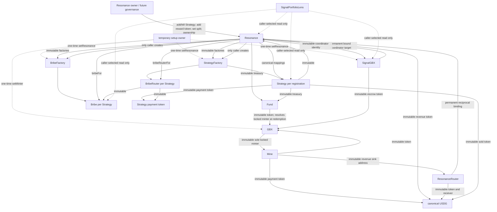

# Architecture, trust boundaries, and state machines

## Snapshot and evidence boundary

This inventory covers every deployable first-party contract in `packages/contracts/src/core`, every first-party core
interface, and `packages/contracts/src/periphery/SignalPortfolioLens.sol`. The baseline checkout is commit
`f9912533e999454f1a3fd49276558bd85e1390da`. The working source reviewed here also contains the audit remediation for
CEX-01 in `Resonance`: `MAX_LIFETIME_REVENUE_AMOUNT`, `lifetimeRevenueNotified`, and the pre-check in
`notifyRevenue`. Those fields did not exist at the baseline commit, so the report distinguishes original behavior from
the remediated working tree. Nothing in this document is deployment evidence or a claim that any graph is safe for
funds.

The eleven-contract core is deliberately non-upgradeable. `Fund`, `Mine`, `GBX`, `Strategy`, `Bribe`, and the Routers
have no owner. `Resonance` retains continuing bounded ownership. `SignalGBX`, `StrategyFactory`, and `BribeFactory`
retain inherited `Ownable` shells after their one-time binding, although the owner has no remaining custom action once
the binding is consumed. `SignalPortfolioLens` is stateless, optional, and view-only.

## Dependency and authority graph

The reciprocal identity getters used during one-time binding prove only internal consistency. They do not prove that
the counterpart has reviewed runtime bytecode, constructor inputs, or provenance. A signed deployment record must bind
addresses to runtime code hashes, constructor transactions and inputs, immutable getter values, setup transaction
ordering, ownership receipts, and untouched initial state.

## Ownership and caller boundaries

| Surface                                     | Authority after valid setup                        | Can it block an existing principal exit?                                                                                                                                                                                |
| ------------------------------------------- | -------------------------------------------------- | ----------------------------------------------------------------------------------------------------------------------------------------------------------------------------------------------------------------------- |
| GBX mint binding                            | one-time temporary `minter`, then immutable `Mine` | An absent or incorrect handoff blocks Mine settlement and Fund redemption; there is no repair after a wrong lock. Ordinary transfer/burn remains available.                                                             |
| SignalGBX binding                           | one-time current owner                             | If never bound, no signal can enter. Once users can enter, the binding cannot change. Later ownership loss does not block removal.                                                                                      |
| Factory bindings                            | one-time current owners                            | A missing binding blocks creation, not exits from already registered graphs. A wrong permanent binding requires abandoning the candidate.                                                                               |
| Resonance Router binding                    | one-time current Resonance owner                   | A missing/wrong binding blocks later revenue scheduling, not existing signal removal after the CEX-01 cap remediation.                                                                                                  |
| Resonance continuing owner                  | current owner, transferrable or renounceable       | Can add/kill Strategies, register reward tokens, and set `bribeBps` in `[0,2000]`; cannot pause, sweep, redirect an account exit, alter a Bribe ledger, or replace dependencies. Killing preserves removals and claims. |
| Mine / Fund / Strategies / Bribes / Routers | none                                               | Permissionless paths only; failures are token, arithmetic, target-EVM, or state precondition failures rather than owner cooperation.                                                                                    |
| Lens / SDK / subgraph / frontend            | no onchain authority                               | Discovery aids only. They are not canonical ledgers and cannot be required to execute a known scalar exit. Incomplete discovery can hide, but cannot erase, an onchain position.                                        |

## Canonical ledgers and reconciliation

| Economic fact                                | Canonical onchain record                                                                                    | Required reconciliation                                                                                                                                                                                                                                                                                             |
| -------------------------------------------- | ----------------------------------------------------------------------------------------------------------- | ------------------------------------------------------------------------------------------------------------------------------------------------------------------------------------------------------------------------------------------------------------------------------------------------------------------- |
| Transferable GBX                             | `GBX` ERC-20 balances and `totalSupply`                                                                     | `totalSupply == lifetimeMinted - lifetimeBurned`; only the locked Mine may increase both supply and `lifetimeMinted`.                                                                                                                                                                                               |
| Accrued, unminted mining emission            | Mine `storedPendingEmission`, `pendingUpdatedAt`, `aggregateTps`, and each slot's `lastAccruedAt/tps/miner` | `pendingEmission = storedPendingEmission + elapsed * aggregateTps`; `aggregateTps` equals the sum of 16 tenure rates; replacing one slot settles its slice and updates the aggregate.                                                                                                                               |
| Outgoing-miner USDG                          | Mine `claimableMinerPayment[account]` and `totalClaimableMinerPayments`                                     | Per-account sum equals the global liability; claims clear both before the USDG call and revert atomically on failure.                                                                                                                                                                                               |
| Aggregate signal receipt                     | `SignalGBX.balanceOf(account)` and `totalSupply`                                                            | Escrowed canonical `GBX.balanceOf(SignalGBX) >= totalSupply`; direct donations are surplus and create no receipt.                                                                                                                                                                                                   |
| Per-Strategy and per-account signal          | Paired `Bribe.signalWeightOf(account)` and `Bribe.totalSignalWeight`                                        | For each account, the sum over known Strategy Bribes equals its sGBX balance. Across all Bribes, totals equal sGBX supply.                                                                                                                                                                                          |
| Active signal eligible for Resonance revenue | `Resonance.totalSignalWeight`                                                                               | Equals the sum of paired-Bribe totals for live Strategies only. Killed weight remains in Bribe/sGBX ledgers but is excluded exactly once.                                                                                                                                                                           |
| Global USDG stream                           | `Resonance.revenueData` and `lifetimeRevenueNotified`                                                       | Elapsed scheduled revenue advances the monotonic `1e36` index only while active signal exists. Fresh lifetime admission, not rolled remainder or donations, is capped at `floor((2^256-1)/1e36)` in the remediated tree.                                                                                            |
| Per-Strategy USDG                            | `strategyRevenuePerSignalPaid` and `strategyRevenue`                                                        | Live weight times index delta is checkpointed before weight or liveness changes; a kill preserves accrued revenue; `distributeRevenue` resets then pays the fixed Strategy atomically. Conversion floors to raw USDG, and a permissionless caller can maximize that floor loss through checkpoint cadence (CEX-08). |
| Per-token Bribe stream                       | `rewardData[token]`, `lifetimeRewardNotified[token]`                                                        | Each token has an independent seven-day schedule and independent lifetime cap. Direct donations and floor surplus are not liabilities.                                                                                                                                                                              |
| Per-account Bribe entitlement                | `accountRewardPerSignalPaid[account][token]` and `rewards[account][token]`                                  | Checkpoints convert index delta at the account's pre-change weight. Whole-unit flooring remains final, but ADR 0053 limits claim-selected checkpoints to the beneficiary or its fixed-beneficiary Resonance batch, removing the reproduced outsider cadence.                                                        |
| Fund backing                                 | actual ERC-20 balances at `Fund`; no registry                                                               | A redeemer chooses unique non-GBX token addresses. All selected balances and the Mine-inclusive denominator are snapshotted before burn. Omitted assets remain for post-redemption supply. Current tracked complete-basket claims exceed this selective behavior (CEX-09).                                          |
| Strategy and Bribe discovery                 | `Resonance.isStrategyRegistered`, `bribeFor`, `bribeRouterFor`, plus immutable getters                      | Events, subgraph and Lens are replaceable indexes. A state-sensitive exit queries canonical mappings/Bribe state for each known Strategy. There is no enumerable Strategy array. Factory-nonce/CREATE reconstruction is finite at any snapshot but grows with all graph contracts ever created.                     |

## Value flows and asset classifications

```mermaid
flowchart LR
    PAYER[Mine replacement payer] -->|USDG transferFrom| MINE[Mine]
    MINE -->|80% floor, pull liability on nonempty slot| MINER[outgoing miner claim]
    MINE -->|empty: 100%; nonempty: remainder| RR[ResonanceRouter buffer]
    RR -->|permissionless full-balance route above thresholds| RES[Resonance global 7-day stream]
    RES -->|live-signal allocation; permissionless distribution| STRAT[Strategy USDG balance]
    BUYER[auction buyer] -->|payment token| STRAT
    STRAT -->|payment minus floor bribe share| FUND[Fund backing]
    STRAT -->|bribe share| BRR[BribeRouter buffer]
    BRR -->|permissionless threshold route| BR[Bribe 7-day reward stream]
    STRAT -->|complete snapshotted USDG| RECEIVER[chosen revenue receiver]

    HOLDER[GBX holder] -->|GBX escrow| SGBX[SignalGBX]
    SGBX -->|virtual weight| BR
    SGBX -->|GBX return on scalar/batch removal| HOLDER
    HOLDER -->|approved GBX burn| FUND
    FUND -->|selected pro-rata assets| HOLDER
```

Balance classification is intentionally not synonymous with recoverability:

- Mine's retained standard USDG backs `claimableMinerPayment` liabilities. A nominal protocol share transferred to
  ResonanceRouter is no longer a miner liability.
- ResonanceRouter and BribeRouter balances are unscheduled buffers. They can wait indefinitely and have no individual
  depositor claim. Their inactivity delays yield only; neither is called by a principal exit.
- `Resonance.strategyRevenue[strategy]`, and elapsed index entitlement not yet checkpointed into it, are Strategy
  liabilities. Scheduled-but-unelapsed USDG is a stream obligation. Rate/index/Strategy floors, zero-active-weight
  emissions, and direct donations are accepted ownerless surplus. The lifetime cap can leave later Router funds
  permanently unschedulable, but it prevents those funds from making the signal index and principal exit overflow.
- Bribe `rewards[account][token]` and uncheckpointed index accrual are reward entitlements. Notification remainders,
  zero-weight emission, direct donations, and rounding floors are surplus. A token-specific lifetime cap can strand a
  later Router buffer but cannot block checkpoints, claims already funded, or signal removal.
- Fund token balances are backing only when selected by a redeemer. There is no promise to enumerate or recover every
  token. A redeemer permanently forfeits their share of omitted assets.
- Direct GBX sent to SignalGBX is stranded surplus because no sGBX or signal weight is minted. Direct GBX held by Fund
  can be burned permissionlessly. Direct tokens sent to a Strategy join its next complete USDG sale only if they are
  USDG; direct payment-token balances in Strategy have no sweep path.

## Setup state machine

```mermaid
stateDiagram-v2
    [*] --> CandidatesDeployed
    CandidatesDeployed: GBX unlocked; SignalGBX/factories unbound; Resonance owner active
    CandidatesDeployed --> InternalBindings: bind BribeFactory, StrategyFactory, SignalGBX to exact Resonance
    InternalBindings --> RouterBound: deploy reciprocal ResonanceRouter and bind it once
    RouterBound --> MineDeployed: deploy Mine with exact GBX, USDG and Router
    MineDeployed --> MinterLocked: verify untouched Mine then GBX.setMinter(exact Mine)
    MinterLocked --> StrategiesCreated: create every reviewed initial Strategy graph through Resonance
    StrategiesCreated --> ManifestVerified: verify bytecode, immutables, reciprocal getters, slots, supply, owners, receipts
    ManifestVerified --> AdminHandoff: transfer Resonance to exact reviewed governance executor
    AdminHandoff --> SetupShellsRemoved: renounce SignalGBX and both factory ownership shells
    SetupShellsRemoved --> ExposableCandidate

    CandidatesDeployed --> Abandon: wrong/early renunciation or counterfeit binding
    MineDeployed --> Abandon: any slot occupied before minter lock (CEX-04 / 249702)
    MinterLocked --> Abandon: wrong Mine, USDG, Router, bytecode, immutable, or transaction-order evidence
    ManifestVerified --> Abandon: any unresolved release gate
```

The ordering is a release invariant rather than a contract-enforced atomic transition:

1. Deploy canonical USDG or record its approved external address; deploy zero-supply GBX with a temporary handoff
   authority, Fund, SignalGBX, both factories, then Resonance with the exact immutable graph.
2. Consume the three reciprocal `setResonance` bindings. Premature ownership renunciation makes the respective
   candidate permanently incomplete.
3. Deploy and bind the exact ResonanceRouter, then deploy Mine with that Router and USDG.
4. **Before exposure and before `GBX.setMinter`, prove all sixteen Mine slots remain at their constructor state.**
   `Mine.mine` is public before binding. An attacker can occupy a slot; that tenure cannot be settled while GBX is
   unlocked, but if the same Mine is later locked it receives pre-binding emission. There is no cleaning operation.
   Any contaminated candidate must be abandoned and redeployed; the contract does not enforce this gate.
5. Lock GBX to the exact Mine once. A wrong locked address is unrecoverable. Fund redemption validates the locked Mine
   shape at call time and is deliberately unavailable before a valid handoff.
6. Create all reviewed initial Strategy/Bribe/Router graphs while the setup owner controls Resonance. Factory creation
   is callable only by the bound Resonance and graph registration is atomic.
7. Compare runtime hashes, immutables, constants, constructor receipts, reciprocal identities, initial state, target
   chain, and ownership to a signed manifest. Reciprocal getters alone cannot reject counterfeit-but-consistent code.
8. Transfer Resonance directly to the separately reviewed governance executor and prove receipt. Explicitly remove the
   temporary owners from SignalGBX and both factories. Until governance provenance and target-chain evidence exist,
   this remains an unexposable candidate.

Setup gating by the code itself is partial: SignalGBX operations reject an unset Resonance; factory creation rejects
everyone while unbound; notifications reject an unset Router; GBX minting rejects an unlocked minter; Fund redemption
rejects an unlocked or non-reciprocal Mine. Mine slot occupation is the explicit gap.

## Runtime state machines

### Mine slot

```mermaid
stateDiagram-v2
    [*] --> Empty: epochId=1, miner=0, tps=0
    Empty --> Occupied: mine; optional USDG payment goes 100% to Router
    Occupied --> Occupied: replacement or self-replacement
    Occupied: fixed tenure tps; unminted emission accrues with time
    Occupied --> Occupied: settle old GBX; credit 80% payment claim; remainder to Router; increment epoch
```

Every occupied slot's price becomes exactly zero after one hour, so any caller can replace it with
`maximumPayment == 0` without USDG or Router interaction. Settlement still calls `GBX.mint`; therefore correct permanent
minter binding is intrinsic. A tenure never has a voluntary "leave empty" transition. On the pinned target, header time
is `uint64`, so lifetime elapsed time is at most `2^64 - 1` seconds. Even the maximum aggregate rate satisfies
`64 ether * (2^64 - 1) < 2^256`; pending emission, effective supply, `totalMined`, and canonical GBX lifetime accounting
therefore remain representable for every target-valid timestamp. Foundry's much larger warp is useful defensive model
evidence, but it is not a target-reachable terminal state. Other checked counters, including `epochId`, have no
demonstrated public target-reachable overflow sequence; the independent ERC-5805 `uint48` block-clock horizon remains.

### Strategy auction and liveness

```mermaid
stateDiagram-v2
    [*] --> LiveEpoch
    LiveEpoch --> LiveEpoch: buy complete USDG; price may be zero; increment epoch
    LiveEpoch --> Killed: Resonance owner kill (not if final live Strategy)
    Killed --> Killed: distribute preserved USDG; buy if Strategy holds USDG; claims/removals continue
```

Killing is irreversible at the Resonance registry level. It checkpoints once, subtracts the complete paired-Bribe
weight from the active global total once, rejects later additions, and leaves Bribe weight, reward streams, removals,
claims, preserved revenue distribution, and the Strategy auction contracts intact. Removal from a killed Strategy does
not subtract active weight a second time. The final-live guard protects the continuing allocation destination but is not
an exit gate.

### Revenue and reward stream

For Resonance and independently for each Bribe reward token:

```mermaid
stateDiagram-v2
    [*] --> Idle
    Idle --> Active: qualifying fresh notification
    Active --> Active: fresh amount >= remaining; combine floored remainder; restart seven days
    Active --> Finished: time >= periodFinish
    Finished --> Active: qualifying fresh notification
    Active --> AdmissionExhausted: fresh lifetime cap reached
    AdmissionExhausted --> AdmissionExhausted: later notification rejected before checkpoint/custody
```

Admission exhaustion is intentionally not an exit-bricked state. Already stored indexes and claims remain
checkpointable; only new fresh scheduling is denied. In the original baseline Resonance had no admission cap, so a
one-raw-unit active signal and cumulative fresh notifications could overflow the monotonic `1e36` index inside the
checkpoint required by `removeSignal`. The remediation bounds cumulative fresh revenue at
`floor(type(uint256).max / 1e36)` before any checkpoint or token call. Rolled remainder is not counted twice; direct
donations never enter the schedule. Bribe already used the analogous per-token bound.

### Signal transition

An addition atomically performs `GBX.transferFrom -> sGBX mint/vote checkpoint -> Resonance revenue checkpoint ->
Bribe reward checkpoints -> canonical weights`. A removal reverses the weight first, then burns sGBX and returns GBX;
any later failure rolls the entire call back. A killed Strategy is accepted on removal. Batches are sequential scalar
semantics under one transaction and may include duplicates. They are optional. On a correctly bound canonical graph,
with supported standard GBX behavior, a target-valid timestamp, and before the ERC-5805 block-clock horizon, a user who
knows the Strategy address can remove a valid allocation with one scalar call. The pinned target's `uint64` timestamp
domain cannot reach the defensive Foundry `uint256`-emission counterfactual. The scalar path does not reconstruct an
unknown position key (CEX-03).

## External-call and callback graph

```mermaid
flowchart TD
    MINE[Mine.mine / claim] --> GBXM[GBX.mint]
    MINE --> USDGX[USDG transferFrom / transfer]
    SADD[SignalGBX.add] --> GBXX[GBX transferFrom]
    SADD --> RA[Resonance.addSignalFor]
    RA --> BUP[Bribe checkpoint + weight update]
    SREM[SignalGBX.remove] --> RR[Resonance.removeSignalFor]
    RR --> BDOWN[Bribe checkpoint + weight update]
    SREM --> GBXT[GBX transfer]
    RROUTE[ResonanceRouter.route] --> USDGA[USDG balanceOf / approve]
    RROUTE --> NOTIFY[Resonance.notifyRevenue]
    NOTIFY --> USDGP[USDG transferFrom]
    DIST[Resonance.distributeRevenue] --> USDGT[USDG transfer]
    BUY[Strategy.buy] --> DIST
    BUY --> USDGB[USDG balanceOf / transfer]
    BUY --> PAY[payment token transferFrom / transfer]
    BROUTE[BribeRouter.route] --> PAY2[payment token balanceOf / approve]
    BROUTE --> BN[Bribe.notifyReward]
    BN --> RTIN[reward token transferFrom]
    CLAIM[Bribe scalar/all claim] --> RTOUT[reward token transfer]
    REDEEM[Fund.redeem] --> VIEWS[GBX + Mine getters]
    REDEEM --> BAL[selected token balanceOf]
    REDEEM --> GBXTF[GBX transferFrom + burn]
    REDEEM --> TOKOUT[selected token transfer + balance checks]

    USDGX -. arbitrary token callback .-> OTHER[other protocol entry]
    PAY -. arbitrary token callback .-> OTHER
    RTIN -. arbitrary token callback .-> OTHER
    RTOUT -. arbitrary token callback .-> OTHER
    TOKOUT -. arbitrary token callback .-> OTHER
```

Each custody-bearing entry point except `BribeRouter.route` is protected directly or reaches a protected callee.
`BribeRouter.route` writes no local mutable accounting; allowance and Bribe custody roll back on a failed call. Local
guards do not prevent cross-contract callbacks, so correctness instead also relies on ordering:

- Mine accrues/settles/allocates and stores the new slot before nonzero USDG interaction. A callback cannot re-enter
  Mine, and failure restores the full prior slot and claims.
- SignalGBX is guarded across both the Resonance/Bribe leg and GBX custody leg. Resonance and Bribe have their own
  guards or caller restrictions. Reward checkpointing during signal removal performs no reward-token call.
- Resonance resets `strategyRevenue` before USDG transfer. Notification writes schedule after the inbound transfer but
  is guarded; all state and custody revert together on failure.
- Strategy snapshots `bribeBps`, pulls/distributes Resonance revenue, snapshots its complete USDG balance, and is
  guarded before interacting with payment or USDG tokens. Epoch state advances only after transfers; a failure reverts
  the distribution as part of the same call stack.
- Bribe rejects a claim caller other than the beneficiary or immutable Resonance before checkpoint mutation, resets an
  entitlement before its token transfer, is guarded, and restores the reset if the transfer reverts. Resonance's
  caller-owned claim batch is also guarded; any nested Bribe/token failure rolls the complete batch back. Direct scalar
  claims isolate other reward tokens.
- Fund snapshots every selected balance before GBX burn, is guarded, and rechecks exact deltas and cross-selected
  balances. A selected malicious token can revert that caller-selected basket, but an omitted token is never called.

Read-only identity calls can also revert: `GBX.setMinter -> IMine.gbx`, the three `setResonance` bindings -> Resonance
identity getters, Resonance Router binding -> Router identity getters, Strategy and Router threshold reads, and Fund's
GBX/Mine getters. These are setup or caller-selected operation dependencies, not hidden global loops.

## Loop and gas topology

| Location                                   | Bound                                                                                  | State-growth effect                                                                            | Bounded fallback                                                                                                                                              |
| ------------------------------------------ | -------------------------------------------------------------------------------------- | ---------------------------------------------------------------------------------------------- | ------------------------------------------------------------------------------------------------------------------------------------------------------------- |
| Mine constructor                           | exactly 16                                                                             | none after construction                                                                        | Not a runtime exit. Runtime Mine calls touch one slot.                                                                                                        |
| `SignalGBX.addSignalMany`                  | caller-controlled allocations                                                          | Strategy count and a portfolio can grow without an onchain cap                                 | Scalar `addSignal` for entry.                                                                                                                                 |
| `SignalGBX.removeSignalMany`               | caller-controlled allocations; duplicates sequential                                   | A large/stale/malformed batch can exceed gas or revert atomically                              | `removeSignal(strategy, amount)` touches one known Strategy; existing position cost is independent of global Strategy count.                                  |
| `Resonance.claimBribeRewards`              | caller-controlled registered Strategy array; duplicates sequential                     | Portfolio/Strategy count can grow without an onchain cap; one failed token reverts all entries | Split the Strategy list or call each Bribe directly; scalar `claimReward(account, token)` isolates healthy tokens.                                            |
| `Bribe._updateAllRewards` / `claimRewards` | append-only registry capped at 16                                                      | Governance may increase a position's scalar removal cost only up to the fixed cap              | Direct scalar claiming isolates tokens, but signal removal necessarily checkpoints all at most 16 streams. No reward-token external call occurs in that loop. |
| `Fund.redeem`                              | caller-controlled selected token array; three linear passes plus exact-transfer checks | Fund may hold arbitrarily many unregistered tokens, but none are enumerated                    | One healthy selected token is an O(1) selective fallback with respect to global Fund contents, with every omitted asset share forfeited for that burn.        |
| `SignalPortfolioLens.portfolio`            | caller-controlled Strategies, then at most 16 rewards per registered Strategy          | RPC response and view gas scale with supplied list                                             | Chunk `eth_call`; Lens is never used by a state transition.                                                                                                   |
| Factories / Resonance administration       | no Strategy enumeration                                                                | Number of Strategies can grow, but each add/kill/update is one graph                           | Existing scalar signal exit touches only the supplied Strategy and its capped Bribe.                                                                          |

## Supported-token boundary and failure containment

1. **Canonical GBX.** The deployed GBX implementation is a standard, non-rebasing OpenZeppelin ERC-20 with permit.
   Signal escrow assumes its nominal transfers are exact. A different/counterfeit GBX graph is a deployment failure.
2. **Canonical USDG.** Mine, ResonanceRouter, Resonance, Strategy, and outgoing-miner claims assume a standard,
   non-rebasing, non-fee, normally transferable ERC-20. They do not measure deltas. USDG blocklisting or implementation
   failure is an intrinsic core-token dependency for a USDG claim, revenue distribution, or paid Mine operation. It is
   not intrinsic to signal-weight removal; removal checkpoints arithmetic but makes no USDG call before returning GBX.
3. **Strategy payment tokens and Bribe rewards.** Core acquisition and reward flow assumes standard non-rebasing
   transfers. Code presence at registration is not behavior validation. A broken token can block purchases priced in
   that token, its Router, its own scalar claim, and the all-token claim. It cannot be called by signal removal and
   cannot block a different reward token's scalar claim. Payment-token failure does not affect an already completed
   purchase or Fund redemption of a different selected asset.
4. **Fund assets.** Fund intentionally accepts arbitrary unsolicited assets, but a selected asset must provide stable
   `balanceOf` responses and exact Fund-debit/receiver-credit transfer deltas for that call. Fee-on-transfer, rebasing,
   alias-ledger, pausable, callback, or malicious-balance behavior is confined to baskets that select it. Omission is
   the bounded escape hatch; there is no global registry or forced enumeration.
5. **Direct donations.** Donation handling is contract-specific and never silently creates a user entitlement:
   Router donations join a later route; Resonance/Bribe donations are surplus; Strategy USDG joins the next sale;
   SignalGBX GBX is surplus; Fund assets become backing only through caller selection; unrelated tokens elsewhere can
   be permanently stranded.

Target-chain compatibility is part of this boundary. Fund's scalar redemption still executes EIP-1153 `TSTORE/TLOAD`.
If the exact target runtime does not support Cancun transient storage, every Fund redemption is unusable; local Anvil
success is not authoritative deployment evidence.
